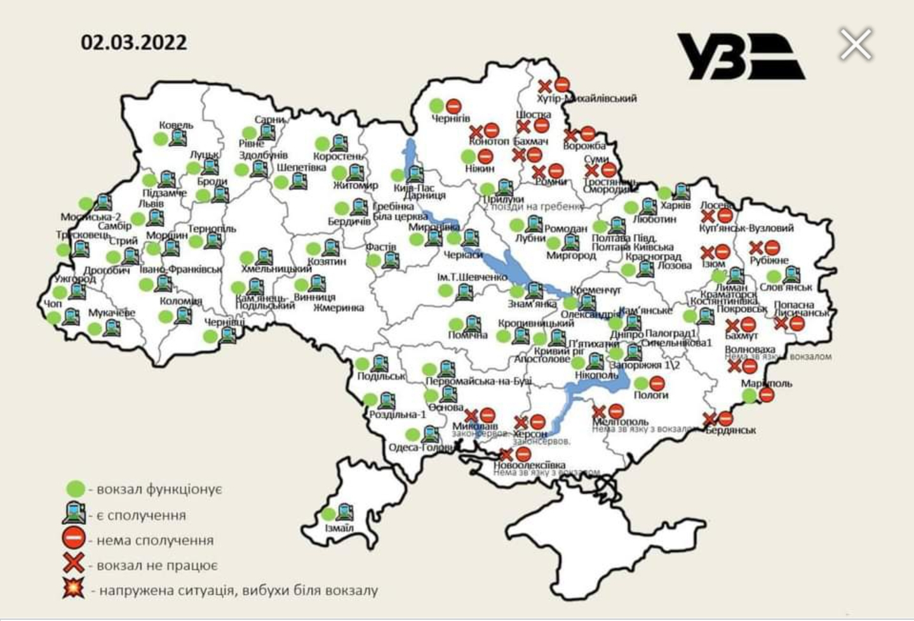

The source for the information on this document is on 
[this Google Doc](https://docs.google.com/document/d/1w59p4ar7wwrZCV8c9PeUIJPGFA53jUcFaJhJCCM5Fik/edit#).

Please keep either this page or that document bookmarked.

Note: where relevant there are language indicators between English
(abbrev: EN), Ukrainian (abbrev: 🇺🇦), and/or Russian (abbrev:
🇷🇺).

## Official Agencies

Information about the social media handles for various gorvernment
agenies is shared on the [Information](../information) page.

Note that all headers can be directly linked to - even if they
aren't in the nav menu on the left.

## Safety & Security

112 – Call number for all emergency services. Call this number,
and the dispatcher will connect the required service.

#### Emergency Numbers
* 101 – Fire Service
* 102 – Police
* 103 – Ambulance
* 104 – Emergency Services: Gas Network
* 0 800 501 482 – Security Service of Ukraine Hotline

#### Pratical Guide for Wartime

[Practical Guide: In Case of Emergency or War](https://dovidka.info/en/) (website)

"It is important to know what each of us can do in an emergency,
especially true when the police, ambulance, rescue services, and
other services are forced to work in an emergency.
In this handbook, you will find practical advice on preparing for
an emergency and how to act in such a case."

#### What can I do if there is fighting?

* If there's a basement, immediately go there. Stay in a safe zone
on lower ground with protective walls.
* Stay as far as possible from windows.
* Wait until the shooting is over before you move to a safer
  shelter.
* Don't pick up anything you haven't dropped yourself. During
  conflict, things that may look harmless could potentially be
  explosive objects. Stay away from unattended objects that do not
  belong to you." Source
* "If you are trapped in debris, use a flashlight, whistle or tap
  on pipes to signal your location to rescuers.
* Shout only as a last resort to avoid inhaling dangerous dust.
* Cover your nose and mouth with anything you have on hand.
  ([Source](https://www.ready.gov/explosions))

#### How to intentionally share location with others

[WhatsApp | GPS Tracking/Live Location](https://faq.whatsapp.com/android/chats/how-to-use-live-location/?lang=en)
allows you to share your movements with contacts you choose. You can use this when you
travel or accept a ride from someone you don't know well.
**_Always_** let someone know where you are going and who you are with.

#### Forced to leave Ukraine through war? --- Saftey Document

Note: Document is in Ukranian 🇺🇦

[Download](assets/docs/MOM-Relocate--527-org-ua.pdf)

Source is [527.org.ua](https://www.527.org.ua/)

[Direct link to document from 527.org.ua's Google Drive](https://drive.google.com/file/d/1chQLWFx7s-KfwCJHfhMEnbUS1WO3ApL2/view)

#### For Persons Still Inside Ukraine: ICRC & UNHCR Advisements

[ICRC](https://www.icrc.org/en/where-we-work/europe-central-asia/ukraine/help-useful-information-affected-people)
&
[UNHCR](https://www.unhcr.org/ua/en/42841-information-for-persons-under-unhcr-mandate.html)

* Your personal documents: In a secure and protective bag keep a
  copy of your national identity card, passport, family
  certificates, birth certificate, insurance documents, property
  documents, etc.
  
* Make sure children know their personal information such as their
  full names, parents' names, and parents' contacts."
  
* Stay informed and connected (via radio, TV, Internet) and follow
  official advice for your security. Listen to official messages
  from emergency services, local authorities, and follow the
  instructions, including regarding curfews.
  
* Keep a copy (even digital) of your documents in a safe place. The
  replacement of lost documents will be easier if people can present
  a copy to the SMS later. (You can also take photos of them and
  email them to yourself - along with photos of your family and of
  yourself with your pets.)
  
* For advice on how to provide emotional support to children during
  these difficult times, see pages such as
  [this](https://www.unhcr.org/mental-health-psychosocial-support.html).
  
* ICRC Contact Information: 
  You can contact the Ukrainian Red Cross Society from anywhere in
  Ukraine: 0 800 331 800.
  * Kyiv 0 800 300 155
  * Slavyansk 0 800 300 115
  * Severodonetsk 0 800 300 125
  * Mariupol 0 800 300 165
  * Donetsk 0 800 300 185
  * Luhansk 0 800 300 195
  * From outside Ukraine, call the hotline at: +41 22 730 36 00 (Eng)
    or Email: [inquiries@icrc.org](mailto:inquiries@icrc.org).

* UNHCR Contact Information:
  * Теlephone: +38(044) 288 9710
  * E-mail: [ukrki@unhcr.org](mailto:inquiries@icrc.org)
  * Website: [unhcr.org.ua](https://www.unhcr.org.ua)
  * Facebook: [@UNHCRKyiv](https://www.facebook.com/UNHCRKyiv/)
  * Twitter: [@unhcrukraine](https://twitter.com/unhcrukraine)

#### General Useful Information

* Be careful of [mines](https://www.facebook.com/100505105900087/posts/121511370466127/). Warn your children that they may appear
colorful and look like toys!
 
* What to do in the case of an [ammonia leak](https://twitter.com/ukrpravda_news/status/1505735077371777028?t=GTyB95jStlHxH0UFdtF-zA&s=19). Follow all directions
for evacuation from officials. (lang: 🇺🇦)
 
* [Radiation Emergencies](https://www.cdc.gov/nceh/radiation/emergencies/index.htm)
 
* [Chemical Attack Safety Information](https://www.dhs.gov/xlibrary/assets/prep_chemical_fact_sheet.pdf) If they are near an outdoor
chemical release, people should:
  1.  Avoid any obvious plume or vapor cloud.
  1.  Walk away from the site and into a building in order to
      shelter-in-place.
  1.  Bring family and pets inside. 
  1.  Lock doors, close windows, air vents, and fireplace dampers. 
  1.  Turn off fans, air conditioning, and forced air heating systems. 
  1.  Go into a room with as few windows as possible. Seal the room to
      create a temporary barrier between people and the contaminated air
      outside.
  1.  Seal all windows, doors, and air vents with plastic sheeting and
      duct tape. 
  1.  Improvise with what is on hand to seal gaps to create a barrier
      from any contamination. 
  1.  Watch TV, listen to the radio, or check the Internet often for
      official news and instructions as they become available."

* In case of evacuation during a chemical attack:
  1. Take a first aid kit
  1. Dress so that there is as little exposed skin as possible
  1. Use gas masks or cotton gauze bandages soaked in water or
  1. Preferably 2-5% solution of baking soda (for chlorine), acetic or
  1. Citric acid (for ammonia)
  1. Leave the room by stairs
  1. Do not touch any objects on the street. [Source](https://www.pravda.com.ua/news/2022/03/24/7334047/)
 
* How to [recognize a saboteur](https://www.facebook.com/100505105900087/posts/120518213898776/): an explanation from the
  [Center for Popular Resistance](https://sprotyv.mod.gov.ua/) (lang: 🇺🇦) 
  * Their [Facebook](https://www.facebook.com/sprotyv.official/) page has valuable safety & awareness information.

* How to make water potable flyer ([Download](assets/images/potable-water.jpg))

### Housing & Transportation

🇺🇦 **[Lviv | Arena Lviv
Stadium](https://zaxid.net/kudi_zvertatis_bizhentsyam_u_lvovi_ta_yak_yim_dopomogti_n1536966)** 
Resettlement center for displaced persons and several points in the city where help is collected for
them. According to LODA Chairman Maksym Kozytskyi, there are a
total of 37,000 ready places for refugees in the region.
  
* 0684147963 - for those who need asylum, housing, or humanitarian
  assistance
* 0971821860 - for those who need asylum, housing, or humanitarian
  assistance
* 0636633371 - to address transport issues

 

**🇺🇦 [How to get help and a temporary home in Ukraine: instructions from Action](https://www.unian.ua/society/yak-otrimati-dopomogu-ta-timchasoviy-dim-v-ukrajini-instrukciya-vid-diji-novini-ukrajini-11742667.html)**
 
Currently, [CNAPs](https://koda.gov.ua/en/interactive-map-of-cnaps/) operate as Care Centers in 120 settlements of Ukraine.

Internally displaced persons can receive assistance and temporary
shelter at administrative service centers (ADCs) in 14 oblasts of
Ukraine.

CNAPs operate as Care Centers where you can get basic necessities
and temporary shelter. You can find out exactly
[where the Care Center works](https://www.unian.ua/techno/communications/mincifri-zapustilo-chatbot-dlya-dopomogi-pereselencyam-11721988.html)
with a chatbot on Telegram [@turbotnyk_bot](https://t.me/turbotnyk_bot).
(For [Viber](https://tinyurl.com/turbotnyk))

Assistance is available in Rivne, Poltava, Zhytomyr, Chernivtsi,
Ternopil, Zakarpattia, Zaporizhia, Luhansk, Khmelnytsky, Volyn,
Lviv, Cherkasy, Vinnytsia and Ivano-Frankivsk regions.
[CNAPs Interactive Map](https://koda.gov.ua/en/interactive-map-of-cnaps/)

The coordinators are available 24/7 at these numbers:
* +380501010454
* +380993121127

 

**🇺🇦 [Settlement opportunities for IDPs](https://r2p.org.ua/vnutrishno-peremishheni-osoby/#)**

Availability of housing facilities in Dnipropetrovsk, Zaporizhia
and Kharkiv oblasts that can be used as temporary/social housing
for internally displaced persons under the condition of
reconstruction or cosmetic repairs. They were placed on an
interactive online map. If you need advice or more detailed
information about these facilities, fill out the
[form](https://ee.humanitarianresponse.info/x/FdG9QOsD) and you
will be contacted by representatives of the
[Right to Protection Charitable Foundation](https://ua.linkedin.com/company/right-to-protection-cf)
within three working days. Data is not
passed on to third parties. 

 

🇺🇦 **[Dopomagai Org | Shelter](https://shelter.dopomagai.org/)**

Free temporary housing in safe cities
of Ukraine or abroad, provided by caring people. Search among
thousands of ads, or call the hotline 0 (800) 332 238. (More
information, from [Kyiv City Gov](https://www.facebook.com/100064898971743/posts/340752394764724/).)

 

**🇺🇦[ List of Caritas Ukraine organizations](http://news.ugcc.ua/news/ugkts_nadaie_pritulok_b%D1%96zhentsyam_na_zahod%D1%96_ukraini_spisok_kontakt%D1%96v_95802.html)**
that are ready to provide shelter in Ukraine. 

 

**🇺🇦 [Bolt taxi service](https://kyivguide.com.ua/bolt-taxify-in-kyiv/)**
provides its fleet for the evacuation of
Ukrainians from places where heavy military operations are taking
place to safer cities in Western Ukraine.

Passengers only need to refuel the car themselves. The driver
must have a driving licence of category "B" and be a citizen of
Ukraine. For passengers, citizenship of Ukraine is also
mandatory. [Source](https://visitukraine.today/blog/155/bolt-taxi-service-provides-cars-for-evacuation-for-free)

 * You can take a car for evacuation in the cities listed
   [here](https://visitukraine.today/blog/155/bolt-taxi-service-provides-cars-for-evacuation-for-free).
 * Contact numbers:
   * +380630577390
   * +380639584701
   * +380982040707
 * You can also fill in the [form for evacuation](https://docs.google.com/forms/d/e/1FAIpQLSf1GdPcMOWb1ZYEQtjCV_c5zRciPo533yTVt5ZjBgzueZK4FA/viewform).

 

**🇺🇦 [UNHCR | UN Refugee Agency](https://www.unhcr.org/)** 
They are providing immigration information and will make referrals for accommodation (ex. to
Airbnb, who they are partnering with.). See [this flyer](assets/images/UNHCR-contact-info.jpg) for contact
information for different countries. 
([Facebook](https://www.facebook.com/UNHCR/))
([Twitter](https://twitter.com/refugees))

Plaintext contact information from the flyer:

* [Czech Republic](http://help.unhcr.org/czech) & [CZ Government Website](https://www.vlada.cz/en/) 
  Hotline: +420 974 801 802
* [Hungary](http://t.co/W3VUqJEwTw) & [Hungarian Helsinki Committee](https://helsinki.hu/en/)
* [Moldova Asylum Authorities](https://www.unhcr.org/republic-of-moldova.html) & [Available Services](http://dopomoga.org.htmlexaminer.com/) 
  You can contact UNHCR at [hunbu@unhcr.org](mailto:mailto:hunbu@unhcr.org). 
  Hotline of the Moldovan Bureau for Migration and Asylum: +373 (0) 8000 15 27
* [Poland](https://help.unhcr.org/poland/) & [Polish Govt Site For Ukrainians](https://www.gov.pl/web/udsc/ukraina-en) 
  Hotline: +48477217575
* [Romania](https://help.unhcr.org/romania/) & [Romanian National Council For Refugees](https://diaspora-engagement.eu/org/the-romanian-national-council-for-refugees/)
* [Slovakia](https://help.unhcr.org/slovakia/) & [Slovakia's Website for Ukrainians](https://ua.gov.sk/en.html)
* [Turkey](https://help.unhcr.org/turkey/) & [Turkey Immigration For Ukrainians](https://www.turkeyimmigration.org/check-requirements/ukraine)
* [Ukraine](http://help.unhcr.org/ukraine/about-unhcr-in-ukraine)
* [All Other Countries](https://help.unhcr.org/)

 

🇺🇦 **[Slovakia | Kto pomôže Ukrajine](https://ktopomozeukrajine.sk/)** 
Government-recommended site to help refugees arriving in Slovakia. This site is incredibly
well-done and includes security processes for those wishing to
offer help. The site itself has a lot of very useful information!

Refugees can request help with:
accommodation, transport, material, psychological support, legal
aid and other forms of care (education, child care, legal aid)

 

🇺🇦 **[Moldova | Dopomoha](https://dopomoha.md/)** 
The site the Government of Moldova links to
for free assistance for refugees from Ukraine. The site provides
categories of help with contact information/ links to assistance.
For accommodation or things not listed, you're required to submit
a request form. It's a pretty good site & is organized well - it
even includes free dental help.

 

🇺🇦 **[„UnAcoperiș” "A Roof"](https://unacoperis.ro/en/request-help)** 
A solution for identifying accommodation
spaces to help refugees who arrive in Romania and need help
immediately. The platform can register legal and natural persons
who can provide rooms or buildings for people living in shelters
provided by the Romanian authorities. A Roof is a platform
developed by Code for Romania and managed by the CNCCI, National
Center for Command and Coordination of Interventions and partner
organizations." 

 

🇺🇦 **[Hostelworld | Rooms For Refugees](https://hwhelp.hostelworldgroup.com/hc/en-us/articles/4505830563474-Rooms-4-Refugees-Supporting-those-fleeing-Ukraine)** 
Reached out to our hostel
partners across Europe to create a directory of hostels that are
able to provide accommodation for refugees fleeing Ukraine All
hostels have confirmed that rooms allocated to refugees will not
be shared with other travelers, so you will have your own space
and privacy to look after yourselves and your families."
([Facebook](https://www.facebook.com/Hostelworld/))
([Twitter](https://twitter.com/hostelworld?lang=en))

 

🇺🇦 **[\#HospitalityHelps](https://hospitality-helps.org/english/main)** 
This initiative has one single goal: providing
temporary hotel accommodation to Ukrainian residents, who are
forced to leave their homes as a result of the war." Rooms are
provided free of charge to refugees fleeing the war. You can
request accommodation on their site, at the above link.
 * [Free accommodation for up to 5 nights in Hilton hotels for Ukrainians](https://193land.com/hilton-free-roms-for-ukraine): The offer is valid throughout Europe!

 

🇺🇦 **[Host4Ukraine](https://www.host4ukraine.com/)** is being promoted by the United Nations High
Commissioner for Refugees (UNHCR) and is  featured by national and
international news agencies like MTV Uutiset & Bloomberg.
(Run by [Churchpool](https://churchpool.com/en/))
([Facebook](https://facebook.com/host4ukraine))
([Twitter](https://twitter.com/Host4Ukraine))

 

🇺🇦 **[I Can Help](https://icanhelp.host/)** 
"The main goal of our platform is to assist and
facilitate people in need to find a host and also for the host to
find those who need solidarity housing." This site is recommended
by former US President, Barack Obama. 
👉👉The site has a security process for vetting. 👈👈

 

🇺🇦 **[Homes for Ukraine](https://homesforukraine.eu/en/home-eng/)**
is an initiative of non-profit public
organizations 
[Barbareum](http://st-barbara-austria.org/uk/),
[Unlimited Democracy](https://www.unlimiteddemocracy.com/),
and [TUMA](https://makumira.ac.tz/)
with the aim of providing free, temporary accommodation within Europe for
Ukrainians.

 

🇺🇦 **[BlaBlaCar](https://bit.ly/blablatransfer)** is a free service that helps to evacuate people to
safety and bring humanitarian aid on return.
* [How does it work?](https://support.blablacar.com/hc/uk/articles/360015367779-%D0%AF%D0%BA-%D0%BF%D1%80%D0%B0%D1%86%D1%8E%D1%94-BlaBlaCar-)

 

🇺🇦 **[Uber](https://twitter.com/USEmbassyWarsaw/status/1498389932800421894)**
is offering free rides from the Poland-Ukraine border. ([Flyer](assets/docs/uber-rideshare-code.jpg)) 
Update 16 Mar 2022: "We plan to expand our support for refugees in other
neighboring countries. With hundreds of thousands of people also
fleeing Ukraine towards Romania and Czechia, we will extend our
support of free rides to both countries."

 

🇺🇦 **<u>Transportation/Accommodation Request From The Border With
The EU</u>**: [This form](http://docs.google.com/forms/d/e/1FAIpQLSeHuzZ3ppgF5iKOXpFKeikguWn0ykZzLruJKZpiQHx23hnYbw/viewform)
is for refugees from Ukraine who require
transport from the EU border with Ukraine (or elsewhere within the
EU) and/or accommodation. We will coordinate people who are ready
to help and give them your contact information. Please keep in
mind that we are not always able to find suitable transportation.
We advise you to look for alternatives in parallel.

####  Facebook Groups: Crowdsourcing Transports & Accommodation

> ⚠️  ⚠️ **Alert**⚠️ ⚠️   
> While these groups are having good success, vet all
> offers as well as you can and follow personal safety protocols
> (such as, keeping your phone batteries charged, documenting the
> license plates of cars you get into, making sure people know where
> you are going & with whom - you can also turn on GPS tracking/live
> location on WhatsApp to share your movements with contacts you
> choose. Decide with family/friends on a code word or phrase that
> will tell them you are in danger. Ideally, accept offers of help
> in a group, not alone. **<u>If you feel that something isn't "right" -
> leave!).</u>**
> 
> ("Vet" = check out or verify.)

* [We Help Ukraine](https://www.wehelpukraine.lt/): Help offers for accommodation, transportation
and food/water/supplies; you can also submit help requests. They
also have a Facebook group, 
[Lietuva padeda Ukrainai/Литва допомагає Україні](https://www.facebook.com/groups/3112002959126318/).
* [Facebook Group | Accommodation and Transport For Ukrainians](https://www.facebook.com/groups/967002083935140/?ref=share):
This is an active group with many offers, as well as group
problem-solving and recommendations. 
* [Facebook Group | Ukraine Refugee & Animal Transport/ Housing/ Fostering](https://www.facebook.com/groups/530024265058805/)
* [Facebook Group | Transport - Ukraina](https://www.facebook.com/groups/346476650687589/?ref=share)
* 🇵🇱 [UA Pomoc: Strona główna](http://uapomoc.pl): This is a grassroots social action
site for those who want to help and for those who are looking for
help! We connect people of good heart with those who need help! If
you came from Ukraine and are looking for a place where you could
stay with your family, search our database! (Transportation
offers are also listed.) (Site lang: EN + 🇺🇦 + 🇵🇱)
* [Google Doc | Drivers Offering Help](https://bit.ly/35vyCFq)
* [Telegram Channel](https://t.me/vodiivolonterylviv): drivers helping Ukrainians flee the country.
* [RefugeeBooking.com](https://www.refugebooking.com/): "Free Refugee Accommodation: Refugees from
  the Ukrainian war can connect with Hosts from neighbouring
  countries and throughout the world."
  ([Flyer](assets/docs/refugeebooking-flyer.jpg), lang:EN)
* [Help & Transport Ukraine PL/UA/Pomoc](https://www.facebook.com/groups/help.pomoc.ukraine/?ref=share)
  ([Flyer](assets/docs/help-transport-ukraine-flyer.jpg), lang: EN + 🇺🇦 + 🇵🇱)
* [Transport A Sister / Help Ukraine 2022](https://www.facebook.com/groups/2182253995256054/)
  ([Flyer](assets/docs/transport-a-sister-flyer.jpg), lang: EN)

#### Plane, Train, & Bus Information

* [Ukrainian Railways](https://www.uz.gov.ua/en/): Updated map on the status functionality of
Railway Stations in Ukraine.
  * Their [Telegram channel](http://t.me/UkrzalInfo/1332) shows updates (see their pinned post).
  * At the volunteer camps in Zakarpattia and Lviv regions volunteer
    centers, it is possible to receive medical care and food -
    **<u>including vegetarian meals</u>**.
  * Ukrainian railways publish the schedule at around 21:00 daily. The
    schedule shows a number of trains going to Poland, Hungary and the
    Czech Republic.

 
<small>Click image to open full size. Date of map is 02 Mar
2022.</small>

* 🇺🇦 The Kyiv City State Administration told [how land public transport](https://www.ukrinform.ua/rubric-kyiv/3429175-u-kmda-rozpovili-ak-pracuvatime-nazemnij-gromadskij-transport.html) will work.
* 🇪🇺[ Information on free travel options offered by European  transport companies](https://ec.europa.eu/info/strategy/priorities-2019-2024/stronger-europe-world/eu-solidarity-ukraine/eu-assistance-ukraine/information-people-fleeing-war-ukraine_en#information-on-free-travel-options-offered-by-european-transport-companies): 
 Information for the following countries:
 Austria, Belgium, Bulgaria, Czechia, Denmark, Finland, France,
 Germany, Hungary, Italy, Latvia, Lithuania, Luxembourg,
 Netherlands, Poland, Romania, Slovakia, Slovenia, Spain &
 Sweden. (Also see: 
 [EU Transport](https://transport.ec.europa.eu/index_en), 
 [Twitter](https://twitter.com/transport_eu?lang=en))
 (Source link lang: EN +
 🇺🇦 + 🇷🇺)
* 🇪🇺 Ukrainian refugees with a Ukrainian passport and a valid
   visa can request a free ticket from Eurostar staff at Amsterdam
   Central, Brussels-Midi, Lille Europe or Paris Nord stations
   going to London.
   ([Source](https://inews.co.uk/inews-lifestyle/travel/ukraine-refugees-eurostar-free-tickets-london-paris-amsterdam-russia-1493770))
* 🇨🇿 [Czech Railways](https://www.cd.cz/en/) is offering free passage on its trains to
  Ukrainian citizens fleeing the war.
* 🇵🇱 [FlixBus](https://global.flixbus.com/) is providing free rides from Bucharest, in addition
to Przemyśl and Rzeszów. For more info and ticket requests, go
[here](https://global.flixbus.com/ukraine-support). (In Ukrainian,
go [here](http://www.flixbus.ua/pidtrymka-ukrainy)).
([Source](https://facebook.com/groups/ukraineresourcesinformationandrelief/permalink/324574872973949/))
* 🇦🇹 Ukrainians fleeing from war can use [unsere
  oebb](https://www.unsereoebb.at/en/) trains in
  Austria without a ticket.
  ([Source](https://twitter.com/lgewessler/status/1497920274053971973?s=20&t=kJQcOXKkKhmNhs5s35Q4DQ))
* 🇩🇪 Germany: "[Deutsche Bahn](https://www.bahn.de/), is collaborating with railways in
  Poland to add more carriages to trains for refugees. Refugees
  with Ukrainian passports or identity cards can use all
  long-distance trains from Poland to Germany free of charge."
  ([Source](https://www.deutschebahn.com/de/presse/pressestart_zentrales_uebersicht/Bahn-erleichtert-Gefluechteten-aus-der-Ukraine-Weiterreise-nach-Deutschland-Sonderzuege-in-Planung-7311236))
* 🇪🇸 Spain: "[Renfe](https://www.renfe.com/es/en) offers free travel on all its trains to
  refugees from Ukraine. For the management of all the movements
  of Ukrainian immigrants, Renfe will organize all its operations
  in Barcelona, which is configured as a 'hub' or
  connection center to receive refugees arriving in Spain or for
  the departure of citizens to France and, subsequently, to other
  parts of Europe. 
    
  Once in Barcelona, the refugees can take any Renfe
  train and continue their journey. In order to benefit from free
  Renfe trains, Ukrainian citizens who wish to do so must carry a
  passport or identity document and present it at Renfe sales
  points, service centers or station ticket offices.
  ([Source](https://www.facebook.com/103448042283925/posts/111089664853096/))
* 🇫🇷 France: [Trains for
  Ukrainians](https://www.sncf.com/fr/groupe/gratuite-trains-refugies-ukrainiens#ukrainska-mova-41240)
  information (site lang: 🇺🇦). People fleeing from Ukraine can
  also use [Thalys](https://www.thalys.com/) trains free of
  charge (site lang: multi).
* 🇮🇪 Ireland: To assist those on their journey, [Bus
  Éireann](http://www.buseireann.ie/?utm_source=galwaygaa) said
  people arriving into the country having fled the war can travel
  to their “final destination for free on
  [Expressway](https://www.expressway.ie/) and Bus
  Éireann services”.
    
  To avail of the offer, the refugees must show the driver their
  Ukrainian ID, evidence of arrival in Ireland within the previous
  seven days, such as an airline booking email, or confirmation from
  a co-ordinating group or charity.
     
  [Irish Rail](https://www.irishrail.ie/) is helping refugees fleeing the crisis with their rail
  travel upon arrival into Ireland, for transfer from arrival point
  to relatives, host families or other facilities within the
  country.
     
  [Stena Line](https://www.stenaline.co.uk/) has been providing free travel to Ukrainians across all
  routes since the beginning of the conflict. They now get free
  meals onboard too."
  ([Source](https://www.irishtimes.com/news/ireland/irish-news/some-public-transport-services-available-for-free-for-ukrainian-refugees-1.4825440))
* [Wizz Air](https://wizzair.com/#/rescue): "The Hungarian budget carrier is to give away seats on
  flights departing from Ukraine’s border countries Hungary,
  Romania, Slovakia and Poland.
     
  Special rescue fares of €29.99 (£25) on all short haul flights and
  $59.99 (£45) on longer haul flights (to the UAE, Canary Islands
  and Iceland) will also be available for Ukrainians fleeing the
  war." ([Source](https://www.facebook.com/wizzair/)) (Through March 2022)
* "[Finnair](https://www.finnair.com/) supports Ukrainians with a 95% discount on net fares
  for one-way tickets from Warsaw, Krakow, Gdansk, Budapest and
  Prague to Helsinki, the key routes for those who are leaving
  Ukraine. The discount is available with code Ukraine95 at
  Finnair.com through March. Airport taxes and fees will be added
  to ticket prices."
  ([Source](https://www.facebook.com/291393512910/posts/10159751133282911/))

