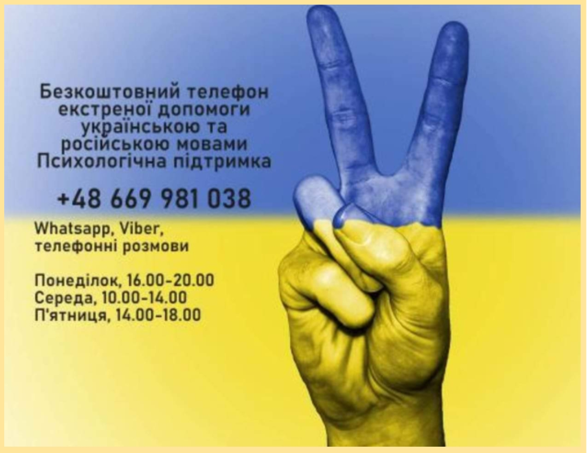
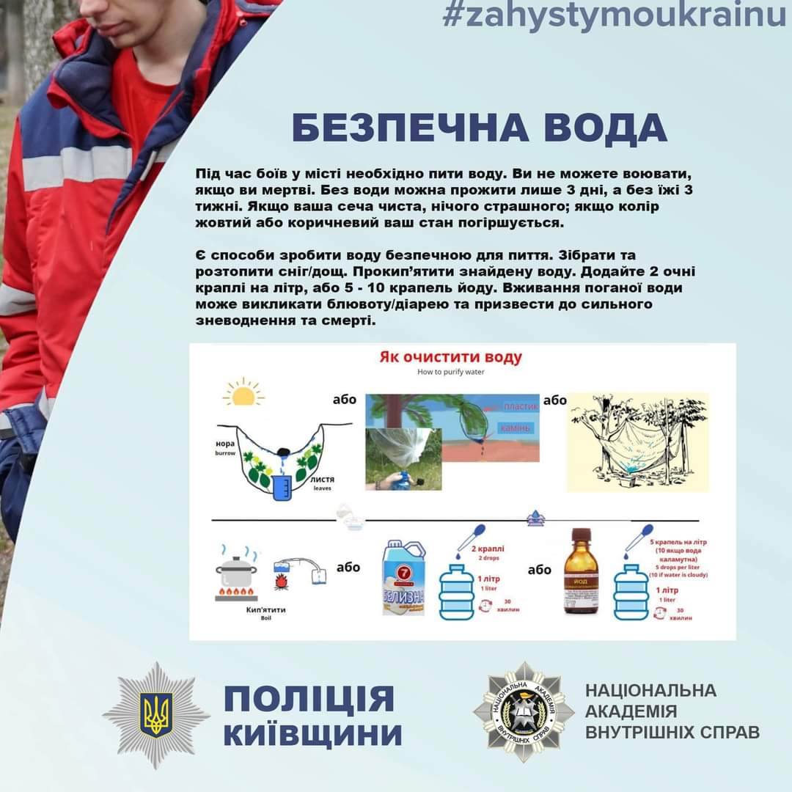
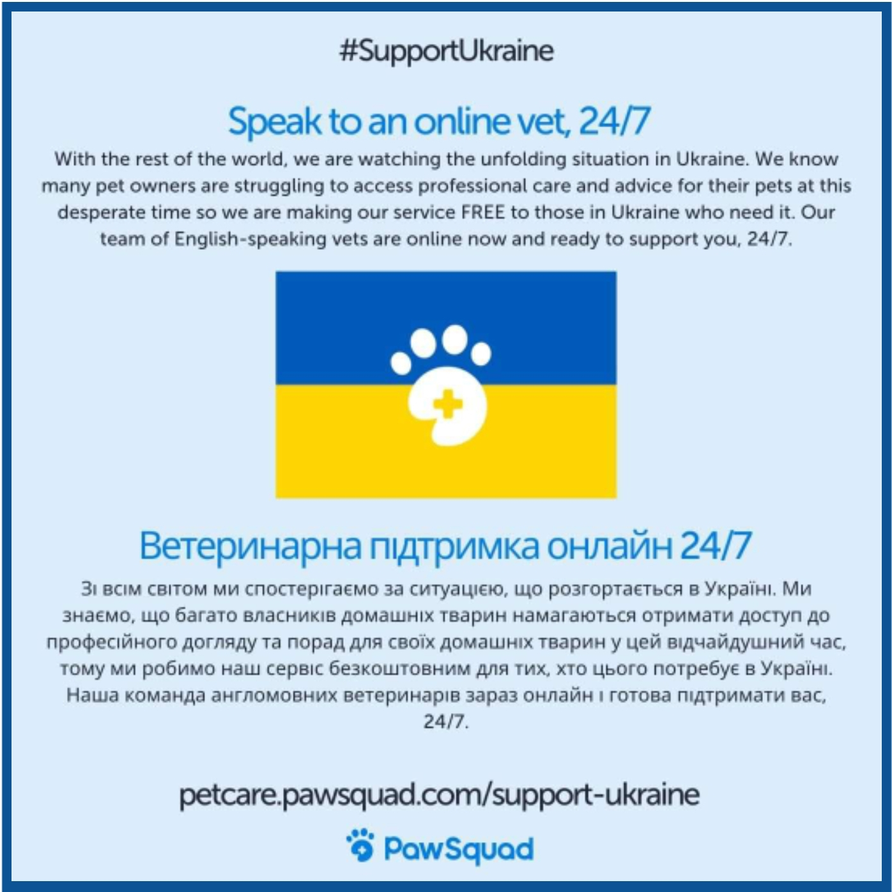
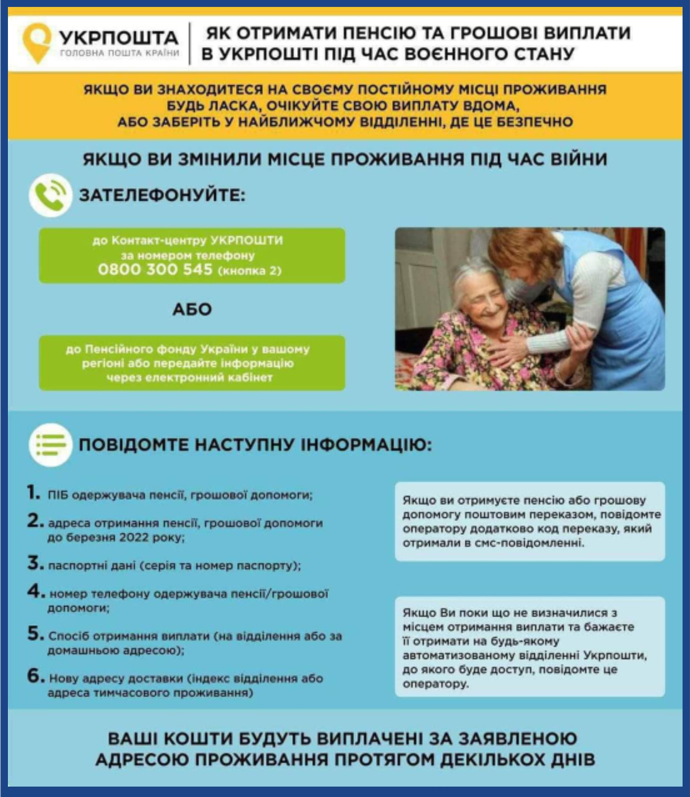
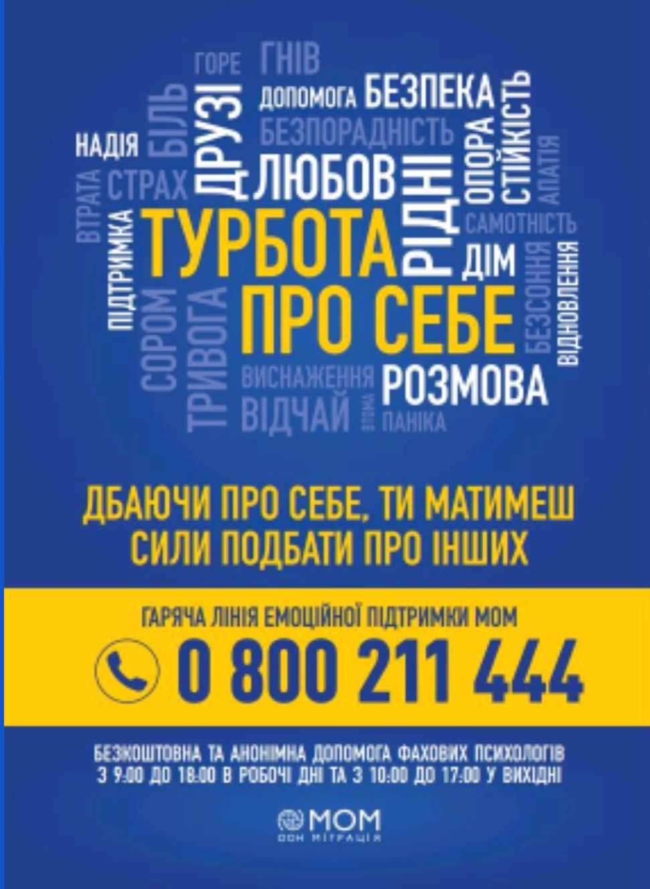

The source for the information on this document is on 
[this Google Doc](https://docs.google.com/document/d/1w59p4ar7wwrZCV8c9PeUIJPGFA53jUcFaJhJCCM5Fik/edit#).

Please keep either this page or that document bookmarked.

Note: where relevant there are language indicators between English
(abbrev: EN), Ukrainian (abbrev: 🇺🇦), and/or Russian (abbrev:
🇷🇺).

**Page last updated: 10 Apr 2022**

## Announcements / New

**Thursday, 7 April -  Sunday, 10 April:**

* "The movie ["Fairytale"](https://t.co/oDuiok8utT) about the WAR has appeared online. The film tells about the first weeks of the full-scale Russian invasion of Ukraine. It contains a huge amount of facts and evidence of Russian Aggression in Ukraine." [Source](https://twitter.com/armyinformcomua/status/1513102375233462279?t=6m-pQlhFVMXdMufddHg2Sw&s=19)
* [Survivor's guilt syndrome: what to do if you are ashamed to be safe](https://tsn.ua/ukrayina/yak-otrimati-pensiyu-ta-groshovi-viplati-v-ukrposhti-yakscho-vi-evakuyuvalisya-1998718.html) — this is a _very_ common feeling experienced by Survivors. This article has some really good information & advice on dealing with those feelings. In Ukr.
* "The government has extended the period for [receiving assistance](https://t.co/cGXUfHESZu) to IDPs. The application deadline for assistance to IDPs has been extended to April 30."
    * "Adults are able to receive UAH 2,000 and UAH 3,000 per child.
    * Now it is possible to obtain immigrant status after employment." [Source](https://twitter.com/Now_in_Ukraine/status/1513086527009611776?t=j4FB-um5yqMKq8pp-tYl7Q&s=19)
* [Self-blame | Rape Crisis](https://rapecrisis.org.uk/get-help/tools-for-victims-and-survivors/self-blame-and-guilt/) — "Many victims and survivors feel like they _blame themselves for what happened_, _feel guilty, or feel ashamed_.

    These feelings of shame, guilt and self-blame can be very hard to deal with. But, if you are feeling like this, you are not alone - it's a really common response."

    * You can chat with a rape crisis counselor if you'd like to — services are _anonymous_ and text-based. Go here: [Live Chat Helpline](https://rapecrisis.org.uk/get-help/live-chat-helpline/).
    * Go at your own pace — when _you_ are ready to reach out. There is no timeline & no rules for sharing your story. Support will be there, when _you_ are ready.
* [Ukrposhta](https://www.ukrposhta.ua/en) Free Delivery Information: "14 postal operators have announced that they are ready to send parcels to Ukraine free of charge. This information [was reported](https://www.ukrposhta.ua/ua/news/57615-ukrposhta-spilno-z-partnerami-proponu-bezkoshtovnu-dostavku-dodomu) in the press service of Ukrposhta."
* "[Women’s Information Consultative Center (WICC)](https://civilmplus.org/en/actors/women-s-information-and-consultative-centre/) is supporting women and women with children who find themselves in a difficult or hopeless situation. In addition, they constantly publish current, useful information on their [website](http://wicc.net.ua/en/category/viyna), such as: daily schedules of evacuation trains; instructions on how to act in a crisis situation (explosion, occupation, mental health, and much more); lists of official information channels and other useful information during the war." [Source](https://wave-network.org/42-days-of-war/) ([Facebook](https://www.facebook.com/WICC.NET.UA/))
* ["Europe without Barriers"](https://english.europewb.org.ua/) provides information concerning documentation, fleeing with children, and legal routes/choices you have for remaining in the EU legally: ['The way home: how to return to Ukraine for those who fled the war'](https://www.eurointegration.com.ua/articles/2022/04/7/7137414/)

---

## Ukrainian Official Agencies

[President Zelensky](https://www.president.gov.ua/en)

* [Facebook](https://zh-cn.facebook.com/president.gov.ua/photos/president-of-ukraine-and-deputy-prime-minister-of-turkmenistan-discussed-prospec/629357273875810/)
* [Twitter](https://mobile.twitter.com/zelenskyyua?lang=en)
* [Telegram](https://t.me/V_Zelenskiy_official/784)

[Ministry of Foreign Affairs](https://mfa.gov.ua/en)

* [Facebook](https://www.facebook.com/UkraineMFA)
* [Twitter](https://twitter.com/MFA_Ukraine?t=0DPvRDls9MFauxb7noG8Rg&s=09)
* [Telegram](https://t.me/Ukraine_MFA/730)
* [Dmytro Kuleba](https://twitter.com/DmytroKuleba?t=ja3M-DldwAzfN8ClanMrJg&s=09)
* [Oleg Nikolenko](https://twitter.com/OlegNikolenko_?t=6KR8NAdoeU4CAxn9BPgUMQ&s=09)

[Kyiv Mayor | Vitali Klitschko](https://kyiv.klichko.org/en/)

* [Facebook](https://www.facebook.com/KlitschkoOfficial)
* [Twitter](https://twitter.com/klitschko)
* [Telegram](https://t.me/vitaliy_klitschko)

[Ministry of Health Ukraine ](https://en.moz.gov.ua/)

* [Facebook](https://m.facebook.com/profile.php?id=247810101979500)
* [Twitter](https://twitter.com/MoH_Ukraine?t=1RwGXys1Qn2mHHh52maUAg&s=09)

[Ministry of Defence of Ukraine ](https://www.mil.gov.ua/en/)

* [Facebook](https://www.facebook.com/modofukraine)
* [Twitter](https://twitter.com/DefenceU?t=7MxacXM6G67MDeF9FcSNzQ&s=09)
* [Telegram](https://t.co/vXHinHjRIj%E2%80%A6)
* [Instagram](https://t.co/jLQVwTKWwy)
* [ArmyInform | Twitter](https://twitter.com/armyinformcomua?t=KFlo5IqlaaI4tBpHcS-maA&s=09)

[Defence Intelligence of Ukraine ](https://gur.gov.ua/en.html)

* [Telegram](https://t.me/DIUkraine)
* [Twitter](https://twitter.com/DefenceU?t=7MxacXM6G67MDeF9FcSNzQ&s=09)

[Verkhovna Rada of Ukraine | Twitter](https://twitter.com/ua_parliament?t=pMeQ-hBnZ90vjxSN4V_cGg&s=09)

* [Telegram](https://t.me/verkhovnaradaofukraine)

[Ukraine United Nations](http://ukraineun.org/)

* [Facebook](https://m.facebook.com/UKRinUN)
* [Twitter](https://twitter.com/UKRinUN?t=O_uz2pRkTAqDDQDqKu84BQ&s=09)
* [Sergiy Kyslytsya | Twitter](https://twitter.com/SergiyKyslytsya?t=fjkrS5oERTLn_Yrf8BKHXQ&s=09)

[Ukraine UA](https://war.ukraine.ua/)

* [Facebook](https://m.facebook.com/UkraineUA.MFA/)
* [Instagram](https://instagram.com/ukraine.ua?utm_medium=copy_link)

[Ukraine Embassies & Consulates](https://www.embassy-worldwide.com/country/ukraine/) (Search tool)

1545 — [Government hotline](https://www.kmu.gov.ua/en/uryadova-garyacha-liniya-1545) (Access to medical support, humanitarian aid, care for individuals with disabilities, access to charities, care for children & parenting support, eldercare and financial & legal aid.)

* For Ukraine’s citizens abroad: +38 044 284 19 15

### War Crimes — Reporting, Documentation & Archives

The Office of the Prosecutor General, together with Ukrainian & international partners, created **[this resource](https://warcrimes.gov.ua/)** where you can report war crimes & crimes against humanity committed by the Russian army.

**OR**

[Ministry of Justice of Ukraine](https://humanrights.gov.ua/) —

**[Report a War Crime](https://humanrights.gov.ua/report)**: "If you have witnessed or been a victim of [human rights violations](https://www.un.org/en/genocideprevention/war-crimes.shtml), record and send evidence."

* 🇬🇧 _UK_: Anyone with information can report war crime evidence to [Scotland Yard](https://www.met.police.uk/advice/advice-and-information/war-crimes/af/report-a-war-crime).
* 🇺🇸 _US_: Refugees & asylum seekers with knowledge of human rights violations committed abroad, may submit [a tip](http://tips.fbi.gov/) to the FBI; or contact your [local or international](https://www.fbi.gov/contact-us) FBI Office.
* As per [Dmytro Kulebra](https://twitter.com/dmytrokuleba): "We have created an [online archive](https://t.co/jTqLXYGO5U) to document Russia’s war crimes. The evidence gathered of atrocities committed will ensure that these war criminals cannot escape justice." [Source](https://t.co/76e6TEssK5)
* [State Ecological Inspectorate of Ukraine](https://www.zoda.gov.ua/news/60381/operativniy-shtab-ta-derzhavna-ekologichna-inspektsiya-ukrajini-prodovzhujut-formuljuvati-perelik-porushen-u-sferi-ohoroni-navkolishnogo-seredovisha.html): "A special [website](https://shtab.gov.ua) was created, through which citizens have the opportunity to report environmental damage. The purpose is to form a list of all violations in the field of environmental protection (explosions/bombardments of oil storage facilities, destruction of dams, etc — they have a list on the site) to bring the aggressor to justice."
    * Hotline: +380 (96) 756-83-66 (Telegram, WhatsApp, Viber)
    * Telegram [Chatbox](http://t.me/ecoshkodabot)
    * Email: [eco@shtab.gov.ua](mailto:eco@shtab.gov.ua)
* "The [MIA](https://mvs.gov.ua/en/) of Ukraine, together with Google, have launched a [project](https://t.co/AvkbS1BdkZ) to digitize the consequences of the Russian invasion. It should help the state to track losses, reconstruction services to plan their work, and citizens [to] know the situation with property." [Source](https://twitter.com/EuromaidanPress/status/1512284851738664962?t=xG_f5blXO8SUFVNgPsX5UA&s=19)
    * Read more [here](https://bit.ly/3LEGXXk).
    * Watch the video [here](https://youtu.be/Kt8rBE85oZY).

---

## Safety & Security

**[Danger Zones](https://www.google.com/maps/d/u/0/viewer?ll=50.37243250000009%2C30.460808699999994&mid=14PnyHN3WPgBZgpJ3q0BOMswKge1hv1au&shorturl=1&z=11): Interactive, live update map of target areas, by [Liveuamap](https://liveuamap.com/).**

* Emergency contact telephone numbers in Ukraine:
    * 112 – Call number for all emergency services. Call this number, and the dispatcher will connect the required service.
    * 101 – Fire Service
    * 102 – Police
    * 103 – Ambulance
    * 104 – Emergency Services: Gas Network
    * 0 800 501 482 – Security Service of Ukraine Hotline
    * 1545 — [Government hotline](https://www.kmu.gov.ua/en/uryadova-garyacha-liniya-1545)

* [Ukraine Ministry of Digital Transformation](https://www.kmu.gov.ua/en/yevropejska-integraciya/coordination/cifrova-transformaciya) has launched an 

    _air raid alert_ [notification](https://t.co/D3ykpynCe1) app.

    * [Google Play](https://play.google.com/store/apps/details?id=com.ukrainealarm)
    * [AppStore](https://apps.apple.com/ua/app/%D0%BF%D0%BE%D0%B2%D1%96%D1%82%D1%80%D1%8F%D0%BD%D0%B0-%D1%82%D1%80%D0%B8%D0%B2%D0%BE%D0%B3%D0%B0/id1611955391)
* [Practical Guide | In Case of Emergency or War](https://dovidka.info/en/): "It is important to know what each of us can do in an emergency, [which is] especially true when the police, ambulance, rescue and other services are [unable to respond].

    In this handbook, you will find practical advice on preparing for an emergency and how to act in such a case." _(*This guide is really well done!)_

* In [Ukrainian](https://livewell.optum.com/pdfs/df57eb6c25018a77.pdf)

* "**What can I do if there is fighting?**

    (*This advice is in regard to shelling/ missile strikes, etc. There is separate advice in relation to chemical & nuclear weapons attacks. See the '[Useful Information](#useful-information)' section. )

1. If there's a basement, immediately, go there. Stay in a safe zone on lower ground with protective walls.
2. Stay as far as possible from windows.
3. Wait until the shooting is over before you move to a safer shelter.
4. Don't pick up anything you haven't dropped yourself. During conflict, things that may look harmless could potentially be explosive objects. Stay away from unattended objects that do not belong to you." [Source](https://www.icrc.org/en/where-we-work/europe-central-asia/ukraine/help-useful-information-affected-people)
5. "If you are trapped in debris, use a flashlight, whistle or tap on pipes to signal your location to rescuers.
6. Shout only as a last resort to avoid inhaling dangerous dust.
7. Cover your nose and mouth with anything you have on hand." [Source](https://www.ready.gov/explosions)
* [WhatsApp | GPS Tracking/Live Location](https://faq.whatsapp.com/android/chats/how-to-use-live-location/?lang=en) allows you to share your movements with contacts you choose. You can use this when you travel or accept a ride from someone you don't know well. _Always let someone know where you are going and who you are with._

[527 Org Ukraine](https://www.527.org.ua/) | [Safety Brochure](https://drive.google.com/file/d/1chQLWFx7s-KfwCJHfhMEnbUS1WO3ApL2/view?usp=drivesdk)

|  |  |
|-------|-------|
|  |  |

### Persons Inside Ukraine

The ICRC & UNHCR Advise:

* "Your personal documents: In a secure and protective bag keep a copy of your national identity card, passport, family certificates, birth certificate, insurance documents, property documents, etc.
* Make sure children know their personal information such as their full names, parents' names, and parents' contacts." [ICRC](https://www.icrc.org/en/where-we-work/europe-central-asia/ukraine/help-useful-information-affected-people)
* Stay informed and connected (via radio, TV, Internet) and follow official advice for your security. Listen to official messages from emergency services, local authorities, and follow the instructions, including regarding curfews.
* Keep a copy (even digital) of your documents in a safe place. The replacement of lost documents will be easier if people can present a copy to the SMS later. (*You can also take photos of them and email them to yourself - along with photos of your family and of yourself _with_ your pets.)
* For advice on how to provide emotional support to children during these difficult times, see pages such as [this](https://www.unhcr.org/mental-health-psychosocial-support.html)." [UNHCR](https://www.unhcr.org/ua/en/42841-information-for-persons-under-unhcr-mandate.html)
* ICRC Contact Information:
    * Tel: Outside of Ukraine, call the hotline: +41 22 730 36 00
    * Email: [inquiries@icrc.org](mailto:inquiries@icrc.org)
    * Twitter: [@ICRC_ua](https://twitter.com/ICRC_ua?t=59AS_fmar8Zvv1AAG6SRjg&s=09)
    * Facebook: [@ICRC](https://www.facebook.com/ICRC/)
* Ukrainian Red Cross:
    * You can contact the Ukrainian Red Cross Society from anywhere in Ukraine: 0 800 331 800.
        * Kyiv – 0 800 300 155
        * Slavyansk — 0 800 300 115
        * Severodonetsk – 0 800 300 125
        * Mariupol – 0 800 300 165
        * Donetsk – 0 800 300 185
        * Luhansk –  0 800 300 195
    * Email: [national@redcross.org.ua](mailto:national@redcross.org.ua)
    * Twitter: [@RedCrossUkraine](https://twitter.com/RedCrossUkraine?t=SsOxU40HhtRouCP3hQceUQ&s=09)
    * Facebook: [@RedCrossUkraine](https://m.facebook.com/RedCrossUkraine/)
    * Telegram: [Ukrainian Red Cross](https://t.me/UkrainianRedCross)
* UNHCR Contact Information:
    * Теl: +38(044) 288 9710
    * Email: [ukrki@unhcr.org](mailto:ukrki@unhcr.org)
    * Website: [www.unhcr.org.ua](http://www.unhcr.org.ua)
    * Facebook: [@UNHCRKyiv](https://www.facebook.com/UNHCRKyiv/)
    * Twitter: [@unhcrukraine](https://twitter.com/unhcrukraine)

### Useful Information

* [Telegram | Chat bot: “Ready For Everything”](https://t.me/Hotovyi_do_vsioho_bot): Information on what to do in an emergency.
* Be careful of [mines](https://www.facebook.com/100505105900087/posts/121511370466127/). Warn your children that they may appear colorful and look like toys! 
  Remember: "If _you_ didn't drop it; _don't_ pick it up!"
* What to do in the case of an [ammonia leak](https://twitter.com/ukrpravda_news/status/1505735077371777028?t=GTyB95jStlHxH0UFdtF-zA&s=19). Follow all directions for evacuation from officials. (In Ukr)
* [CDC | Radiation Emergencies](https://www.cdc.gov/nceh/radiation/emergencies/index.htm)
    * [Questions About Radiation (FAQ)](https://www.cdc.gov/nceh/radiation/emergencies/emergencyfaq.htm)
    * [Preventing and Treating Radiation Injuries and Illness](https://www.cdc.gov/nceh/radiation/emergencies/symptoms.htm)
    * [Radiation | Food & Water Safety](https://www.cdc.gov/nceh/radiation/emergencies/food_water_safety.html)
* "The [Thomson Foundation](https://www.thomsonfoundation.org/) has created a course on reacting to a _chemical weapons attack_ that is delivered via a Telegram bot, with the help of chemical and biological weapons expert Hamish de Bretton-Gordon." [Source](https://twitter.com/NovelSci/status/1509687859388715022?t=9uA1zaWFRgkdd0OMhV_1Yw&s=19)
    * [English](http://t.co/9pjRO7oBK8)
    * [Ukrainian](http://t.co/RxMyjGEb7b)
* [Chemical Attack Safety Information](https://www.dhs.gov/xlibrary/assets/prep_chemical_fact_sheet.pdf): "If they are near an outdoor chemical release, people should:
1. Avoid any obvious plume or vapor cloud.
2. Walk away from the site and into a building in order to shelter-in-place.
3. Bring family and pets inside. 
4. Lock doors, close windows, air vents, and fireplace dampers. 
5. Turn off fans, air conditioning, and forced air heating systems. 
6. Go into a room with as few windows as possible. Seal the room to create a temporary barrier between people and the contaminated air outside.
7. Seal all windows, doors, and air vents with plastic sheeting and duct tape. 
8. Improvise with what is on hand to seal gaps to create a barrier from any contamination. 
9. Watch TV, listen to the radio, or check the Internet often for official news and instructions as they become available."

    "In case of evacuation during a chemical attack:

1. take a first aid kit;
2. dress so that there is as little exposed skin as possible;
3. use gas masks or cotton gauze bandages soaked in water or preferably 2-5% solution of baking soda (for chlorine), acetic or citric acid (for ammonia);
4. leave the room by stairs;
5. do not touch any objects on the street." [Source](https://www.pravda.com.ua/news/2022/03/24/7334047/)
* "How to [recognize a saboteur](https://www.facebook.com/100505105900087/posts/120518213898776/): an explanation from the [Center for Popular Resistance](https://sprotyv.mod.gov.ua/)." (In Ukr) 
    * Their [Facebook](https://www.facebook.com/sprotyv.official/) page has valuable safety & awareness information.
* [How to make water drinkable](https://www.fema.gov/press-release/20210318/fact-sheet-how-make-your-water-safe-drink).

* [Five Ways To Purify Water Without A Filter](https://www.primalsurvivor.net/ways-to-purify-water-survival/) — [Source](https://twitter.com/StephenKolanko1/status/1501771824128008193?t=epxspR8ec09ELBHfmy3J_A&s=19)

---

## Housing & Transportation 

* 🇺🇦 "[Lviv | Arena Lviv Stadium](https://zaxid.net/kudi_zvertatis_bizhentsyam_u_lvovi_ta_yak_yim_dopomogti_n1536966): resettlement center for displaced persons and several points in the city where help is collected for them. According to LODA Chairman Maksym Kozytskyi, there are a total of 37,000 ready places for refugees in the region."
    * 0684147963 - for those who need asylum, housing, or humanitarian assistance;
    * 0971821860 - for those who need asylum, housing, or humanitarian assistance;
    * 0636633371 - to address transport issues."
* 🇺🇦 "[Zaporizhia Regional Military Administration](https://www.zoda.gov.ua/news/59659): the Center for Reception of Displaced Persons is open at: Zaporizhia, vul. Record, 41 (premises of the State Enterprise "Zaporizhzhya State Circus"). You need to register here. The Center will also be able to feed, heat & coordinate further actions.
    * Zaporozhye region — hotline for people moving from the combat zone: +38 066 926 50 97; +38 068 297 01 18; +38 061 787 94 75
    * Ukrainians can get information on where to apply for temporary accommodation in Zaporizhia."
    * [Shelter points](https://www.zoda.gov.ua/article/2603) in Zaporizhia Region. 
* 🇺🇦 [How to get help and a temporary home in Ukraine: instructions from "Action"](https://www.unian.ua/society/yak-otrimati-dopomogu-ta-timchasoviy-dim-v-ukrajini-instrukciya-vid-diji-novini-ukrajini-11742667.html?utm_source=twitter&utm_medium=twitter&utm_campaign=twitter_site): "Currently, [CNAPs](https://koda.gov.ua/en/interactive-map-of-cnaps/) operate as Care Centers in 120 settlements of Ukraine.
    * Internally displaced persons can receive assistance and temporary shelter at administrative service centers (ADCs) in 14 oblasts of Ukraine.
    * CNAPs operate as Care Centers where you can get basic necessities and temporary shelter. You can find out exactly [where the Care Center works with a chatbot](https://www.unian.ua/techno/communications/mincifri-zapustilo-chatbot-dlya-dopomogi-pereselencyam-11721988.html) on Telegram [@turbotnyk_bot](https://t.me/turbotnyk_bot)." (For [Viber](https://tinyurl.com/turbotnyk))
    * "Assistance is available in Rivne, Poltava, Zhytomyr, Chernivtsi, Ternopil, Zakarpattia, Zaporizhia, Luhansk, Khmelnytsky, Volyn, Lviv, Cherkasy, Vinnytsia and Ivano-Frankivsk regions." [CNAPs Interactive Map](https://koda.gov.ua/en/interactive-map-of-cnaps/)
    * The coordinators are available 24/7 at these numbers: +380501010454; +380993121127.
* 🇺🇦 [Settlement opportunities for IDPs](https://r2p.org.ua/vnutrishno-peremishheni-osoby/#):

    "Availability of housing facilities in _Dnipropetrovsk, Zaporizhia and Kharkiv oblasts_ that can be used as temporary/social housing for internally displaced persons under the condition of reconstruction or cosmetic repairs. They were placed on an interactive online map. If you need advice or more detailed information about these facilities, fill out the **[form](https://ee.humanitarianresponse.info/x/FdG9QOsD)** and you will be contacted by representatives of the [Right to Protection Charitable Foundation](https://ua.linkedin.com/company/right-to-protection-cf) within three working days. Data is not passed on to third parties." 

* [Dopomagai Org | Shelter](https://shelter.dopomagai.org/) — "Free temporary housing in safe cities of Ukraine or abroad, provided by caring people. Search among thousands of ads, or call the hotline 0 (800) 332 238." More information, from [Kyiv City Gov](https://www.facebook.com/100064898971743/posts/340752394764724/).
* 🇺🇦 List of [Caritas Ukraine organizations](http://news.ugcc.ua/news/ugkts_nadaie_pritulok_b%D1%96zhentsyam_na_zahod%D1%96_ukraini_spisok_kontakt%D1%96v_95802.html) that are ready to provide shelter in Ukraine. 
* 🇺🇦 "[Bolt taxi service](https://kyivguide.com.ua/bolt-taxify-in-kyiv/) provides its fleet for the evacuation of Ukrainians from places where heavy military operations are taking place to safer cities in Western Ukraine.

    Passengers only need to refuel the car themselves. The driver must have a driving licence of category "B" and be a citizen of Ukraine. For passengers, citizenship of Ukraine is also mandatory." [Source](https://visitukraine.today/blog/155/bolt-taxi-service-provides-cars-for-evacuation-for-free)

    * You can take a car for evacuation in the cities listed [here](https://visitukraine.today/blog/155/bolt-taxi-service-provides-cars-for-evacuation-for-free).
    * Contact numbers:

        +380630577390

        +380639584701

        +380982040707

    * You can also fill in the [form for evacuation](https://docs.google.com/forms/d/e/1FAIpQLSf1GdPcMOWb1ZYEQtjCV_c5zRciPo533yTVt5ZjBgzueZK4FA/viewform).
* [UNHCR | UN Refugee Agency](https://www.unhcr.org/): They are providing immigration information and will make referrals for accommodation (Ex., to Airbnb, who they are partnering with.). See below for contact information for different countries. ([Facebook](https://www.facebook.com/UNHCR/))([Twitter](https://twitter.com/refugees))

* [UNHCR | Refugee Help Pages](https://help.unhcr.org/)
    * 🇨🇿 [Czech Republic](http://help.unhcr.org/czech) & [CZ Government Website](https://www.vlada.cz/en/)
        * Hotline: +420 974 801 802
    * 🇭🇺 [Hungary](http://t.co/W3VUqJEwTw) & [Hungarian Helsinki Committee](https://helsinki.hu/en/)
    * 🇲🇩 [Moldova Asylum Authorities](https://www.unhcr.org/republic-of-moldova.html) & [Available Services](http://dopomoga.org.htmlexaminer.com/)
        * You can contact UNHCR at [hunbu@unhcr.org](mailto:hunbu@unhcr.org).
        * Hotline of the Moldovan Bureau for Migration and Asylum: +373 (0) 8000 15 27.
    * 🇵🇱 [Poland](http://t.co/wRy8CEtIzE) & [Polish Govt Site For Ukrainians](https://www.gov.pl/web/udsc/ukraina-en).
        * Hotline: +48477217575
    * 🇷🇴 [Romania](http://t.co/H11VisLGFM) & [Romanian National Council For Refugees](https://diaspora-engagement.eu/org/the-romanian-national-council-for-refugees/)
    * 🇸🇰 [Slovakia](http://t.co/B08aWP7ILK) & [Slovakia's Website for Ukrainian](https://ua.gov.sk/en.html)
    * 🇹🇷 [Turkey](https://help.unhcr.org/turkey/#_ga=2.6290357.721434156.1647648538-1458154826.1646456093&_gac=1.259124856.1646989152.CjwKCAiAg6yRBhBNEiwAeVyL0JYI1gtATqf_fkAOGmRsfLKkVXkAdPjHEeUIIsIkYhe_yiNJHAZ1yRoCIpQQAvD_BwE) & [Turkey Immigration For Ukrainians](https://www.turkeyimmigration.org/check-requirements/ukraine)
    * 🇺🇦 [Ukraine](http://help.unhcr.org/ukraine/about-unhcr-in-ukraine)
    * 🌏 [All Other Countries](http://t.co/UuwtEkUrzb)
* 🇸🇰 [Slovakia | Kto pomôže Ukrajine](https://ktopomozeukrajine.sk/) is a Government-recommended site to help refugees arriving in Slovakia. This site is incredibly well-done and includes security processes for those wishing to offer help. The site itself has a lot of very useful information!

    Refugees can request help with:

    accommodation, transport, material, psychological support, legal aid and other forms of care (education, child care, legal aid)

* 🇲🇩 [Moldova | Dopomoha](https://dopomoha.md/) is the site the Government of Moldova links to for free assistance for refugees from Ukraine. The site provides categories of help with contact information/ links to assistance. For accommodation or things not listed, you're required to submit a request form. It's a pretty good site & is organized well - it even includes free dental help.
* 🇷🇴 „[UnAcoperiș](https://unacoperis.ro/en/request-help)” '"A Roof' is a solution for identifying accommodation spaces to help refugees who arrive in **Romania** and need help immediately. The platform can register legal and natural persons who can provide rooms or buildings for people living in shelters provided by the Romanian authorities. A Roof is a platform developed by Code for Romania and managed by the CNCCI, National Center for Command and Coordination of Interventions and partner organizations."LLP
* [Hostelworld | Rooms For Refugees](https://hwhelp.hostelworldgroup.com/hc/en-us/articles/4505830563474-Rooms-4-Refugees-Supporting-those-fleeing-Ukraine) reached out to our hostel partners across Europe to create a directory of hostels that are able to provide accommodation for refugees fleeing Ukraine All hostels have confirmed that rooms allocated to refugees will not be shared with other travelers, so you will have your own space and privacy to look after yourselves and your families." ([Facebook](https://www.facebook.com/Hostelworld/))([Twitter](https://twitter.com/hostelworld?lang=en))
* [#HospitalityHelps](https://hospitality-helps.org/english/main): "This initiative has one single goal: providing temporary hotel accommodation to Ukrainian residents, who are forced to leave their homes as a result of the war." Rooms are provided free of charge to refugees fleeing the war. You can request accommodation on their site, at the above link.
    * [Free accommodation for up to 5 nights in Hilton hotels for Ukrainians](https://193land.com/hilton-free-roms-for-ukraine): The offer is valid throughout Europe!
* [Host4Ukraine](https://www.host4ukraine.com/) is being promoted by the United Nations High Commissioner for Refugees (UNHCR) and is  featured by national and international news agencies like MTV Uutiset & Bloomberg." (Run by [Churchpool](https://churchpool.com/en/)) ([Facebook](https://m.facebook.com/host4ukraine))([Twitter](https://mobile.twitter.com/Host4Ukraine))
* [I Can Help](https://icanhelp.host/): "The main goal of our platform is to assist and facilitate people in need to find a host and also for the host to find those who need solidarity housing." This site is recommended by former US President, Barack Obama. The site has a security process for vetting.
* [Homes for Ukraine](https://homesforukraine.eu/en/home-eng/) is an initiative of non-profit public organizations [Barbareum](http://st-barbara-austria.org/uk/), [Unlimited Democracy](https://www.unlimiteddemocracy.com/) and [TUMA](https://makumira.ac.tz/) with the aim of providing free, temporary accommodation within Europe for Ukrainians."
* [BlaBlaCar](https://bit.ly/blablatransfer) is a free service that helps to evacuate people to safety and bring humanitarian aid on return.
    * [How does it work?](https://support.blablacar.com/hc/uk/articles/360015367779-%D0%AF%D0%BA-%D0%BF%D1%80%D0%B0%D1%86%D1%8E%D1%94-BlaBlaCar-)
* [Uber](https://t.co/0orvOyEITr) is offering free rides from the <em>Poland-Ukraine</em> border.
    Update 3/16: "We plan to expand our support for refugees in other neighboring countries. With hundreds of thousands of people also fleeing Ukraine towards <em>Romania and Czechia</em>, we will extend our support of free rides to both countries." 
    
* 🇪🇺 Transportation/Accommodation Request From The Border With The EU: "[This form](http://docs.google.com/forms/d/e/1FAIpQLSeHuzZ3ppgF5iKOXpFKeikguWn0ykZzLruJKZpiQHx23hnYbw/viewform) is for refugees from Ukraine who require transport from the _EU border with Ukraine_ (or elsewhere within the EU) and/or accommodation. We will coordinate people who are ready to help and give them your contact information. Please keep in mind that we are not always able to find suitable transportation. We advise you to look for alternatives in parallel."

### Facebook Groups: Crowdsourcing Transports & Accommodation

> Alert: While these groups are having good success, _vet all offers_ as well as you can and follow personal safety protocols (such as, keeping your phone batteries charged, documenting the license plates of cars you get into, making sure people know where you are going & with whom - you can also turn on [GPS tracking/live location on WhatsApp](https://faq.whatsapp.com/android/chats/how-to-use-live-location/?lang=en) to share your movements with contacts you choose. Decide with family/friends on a code word or phrase that will tell them you are in danger. Ideally, accept offers of help in a group, not alone. _If you feel that something isn't "right" - leave!_) 
> ("Vet" = check out or verify.)

* [We Help Ukraine](https://www.wehelpukraine.lt/): Help offers for accommodation, transportation and food/water/supplies; you can also submit help requests. They also have a Facebook group, [Lietuva padeda Ukrainai/Литва допомагає Україні](https://www.facebook.com/groups/3112002959126318/).
* [Facebook Group | Accommodation and Transport For Ukrainians](https://www.facebook.com/groups/967002083935140/?ref=share): This is an active group with many offers, as well as group problem-solving and recommendations. 
* [Facebook Group | Ukraine Refugee & Animal Transport/ Housing/ Fostering](https://www.facebook.com/groups/530024265058805/)
* [Facebook Group | Transport - Ukraina](https://www.facebook.com/groups/346476650687589/?ref=share)
* 🇵🇱 [UA Pomoc: Strona główna](http://uapomoc.pl): "This is a grassroots social action site for those who want to help and for those who are looking for help! We connect people of good heart with those who need help! If you came from Ukraine and are looking for a place where you could stay with your family, search our database!" (Transportation offers are also listed.)
* [Google Doc | Drivers Offering Help](https://bit.ly/35vyCFq)
* [Telegram Channel](https://t.me/vodiivolonterylviv): drivers helping Ukrainians flee the country.
* [RefugeeBooking.com](https://www.refugebooking.com/): "Free Refugee Accommodation: Refugees from the Ukrainian war can connect with Hosts from neighbouring countries and throughout the world." 
* [Help & Transport Ukraine PL/UA/Pomoc](https://www.facebook.com/groups/help.pomoc.ukraine/?ref=share) 
* [Transport A Sister / Help Ukraine 2022](https://www.facebook.com/groups/2182253995256054/) 

### Plane, Train & Bus Information

* 🇺🇦 **[Ukrainian Railways](https://www.uz.gov.ua/en/)**: You can find updated maps and press release updates on the status functionality of railway stations and rail transport in Ukraine on this site. (*The site is currently only accessible in the EU.)
    * Their [Telegram channel](http://t.me/UkrzalInfo/1332) shows updated schedules & maps daily (see their pinned post for more information). Schedules are posted at approximately 21:00 daily.
    * At the volunteer camps in _Zakarpattia_ _and Lviv regions_ volunteer centers, it is possible to receive medical care and food - including vegetarian meals.
    * The below map was posted as an example on 3/31/22.
    * [Ukrzaliznytsia](https://uz-vezemo.com) is the web portal created to inform passengers during the war. You can plan your trip and buy a ticket via a form on the site.
        * On the portal you just need to select the station of departure, arrival and date. Then, with tips, you can easily buy a ticket.
        * You can find the current list of long-distance trains, directions of commuter trains, international routes, a map of operating stations, and current rules of transportation.
        * Contact Center: 0 800 503 111, 044 465 33 44
 
* 🇺🇦 The _Kyiv_ City State Administration explained how land [public transport](https://t.co/Um7ilvTLy0) will work.
* 🇪🇺 [Information on free travel options offered by European transport companies](https://ec.europa.eu/info/strategy/priorities-2019-2024/stronger-europe-world/eu-solidarity-ukraine/eu-assistance-ukraine/information-people-fleeing-war-ukraine_en#information-on-free-travel-options-offered-by-european-transport-companies): Information for the following countries: Austria, Belgium, Bulgaria, Czechia, Denmark, Finland, France, Germany, Hungary, Italy, Latvia, Lithuania, Luxembourg, Netherlands, Poland, Romania, Slovakia, Slovenia, Spain & Sweden. (Also see: [EU Transport](https://transport.ec.europa.eu/index_en)  [Twitter](https://twitter.com/transport_eu?lang=en))
* 🇪🇺 Ukrainian refugees with a Ukrainian passport and a valid visa can request a free ticket from _[Eurostar](https://www.eurostar.com/uk-en)_ staff at Amsterdam Central, Brussels-Midi, Lille Europe or Paris Nord stations going to London. [Source](https://inews.co.uk/inews-lifestyle/travel/ukraine-refugees-eurostar-free-tickets-london-paris-amsterdam-russia-1493770?ito=social_ifb_theipaper&utm_medium=Social&utm_source=Facebook#Echobox=1646239955)
* 🇨🇿 [Czech Railways](https://www.cd.cz/en/) is offering free passage on its trains to Ukrainian citizens fleeing the war.
* 🇵🇱 [FlixBus](https://global.flixbus.com/) is providing free rides from _Bucharest_, in addition to _Przemyśl_ and _Rzeszów_. For more info and ticket requests, go [here](https://global.flixbus.com/ukraine-support). (In Ukrainian, go [here](http://www.flixbus.ua/pidtrymka-ukrainy)). [Source](https://m.facebook.com/groups/ukraineresourcesinformationandrelief/permalink/324574872973949/)
* 🇦🇹 Ukrainians fleeing from war can use [unsere oebb](https://www.unsereoebb.at/en/) trains in _Austria_ without a ticket. [Source](https://twitter.com/lgewessler/status/1497920274053971973?s=20&t=kJQcOXKkKhmNhs5s35Q4DQ)
* 🇩🇪 _Germany_: "[Deutsche Bahn](https://www.bahn.de/), is collaborating with railways in Poland to add more carriages to trains for refugees. Refugees with Ukrainian passports or identity cards can use all long-distance trains from Poland to Germany free of charge." [Source](https://www.deutschebahn.com/de/presse/pressestart_zentrales_uebersicht/Bahn-erleichtert-Gefluechteten-aus-der-Ukraine-Weiterreise-nach-Deutschland-Sonderzuege-in-Planung-7311236)
* 🇪🇸 _Spain_: "[Renfe](https://www.renfe.com/es/en) offers free travel on all its trains to refugees from Ukraine. For the management of all the movements of Ukrainian immigrants, Renfe will organize all its operations in Barcelona, ​​which is configured as a 'hub' or connection center to receive refugees arriving in Spain or for the departure of citizens to France and, subsequently, to other parts of Europe. 

    Once in Barcelona, ​​the refugees can take any Renfe train and continue their journey. In order to benefit from free Renfe trains, Ukrainian citizens who wish to do so must carry a passport or identity document and present it at Renfe sales points, service centers or station ticket offices."  [Source](https://www.facebook.com/103448042283925/posts/111089664853096/)

* 🇫🇷 _France_: [Trains for Ukrainians ](https://www.sncf.com/fr/groupe/gratuite-trains-refugies-ukrainiens#ukrainska-mova-41240)information (in Ukr). People fleeing from Ukraine can also use [Thalys](https://www.thalys.com/) trains free of charge (choose language).
* 🇮🇪 _Ireland_: To assist those on their journey, [Bus Éireann](http://www.buseireann.ie/?utm_source=galwaygaa) said people arriving into the country having fled the war can travel to their “final destination for free on [Expressway](https://www.expressway.ie/) and Bus Éireann services”.

    To avail of the offer, the refugees must show the driver their Ukrainian ID, evidence of arrival in Ireland within the previous seven days, such as an airline booking email, or confirmation from a co-ordinating group or charity.

    * [Irish Rail](https://www.irishrail.ie/) is helping refugees fleeing the crisis with their rail travel upon arrival into Ireland, for transfer from arrival point to relatives, host families or other facilities within the country.
    * [Stena Line](https://www.stenaline.co.uk/) has been providing free travel to Ukrainians across all routes since the beginning of the conflict. They now get free meals onboard too." [Source](https://www.irishtimes.com/news/ireland/irish-news/some-public-transport-services-available-for-free-for-ukrainian-refugees-1.4825440)

---

## Medical/Health

* [COVID-19 Vaccinations](https://kyivcity.gov.ua/news/u_stolitsi_pratsyuyut_73_punkti_vaktsinatsi_vid_COVID-19_adresi_telefoni/) are available at 73 locations in Kyiv. You can find addresses & telephone numbers at the above link.
* [MoH of Ukraine](https://en.moz.gov.ua/): list of pharmacies where diabetics can get insulin - continually updated. Call the pharmacy and check the availability of medications before going.
  * Reminder: In a state of war, patients can receive "Affordable Medicines" both electronically and on paper. 
  * How to get a consultation from a family doctor or a prescription for insulin: [Go here](https://tsn.ua/zdorovya/korysni-statti/vazhlivi-zmini-u-medicini-pid-chas-viyni-yak-otrimati-konsultaciyu-simeynogo-likarya-chi-recept-na-insulin-2020681.html).
  * [List of pharmacies](http://t.me/mozofficial/2247)
  * [Where to find insulin](http://bit.ly/apteky_insul)
  * You can contact the MoH hotline at: 0800 60 20 19. The operator will submit your application for processing and insulin will be found either in a pharmacy or delivered by volunteers.
  * Ukraine Pharmacy Locator [Map](https://www.google.com/maps/d/embed?mid=11ftUM5axVYLzh23VvRRUNBcDZ4stmh1l&ehbc=2E312F&ll=50.54066462166791%2C30.515160743160727&z=6&fbclid=IwAR3AYuntsTaQ9VATEjfpNxlxW5bfWWimu4jLevXwCdpf08uKK6SyiqHu6eg)
  * Kyiv Pharmacy Locator [Map](https://www.google.com/maps/d/viewer?mid=1dDKrnjMJs3vcFfoE77CVYV-X2tF9jzeZ&ll=50.22666457982802%2C28.946304030713467&z=9)
* The Ministry of Health published recommendations on home care during martial law. Go [here](https://moz.gov.ua/article/news/pidgotovlenij-%e2%80%93-znachit-zahischenij)
* Brigham and Women's Hospital made videos showing Ukrainians how to recognize and react to life-threatening bleeding. [Stop The Bleed](https://m.youtube.com/watch?v=epCU2EiDXsc&feature=youtu.be) is in Ukrainian. 
* 
* This is an excellent resource to use in case of emergency, when medical personnel are unavailable or cannot immediately respond: [Ukraine Humanitarian Aid: Medical Quick Guide](https://docs.google.com/document/d/1-li6T8KwFSB3zSEG_hP4ffa5yR1zS15t7MwJmYPKSPs/edit?usp=drivesdk). (🇺🇦 - [Guide in Ukranian](https://docs-google-com.translate.goog/document/d/1-li6T8KwFSB3zSEG_hP4ffa5yR1zS15t7MwJmYPKSPs/mobilebasic?_x_tr_sl=auto&_x_tr_tl=uk&_x_tr_hl=en), 🇷🇺 - [Guide in Russian](https://docs-google-com.translate.goog/document/d/1-li6T8KwFSB3zSEG_hP4ffa5yR1zS15t7MwJmYPKSPs/mobilebasic?_x_tr_sl=auto&_x_tr_tl=ru&_x_tr_hl=en))
* While it is not meant to take the place of medical care, it offers clear guidance for quick actions to take in response to injury or illness. It provides information and care guidance for the following: 
    *  Gunshot Wounds, Arterial Bleeding, Entrance and Exit Wounds & Tourniquet Application
    *  Explosion and Burn Wounds, Wounds caused by Explosions & Recognizing and Treating different degree burns
    *  Major cuts and wounds
    *  Airway & Respiration
    *  Spinal & Neck injury
    *  How to recognize shock & How to treat shock
    *  Treating hypothermia
    *  Dehydration // Recognizing dehydration
    *  Eye injury
    *  Fractures
    *  Minor cuts and wounds; How to avoid wound infection & How to treat wound infection
    *  Taking vitals & documenting
    *  Improvised Devices
* The doctors of the DSNS advise how to perform first aid in [this video](https://fb.watch/bTzooJ-EHl/).
* Information from the [Ukrainian Red Cross](https://redcross.org.ua/en/): First Aid for [hypothermia & frostbite](https://www.facebook.com/101653595808533/posts/110675678239658/) and for [stroke](https://www.facebook.com/101653595808533/posts/111863054787587/).
* [Tactical Combat Casualty Care](https://www.gsmsg.org/ukrainiantccc), which the American military uses, translated into Ukrainian.
* [Casualty Evacuation Manual](https://t.co/cPlYIO7sgv). Also see [here](https://t.co/ehHT7TVj6B), for a short thread with instructions/graphics on making homemade "litters" - devices to carry the wounded.
* "The [National Health Service of Ukraine](https://en.moz.gov.ua/search?tag=NHS+of+Ukraine) has clarified [where to observe pregnant women and receive medical care](https://www.ukrinform.ua/rubric-society/3434677-nacsluzba-zdorova-dala-rozasnenna-sodo-dopomogi-vagitnim-pid-cas-vijni.html) during martial law." It concerns free services and locating care centers. 
    * National Health Insurance Fund Contact Center: 16-77
    * During martial law, doctors will meet/receive patients without a referral.
    * [Video](https://fb.watch/bSsfvWI8X1/) with more information. 

### Doctors, Midwives & Clinics

* [Samaritan's Purse](https://www.samaritanspurse.org/our-ministry/ukraine-response/) medical clinic is open at the train station in _Lviv_ to help Ukrainians in need of care.
* _Ukraine_: The [Helsi Medical System](https://www.facebook.com/helsi.me/posts/505955581197132) team has updated the system of online consultations with doctors and made them free for all Ukrainians." [Source ](https://visitukraine.today/blog/213/where-to-get-a-doctors-consultation-for-free-during-the-war)
* [Doctors For Ukrainians In Poland](https://www.znanylekarz.pl/dla-ukrainy?fbclid=IwAR0DcRDw6w7_76k-nyO_n2tdrovBcG7bXRfBKTL96226hiREYOGAhjWsp90) Doctors for Ukraine: listings of doctors who provide advice in Ukrainian or Russian. (Telemedicine)
* "‘[Lekarze dla Ukrainy](https://lekarzedlaukrainy.pl/en?)’ (Doctors for Ukraine) and available in Ukrainian, Polish and English, allows Ukrainian refugees to search for medical specialists across _Poland_ and for Polish doctors to list their free services." [Source](https://www.thefirstnews.com/article/krakow-student-creates-website-to-connect-ukrainian-refugees-with-doctors-giving-free-consultations-and-advice-28816)
* ‘How to get medical care online or by phone. [List of doctors](https://life.pravda.com.ua/health/2022/02/28/247586) who are ready to help' (This is in Ukrainian and is continually updated.)
* _Lviv_, [Mini-Clinic](https://m.facebook.com/minipoliklinika) offering consultations via the telephone: +380 67 327 9020
* "Support for pregnant women throughout _Ukraine_. You can find midwives [here](https://t.me/bezpekavagitnihua)." [Source](https://euneighbourseast.eu/uk/news-and-stories/latest-news/pidtrymka-zhinok-i-divchat-shho-postrazhdaly-vid-vijny-yaka-dopomoga-dostupna-v-ukrayini/)
* Pediatricians offering online [consultations](https://pediatrplus.com.ua/) in _Ukraine_.
* Free medical consultations from [Dobrobut doctors](https://www.dobrobut.com/med/c-bezoplatni-konsultacii-likariv-dobrobut-telefonom-ta-onlajn?fbclid=IwAR1EkAknIOtRlpQs4FHrnQFE-mCz1BRa5zZjXpnIIFzIDRiNr7L_eCfCdUw) by phone and online.

### Medical Help Bots

* You can use [MedhelpUkrainebot](https://t.me/MedhelpUkrainebot) if you are in need of medical attention.
* The [MedHelp_UA_bot](https://lp.chatforma.com/landing/2394) is a chatbot for Telegram or Viber, created by doctors and pharmacists, in order to provide medical care and help finding medication or transportation for medical care.
* The [Doc2rbot](https://t.me/Doc2rbot) helps you locate a doctor.

---

## Emergency Hotlines & Helplines

* 1545 — [Government hotline](https://www.kmu.gov.ua/en/uryadova-garyacha-liniya-1545): Access to medical support, humanitarian aid, care for individuals with disabilities, access to charities, care for children & parenting support, eldercare and financial & legal aid.
    * Ukraine’s citizens abroad: +38 044 284 19 15
* [List of Emergency Telephone Numbers](https://en.wikipedia.org/wiki/List_of_emergency_telephone_numbers) — Emergency services contact numbers, by country.
    * [International Organization For Migration](https://www.iom.int/) (IOM) has set up information and support hotlines for persons fleeing Ukraine in different countries." Contact: +41 22 717 9111 
    🇺🇦 Ukraine: 527 (free from mobile phones), 0800505501 (free from landline phones). 
    🇵🇱 Poland: +48 22 490 20 44 
    🇹🇩 Romania: the online support platform <a href="https://dopomoha.ro/">dopomoha.ro</a> (developed by <a href="https://code4.ro/">Code4Romania</a> with support from IOM Romania) is now live <a href="http://romania.iom.int/news/online-platform-dopomoharo-developed-code4romania-support-iom-romania-now-live">here</a>. 
    🇱🇹 Lithuania: +370 525 14352 is run by IOM's Migration Information Centre, also available through live chat <a href="http://www.renkuosilietuva.lt/ru">here</a>. 
    🇸🇰 Slovakia: from abroad 00421 5263 0023, locally 0850 211 478, Telegram/Signal: 00421 908 767 853 (voice only), go <a href="http://www.mic.iom.sk/en">here</a>. <a href="https://www.iom.int/iom-hotlines-persons-affected-crisis-ukraine">Source</a> (<a href="https://m.facebook.com/IOM">Facebook</a>)(<a href="https://twitter.com/UNmigration?t=u-ZYxJDhorAUGhoX-iSClg&s=09">Twitter</a>) 

* [JDC Entwine](https://www.jdcentwine.org/) has set up emergency hotlines for anyone who needs assistance. The hotlines are being staffed from 8:00 to 20:00 (in the local time zones) daily. We continue to work in Ukraine to ensure all have access to their basic needs." ([Facebook](https://www.facebook.com/jdcentwine/))([Twitter](https://twitter.com/jdcentwine)) Emergency Hotline Numbers: 
   * 🇺🇦 Ukraine — +38 094 711 11 04
   * 🇪🇪 Estonia — +372 56 998 880
   * 🇭🇺 Hungary — +36 30 541 8771
   * 🇦🇹 Latvia — +371 22 535 225
   * 🇵🇱 Poland — +48 509 135 836
   * 🇹🇩 Romania — +40 735 33 7777
   * 🇸🇰 Slovakia — +421 917 711 896 (<a href="mailto:help@uzzno.sk">help@uzzno.sk</a>)

* 🇺🇦 [Zaporizhia Regional Contact Center](https://www.zoda.gov.ua/news/59987/) — a humanitarian hotline is set up: "Information on illegal detention of Ukrainian citizens, foreign citizens & persons in temporarily uncontrolled territories, Ukrainian authorities, or missing civilians may be reported to the below telephone numbers.

    At the local level, representatives of religious, charitable & public orgs, and volunteers will be involved to help citizens who are in the respective territories.

    * Call the hotline at: 0800-503-508
    * You may also call: 067-220-41-12; 095-220-41-11."

* 🇲🇩 [Chabad of Moldova](https://kishinev.org/help-chabad-of-moldova-welcomes-jewish-refugees-from-ukraine/): Hotline number for Russian, English and Hebrew is: +373 22 541023. (They help Jewish Ukranians by helping to secure transport and providing shelter/ warm meals.)
* [International Suicide Hotlines](https://www.opencounseling.com/suicide-hotlines)
    * "If you or someone you know if suicidal, call one of the numbers below. If someone is in IMMEDIATE danger, please call your local emergency number e.g. 911 in the US or 112 in the EU."
* [International Directory | Find A Helpline](https://findahelpline.com/i/iasp): "Struggling? Get free, confidential support from a real human over phone, text or web chat — free emotional support, wherever you are."
* [Refugees | Help Chats in Europe](https://www.facebook.com/groups/ukraineresourcesinformationandrelief/permalink/338951231536313/):
    * Telegram chats, facebook groups & government sites for: Austria, Belgium, Brazil, Czech Republic, Cypres, Denmark, France, Germany, Hungary, Italy, Latvia, Moldova, Paris, Poland, Portugal, Romania, Slovakia, Slovenia, Spain, Sweden, Switzerland and Ukraine. (4/3 They will keep adding to this list.)
* [European Commission Telegram channel](https://t.me/europeancommission/52): "The EU has launched a dedicated language service for questions related to EU solidarity with Ukraine.
    * Citizens within the EU or abroad can use the helpline to _receive written replies in Ukr & Rus_. (+24 other languages)
    * The EU says it will reply in 3 working days (or longer, for more complex questions)." [Source](https://euneighbourseast.eu/news-and-stories/latest-news/ask-the-eu-a-question-in-ukrainian-or-russian-new-service-launched/)
* [State Ecological Inspectorate of Ukraine](https://www.zoda.gov.ua/news/60381/operativniy-shtab-ta-derzhavna-ekologichna-inspektsiya-ukrajini-prodovzhujut-formuljuvati-perelik-porushen-u-sferi-ohoroni-navkolishnogo-seredovisha.html): "A special [website](https://shtab.gov.ua) was created, through which citizens have the opportunity to report environmental damage. The purpose is to form a list of all violations in the field of environmental protection (explosions/bombardments of oil storage facilities, destruction of dams, etc — they have a list on the site) to bring the aggressor to justice."
    * Hotline: +380 (96) 756-83-66 (Telegram, WhatsApp, Viber)
    * Telegram [Chatbox](http://t.me/ecoshkodabot)
    * Email: [eco@shtab.gov.ua](mailto:eco@shtab.gov.ua)

---

## Searching For Missing Loved Ones

* If you lose contact with your loved ones, you can contact the [Red Cross Search Service of Ukraine](https://redcross.org.ua/en/tracing-service/) at the following numbers:
    * Kiev – 096 304 4375, 066 250 9957
    * Lviv – 095 250 1274
    * Kharkiv – 099 206 5493
    * Dnipro – 095 250 1181
    * Kramatorsk – 095 250 1229
    * Please go to their [Facebook Page](https://www.facebook.com/RedCrossUkraine/), [Telegram Channel](https://t.me/UkrainianRedCross) or [Instagram Account](https://instagram.com/redcrossukraine) for updates, as their website is still down. (1 Apr 2022)

* [ICRC | Restoring Family Links](https://t.co/G2BszmA062) can assist in reconnecting families. This service is free & confidential.
* [International Commission on Missing Persons](https://oic.icmp.int/index.php?w=general_inquiries&l=en) — "If you want to report a missing person, please [click here](https://oic.icmp.int/index.php?w=mp_reg&l=en). You will be asked to provide basic information about the missing person, the circumstance of disappearance, and whether you agree to share this information with other relevant international and national agencies." ([Twitter](https://twitter.com/theicmp?lang=en))
* A [chatbot](https://t.co/BisaO8i8Cs) has been launched in the _Kyiv region_ to search for missing people.

* "There are close to two million people displaced in Ukraine, countless families have been separated from their loved ones by the conflict. At the request of the IT Army of Ukraine we built [DeTy.org](https://dety.org/), a website to make it easy for families to find their missing loved ones." How it works:
    * Create a profile for yourself — in case someone is trying to locate you.
    * Search for profiles by exact name match. 
    * If there is no match, you can create a message for the person you're searching for in case they check the site.
    * Request help from your local authorities in Ukraine."
    * In Eng, French, Pol, Ukr & Rus.
* [Red Crescent Society | Help Finding a Missing Relative](https://familylinks.icrc.org/how-it-works): Their services are free and confidential. 
    * Contact number: +380 44 392 7600
    * Email: [kyi_kyiv@icrc.org](mailto:kyi_kyiv@icrc.org)
* [Nadiia_Kharkiv_bot](https://t.me/Nadiia_Kharkiv_bot): You can use this bot to request help in _Kharkiv_, if you're looking for a loved one.
* [Ukraine Ministry of Internal Affairs | Find Your Own/Ishchi Svoikh](https://200rf.com/) Site: "If your [_Russian_] relatives or friends are in Ukraine and participate in the war against our people - here you can get information about their fate." (Russia has blocked the website; please use the Telegram channel.)
    * [Telegram channel](https://t.me/rf200_nooow)
    * [Form to Submit For Search](https://docs.google.com/forms/d/e/1FAIpQLSfNcHV6cob4f8QHc90QnpAihMsioOOroSQWNAVHCmwDelHL8w/viewform)
* Search for missing persons:** "**This [form](https://docs.google.com/forms/d/e/1FAIpQLSc1npbE_UAgOJnIpxq9ZbK1bbBMpJOGjOgS0QAYRBKJ10CKRw/viewform) is for collecting data about people with whom you have no [contact]. The information will be available to law enforcement agencies, volunteers and the Donetsk Regional Military Administration."
* "[Ukraine Zone](https://ukrainezone.org/) is a British team looking to reunite displaced Ukrainians back with loved ones during the present conflict with Russia. 
    * This service is free and available on smartphones or any browser, should local services be unreliable, screened or politically restricted."

---

## Food, Water, Supplies & Financial Support

* The [Ukraine Cabinet of Ministers](https://www.kmu.gov.ua/en) has approved:
    * Reimbursement of about UAH 450/month for each person housed by Ukrainians who sheltered IDPs free of charge, to reimburse utility;
    * Local governments will create a register of available housing for accommodation. Owners of places that can receive displaced persons should apply to local authorities;
    * A social package to support internally displaced persons has been developed. [VIDEO](https://youtu.be/QIbpFF0c5GI).  [Source](https://www.ukrinform.ua/rubric-society/3435179-vlasnikam-zitla-aki-bezoplatno-prihistili-pereselenciv-kompensuut-komunalni-vitrati.html)
* "The government has extended the period for [receiving assistance](https://t.co/cGXUfHESZu) to IDPs. The application deadline for assistance to IDPs has been extended to April 30."
    * "Adults are able to receive UAH 2,000 and UAH 3,000 per child.
    * Now it is possible to obtain immigrant status after employment." [Source](https://twitter.com/Now_in_Ukraine/status/1513086527009611776?t=j4FB-um5yqMKq8pp-tYl7Q&s=19)
* [Yourz Space Bistro](https://www.facebook.com/pages/category/Restaurant/Yourz-Space-Bistro-108637750490595/) in Odessa, is working with [World Central Kitchen](https://wck.org/relief/activation-chefs-for-ukraine) (WCK) to cook thousands of plates of food daily for anyone in need. Location: Preobrazhens'ka St, 45, Odessa, Odessa Oblast, Ukraine, 65000
* "["Girls"](https://www.facebook.com/lectures4girls/), provides support to families from_ Irpen, Bucha, Vorzel, Gostomel and Kotsyubynsky_ - areas that have suffered greatly from the Russian invasion. Families with children can receive financial support - UAH 1,000 for food, medicine and hygiene products." Submit this [form](https://docs.google.com/forms/d/e/1FAIpQLSeIfVkO7b5WaYMeXmvVQlyjxk2c3dvzSr8BjfkeMSO2F6gWsQ/viewform)." [Source](https://euneighbourseast.eu/uk/news-and-stories/latest-news/pidtrymka-zhinok-i-divchat-shho-postrazhdaly-vid-vijny-yaka-dopomoga-dostupna-v-ukrayini/)
* [UKR_RAZOM_bot](https://t.me/UKR_RAZOM_bot) "This chatbot was created for the prompt response of volunteers to the needs of those who found themselves in a hopeless situation during the war in Ukraine." You can request food/supplies, evacuation/transport assistance or emergency medical care.
    * In Ukrainian
    * Available 24/7
* [saveua_bot](https://t.me/saveua_bot): "This bot will allow you to find or provide assistance in different regions of Ukraine: transport, food, medicine, etc." This bot also requires that you verify your identity for security reasons. 
* [turbotnyk_bot](https://t.me/turbotnyk_bot) is a chatbot Caregiver which helps Ukrainian migrants 24/7 to get a temporary home and necessary things (mattresses, bedding, baby or hygiene items) in the [CNAPs](https://koda.gov.ua/en/interactive-map-of-cnaps/), which work as points of care." 
    * The coordinators can be reached 24/7 at these numbers: +380501010454 +380993121127
* [Foraging/Regrowing Food](https://t.co/cIZd0iu9ML) - [Source](https://twitter.com/StephenKolanko1/status/1497749264776278016?t=oeHKvcijRpLdgaL7ytdN6w&s=19)
* [Five Ways To Purify Water Without A Filter](https://www.primalsurvivor.net/ways-to-purify-water-survival/) — [Source](https://twitter.com/StephenKolanko1/status/1501771824128008193?t=epxspR8ec09ELBHfmy3J_A&s=19)

---

## Disabilities & Vulnerable Persons (Pensioners)

* [Ukrposhta](https://www.ukrposhta.ua/en) explains how to <a href="https://t.co/K5Z8z4oIQT">receive pensions and cash benefits</a> during the war."
    "If you are in your permanent residence,  please expect your payment at home or go to the nearest office where it's safe, if you changed place of residence during the war. Call the Contact Center of the UKRPost at phone number 0800 300 545 (button 2) OR to the Pension Fund of Ukraine in your region or provide information through the electronic cabinet."  
* In Ukraine and NEED HELP? [SafeBow](https://safebow.org/) works directly with families and individuals to evacuate from Ukraine, prioritizing at-risk populations, including children, LGBT, BiPOC, elderly, and disabled individuals. Reach out [here](https://docs.google.com/forms/d/e/1FAIpQLSdxx_OJEDpbms9XKcnjyT4f_PmDd4_VMQXxbLSpJQCe5hsBeA/viewform?fbzx=4602178245592464764).
* The Ukrainian Government has [simplified border crossings](https://t.co/vLztsgMRC0) for certain categories of people with disabilities and accompanying persons.
* [NoWar.help | Support for Sick, Disabled and Deaf People](https://www.nowar.help/en/disability): Information about organizations offering help in Ukraine, Germany and Slovakia. Many of those listed support deaf individuals.
* [Fight for Right](https://ffr.org.ua/) is supporting people with disabilities to evacuate from Ukraine. You can call their emergency hotline if you're needing immediate assistance: +380978831508; [office.ffr@org.ua](mailto:office.ffr@org.ua). You can find more information here: [The Partnership For Inclusive Disaster Strategies](https://disasterstrategies.org/ukraine-crisis/) or here: [CrowdSource Rescue](https://twitter.com/cs_rescue/status/1507599855635640323?t=NjOY_CK1aLWzfe_kiYfUOQ&s=19).
    * [Practical information for people with disabilities who wish to evacuate from Ukraine](https://disasterstrategies.org/%d1%96%d0%bd%d1%84%d0%be%d1%80%d0%bc%d0%b0%d1%86%d1%96%d1%8f-%d0%b4%d0%bb%d1%8f-%d0%bb%d1%8e%d0%b4%d0%b5%d0%b9-%d0%b7-%d1%96%d0%bd%d0%b2%d0%b0%d0%bb%d1%96%d0%b4%d0%bd%d1%96%d1%81%d1%82%d1%8e/)
* [Off-The-Grid Missions](https://www.offthegridmissions.org/ukraine/): "We are coordinating with our network of NGOs to provide access to important information for deaf people in need in Ukraine." They have a lot of great information on their site!
    * Kyiv map of [shelter locations](https://www.google.com/maps/d/u/0/viewer?ll=50.37243250000009%2C30.460808699999994&mid=14PnyHN3WPgBZgpJ3q0BOMswKge1hv1au&shorturl=1&z=11).
    * The site includes contact information for organizations working to welcome Deaf refugees from Ukraine & help chat links for Hungary, Poland, Moldova, Romania and Slovakia.
* [Migrant Offshore Aid Station (MOAS)](https://www.moas.eu/)
   * Contact: [info@moas.eu](mailto:info@moas.eu): Avery, helping coordinate evacuations for people with disabilities. WhatsApp contact: +1 (951) 751-3978
* [Quick Help for People in Need of Care](https://www.health-h.de/en/post/quick-help-for-ukrainian-people-in-need-of-care?fbclid=IwAR0b8jKSnss3JLartJokEdt6eApHHDMe2TGzpo5v1i0Ao8Qm9KPyQPqzAl4): "Under the hashtag **#_health4ukraine_**, a private group from Germany is now organizing special transports of mobility-impaired people, people in need of care and their relatives to safe areas, as well as the referral of affected persons from the war zone to care facilities throughout all over Germany." 
* [AE member organisations supporting autistic people in Ukraine](https://www.autismeurope.org/ae-member-organisations-supporting-autistic-people-in-ukraine/): "In this page you will find the actions and support that AE member organisations are providing to _autistic_ refugees from Ukraine."
* "This [Facebook group](https://www.facebook.com/groups/667774194546768/) is being used to help centralize information regarding existing channels of support for Ukrainian refugees and any kind of available support for _autistic_ people in Ukraine." [Source](https://www.autismeurope.org/what-we-do/areas-of-action/support-for-autistic-people-in-ukraine/)
    * Also see: [International Autism Organizations](https://www.autismspeaks.org/international-autism-organizations) for more resources listed by country. 

---

## Women & Children

* [Women Against Violence Europe](https://wave-network.org/) — table of [women’s helplines](https://wave-network.org/wp-content/uploads/WAVE-list-of-heplines.pdf) available in the 46 European Countries.
    * To contact WAVE directly, call: +43 1 5482720
* [Rape Crisis Network Europe](https://www.rcne.com/) — database of rape crisis centres across Europe. Unfortunately, there is no listing for Ukraine. Please contact: [La Strada-Ukraine](https://www.lastradainternational.org/la-strada-ukraine/). 
    * "If you have experienced sexual violence or are supporting someone else who has been violated, you can contact a rape crisis centre for help &  information.
    * _It does not matter whether the sexual violence happened recently or a long time ago."_
* "[Women’s Information Consultative Center (WICC)](https://civilmplus.org/en/actors/women-s-information-and-consultative-centre/) is supporting women and women with children who find themselves in a difficult or hopeless situation. In addition, they constantly publish current, useful information on their [website](http://wicc.net.ua/en/category/viyna), such as: daily schedules of evacuation trains; instructions on how to act in a crisis situation (explosion, occupation, mental health, and much more); lists of official information channels and other useful information during the war." [Source](https://wave-network.org/42-days-of-war/) ([Facebook](https://www.facebook.com/WICC.NET.UA/))
* "[United Nations Population Fund (UNFPA) in Ukraine](https://ukraine.unfpa.org/en) provides free psychological support to Ukrainian women. The National Hotline for the Prevention of Domestic Violence, Trafficking in Human Beings and Gender Discrimination (includes sexual assault & rape) is _available online._ You can get psychological support 24/7 on these pages:
    * [Facebook](https://www.facebook.com/lastradaukraine)
    * [Telegram](https://t.me/NHL116123)
    * Email: [hotline@la-strada.org.ua](mailto:hotline@la-strada.org.ua)
    * Skype: lastrada-ukraine." [Source](https://euneighbourseast.eu/uk/news-and-stories/latest-news/pidtrymka-zhinok-i-divchat-shho-postrazhdaly-vid-vijny-yaka-dopomoga-dostupna-v-ukrayini/)
* The [Masha Efrosinina Foundation](https://instagram.com/mashaefrosinina?utm_medium=copy_link) provides psychological assistance to children. You can request assistance [here](https://docs.google.com/forms/d/e/1FAIpQLScAhuuZhLEK1S1SQW9t4HlldngRE32BeK0bBkn1_buG_WIcEw/viewform). (Ukrainian)
* [La Strada-Ukraine | Child Hotline](https://www.lastradainternational.org/la-strada-ukraine/) offers free counseling for parents who need support. You can connect via:
    * [Facebook](https://www.facebook.com/childhotline.ukraine/)
    * [Telegram](https://t.me/CHL116111)
    * [Instagram](https://www.instagram.com/childhotline_ua)
* [The Child Mind Institute | Helping Children Cope With Traumatic Events](https://childmind.org/resources/helping-children-cope-with-traumatic-events/): "Free, multilingual resources to help parents, educators and communities support children during and after potentially traumatic events." 
* [MilitaryChild.org | Support and Resources for Ukrainian Military Families](https://www.militarychild.org/resourcesukrainianfamilies)
* "Svitlana Roiz and the [Ministry of Education and Science](https://mon.gov.ua/eng) have launched a video project ["Psychological Care"](https://www.youtube.com/playlist?app=desktop&list=PLFVSJgZgf7h8rXg9TTyevxZkdfxAQXodS&fbclid=IwAR0qUXzXfGQbi3yYTI8D3pt1D_GxBc20O5sN7-f3C9K7N_nBpo) for children. Experts talk about how to take care of a child in a bomb shelter, how to talk during an evacuation, how to pick up words if one of the parents went to war." [Source](https://euneighbourseast.eu/uk/news-and-stories/latest-news/pidtrymka-zhinok-i-divchat-shho-postrazhdaly-vid-vijny-yaka-dopomoga-dostupna-v-ukrayini/)
* "What should parents expect from their children while in the shelter? How should they support them?

    There should be books, games and computers there for children to use. But in a state of hyper-alertness, a lot of children find it difficult to concentrate or do anything apart from cry. If this happens, hold and comfort the child. Don’t tell them to stop being afraid. This isn’t helpful — it dismisses what they are feeling. Rather, acknowledge that it is a scary situation and reassure them that you are with them and things will be okay.

    Then after the alert has passed, go to [YouTube](https://youtu.be/PmBYdfv5RSk) for breathing exercises, music, and movement exercises to “shake out the fear” and reduce levels of tension. This is a very worthwhile thing to do." [Source](https://www.timesofisrael.com/parenting-under-fire-as-rockets-rain-a-bomb-shelter-guide-for-israeli-parents/) (This was a great article; recommend reading the whole thing.) (Here is another "breathing exercise" for children: [YouTube](https://youtu.be/PHQ7YZYRAms) - I could not find one in Ukrainian. ~Jenn)

* [Marshzhinok_bot](https://t.me//Marshzhinok_bot) is supported by the Women's March Organization. 
    * "We coordinate the provision of care for women and their children: products, medicines, doctors, etc. All cities.
    * The psychological help hotline is working 24/7, with text."
* "The [Ukrainian Network for the Rights of the Child](https://en.childrights.org.ua/) and [UNICEF](https://www.unicef.org/ukraine/en) have launched a support line. Specialists on the line will provide informational assistance to foster families, family-type orphanages, families raising a disabled child, and any family with children in need. 

    Social workers, employees of children's services and other structures that accompany families and take care of children can also apply for support." [Source](https://euneighbourseast.eu/uk/news-and-stories/latest-news/pidtrymka-zhinok-i-divchat-shho-postrazhdaly-vid-vijny-yaka-dopomoga-dostupna-v-ukrayini/)

    You can get help by calling:

    * Kyivstar: +380675679845
    * Lifecell: +380636614252; +380633994592
    * Vodafone: +380953271521
* The [Masha Efrosinina Foundation](https://instagram.com/mashaefrosinina?utm_medium=copy_link) provides psychological assistance to children. You can request assistance [here](https://docs.google.com/forms/d/e/1FAIpQLScAhuuZhLEK1S1SQW9t4HlldngRE32BeK0bBkn1_buG_WIcEw/viewform). (Ukrainian)
* [La Strada-Ukraine | Child Hotline](https://www.lastradainternational.org/la-strada-ukraine/) offers free counseling for parents who need support. You can connect via:
    * [Facebook](https://www.facebook.com/childhotline.ukraine/)
    * [Telegram](https://t.me/CHL116111)
    * [Instagram](https://www.instagram.com/childhotline_ua)
* [The Child Mind Institute | Helping Children Cope With Traumatic Events](https://childmind.org/resources/helping-children-cope-with-traumatic-events/): "Free, multilingual resources to help parents, educators and communities support children during and after potentially traumatic events." 
* [MilitaryChild.org | Support and Resources for Ukrainian Military Families](https://www.militarychild.org/resourcesukrainianfamilies)
* "Svitlana Roiz and the [Ministry of Education and Science](https://mon.gov.ua/eng) have launched a video project ["Psychological Care "](https://www.youtube.com/playlist?app=desktop&list=PLFVSJgZgf7h8rXg9TTyevxZkdfxAQXodS&fbclid=IwAR0qUXzXfGQbi3yYTI8D3pt1D_GxBc20O5sN7-f3C9K7N_nBpo) for children. Experts talk about how to take care of a child in a bomb shelter, how to talk during an evacuation, how to pick up words if one of the parents went to war." [Source ](https://euneighbourseast.eu/uk/news-and-stories/latest-news/pidtrymka-zhinok-i-divchat-shho-postrazhdaly-vid-vijny-yaka-dopomoga-dostupna-v-ukrayini/)
* "The [Ministry of Education and Science](https://mon.gov.ua/eng) has created an [online schedule](https://t.co/Qvw5F2yy7g) for students during the war." 
* "The Volunteer Initiative for the Protection of Children of Ukraine launched an _online platform with free lessons for children and psychological help_. Children from all over Ukraine who have access to the Internet can learn with teachers in real time. Volunteers from abroad [have] joined the platform. 

    For descriptions of trainings, schedule of classes and the registration form, go [here](https://dostupnaosvita.com.ua/news/naukovij-licej-churyumova-spilno-z-volonterami-zapustili-platformu-z-bezkoshtovnimi-onlajn-urokami-v?fbclid=IwAR04q7oJ2jbNjEhFpJXNId0xciJ4vcWU0FWi7g-HQyncnjhe1JZypeTea9k)." [Source ](https://euneighbourseast.eu/uk/news-and-stories/latest-news/pidtrymka-zhinok-i-divchat-shho-postrazhdaly-vid-vijny-yaka-dopomoga-dostupna-v-ukrayini/)

* Free children's [audiobooks](https://abuk.com.ua/catalog/compilation/29?fbclid=IwAR1lzWu3ezPkvP5p4uMuwst-TA0XBe6TSgu0H0NEnEW9zJ6ys3CrCBIk4Uo).

### Educational Resources

* [How to register a child in a new school and get a document on education in wartime](https://tsn.ua/ukrayina/yak-oforomiti-ditinu-v-novu-shkolu-ta-otrimati-dokument-pro-osvitu-v-umovah-viyni-2030983.html) — guidance from the Ministry of Education & Science.
* [MES | Ukrainian Online Academy for Displaced Students](https://mon.gov.ua/ua/news/zapusheno-stvorennya-ukrayinskoyi-onlajn-akademiyi-dlya-peremishenih-shkolyariv) has been launched for temporarily displaced students, which will allow them to continue their education free of charge."
    * provides continuing education for students who are temporarily relocated to regions of Ukraine or abroad;
    * for students who do not have the opportunity to continue studies in a foreign language;
    * courses with Ukrainian translation;
    * for students in grades 9-11;
    * students will be able to transition back to studies in Ukraine sooner, after victory;
    * registration [link](https://citizenshighschool.com/academies/ukrainian-online-academy/).
* "Currently, there are 36 schools in Ukraine that issue Ukrainian-style certificates. A list of them can be found on [the website](https://uis.org.ua/edu-course/advanced-english-ii/) of the  International Ukrainian School. The International Ukrainian School is authorized by the Ministry of Education of Ukraine to evaluate children in the territory where they are. If desired, children can be registered directly with this school, which operates exclusively in the external form of education, organizing an individual curriculum for each student." [Source](https://tsn.ua/ukrayina/yak-oforomiti-ditinu-v-novu-shkolu-ta-otrimati-dokument-pro-osvitu-v-umovah-viyni-2030983.html)
* "The [Ministry of Education and Science](https://mon.gov.ua/eng) has created an [online schedule](https://t.co/Qvw5F2yy7g) for students during the war."
* Ukraine MES offers [a list of mobile applications](https://mon.gov.ua/ua/news/mobilni-zastosunki-dlya-vivchennya-inozemnih-mov) for learning foreign languages, which are free for Ukrainians impacted by the war.
* [Lets Learn without Borders](https://uied.org.ua/en/lets-learn-without-borders/) — "This resource provides students, teachers and parents free access to learning resources and resources aimed at psychological support."
    * [Learning resources](https://uied.org.ua/en/lets-learn-without-borders/learning-resources/)
    * [Resources for psychological support](https://uied.org.ua/en/lets-learn-without-borders/psychological-support/)
* "The Volunteer Initiative for the Protection of Children of Ukraine launched an _online platform with free lessons for children and psychological help_. Children from all over Ukraine who have access to the Internet can learn with teachers in real time. Volunteers from abroad [have] joined the platform. 

For descriptions of trainings, schedule of classes and the registration form, go [here](https://dostupnaosvita.com.ua/news/naukovij-licej-churyumova-spilno-z-volonterami-zapustili-platformu-z-bezkoshtovnimi-onlajn-urokami-v?fbclid=IwAR04q7oJ2jbNjEhFpJXNId0xciJ4vcWU0FWi7g-HQyncnjhe1JZypeTea9k)." [Source](https://euneighbourseast.eu/uk/news-and-stories/latest-news/pidtrymka-zhinok-i-divchat-shho-postrazhdaly-vid-vijny-yaka-dopomoga-dostupna-v-ukrayini/)

---

## LGBTQ+ Community

* "[Insight.org](https://t.co/wjKTmc00nm) is organizing temporary stays of people from the LGBTQ+ community and their families in other cities/countries, helping with accommodation and basic necessities, coordinating with organizations and other people on the ground, while providing free psychological assistance." (They also provide legal help.) [Source](https://t.co/NhXBIL22yB)
    * Request psychologist help [here](https://docs.google.com/forms/d/e/1FAIpQLSctFBXMK3J34F2oDW4ofszZiALb3Cwwkn58PLGTQiCPKfS9XQ/closedform).
    * Request legal assistance [here](https://docs.google.com/forms/d/e/1FAIpQLSd8wzBqifqM_7HtkXh_owDE4Isov1J62tvKQn1TrtYt8Tkq8Q/viewform).
    * ([Facebook](https://www.facebook.com/insight.ngo/))([Twitter](https://mobile.twitter.com/insightua)) 
* Immigration: [Support for BIPOC & LGBTQ+ Communities](https://www.nowar.help/en/bipoc) from NoWar.help.
* In Ukraine and NEED HELP? [SafeBow](https://safebow.org/) works directly with families and individuals to evacuate from Ukraine, prioritizing at risk populations, including children, LGBT, BiPOC, elderly, and disabled individuals. Reach out [here](https://docs.google.com/forms/d/e/1FAIpQLSdxx_OJEDpbms9XKcnjyT4f_PmDd4_VMQXxbLSpJQCe5hsBeA/viewform?fbzx=4602178245592464764).
* [VAWnet.org  | Transgender Sexual Violence Survivors: A Self Help Guide to Healing and Understanding](https://vawnet.org/material/transgender-sexual-violence-survivors-self-help-guide-healing-and-understanding) — "This guide is written for trans survivors of sexual violence. Sections include: trauma and its aftermaths, transgender survivors of sexual assault, options for healing, and self-help techniques."

---

## BiPOC Community

* Emergency hotline for African, Asian and other students wishing to leave Ukraine may call this hotline for assistance: +38 093 418 5684.
* Immigration: [Support for BIPOC & LGBTQ+ Communities](https://www.nowar.help/en/bipoc) from NoWar.help.
* [Resources for Minorities and People of Color](https://boisdejasmin.com/2022/03/aiding-communities-in-and-outside-ukraine.html) (African Nations embassy contact information and more.)
* [Help For Nigerians Leaving Ukraine ](https://lnkj.in/p/nido/)(Website)** **
* [African Diaspora Haven](https://africandiasporahaven.org/): You can request help [here](https://africandiasporahaven.org/help/).
    * "Transportation & Accommodation: Please contact us if you are still stuck in Ukraine and require transportation or if you have been evacuated and require a place to stay.
    * Feeding & Medical Support:

        If you are in need of supplies, medical support, or assistance with your mental 

        health, please contact us.

    * Education & Immigration:

        Please contact us if you require immigration assistance or would want to learn more about the different options for continuing your education."

---

## Artists, Writers, Scientists, Scholars & Students

* "[UChicago](https://www.uchicago.edu/) will provide full-tuition undergraduate scholarships and other resources to students and scholars affected by the invasion. Click [here](https://t.co/ZqvtK6KT3Z) for details." [Source](https://t.co/M7K2nSgE7l)
* "The team of [Docudays and Docudays UA](https://docudays.ua/2022/news/kino/docuhelp-raising-money-to-support-the-filmmaking-community-in-ukraine/) has initiated a support fund for Ukrainian cinematographers who are boldly and desperately documenting the events of the war in Ukraine right now: recording war crimes, creating materials for foreign media and future films that will later provide more insightful view of the situation in our country." [Request help](https://docs.google.com/forms/d/e/1FAIpQLSee1HblSIyaDIQ5Cypu7srm6Q60_yL_4SU6BNOJxqGXGYZuHg/viewform).
* Displaced students can study online at other universities. 

    The National Agency for Quality Assurance in Higher Education: [this list](https://t.co/DcT4A5NUkH) is not exhaustive and will be updated on the official [Facebook page](https://m.facebook.com/nazyavo).

* [FENS community support for Ukraine](https://www.fens.org/ukraine): "A list of resources shared by our community for Ukrainian scientists and students."
* [Science For Ukraine](https://scienceforukraine.eu/table.html) has a database of current help offers, with many paid job listings, in the sciences.
    * [Interactive Map](https://scienceforukraine.eu/) of Universities assisting Ukrainian refugees.
* [ARTMargins Online | Resources for Artists and Scholars Forced to Flee Ukraine](https://artmargins.com/resources-for-ukrane/?fbclid=IwAR0aaCACIGsUVpYWKrvN9f1lFEs1mZWWasQ7n7w_QwjtRWa437No8Ouv9Fg): "...growing list of resources (primarily art- and research-related), including residencies, fellowships,  internships, and emergency funds." 

    You can submit resources you're aware of to them. They will continue to update. (Also includes: Cultural Heritage and Evacuation of Art resources.) (_This is a valuable site!_)

* Ukrainian Refugee Writers, Poets, Artists, Filmmakers - Resources available by country, compiled by community resources. It's an incredible list and is currently being translated. It must be viewed from Facebook - the comments also have valuable information. Go [here](https://www.facebook.com/100027885304019/posts/1003314770608024/).
* [IUBMB](https://iubmb.org/): "The Relocation Support for Displaced Trainees will support _graduate students and postdoctoral fellows_ displaced from their labs because of natural disasters, war, or other events beyond their control that interrupt their training. Relocation Support for Displaced Trainees – [Application Form](https://iubmb.org/iubmb-relocation-support-for-displaced-trainees-application-form/).
    * [List of life scientists](https://www.embo.org/solidarity-with-ukraine) across Europe and beyond, offering to host Ukrainian researchers in their labs.
* "[Scholars at Risk](https://www.scholarsatrisk.org/) protects scholars suffering grave threats to their lives, liberty and well-being by arranging temporary research and teaching positions at institutions in our network as well as by providing advisory and referral services."
* "The [Ukrainian Scholars at Risk Fellowships](https://www.scholarsatrisk.org/2022/03/solidarity-with-the-people-of-ukraine-and-ukrainian-higher-education/) are established to provide Ukrainian academics currently under threat due to the Russian Invasion an academic home during the war and allow them and their families to be in safety and space to continue their work. The fellowships are currently open for researchers in the fields of humanities, law and the fields covered by the overall focus of the Field of Excellence." See [here](http://europaeisierung.uni-graz.at/de/neuigkeiten/detail/article/call-fellowships-ukrainian-scholars-at-risk).
* "[Institute of International Education’s Scholar Rescue Fund (IIE-SRF)](https://www.scholarrescuefund.org/iie-srf-statement-on-ukraine/) is working closely with our global network of partners to help threatened/displaced scholars continue their academic work in safety until they are able to return home or make longer-term plans in a second country. We recently launched a [call for applications](https://mailchi.mp/iie/call-for-applications-threatened-scholars-march-2022?e=%5bUNIQID%5d) (you can apply there) and welcome applications from, or referrals of, Ukrainian and Russian professors and researchers facing threats. 

    We also welcome offers to host these scholars in temporary positions at higher education institutions in Europe, North America, and globally."

    * [IIE-SRF Website](https://mailchi.mp/iie/call-for-applications-threatened-scholars-march-2022?e=%5bUNIQID%5d) (to host)
    * _Artists_ directly impacted can apply for assistance: [IIE’s Artist Protection Fund](https://www.iie.org/Programs/Artist-Protection-Fund/Eligibility-and-Application/APF-Application)
    * [IIE’s Emergency Student Fund](https://www.iie.org/Programs/Emergency-Student-Fund) will rush aid to Ukrainian _students_ in need who are studying at US colleges & universities.
* "Resources for Helping Displaced Scholars from Ukraine: [ASEEES](https://www.aseees.org/) is working with the newly created [International Task Force for Displaced Scholars (ITFDS)](https://www.aseees.org/resources/help-displaced-scholars-ukraine) established by a group of scholars and graduate students. For more information, email [displaced.scholars@gmail.com](mailto:displaced.scholars@gmail.com)." See [here](http://www.aseees.org/resources/help-displaced-scholars-ukraine).
    * [ASEEES | Resources to Help Displaced Scholars From Ukraine](https://www.aseees.org/resources/help-displaced-scholars-ukraine)
    * [International Task Force for Displaced Scholars (ITFDS) | Detailed Guide](https://docs.google.com/document/d/1S0qKI9NoIMKVSoJ17R-_d4vkcolvCK4Is1dgGkFjgto/edit?usp=drivesdk) for bringing displaced students and scholars to your institutions amid the invasion of Ukraine.
* [H-net.org | Emergency Resources for Ukrainian Scholars](http://networks.h-net.org/node/4555727/projecttype/Emergency-Resources-for-Ukrainian-Scholars) 
* [Ukraine Archives Rescue Team](https://www.ualberta.ca/kule-folklore-centre/news/2022/march/u-art.html?fbclid=IwAR04qE5H_3joMcL77TpzVPCUuE9FJdqb-Stqv2cSNDfKKaexXfIDldXm-o0)

    "The Canadian Institute of Ukrainian Studies recently helped launch an initiative offering free, secure cloud storage to archivists, librarians, scientists and other institutions in Ukraine." "The digital storage is available to scholars and institutions of all disciplines." [Source](https://www.cbc.ca/news/canada/edmonton/university-of-alberta-initiative-aims-to-protect-ukrainian-archives-research-1.6384871)
* "[ERA4Ukraine](https://euraxess.ec.europa.eu/ukraine) is a one-stop-shop for information and support services to _Ukraine-based researchers and researchers fleeing Ukraine_. The portal brings together initiatives at the EU level, per country and from non-governmental groups as well.

    Through this portal, affected researchers can find housing and job opportunities, facilitate the recognition of their diplomas and receive other supporting services." [Source](https://marie-sklodowska-curie-actions.ec.europa.eu/news/eu-stands-with-ukrainian-researchers)

* From [House of Europe](https://houseofeurope.org.ua/en): "European institutions and programs offer a number of [opportunities to support](https://www.facebook.com/108793443805527/posts/708651113819754/) Ukrainian students and educators."
* Another great list from 'House of Europe' detailing [opportunities in the culture and creative industries sector](https://www.facebook.com/108793443805527/posts/707885870562945/).

---

## Animals

* Tips for [evacuating with animals](https://www.facebook.com/917592118296008/posts/4755422114512970/).
* Take a picture of you _with_ your pets - take pictures of any unique identifying marks/bodily features they may have, as well (one of my cats has one tan toe on each front paw, for example ~ Jenn). Email your photos to yourself, in case your phone is lost.
* [#VetsforUkrainianPets](https://lnkd.in/gN-_rRee): "Humane Society International together with FVE - Federation of Veterinarians of Europe and FECAVA is rolling out a program to provide _free veterinary care for pets and horses_ of Ukrainian refugees across 38 European countries." 
    * "Every registered practicing veterinarian in Europe can apply to become part of the programme and can make up to five claims for refunding the cost of treatment for pet animals of Ukrainian refugees by using the website [Vets For Ukraine](http://apply.vetsforukraine.com).
* The [European Association of Zoos and Aquaria](https://www.eaza.net/) has set up a donation system that will send funds to the [Nikolaev Zoo](http://zoo.nikolaev.ua/en) and the zoos in [Kharkiv](https://zoo.kharkov.ua/) and [Kyiv](https://zoo.kiev.ua/en/homepage/). You can find donation information **[here](https://www.eaza.net/emergency-appeal-for-ukrainian-zoos/)**. 🦒

### Companion Animals

* 🇺🇦 "In _Kyiv_, the Zoopatrol (an organization that takes care of homeless or lost pets) volunteers are helping to save pets that were left alone in apartments. People can fill out a form indicating the area of the city where the pet is, how long they’ve been alone, whether they need a new shelter, and so on. If an owner agrees, volunteers can make a hole in the wall of an apartment, so that the animal can get out to eat and drink." Go [here](https://t.co/4E0w9SEeyA).
    * Tel: +380635735663
    * Free service
    * [Request Form](https://docs.google.com/forms/d/e/1FAIpQLScAJ5RtbskmznlobCKABI7mTBuNmWCPOXcUXYFDH3tcAmGQLw/viewform): "Врятуйте мою тварину!

        Запит волонтерам врятувати свою домашню тварину, яка сидить в зачиненій квартирі. Автоматично, пройшовши це опитування, ви ПІДПИСУЄТЕ УГОДУ ПРО ЗАВДАННЯ ШКОДИ ВАШІЙ СТІНІ (ми будемо робити отвір в стіні, щоб ваша тварина могла вилізти та поїсти)." [Source](https://t.co/11U82ilVfS)

    (They've had a lot of success, thus far.) [Video](https://www.instagram.com/p/CawkzHYN_mt/?utm_medium=copy_link) [Video](https://www.instagram.com/tv/Ca1pFxzDd3P/?utm_medium=copy_link) [Video](https://www.instagram.com/tv/Ca1pFxzDd3P/?utm_medium=copy_link) 

* 🇵🇱 If you are evacuating with animals, this Facebook Group: [Kynolodzy - Kynologom na Ukrainie](https://t.co/RNovpWlwBr), has gathered a list of over a thousand safe homes in _Poland_ where you can shelter yourself & your animals. Polish vets are also offering free medical assistance.
* 🇵🇱 [Evacuation Documents](https://t.co/HB5616gxIO) for animals crossing the border into _Poland_. Files can be downloaded in English.
* 🇵🇱 _Poland_: [Paws Up | Sprzęt Ortopedyczny dla Zwierząt](https://www.facebook.com/pawsuporthovet/posts/1920486261469077) (Orthopedic Equipment for Animals) "Both private animal owners and Ukrainian aminal rescues can apply. Write [hello@pawsup.pl](mailto:hello@pawsup.pl) or call: +48697665554 to tell us how we can help you." 
* 🇵🇱 _Warsaw, Poland_: Information for bird owners. [Our help | Nasza pomoc | Наша допомога](https://www.facebook.com/projektptasiaedukacja/posts/501310628333028) (Facebook): "[Projekt Ptasia Edukacja](https://www.facebook.com/projektptasiaedukacja/), Polish educational platform focused on everything _avian_. (Qualified exotic vet nurse and avian zoo psychologist.) If anyone in Ukraine needs help transferring surviving parrots to safety and patching them up if needed, please contact: Phone/WhatsApp (+48) 607550520. I volunteer to either come to the border or cross the border to take them either to Polish zoos that offer shelter or to temporary homes (I have a base of volunteers). I will provide a contract/agreement to sign so nobody has to worry about the credibility. Слава!" ~ [Ola Borowiec](https://www.facebook.com/szejdi.szejdi.szejdi), Avian Vet. Nurse [Source](https://www.facebook.com/119338609863567/posts/501310628333028/)
* 🇵🇱 _Warsaw_, _Poland_: Free vet service for _birds_ | [Darmowa pomoc weterynaryjna | Безкоштовна допомога ветеринара](https://www.facebook.com/birdhism/posts/2073860776120609): Aleksandra Kornelia Maj, DVM, Avian vet,.offers FREE veterinary help for refugee birds in Warsaw, as well as _remote help and advice_ - will also try to help find temporary homes for birds if needed. Contact preferably via [Instagram](https://www.instagram.com/p/CVvmi1HqKtY/) or Email: [aleksandrakorneliamaj@gmail.com](mailto:aleksandrakorneliamaj@gmail.com)." [Source ](https://www.facebook.com/191609134345792/posts/2073860776120609/)
* Facebook Group: [Ukrainian Animal Rescue Information](https://www.facebook.com/groups/317825230407855/) (This is a really well run group - lots of info and sources of help. Great admin team!)
* 🇲🇩 [Areal Moldavian Dog Rescue](http://www.moldaviandogrescue.com/) in _Moldova_ offers advice, consultation, quarantine and/or accommodation. Call or message for evacuation help: +373 799 899 69
* [IFAW](https://www.ifaw.org/): Helpful information for people fleeing Ukraine with their pets - includes valuable information for Belgium, Czech Republic, Denmark, Estonia, Finland, Hungary, Germany, India, Ireland, Italy, Latvia, Lithuania, Netherlands, Poland, Romania and Slovakia. Go [here](https://www.ifaw.org/news/resources-flee-ukraine-pets?ms=UONDF220320130&cid=7013k000001a9KF).
* 🇺🇦 [Breaking The Chains](https://www.breakingthechains.co.uk/) is on the ground, both rescuing and getting food to rescues in Ukraine. They're doing an incredible job! ([Facebook](https://m.facebook.com/FacesOfHopeDocumentaries) - they post regularly about their mission in Ukraine) If you would like to donate you can do so via [PayPal](https://www.paypal.com/) at [dogrescue@toms-n.co.uk](mailto:dogrescue@toms-n.co.uk). (*While they're not a 501(c)3, they're listed as a "Rescue Service" - they're doing _really_ good work!) [Twitter](https://twitter.com/Breakingtcmedia?t=y6wL2e4OWbNr0Q3iKE5Eog&s=09)

    _Rescues in need of emergency help can email requests to: _[support@breakingthechains.co.uk](mailto:support@breakingthechains.co.uk)

* [Paw Squad](https://www.pawsquad.com/): "We've made our services FREE for anyone in need in Ukraine, w/ access to our _24 hour vets via video, audio or live text chat_. We are here for urgent medical advice & first aid support." Go [here](https://t.co/aOy7ITWJFs).
* 
* Facebook Group: [Help To Ukrainian Dog Owners/Breeders - Temp Home & Care For Pets](https://www.facebook.com/groups/274662958080088/?ref=share): Lots of temporary rehoming offers and accommodation availability, as well as information on animal-related help.
* 🇺🇦 [UAnimals](https://www.facebook.com/UAnimals.official/) is helping to rescue animals, provides both funding and pet food to shelters and holds pet food giveaways around _Kyiv_. They post helpful tips, advice and other animal-related updates to their Facebook page. 
* 🇺🇦 [Ukraine Small Animal Veterinary Association](https://wsava.org/associations/usava/)
* 🇵🇱 [Poland Small Animal Veterinary Association](https://wsava.org/associations/psava/)
* 🇪🇪 [Estonia Small Animal Veterinary Association](https://www.fecava.org/associations/estonia-esava/)
* 🇺🇦 [List of Ukrainian Rescues](https://docs.google.com/spreadsheets/d/1nM0ZGlf9sg7xPejsEihgRhaADFFXXfoDEDZWOYGpcZM/htmlview) which includes their social media and donation details. The details on the list are verified.

    When finished, the list will contain over 150 rescues across the country. (*The creators of this list are credible and their information is trusted.) [Source](https://www.facebook.com/groups/317825230407855/permalink/320888816768163/)

* 🇬🇧 _UK_ [Exporting dog/cat food from England, Scotland and Wales](https://www.gov.uk/export-health-certificates/export-pet-food-animal-feed-and-feed-additives-for-non-productive-animals-to-ukraine-certificate-7160): If you’re in England, Scotland or Wales, you must apply for this export health certificate (EHC) using the online service. If you’re in Northern Ireland, you must apply to [DAERA](https://www.gov.uk/export-health-certificates/export-pet-food-animal-feed-and-feed-additives-for-non-productive-animals-to-ukraine-certificate-7160#other-ways)."
* 🇮🇪 _Ireland_ "Special Measures in Place for People Travelling with Pets From Ukraine, and for EU Citizens Travelling From Russia. 

    Special arrangements have been put in place to facilitate the movement of non-commercial pets with their owners from Ukraine and for EU citizens currently in Russia wishing to return to the EU with their pets in emergency circumstances. 

    These pets will be allowed to travel with their owners even if the pet is non-compliant for entry into the EU or missing documentation. Please bring as much documentation about your pets as you can, e.g. vaccination or vet records. Staff will then issue you with instructions on arrival. 

    Travelers are being asked to contact the point of arrival via email in advance at the emails below."

    * Dublin Airport [petmove@agriculture.gov.ie](mailto:petmove@agriculture.gov.ie)

        (+353 (0) 87 417 8986) 

    * Dublin Port [dubport.petmove@agriculture.gov.ie](mailto:dubport.petmove@agriculture.gov.ie)
    * Shannon Airport Pets [Shannon@agriculture.gov.ie](mailto:Shannon@agriculture.gov.ie)
    * Cork Airport [corkpetmove@agriculture.gov.ie](mailto:corkpetmove@agriculture.gov.ie)
    * Ringaskiddy Port, Cork [corkpetmove@agriculture.gov.ie](mailto:corkpetmove@agriculture.gov.ie)
    * Rosslare Europort [europort@agriculture.gov.ie](mailto:europort@agriculture.gov.ie)

### Horses

* [Fleet of Angels | Fund For Ukraine Horses](https://www.fundforukrainehorses.com/) Horse owners can now apply: "Grant recipients may use the funds to provide feed for horses that are in Ukraine and cannot yet be evacuated.  Some horse owners who have successfully evacuated to a NATO country may also qualify for funding assistance with feed or quarantine expenses, depending on the circumstances."​ To apply, complete the form at the above link. 
* 🇷🇴 "[Equiwent](https://www.equiwent.org/) supports and protect horses and humans; refugees. We have our own Horse-Clinic in _East-Romania_/at the Border to Ukraine where we have non-profit (free) vets and farriers for poor horses in east Europe. The name of the Border crossing to Ukraine is: _SIRET_. 

    We can pick up horses and their owners only on the border to the EU. We can't drive into Ukraine. To proceed into the EU, horses need a quarantine time of at least 21 Days. We can provide a place to quarantine for the Horse and the Owner. In the meanwhile, we will fix all the necessary documents and tests for the horses. If you are trying to flee from Ukraine with horses, please contact us. We will help you, once you are at the border, to ensure safe travels across Europe. Please send an email to: [equiwent@yahoo.de](mailto:equiwent@yahoo.de) Subjekt: Direct Contact - We need the Ukrainian phone number from the horse owner." [Source](https://twitter.com/Jr3597/status/1501161374524887041?t=7V5yoUzI19f7kJmP7oIjCg&s=19)

* [Ukrainian Equestrian Federation Charity Foundation](https://helpukrainehorses.eu/) (Newly formed, by the Ukrainian Equestrian Federation, with the goal of getting feed and supplies to the equines in Ukraine.) "The charity aims to help horse owners, riding schools, athletes, equestrian clubs, stables and professionals. It will also provide counselling and needs-based assistance on the ground, including the relocation of horses, and gathering and distributing goods for equestrians and their horses both in Ukraine and in their temporary locations in Europe.

    Parkhomchuk is taking a horse truck with “humanitarian cargo” to Ukraine and will evacuate several horses to Poland on his return trip. He is also negotiating the organisation of a logistical hub for humanitarian aid and as a pick up place for evacuated horses." 

    * To donate: you can purchase feed/hay from shops listed [here](https://helpukrainehorses.eu/en/donate-feed-en/?amp=1), and follow their instructions. [Source](https://www.horsetalk.co.nz/2022/03/03/charity-foundation-ukraine-equestrians/)
    * Request help via [this form](https://helpukrainehorses.eu/en/ask-for-help/?amp=1) — let them know of your situation and how they can assist! You can request help with: shelter and stabling, goods, or advice.
    * ([Facebook](https://www.facebook.com/helpuahorses))([Twitter](https://mobile.twitter.com/helpuahorses))

---

## Mental Health

* Ministry 0f Health Ukraine: ['How to deal with stress during the war'](https://moz.gov.ua/article/health/jak-vporatisja-zi-stresom-pid-chas-vijni-): "Russia's aggression & hostilities on the territory of Ukraine have been going on for a month. Under such conditions, we can feel stress & deep feelings, fear, anxiety, both for ourselves and for loved ones. To safely adapt to modern realities, minimize the effects of stress, we offer you simple steps [see link]."                                 

    _"Remember that it is normal to feel anxiety, worry and fear at a time when there is fighting around you and the country is at war with the aggressor._ _This is an acceptable reaction of your psyche and body to the situation."_
* "Svitlana Roiz and the [Ministry of Education and Science](https://mon.gov.ua/eng) have launched a video project ["Psychological Care"](https://www.youtube.com/playlist?app=desktop&list=PLFVSJgZgf7h8rXg9TTyevxZkdfxAQXodS&fbclid=IwAR0qUXzXfGQbi3yYTI8D3pt1D_GxBc20O5sN7-f3C9K7N_nBpo) for children. Experts talk about how to take care of a child in a bomb shelter, how to talk during an evacuation, how to pick up words if one of the parents went to war." [Source](https://euneighbourseast.eu/uk/news-and-stories/latest-news/pidtrymka-zhinok-i-divchat-shho-postrazhdaly-vid-vijny-yaka-dopomoga-dostupna-v-ukrayini/)

### Providers/Agencies

* Psychological Assistance:

    "[National Psychological Association (NPC)](https://www.facebook.com/645017952595504/posts/1391715561259069/) members have set up a psychological counseling center for those experiencing panic, anxiety and constant stress."

    * To request services, submit this [form](https://forms.gle/3Z4vpJiPgLpTTzzr5)."
* "At the [PSYCHOLOGIST 3433](https://upsihologa.com.ua/) psychologists from all over Ukraine are currently in our directory. Over the years, our portal has become a meeting place for professional psychologists in Ukraine and potential clients, as well as everyone who is interested in psychology. All users have the opportunity to ask questions to our specialists in the "question-answer" format for free."
* [La Strada-Ukraine | Child Hotline](https://www.lastradainternational.org/la-strada-ukraine/) offers free _counseling for parents_ who need support. You can connect via:
    * [Facebook](https://www.facebook.com/childhotline.ukraine/)
    * [Telegram](https://t.me/CHL116111)
    * [Instagram](https://www.instagram.com/childhotline_ua)
* [Therapists for Ukraine](https://www.complicated.life/ukraine): "The counselors listed on this page come from many backgrounds, work with different therapeutic modalities, and speak a wide variety of languages. What unites them is that they have agreed to offer _free, online_ counseling for any person directly affected by the war in Ukraine." 
    * They offer a minimum of 4, 45-60 minute sessions. 
* The [Masha Efrosinina Foundation](https://www.instagram.com/p/CZch4TFrLYY/) provides psychological assistance to children. You can request assistance [here](https://docs.google.com/forms/d/e/1FAIpQLScAhuuZhLEK1S1SQW9t4HlldngRE32BeK0bBkn1_buG_WIcEw/viewform). (Ukrainian)
* "[Psychological support of Ukrainians during the war](https://t.me/PsihologDopomogaWarInUa2022) from psychotherapists-practitioners." [Source](https://euneighbourseast.eu/uk/news-and-stories/latest-news/pidtrymka-zhinok-i-divchat-shho-postrazhdaly-vid-vijny-yaka-dopomoga-dostupna-v-ukrayini/)
* "The online platform ["Tell Me"](https://tellme.com.ua/) is providing free psychological assistance to Ukrainians around the clock. If you feel anxious, have panic attacks, are close to depression or even on the verge - leave a request and wait. The specialist will contact you as soon as possible."

### Hotlines & Support Groups

* [Lifeline Ukraine National Line on Suicide Prevention and Mental Health Prevention](https://lifelineukraine.com/en) - Call 7333 for support.
* The [Ukrainian Red Cross](https://redcross.org.ua/en/) are doing their best to provide psychosocial support. Their hotline is 0 800 331 800.
* 
* "Intervention Phone Offering Psychological Support: +48 669 981 038
    Call if: 

    * You had to suddenly leave Ukraine for _Poland;_
    * You are worried about how you will arrange your next days;
    * You feel fear or experience paralyzing sadness;
    * You are worried about the well-being of your children;
    * Your relatives stayed in Ukraine, you feel helpless & lonely.

    The hotline supports regular phone calls, Whatsapp, Viber. 

    Mon, 16.00-20.00 | Wed, 10.00-14.00 | Fri, 14.00-18.00." [Source](https://t.co/3JhvujJDbA)

* [La Strada Ukraine | National Hotline for Children and Youth](https://www.lastradainternational.org/la-strada-ukraine/): 

    "Every day from 9:00 to 21:00 on the

    numbers 0 800 500 225 (from landlines) or 116 111 (from mobile).

    Calls are free, anonymous, [and] confidential."

* 🇵🇱 _Poland_: [Support Telephone Line](https://mindgram.com/en/help-in-crisis-ukraine/) for those who have been affected by the crisis related to the war in Ukraine. If you or a loved one needs support, we encourage you to get help by contacting one of our psychologists.
    * 28.03 to 01.04. 9:00-12:00 +48 789 367 193 (languages: Ukrainian, Russian, Polish, English)
    * from 25.03 to 01.04. 9:00-21:00 +48 786 984 355 (languages: Ukrainian, Russian, Polish)
    * 28.03 to 01.04. 7:00-21:00 p.m. +48 789 477 425 (languages: Ukrainian, Russian, Polish)

    All information will be updated on a regular basis."

* "Every day the Mindgram platform and [YouTube](https://www.youtube.com/channel/UCD9L24sP5S4M3l-4nNRJZ6w/featured) channel host workshops in the form of discussion groups for everyone interested in coping with difficult emotions. The meetings will be held in Polish and English. We will host selected workshops in Ukrainian as well."
* "[People in Need](https://www.peopleinneed.net/) offers psychological support to all those affected by the war. The hotline is open 24 hours a day, 7 days a week, it is confidential, anonymous and free: 0800210160." [Source](https://euneighbourseast.eu/uk/news-and-stories/latest-news/pidtrymka-zhinok-i-divchat-shho-postrazhdaly-vid-vijny-yaka-dopomoga-dostupna-v-ukrayini/)
* [Facebook Group | Praktyki troski i wsparcia dla uchodźczyń/uchodźców oraz osób pomagających](https://www.facebook.com/groups/1043493309714098/?ref=share): "Practices of care and support for helpers and women refugees / refugees." Their focus is: Psychology, Body Practices, Support Groups and Cross-Cultural Communication.

    *There are many good resources and lots of useful information shared in this small group. 

* "The Georgian medical online platform [EKIMO](https://ekimo.ge/) for citizens of Ukraine has organized the opportunity to receive services free of charge.

    With the help of EKIMO it is possible to get a free video or telephone consultation with a doctor.

    Through the EKIMO application you can choose a doctor, determine the date and time. Currently, more than 50 doctors are available on the platform for citizens of Ukraine.

    To get a consultation, you only need to [download the application](https://ekimo.page.link/6yEU): IOS or Android; or call the hotline at +380443440512. The chosen doctor will contact the patient at the appointed time."

* "[IOMU kraine](https://iom.org.ua/) set up a psychological support hotline with 30+ psychologists, counselors & psychiatrists ready to provide free support to people affected who are in Ukraine. Call 0 800 211 444." [Source](https://t.co/IWDfFnXWPt)
* "Svitlana Roiz and the [Ministry of Education and Science](https://mon.gov.ua/eng) have launched a video project ["Psychological Care"](https://www.youtube.com/playlist?app=desktop&list=PLFVSJgZgf7h8rXg9TTyevxZkdfxAQXodS&fbclid=IwAR0qUXzXfGQbi3yYTI8D3pt1D_GxBc20O5sN7-f3C9K7N_nBpo) for children. Experts talk about how to take care of a child in a bomb shelter, how to talk during an evacuation, how to pick up words if one of the parents went to war." [Source](https://euneighbourseast.eu/uk/news-and-stories/latest-news/pidtrymka-zhinok-i-divchat-shho-postrazhdaly-vid-vijny-yaka-dopomoga-dostupna-v-ukrayini/)

### Field Guides/Information/Apps

* [Survivor's guilt syndrome: what to do if you are ashamed to be safe](https://tsn.ua/ukrayina/yak-otrimati-pensiyu-ta-groshovi-viplati-v-ukrposhti-yakscho-vi-evakuyuvalisya-1998718.html) — this is a _very_ common feeling experienced by Survivors. This article has some really good information & advice on dealing with those feelings. In Ukr.
* "Stress relief [in the bomb shelter](https://hey.mindist.io/meditation?meditationId=irdOPptMRuE4FvX3atFY) , 12 min audio — Gleb Khodorkovsky."
* [Psychological First Aid for Displaced Children and Families (NCTSN)](https://www.nctsn.org/resources/pfa-for-displaced-children-and-families).
* [Traumatic Separation and Refugee & Immigrant Children](http://www.nctsn.org/resources/traumatic-separation-and-refugee-and-immigrant-children-tips-current-caregivers): Tips for parents and current caregivers. 
    * [National Child Traumatic Stress Network](https://www.nctsn.org/)
    * [Facebook](https://www.facebook.com/NCTSN/)
    * [Twitter](https://mobile.twitter.com/nctsn/status/1498372603643375618)
* Psychological first aid: Guide for field workers (Ukrainian). See [here](http://apps.who.int/iris/bitstream/handle/10665/44615/9786176150787-ukr.pdf?sequence=72).
    * Psychological first aid: facilitator’s manual for orienting field workers (Ukrainian). See [here](http://app.mhpss.net/?get=245/psychological-first-aid_facilitators-manual-for-orienting-field-workers_ukrainian_e-version.pdf).
* [Dr. V of DAT | Mental Health Tips & Info for Survivors of Disaster & War](https://t.co/qMvUaA4Tgt) 
    "Feeling sad, terrified, restless, uneasy, can't sleep, panicked, overwhelmed, can't stop news scrolling? Effective psychological techniques you can use to feel better, _now_." 
    * Trauma, grief, loss, crisis, self-care and so much more are addressed in this helpful doc. 
    * Dr. V has decades of experience and is a practicing psychotherapist in the US.
* The Center for Strategic Communications & Information Security has created a new bot, ["Friend. First Aid"](https://t.me/friend_first_aid_bot?fbclid=IwAR3E7kjNACpNdjxnLKDxRNVgAralWKYW0BZKcj3GY9Jyfk_SUWcQCz8S_Q8) — which can provide psychological assistance in stressful situations, or immediately after a traumatic event, in the case that you cannot access a therapist. 
    * "This bot was created on the basis of modern research, so it can really help you in the first hours after a traumatic event ," - says the agency. [Source](https://www.facebook.com/100068219718932/posts/303102991973689/)
* "Exposure to war causes a wide range of harmful mental health effects. Those living in Ukraine, refugees who are displaced, family and friends of Ukrainian citizens and communities watching around the world may experience responses such as anger, fear, trouble with sleep, increased use of substances, and others." [CSTS Online | War in Ukraine Mental Health Resources](https://www.cstsonline.org/resources/resource-master-list/war-in-ukraine-mental-health-resources)
* [Telegram Channel | Psychological Support](https://t.me/psy_support)
    * Offers tips & advice for psychological health, coping and living during the war.
* The Institute of Cognitive Modeling: ['It Seems To Me](https://itseems.com.ua/)' is an anonymous online diary. *Journaling can be an effective coping tool during times of stress & anxiety. 
* 'Recommendations for dealing with people in crisis situations and following difficult life events'. (This is useful information for anyone in contact with Survivors of war.) Brochure [link](https://acrobat.adobe.com/link/track?uri=urn:aaid:scds:US:a88e1735-230e-3d3f-8a84-7bcb1920b538). In [Ukrainian](https://rm.coe.int/for-helpers-ukr-print/1680a5c95a).

|  |  |
|-------|-------|
|  |   |

---

## Gender-Based Violence & Human Trafficking

> **Ukrainian National Hotline for Prevention of Domestic Violence, Trafficking in Human Beings and Gender Discrimination:** 
    **Landline 0 800 500 335 or Mobile 116 123. Dial 112 for Emergencies in EU Countries.**

* [CHLSS | Regarding Refugee Children Fleeing the War in Ukraine](https://chlss.org/blog/regarding-refugee-children-fleeing-the-war-in-ukraine/)
* [UNICEF | Guidance for protecting displaced and refugee children in and outside of Ukraine](https://www.unicef.org/emergencies/guidance-protecting-displaced-children-ukraine?fbclid=IwAR1QE--onRxBsJHc9Z4QNW-ozs2ScT775lIPKPAYx33DgSSbX1UvqHvOs0U): "How authorities and aid workers can help keep children displaced by the war in Ukraine safe from trafficking and other forms of exploitation and abuse."
* [Istanbul Convention](https://www.coe.int/en/web/istanbul-convention/text-of-the-convention): Action against violence, against women and domestic violence.
    * [Helplines in Europe](https://www.coe.int/en/web/istanbul-convention/help-lines)
* [Women Against Violence Europe (WAVE)](https://wave-network.org/) — table of [women’s helplines](https://wave-network.org/wp-content/uploads/WAVE-list-of-heplines.pdf) available in the 46 European Countries.
    * To contact WAVE directly, call: +43 1 5482720
    * ([Twitter](https://twitter.com/WAVE_europe?t=voY2yheGwocaUi2MxTM5ug&s=09))
* [National Fight Against Trafficking And Counseling For Migrants](http://ukraine.iom.int/en/migrant-protection-and-assistance) 
    * Hotline: From a landline: 0 800 505 501; from a mobile phone: 527
    * Operates from 8:00 to 20:00; and is free and anonymous.
* [Women Against Violence Europe](https://wave-network.org/) — table of [women’s helplines](https://wave-network.org/wp-content/uploads/WAVE-list-of-heplines.pdf) available in the 46 European Countries.
    * To contact WAVE directly, call: +43 1 5482720
* [Rape Crisis Network Europe](https://www.rcne.com/) — database of rape crisis centres across Europe. Unfortunately, there is no listing for Ukraine. Please contact: [La Strada-Ukraine](https://www.lastradainternational.org/la-strada-ukraine/). 
    * "If you have experienced sexual violence or are supporting someone else who has been violated, you can contact a rape crisis centre for help &  information.
    * _It does not matter whether the sexual violence happened recently or a long time ago."_
* [Lila.help](https://lila.help/): "On this website you will find trustworthy _gender-based violence helplines and NGOs_ for almost every country in the world. Every helpline or organization on this website is safe, will provide a listening ear, understands what victims need, is part of a broader crisis-help network, and can answer your questions or call for help." 
    "The [Global Network of Women’s Shelters (GNWS)](https://gnws.org/) strives to meet the needs of all survivors."
* [NoMore Directory](https://nomoredirectory.org/ukraine/) - Sexual Assault & Domestic Violence Helplines:
    * [24/7 National Hotline](https://rozirvykolo.org/): + 0 800 500 335
    * [Hotline of National police of Ukraine](http://womenua.today/en/de-v-ukrayini-otrymaty-dopomogu-postrazhdalym-vid-domashnogo-nasylstva/): + 0 800 500 202.
    * Gov Hotline for victims of domestic and gender based violence: 1547
    * [Telegram | Police Helpbot](https://t.me/police_helpbot)
* The Republic of Moldova: [Center for Combating Trafficking in Human Beings of the Ministry of Internal Affairs of Moldova](https://www.iom.int/preventing-trafficking-and-protecting-victims-moldova)
    * Hotline: +373 22 25 49 98 (round the clock)
    * 800 777 77 (free of charge from the Republic of Moldova)
    * +373 22 23 33 09 (for calls from abroad) Hotline on safe migration and combating trafficking in human beings.
* Human Trafficking and Counseling Migrants - Poland: +48 22 490 20 44 MOM Poland (9.00-17.00 weekdays)
    * +48 22 628 01 20 National Counseling Center and Assistance to Victims of Trafficking
    * +48 605 68 77 50 Anti-Trafficking Hotline, [La Strada-Poland](https://www.lastradainternational.org/la-strada-poland/)
* [National Anti-Trafficking Agency](https://ec.europa.eu/anti-trafficking/romania_en) - Romania: 0 800 800 678 / +40 21 313 31 00
* Hotline for Victims of Human Trafficking - Slovakia: +421 800 800 818 National 
* National Crisis and Information Line -  Hungary: +36 80 20 55 20 (free of charge from Hungary, 24 hours a day)
* [La Strada - Ukraine](https://la-strada.org.ua/kontakty): Electronic channels of counseling:
    * Email: [hotline@la-strada.org.ua](mailto:hotline@la-strada.org.ua)
    * [Telegram](https://t.me/NHL116123)
    * [Messenger](http://m.me/lastradaukraine)
    * Skype: lastrada-ukraine

       For Children:

    * [Telegram](https://t.me/CHL116111)
    * [Instagram](https://www.instagram.com/childhotline_ua/)
    * [Facebook](https://www.facebook.com/childhotline.ukraine/)
* [Support for women and girls affected by the war: what help is available in Ukraine?](https://euneighbourseast.eu/uk/news-and-stories/latest-news/pidtrymka-zhinok-i-divchat-shho-postrazhdaly-vid-vijny-yaka-dopomoga-dostupna-v-ukrayini/) This has a fantastic list of resources for women and children - impacted by the war, domestic violence, or in need of psychological care.
* "[United Nations Population Fund (UNFPA) in Ukraine](https://ukraine.unfpa.org/en) provides free psychological support to Ukrainian women. The National Hotline for the Prevention of Domestic Violence, Trafficking in Human Beings and Gender Discrimination is _available online._ You can get psychological support 24/7 on these pages:
    * [Facebook](https://www.facebook.com/lastradaukraine)
    * [Telegram](https://t.me/NHL116123)
    * Email: [hotline@la-strada.org.ua](mailto:hotline@la-strada.org.ua)
    * Skype: lastrada-ukraine." [Source](https://euneighbourseast.eu/uk/news-and-stories/latest-news/pidtrymka-zhinok-i-divchat-shho-postrazhdaly-vid-vijny-yaka-dopomoga-dostupna-v-ukrayini/)
* [Survivors Network](https://survivorsnetwork.org.uk/resource/survivors-self-help-guide/) — "[The Survivors Self Help Guide](https://survivorsnetwork.org.uk/wp-content/uploads/2019/02/SN-Self-Help-Guide.pdf) is for survivors of rape or sexual abuse who want to understand and process their own personal reactions to their experience. When you have suffered rape or sexual abuse it can affect how you think, how you feel, how you behave and how you see the world."
    * Website in Ukrainian: [Посібник із самодопомоги для тих, хто вижив](https://survivorsnetwork-org-uk.translate.goog/resource/survivors-self-help-guide/?_x_tr_sl=auto&_x_tr_tl=uk&_x_tr_hl=en)
    * Website in Russian: [Руководство по самопомощи для выживших](https://survivorsnetwork-org-uk.translate.goog/resource/survivors-self-help-guide/?_x_tr_sl=auto&_x_tr_tl=ru&_x_tr_hl=en)
* [VAWnet.org  | Transgender Sexual Violence Survivors: A Self Help Guide to Healing and Understanding](https://vawnet.org/material/transgender-sexual-violence-survivors-self-help-guide-healing-and-understanding) — "This guide is written for trans survivors of sexual violence. Sections include: trauma and its aftermaths, transgender survivors of sexual assault, options for healing, and self-help techniques."
* [Self-blame | Rape Crisis](https://rapecrisis.org.uk/get-help/tools-for-victims-and-survivors/self-blame-and-guilt/) — "Many victims and survivors feel like they _blame themselves for what happened_, _feel guilty, or feel ashamed_. 
    These feelings of shame, guilt and self-blame can be very hard to deal with. But, if you are feeling like this, you are not alone - it's a really common response."
    * You can chat with a rape crisis counselor if you'd like to — services are _anonymous_ and text-based. Go here: [Live Chat Helpline](https://rapecrisis.org.uk/get-help/live-chat-helpline/).
    * Go at your own pace — when _you_ are ready to reach out. There is no timeline & no rules for sharing your story. Support will be there, when _you_ are ready. Be gentle with yourself. 

---

## Legal Assistance & Banking

* [Ukrainian Legal Aid](https://ukrainelegalaid.org/#/): "This website is for Ukrainians who have fled as refugees to other countries seeking asylum and other legal assistance. We've collected a database of volunteer attorneys willing to help." (Site is in Ukr, Eng, Rus, Pol & Hun)
* "Lawyers in the [Canadian Bar Association | CBA](https://www.cba.org/For-The-Public/Crisis-in-Ukraine) Immigration Law Section are spearheading an initiative to provide services, without charge, to individuals affected by the crisis in Ukraine. These services include legal consultations and advice for those seeking to take advantage of Immigration, Refugees and Citizenship Canada’s facilitative initiatives and programs to bring eligible Ukrainian nationals to _Canada_.
* US: [Lawyers for Good Government](https://www.lawyersforgoodgovernment.org/client-waitlist-form-english) – "We will be providing free legal assistance to Ukrainian Nationals seeking Temporary Protected Status (TPS). Please fill out this form to join our list of people to be notified when Ukrainians are allowed to prepare and submit TPS applications."
* [AILA](https://www.aila.org/) (American Immigration Legal Association) immigration lawyer search database. "AILA is the only legal association in the _United States_ for immigration attorneys." 
* _Hungary_: "[The Hungarian Helsinki Committee](https://helsinki.hu/en/) will help people fleeing from Ukraine. Asylum seekers can count on us to provide them with professional and free legal assistance, from counselling to representation." ([Facebook](http://facebook.com/helsinkibizottsag))([Twitter](https://twitter.com/hhc_helsinki/status/1486608672788824066))
    * Contact us here: [ukrainecrisis@helsinki.hu](mailto:ukrainecrisis@helsinki.hu)
* Fleeing to _Romania_: [Romanian National Council for Refugees (CNRR)](https://www.cnrr.ro/index.php/en/)

    Services: information, legal counselling. Email: [office@cnrr.ro](mailto:office@cnrr.ro)

    Phone: (004) 0213126210

    Hotline: (004) 0730073170

* [Ukraine Advice Project UK](https://advice-ukraine.co.uk/) "Free _UK_ immigration advice for Ukrainians: "We are a group of volunteer legal professionals with immigration and asylum expertise. We are providing a free service to connect Ukrainian citizens in need of free legal advice on UK immigration, visas and asylum with qualified and regulated lawyers."

    "To request, contact: [ukraine@freemovement.org.uk](mailto:ukraine@freemovement.org.uk) with some details of your circumstances and the advice you need." *Available in English only. 

* _UK_: [Good Law Project](https://t.co/j8AFIKGRvB) "We are funding a legal caseworker at [Asylum Aid](https://www.asylumaid.org.uk/), working full time for a year, on asylum claims." (Click link for more.) Contact: [Email](https://goodlawproject.org/contact/).
* _Poland_: [Association for Legal Intervention](https://interwencjaprawna.pl/en/) has created a [portal](https://ukraina.interwencjaprawna.pl/?fbclid=IwAR0ebYzcsFkzusH-Ciaxh1aVutKfoXexYhsDz4-avL79ZW6NU1F8FYA55E8) for legal information, where you can find FAQs and guidance on the following topics:
    * Border crossing;
    * International protection;
    * Legalization of stay;
    * Social matters;
    * Education;
    * You can request free help [here](https://interwencjaprawna.pl/en/need-help/). 
* List of links to Ukraine [immigration law resources](https://t.co/kFYsBn9UUm).
* [Guide on International Humanitarian Law](https://bit.ly/VyvchayemoMGP) prepared by the [Ukrainian Helsinki Human Rights and Goods Association](https://helsinki.org.ua/en/) & [The Red Cross of Ukraine](https://www.icrc.org/en/where-we-work/europe-central-asia/ukraine). (In ukr) "Being purely abstract in peaceful times, this knowledge helps survive and provide livelihood in a period of armed conflict. The dissemination of knowledge in international humanitarian law is a life-saving necessity." [Source](https://www.facebook.com/101653595808533/posts/110671348240091/)
* [RevolutApp](https://www.revolut.com/en-US) is offering its payment services for free to refugees from Ukraine now in the _EU_, providing them access to additional currencies and savings mechanisms. Details can be found [here](https://t.co/8xvS62mGtP).
* [Expanding PayPal’s Money Services To Help Ukraine Humanitarian Efforts](https://newsroom.paypal-corp.com/2022-03-Expanding-PayPals-Money-Services-To-Help-Ukraine-Humanitarian-Efforts)
    * "Expansion of send & receive peer-to-peer (P2P) payments between friends and family for Ukrainian customers that will supplement the company’s existing [PayPal](https://www.paypal.com/) and [Xoom services](https://www.xoom.com/) available in Ukraine.
    * PayPal is temporarily waiving its own fees for customers sending funds to Ukrainian PayPal accounts or receiving funds into Ukrainian accounts.
    * Ukrainian customers can transfer funds from their PayPal Wallet to eligible Mastercard and Visa debit and credit cards.
    * _Ukrainian customers who have traveled to other countries to seek refuge will be able to access these services by establishing a Ukrainian [PayPal Wallet](https://www.paypal.com/us/digital-wallet)_."

---

## Immigration & Border Crossing Info

* [Ukraine Border Crossings Monitoring](https://www.mapotic.com/ukraine-border-crossings): "Providing general info and overview about the current situation at Ukraine borders." Also see: [Monitoring of Border Crossings Queues](https://docs.google.com/spreadsheets/u/1/d/e/2PACX-1vTmKNAxZn2cPpBqPHnRx9Hc_GPzfi7U92h05hkNuES6pA8l7IcbfdRELMkTBWGcBFoRkUdwlnfX889X/pubhtml?gid=0&single=true&fbclid=IwAR0cqOMl7qEgeYTE4_VbCp2XiRsOx-R2wyd9B7iHE6uijqJ8mjxAqmgCzfU).
    * [Telegram | Ukraine Border](https://t.me/kordon_help): Border qeues & details about crossing.
* The Ukrainian Government has [simplified border crossings](https://t.co/vLztsgMRC0) for certain categories of people with disabilities and accompanying persons.
* "[Telegram chat bot](https://t.me/safeabroad_bot) to help women when crossing the border." [Source](https://visitukraine.today/blog/204/safety-rules-for-girls-and-women-crossing-the-border-1)
* [Information for going abroad](https://prykhystok.gov.ua/faq):
    * "What to do if your passport expires;
    * Departure of a minor child abroad;
    * What do you need to have when crossing the Ukrainian border?"
* 🇪🇺 [Information for Ukrainians arriving in the European Union](https://www.edf-feph.org/information-for-ukrainians-arriving-in-the-european-union/): This provides valuable information for those arriving in/choosing to stay in any of the EU countries. There are also links to each country's website for Ukrainian residents.
    * "There are two options when you cross the border into the European Union: 
        * You can move freely for up to 90 days on a standard tourist visa;
        * You can claim temporary protection for 1 year, which may be renewed for up to 3 years in total depending on the circumstances.
    * The Temporary Protection Directive gives you a series of rights, including access to housing, education, employment and self-employment, necessary assistance in terms of social welfare and means of subsistence, and medical care.
    * Please note that once you have claimed temporary protection in one Member State, you cannot normally claim it in another Member State. 
    * You should therefore only register for temporary protection when you have reached the country in which you want to stay for a longer period.  
    * We can advise you and put you in contact with organisations in different countries that can support you. 
    * In addition, please note that you can lose the benefit of temporary protection if you apply for asylum. The situation may depend on the rules in the Member States in which you are, so we advise you to seek legal advice if you wish to apply for asylum."
    * [For more information visit the European Commission webpage on temporary protection](https://ec.europa.eu/home-affairs/policies/migration-and-asylum/common-european-asylum-system/temporary-protection_en)
* [527 Org | Rules of entry to Ukraine's neighboring countries during the war](https://www.527.org.ua/): Moldova, Romania, Hungary, Slovakia and Poland have very complete profiles with contact information. They have included information separately for: Lithuania,  Germany, Austria, Belgium, Czech Republic, Croatia, Denmark, Estonia, Finland, France, Greece, Ireland, Italy, Latvia, Malta, Netherlands, Norway, Portugal, Slovenia, Sweden, and the United Kingdom.

    For each entry, they try to include:

    * Entry into the country
    * Asylum
    * International protection
    *  Temporary shelter
    * Transport
    * Useful contacts
    * Psychological help
    * Medicine
    * Hotline
* FAQ: [Migration From Ukraine](https://www.ukrainenow.org/faq#googtrans(uk%7Cen)) from [UkraineNow.org](https://www.ukrainenow.org/). (Eng & Ukr)
* 🇺🇦 "The Ukrainian Ministry of Internal Affairs has resumed administrative services - issuance of foreign passports and rights." Go [here](https://t.co/rn1vME4bxH). (In Ukr)
* "[This repository](https://github.com/billfitzgerald/embassy_data) contains a breakdown of embassies and consulates in and around Ukraine and neighboring countries, organized by Country." Created by [Bill Fitzgerald](https://twitter.com/funnymonkey)
* [Federal Ministry for European and International Affairs](https://www.entwicklung.at/en/actors/federal-ministry-for-european-and-international-affairs): "Citizens of Ukraine holding a biometric passport do not need a short-stay visa in order to travel to [Schengen Zone countries](https://www.axa-schengen.com/en/countries-schengen-area), including to France. 

    (The Schengen Area includes the 26 following States:

    Member States of the European Union: Austria, Belgium, Czech Republic, Denmark, Estonia, Finland, France, Germany, Greece, Hungary, Italy, Latvia, Lithuania, Luxembourg, Malta, Netherlands, Poland, Portugal, Slovakia, Slovenia, Spain and Sweden;

    Non-Member States of the European Union: Iceland, Liechtenstein, Norway and Switzerland.)

    "Citizens of Ukraine have a legal stay of 90 days within the Schengen Zone. They can also obtain protection in the country where they are staying." [Source](https://www.schengenvisainfo.com/news/france-welcomes-refugees-from-ukraine-facilitates-travel-rules-for-them/) (Also see: [SchengenVisaInfo.com](https://www.schengenvisainfo.com))

* [LPHR Org | Information for the escape to Germany/Switzerland/ Poland](https://www.lphr.org/en/info-flucht/): Helpful links in German & Ukrainian.
* The [International Refugee Assistance Project (IRAP)](https://support.iraplegalinfo.org/hc/en-us/articles/4629538686612) is an excellent page with legal/asylum, psychosocial & disability resource listings, humanitarian aid orgs & government sites/information for Ukrainian refugees. It has information for: _Moldova, Poland, Romania, Hungary & Slovakia_.
* 🇪🇺 [Information for people fleeing the war in Ukraine](https://ec.europa.eu/info/strategy/priorities-2019-2024/stronger-europe-world/eu-solidarity-ukraine/eu-assistance-ukraine/information-people-fleeing-war-ukraine_en): "If you are fleeing the war in Ukraine and coming to the European Union, you will find key information about your rights with regard to crossing the border into an EU country, eligibility for temporary protection and applying for international protection, as well as the rights of travel inside the European Union." Information in Eng, Ukr & Rus. 
* 🇪🇺 🚗 (19 Mar) Citizens of Ukraine can cross the borders of _Poland, Slovakia, Hungary, Romania, the Czech Republic and Moldova_ in their own cars without ["Green Card" policies](https://visitukraine.today/blog/201/do-ukrainian-drivers-need-a-green-card-when-entering-the-eu). 
    "In case of traveling to other countries, [Green Card policies can now be issued by Ukrainian insurers](https://visitukraine.today/blog/201/do-ukrainian-drivers-need-a-green-card-when-entering-the-eu), including via the Internet, both for a short period (up to 60 days) with a 50% discount, and for any period."
    * Ukrainian citizens can get vehicle insurance ("Green Card")  — needed to cross into many Schengen countries by car, at the [Oschad bank](https://www.oschadbank.ua/aktualnij-rezim-roboti-viddilen-ta-bankomativ).
* 🇪🇺 [Information on free travel options offered by European transport companies](https://ec.europa.eu/info/strategy/priorities-2019-2024/stronger-europe-world/eu-solidarity-ukraine/eu-assistance-ukraine/information-people-fleeing-war-ukraine_en#information-on-free-travel-options-offered-by-european-transport-companies): Information for the following countries: Austria, Belgium, Bulgaria, Czechia, Denmark, Finland, France, Germany, Hungary, Italy, Latvia, Lithuania, Luxembourg, Netherlands, Poland, Romania, Slovakia, Slovenia, Spain & Sweden.
    * [Additional information from national authority](https://ec.europa.eu/info/strategy/priorities-2019-2024/stronger-europe-world/eu-solidarity-ukraine/eu-assistance-ukraine/information-people-fleeing-war-ukraine_en#onward-travel-in-the-eu)
* [Asylum Access Org | Ukraine Emergency: Resources for Refugees](https://asylumaccess.org/ukraine/) — Provides information about safety for refugees and organizations offering assistance in neighboring countries.
* 🇪🇺 ["Europe without Barriers"](https://english.europewb.org.ua/) provides information concerning documentation, fleeing with children, and legal routes/choices you have for remaining in the EU legally: [The way home: how to return to Ukraine for those who fled the war](https://www.eurointegration.com.ua/articles/2022/04/7/7137414/)
* [UNICEF Europe C. Asia](https://twitter.com/UNICEF_ECA/status/1509520100419936268?t=B1Qwz0SzRXMLnB2ydeuhHQ&s=19): "If you or someone you know has fled Ukraine and is taking refuge in the _Czech Republic, Hungary, Moldova, Poland, Romania or Slovakia_, [here's how to access essential services](https://t.co/8traaj8pp2), including:
    * Shelter 
    * Food
    * Protection
    * Other forms of support." 
* **Protecting yourself:**
    * Try to find information in advance about where migrants can get help and support in the destination country. If possible, contact government or non-governmental organizations.
    * Take photos of all your important documents and send them to your email - so you will almost always have access to them.
    * Trust your documents only to border guards and police. Do not leave your passport as collateral, for paperwork or registration, or for other reasons.
    * Make sure you have enough information about who you are going with and where, where and with whom you will stay, for how long. Share this information with those you trust.
    * Agree with family or friends on a code word or phrase that will tell you that you are in danger.
    * If you are in danger, call the local emergency services and contact the Ukrainian embassy in the host country.
    * If you have any questions or doubts, do not hesitate to contact the hotlines to help migrants." [Source](https://www.527.org.ua/)

[USG | Reception Center Locations](https://www.usaid.gov/sites/default/files/documents/2022-03-11_USG_Ukraine_Complex_Emergency_Program_Map.pdf)

---

## By Country: Refugee Info, Immigration & Facebook Groups

[UNHCR | Refugee Help Pages](https://help.unhcr.org/)

* [Czech Republic](http://help.unhcr.org/czech) & [CZ Government Website](https://www.vlada.cz/en/)
    * Hotline: +420 974 801 802
* [Hungary](http://t.co/W3VUqJEwTw) & [Hungarian Helsinki Committee](https://helsinki.hu/en/)
* [Moldova Asylum Authorities](https://www.unhcr.org/republic-of-moldova.html) & [Available Services](http://dopomoga.org.htmlexaminer.com/)
    * You can contact UNHCR at [hunbu@unhcr.org](mailto:hunbu@unhcr.org).
    * Hotline of the Moldovan Bureau for Migration and Asylum: +373 (0) 8000 15 27.
* [Poland](http://t.co/wRy8CEtIzE) & [Polish Govt Site For Ukrainians](https://www.gov.pl/web/udsc/ukraina-en). 
    * Hotline: +48477217575
* [Romania](http://t.co/H11VisLGFM) & [Romanian National Council For Refugees](https://diaspora-engagement.eu/org/the-romanian-national-council-for-refugees/)
* [Slovakia](http://t.co/B08aWP7ILK) & [Slovakia's Website for Ukrainian](https://ua.gov.sk/en.html)
* [Turkey](https://help.unhcr.org/turkey/#_ga=2.6290357.721434156.1647648538-1458154826.1646456093&_gac=1.259124856.1646989152.CjwKCAiAg6yRBhBNEiwAeVyL0JYI1gtATqf_fkAOGmRsfLKkVXkAdPjHEeUIIsIkYhe_yiNJHAZ1yRoCIpQQAvD_BwE) & [Turkey Immigration For Ukrainians](https://www.turkeyimmigration.org/check-requirements/ukraine)
* [Ukraine](http://help.unhcr.org/ukraine/about-unhcr-in-ukraine)
* [All Other Countries](http://t.co/UuwtEkUrzb)

#### 🇦🇺 Australia

[Immigration & Citizenship](https://immi.homeaffairs.gov.au/)

[Immigration and Visas](https://info.australia.gov.au/information-and-services/immigration-and-visas) & [Ukraine visa support](https://www.homeaffairs.gov.au/help-and-support/ukraine-visa-support#:~:text=On%2023%20February%202022%2C%20the,family%20members%2C%20came%20into%20effect.)

"Access to State Services With [Humanitarian and Refugee Visa](https://immi.homeaffairs.gov.au/what-we-do/refugee-and-humanitarian-program)

[Persons](https://visaguide.world/australia-visa/humanitarian/#:~:text=Global%20Special%20Humanitarian%20Visa%2D%20subclass,member%20or%20a%20close%20relative.) who hold a [humanitarian and refugee visa](https://immi.homeaffairs.gov.au/what-we-do/refugee-and-humanitarian-program/the-special-humanitarian-program), have access to Australia’s government services. This includes:

* Medicare
* Centrelink
* Jobactive
* Trauma Counselling (if you want)." [Source ](https://visaguide.world/australia-visa/humanitarian/#:~:text=Global%20Special%20Humanitarian%20Visa%2D%20subclass,member%20or%20a%20close%20relative.)

#### 🇦🇹 Austria

[Federal Office for Immigration and Asylum (BFA)](https://www.bfa.gv.at/news.aspx?id=7138695A2B6150634156493D)

[Austrian Foreign Ministry ](https://www.bmeia.gv.at/en/)

[Information For Ukrainian Citizens in Austria](https://www.bbu.gv.at/ukraine)

* "If you are in urgent need of assistance, please contact the hotline: +43 1 2676 870 9460
* If you do not have the financial means to organize accommodation on your own, we provide shelters.
* Temporary housing, food and non-food-items are provided in the shelters. Call the hotline for further information.
* Medical Services for refugees from Ukraine (passport or document of residence has to be shown) are free
* If you show your Ukrainian ID, tickets for the Austrian Railway are free." [Source](https://www.bbu.gv.at/)

[Borgen Project | Organizations Helping Refugees in Austria](https://borgenproject.org/refugees-in-austria/) 

The City of Vienna, several NGOs and "Helfer Wiens" have set up [this platform](https://www.wien.gv.at/english/health-socialservices/refugees/) for everyone who wants to help.

#### 🇧🇪 Belgium

[Information For Refugees ](https://m.facebook.com/uarefugeesinbe)(Facebook Page)

#### 🇧🇬 Bulgaria

[Bulgaria For Ukraine](https://www.bg4ua.com/)

[Bulgarian Red Cross opens toll-free hotline to help Ukrainian refugees](https://bnr.bg/en/post/101611839/bulgarian-red-cross-opens-toll-free-hotline-to-help-ukrainian-refugees): "...consultants & volunteers from the Bulgarian Red Cross (BRC) will provide the needy with information: 

* Tel: 0800 20101 
* Between 8.00 & 20.00 (8 AM - 8 PM) 
* Ukrainian volunteers will provide information in Ukrainian and Russian. 
* Email: help@redcross.bg.

#### 🇨🇦 Canada

[Immigrating from Ukraine to Canada](https://www.visaplace.com/canadian-immigration/country/ukraine/)

Call: 1.855.936.1718

[How Ukraine Refugees Can Come to Canada](https://www.visaplace.com/blog-immigration-law/ukraine-canada-refugee/)

(**17-Mar**) "Ukrainians and their immediate family members of any nationality may stay in Canada for up to three years. Overseas applicants need to apply online for a [visitor visa](https://www.canadavisa.com/canadian-temporary-resident-visa-visitor.html) and provide their [biometrics](https://www.canadavisa.com/visiting-canada-biometrics.html).

The Canadian government encourages [CUAET applicants](https://www.canada.ca/en/immigration-refugees-citizenship/news/2022/03/canada-ukraine-authorization-for-emergency-travel.html) to apply for a three-year [open work permit](https://www.canadavisa.com/canadian-immigration-open-work-permits.html) at the same time as their visa application. This will allow them to work in Canada for any employer."

"Applicants who do not have a valid passport may still apply. [Immigration, Refugees and Citizenship Canada](https://www.canadavisa.com/ircc.html) (IRCC) will issue a single journey travel document on a case-by-case basis, where appropriate." [Source ](https://www.cicnews.com/2022/03/canada-launches-special-temporary-residence-pathway-for-ukrainians-0323260.html/amp)

[Immigration Measures For People Affected by the Situation in Ukraine](https://www.canada.ca/en/immigration-refugees-citizenship/services/immigrate-canada/ukraine-measures.html): "We’ve created a phone line and a [web form](http://www.canada.ca/en/immigration-refugees-citizenship/services/immigrate-canada/ukraine-measures.html#contact-form) to prioritize questions from:

* people affected by the situation in Ukraine
* people contacting us on behalf of someone who is affected."

*You can now add the keyword “Ukraine2022” to the IRCC Web form with your enquiry and your email will be prioritized.

"Contact us by phone at +1-613-321-4243; Mon to Fri, 6:30am to 7pm (ET). Available both inside and outside Canada. We’ll accept charges for collect calls or calls with reverse charges." ~ [Canada to welcome those fleeing the war in Ukraine](https://www.canada.ca/en/immigration-refugees-citizenship/news/2022/03/canada-to-welcome-those-fleeing-the-war-in-ukraine.html).

[Canada-Ukraine authorization for emergency travel](https://www.canada.ca/en/immigration-refugees-citizenship/services/immigrate-canada/ukraine-measures/cuaet.html): "Temporary residence programs are intended to help those affected by the Russian invasion of Ukraine to seek temporary safe harbour in Canada, until it is safe to return to Ukraine. Temporary residents may be able to apply for permanent residency through various programs, should they decide to stay in Canada at the end of their temporary stay."

[Canada | Find useful information and resources](https://www.canada.ca/en/immigration-refugees-citizenship/services/immigrate-canada/ukraine-measures.html#information)

Ukrainian Canadian Congress: If you'd like to offer your assistance/ services, please go here, [Assistance to Ukranians Affected by War in Ukraine](https://www.surveymonkey.com/r/HYPCHTP), and complete their form.

"The [University of Alberta](https://www.cbc.ca/amp/1.6382745) is offering financial support to Ukrainian students who may be suffering financial hardship because of the Russian invasion."

#### 🇨🇿 Czech Republic

Government [Website](https://www.mvcr.cz/clanek/informace-pro-obcany-ukrajiny.aspx). 

Hotline number +420 974 801 802

[Organization To Aid Refugees](https://www.opu.cz/en/) (CZ)

UNHCR Help Page: [help.unhcr.org/czech](https://help.unhcr.org/czech/)

[opu.cz](https://www.opu.cz/en/) (Provides free legal and social counselling to applicants.)

[www.nasiukrajinci.cz](http://www.nasiukrajinci.cz)

[www.stojimezaukrajinou.cz](http://www.stojimezaukrajinou.cz)

[Pomoc Ukrajinĕ - sbírky, odkazy, tipy](https://www.facebook.com/groups/pomocukrajine/) (Facebook Group)

"[Opora.uk](https://www.opora.uk/?fbclid=IwAR1-fBV3TYVsz2PrWFW0IapMfyib41ARNKxGvElcVFkycLQ2oAtUR8bM1gU) can provide direct emergency assistance to families arriving into CZ, from funding basic necessities, finding shelter, informational support to partnering with local organisations to facilitate both emergency and long-term resettlement needs of Ukrainian families."

#### 🇪🇪 Estonia

[Estonian Refugee Council](https://www.pagulasabi.ee/uk)

[Coming to Estonia](https://kriis.ee/en/security-situation-europe/ukrainian-war-refugees/coming-estonia): "Initial information to Ukrainian citizens and their family members about the opportunities they have to come to Estonia, the necessary documents and contacts."

#### 🇫🇮 Finland

[Finland | Basic Information](https://sites.google.com/view/finland-)

[Ukranians in Finland Org](https://ukrainians-in-finland.org)

[Accommodation & Help For Ukranians In Finland](https://www.facebook.com/groups/698870174438352/) (Facebook Group)

#### 🇫🇷 France

[Reception in France of people displaced from Ukraine](https://www.welcometofrance.com/accueil-en-france-des-personnes-deplacees-dukraine) (Gov Website)

#### 🇩🇪 Germany

People fleeing from Ukraine can find important information [here](https://www.integrationsbeauftragte.de/ib-de/staatsministerin/war-in-ukraine-2008510).

[FAQs](https://www.bmi.bund.de/SharedDocs/faqs/EN/topics/ministry/ukraine-war-eng/faq-list-ukrain-war-en.html) about entry from Ukraine and about residence in Germany.

You can reach the crisis hotline of the [German Federal Foreign Office](https://www.auswaertiges-amt.de/en) on +49 (0) 30 / 5000 3000

[Germany Handbook](https://handbookgermany.de/de/ukraine-info/ru.html) (In Ukrainian)

[#Unterkunft Ukraine](https://unterkunft-ukraine.de) (A platform for finding or offering accommodation.)

[MitOst | Mental Health Resources in Germany](https://www.mitost.org/ukraine/mental-support/): "...counselling by licensed therapists, psychologists, and volunteers in various countries."

Munich: [Münchner Freiwillige ](https://www.muenchner-freiwillige.de/)(Non-profit)

[Münchner Freiwillige - Wer helfen e.V.](https://www.facebook.com/muenchnerfreiwillige) (Facebook Page)

Berlin: [Information for refugees from Ukraine](https://www.berlin.de/ukraine/en/)

Comprehensive information for [Ukrainian refugees arriving in Berlin](https://t.co/QXzG3tqdwL): "As a war refugee, you have a right of residence for an initial period of one year and simplified access to the labour market." [Source](https://twitter.com/AltTaxPro/status/1502688507965308931?t=D670HxpPyx8mk6kRw2LSlw&s=19)

Facebook Group: [Bridge: a group to help Ukrainian refugees](https://www.facebook.com/groups/718925522598800/?ref=share) (Germany)

#### 🇬🇷 Greece

"The Government of the Hellenic Republic has endorsed a decision to send buses or planes to Poland to voluntarily accept and resettle some Ukrainian refugees." 3/11 [Source](https://www.ukrinform.net/rubric-ato/3426215-greece-to-take-some-ukrainian-refugees-from-poland.html)

"The Embassy of Greece in Ljubljana is announcing that Greece has put in place [special procedures](https://www.mfa.gr/missionsabroad/en/slovenia-en/news/announcement-about-special-procedures-for-ukrainian-refugees.html) for Ukrainian refugees to enter Greece."

Ukrainians can request help from the migration & asylum ministry site [here](https://migration.gov.gr/ukraine/). (Greek, English & Ukrainian)

"All Ukrainian citizens who plan to enter Greece are no longer required to fill in the Passenger Locator Form (PLF) upon their arrival in this country - from Sun, March 6." [SchengenVisaInfo.com ](https://www.schengenvisainfo.com)

"Starting April 4, a special fast track procedure to identify and provide a special biometric ID to all Ukrainians wishing to stay temporarily in Greece will be in place." [Source](https://www.ekathimerini.com/news/1179053/greece-prepares-to-host-ukrainian-refugees/) (_&lt;- Very good update article._)

#### 🇭🇺 Hungary

[Hungarian Helsinki Committee](https://helsinki.hu/en/information-for-people-fleeing-from-ukraine/) (They offer free legal guidance & assistance for asylum claims)

[Hungarian Helsinki Committee | Guide for New Arrivals From Ukraine](https://helsinki.hu/wp-content/uploads/2022/02/Hungarian_Helsinki_Comittee_Ukraine_Guide_2022_02_25_EN.pdf)

UNHCR: [Hungary Refugee Help Page](http://t.co/W3VUqJEwTw)

"[Cordelia Foundation](https://cordelia.hu/en/) offers psychological support to survivors of trauma and their families." (Services are free)

[Hungarian Red Cross](https://voroskereszt.hu/en/): " The government has launched a 24/7 customer service to provide information to refugees in Hun, Ukr, & Eng, on topics such as the asylum procedure, border crossing, entry, documentation, as well as information on individual circumstances. 

The customer service can be called free of charge from Hungary on 06 / 80-310-310, free of charge from Ukraine on 0-800 / 504-546, from other countries on + 36 / 1-550-1828, or you can email [menekultinfo@me.gov.hu](mailto:menekultinfo@me.gov.hu)."

[Menedék Hungarian Association for Migrants](https://menedek.hu/en/news/what-will-happen-people-fleeing-ukraine-last-update-09032022): "This article is a summary of what people fleeing Ukraine for Hungary can expect based on current regulations."

[https://www.facebook.com/groups/994143548136400/](https://www.facebook.com/groups/994143548136400/)

#### 🇮🇪 Ireland

[Irish Immigration Service](http://www.irishimmigration.ie/)

This [FAQ document](https://www.irishimmigration.ie/faqs-for-ukraine-nationals-and-residents-of-ukraine) provides information for Ukrainian Citizens and their Family members wishing to travel to Ireland.

[Asylum Seekers & Refugees ](https://www.citizensinformation.ie/en/moving_country/asylum_seekers_and_refugees/the_asylum_process_in_ireland/coming_to_ireland_from_ukraine.html) (In Ukrainian)

[Practical sites to support Ukrainians arriving in Ireland](https://linktr.ee/SupportForUkrainiansInIreland)

[UNHCR Ireland - Help for refugees and asylum-seekers](https://help.unhcr.org/ireland/)

[Temporary protection for people fleeing the conflict in Ukraine](https://www.irishimmigration.ie/temporary-protection-for-people-fleeing-the-conflict-in-ukraine/)

#### 🇮🇱 Israel

[Israel Ministry of Foreign Affairs](https://mfa.gov.il/mfa/consularservices/pages/visas.aspx)

**13-Mar** "[Israel will receive relatives of Ukrainians who are already in the country](https://www.i24news.tv/en/news/ukraine-conflict/1647197036-israel-to-let-in-more-ukrainians-with-relatives-in-the-country)**" **Israel's Interior Minister: 

Non-Jewish family members seeking asylum in Israel will not count toward the 5000-person cap.

**14-Mar** "Under Israel’s Law of Return, citizenship can be automatically granted to any person who has at least one Jewish grandparent.

The new system, known as “Green Path,” would allow nearly all refugees reasonably claiming to be eligible for Israeli citizenship into the country, without receiving immigration visas. Once in Israel, they will complete the immigration process and only then receive citizenship." [Source](https://www.timesofisrael.com/israel-to-significantly-shorten-entry-process-for-would-be-immigrants-from-ukraine/)

[Jewish Agency For Israel Org](https://www.jewishagency.org/home-at-last/)

#### 🇮🇹 Italy

[Ukrainian Migration to Italy](https://www.tandfonline.com/doi/pdf/10.1080/15362940802371507)

[Asylum Visa In Italy](https://www.immigration-italy.com/obtain-asylum-visa-in-italy)

[Help, Accommodation & Shelter For Ukrainians In Italy ](https://www.facebook.com/groups/465946801653038/)(Facebook Group)

#### 🇱🇻 Latvia

#### 🇱🇹 Lithuania

[Lithuania | A Guide For Ukrainian Refugees](https://docs.google.com/document/d/1f5o_oWoJLVCF18mIMBrOzAwtmCj3bs2RsrlOoEa8A-w/edit?usp=drivesdk)

#### 🇦🇩 Moldova

Please see the page of the [Asylum Authorities](http://bma.gov.md/ro/content/%D0%B2%D0%B0%D0%B6%D0%BB%D0%B8%D0%B2%D0%BE) and this page for [Available Services](https://dopomoga.life).

[Moldovan Bureau for Migration and Asylum](http://bma.gov.md/en)

[How To Apply For Asylum In Moldova](https://www.uni-bielefeld.de/themen/refugees/index.xml)

You may Email UNHCR at: [hunbu@unhcr.org](mailto:hunbu@unhcr.org).

[Moldovan gov site on assistance for people entering Moldova from Ukraine](http://bma.gov.md/en/content/important)

[The Charity Centre for Refugees](https://ccr.md/)

If you need help or information, this is an excellent [page](https://ccr.md/ukraine/).

Hotline for assistance 080001527. (From Ukraine +37322820007)

[The Law Center of Advocates](https://cda.md/2022/02/24/how-to-apply-for-asylum-in-moldova) — How To Apply For Asylum In Moldova:

* "For additional questions about asylum in Moldova, call the hotline at the Legal Center of Lawyers
    * +373 60574848
    * +373 60966760
    * +373 60238927
    * +373 79586779
    * +373 61068968
    * +373 69071119
    * +373 69915725
    * +373 68287590
    * +373 62030251
    * +373 60974490
    * +373 69621551
    * +373 60970653."

[Ajutor Ucraineni în Moldova / Допоможіть українцям у Молдові](https://www.facebook.com/groups/347615063908402) (Facebook Group)

#### 🇳🇱 Netherlands

[Coming to the Netherlands as a Ukrainian](https://ind.nl/en/ukraine/Pages/Coming-to-the-Netherlands-as-a-Ukrainian.aspx): "​Ukrainians who come to the Netherlands can usually travel freely. And do not have to apply for asylum. Reception is possible in various places in the Netherlands."

[Working in the Netherlands](https://jobon.nl/events/werken-in-nederland-voor-oekrainers/)

'Red Cross [opens hotline](https://nltimes.nl/2022/03/20/red-cross-opens-hotline-ukrainian-refugees-netherlands) for Ukrainian refugees in the Netherlands': "Assistance is available in both Ukr & Eng. A Dutch-language helpline will run alongside this for people who want to request help in Dutch, or for locals who want to offer help to refugees."

"People who speak Ukrainian or English can contact the Red Cross on 06-48158053 using WhatsApp. The Dutch-language line is available from 9 a.m. to 9 p.m., Monday through Friday. That number is 070-4455888."

[Aid for Ukraine Animals](https://www.hulpvoordierenuitoekraine.nl/en/): "The hotline "Help to animals from Ukraine" can be contacted to save animals that have escaped from the war. For assistance, call 088-811 3333 or email [info@hulpvoordierenuitoekraine.nl](mailto:info@hulpvoordierenuitoekraine.nl).

Dierenbescherming and NFDO coordinate rescue and asylum opportunities in the Netherlands, and collaborate with other animal-assisted organisations, including DierenLot, Stichting Bevordering Huisdierenwelzijn, Mendoo, BVDD and KNMvD."

"On [refugeehelp.nl](https://www.refugeehelp.nl/) we collect all information for refugee Ukrainians who are in the Netherlands or who are planning to come here. The information is available in Dutch, English, Ukrainian and Russian." [Source](https://www.vluchtelingenwerk.nl/nl/steun-oekraiense-vluchtelingen)

[Oekraïne Vluchtelingen NL](https://www.facebook.com/groups/683253849468899) (Facebook Group)

[Initiatives from all over the country](https://www.vluchtelingenwerk.nl/nl/steun-oekraiense-vluchtelingen/overzicht-van-initiatieven-voor-vluchtelingen-uit-oekraine): housing, donations, welcome centers, support for the deaf… etc.

[VluchtelingenWerk Netherlands ](https://www.vluchtelingenwerk.nl/nl/steun-oekraiense-vluchtelingen)

Refugee support - "Find out what you can do, which organization you can contact and what the current situation is."

[The Royal Dutch Society for Veterinary Medicine](https://www.knmvd.nl/?fbclid=IwAR3R6Ditx2CRpybjsGaVtssPpeaJbEoH7-C4RZqb-rRy-dW_6FcuyKi8TAc)

#### 🇳🇿 New Zealand

[New Zealand Immigration](https://www.immigration.govt.nz/about-us/media-centre/news-notifications/important-information-for-ukrainian-nationals)

"The 2022 Special Ukraine Policy will be open for one year and enable New Zealand citizens and residents in New Zealand who were born in Ukraine or are Ukrainian citizens to sponsor their parents, grand-parents, adult siblings and adult children and their immediate family.

Successful applicants will be granted a two-year visa with work rights, or study rights if they are 18 or younger.

New Zealand sponsors can now complete a sponsorship form and submit it to Immigration New Zealand (INZ)."

#### 🇵🇱 Poland

[Poland | A Guide For Ukranian Refugees](https://docs.google.com/document/d/1vFjhJosI4tHCTbZyVq360Lj_nuOC1Rd_5A6VB7s9Snk/edit?usp=drivesdk)

[Graphic Source](https://twitter.com/Jr3597/status/1504291258256211971?t=thNrS-JOq5HGa5UvI_fuAA&s=19)

#### 🇵🇹 Portugal

[Ucrânia SOS Portugal](https://www.facebook.com/ucrania.sos.portugal/) (Gov Facebook Page)

"[JRS Portugal](https://www.jrsportugal.pt/) provides free support at various stages of integration:

* assistance with legalization of documents;
* help of psychologists;
* employment assistance,
* Portuguese language courses; and other assistance.

Contacts: 
[centro.atendimento@jrs.net](mailto:centro.atendimento@jrs.net) 
[jrsportugal@jrs.net](mailto:jrsportugal@jrs.net) 
+351 217 552 790 (option 1) 
+351 937 541 620." 
Go [here](https://www.jrsportugal.pt/informacao-para-ucranianos/?fbclid=IwAR2B-socZfWb62dr3UTIyy7yR3SaLwC9rHTotYNLrlEBOsQWTuxaJtzBFlE). 

#### 🇷🇴 Romania

[National Council for Refugees](https://www.cnrr.ro/index.php/ro) 
Email: [office@cnrr.ro](mailto:office@cnrr.ro) 
Phone: (004) 0213126210 
Hotline: (004)0730073170

[Romanian Government Website |  Assistance for Ukrainian Refugees Entering Romania](https://www.gov.ro/ro/pagina/ukraine-together-we-help-more)

[People Solidarity For Ukraine](https://refugees.ro)

UNHCR, the UN Refugee Agency: 
Office Phone: +40 21 201 7873 (Mon-Fri: 9:00-17:30) 
 Hotline: +40 723 653 651 (available 24/7) 
Email: [rombu@unhcr.org](mailto:rombu@unhcr.org) 
[UNHCR | Romania Help Page](http://t.co/H11VisLGFM)

[Oameni De Bine | Alege inițiativa](https://oamenidebine.ro)
[pentru Ucraina!](https://oamenidebine.ro)

Additional info - Through Chernivtsi: Suceava Border Customs Office: +40 230 529 595; [Map](http://t.co/4jGfB3zcBa)

Contacts when you arrive at the border:  
Mr Okafor: +40747568035, 
Dr Okonkwo: +40757696087

[Code for Romania guide for people entering Romania from Ukraine](https://dopomoha.ro/en)

[Romanian Red Cross](https://oldmedia.ifrc.org/ifrc/where-we-work/europe-and-central-asia/romanian-red-cross/)

Facebook Group: 
[Uniți Pentru Ucraina (UNIȚI PENTRU UCRAINA - Об'εднанi за Украiну - United for Ukraine)](https://www.facebook.com/groups/unitipentruucraina) 
(Group has more than 225,000 members, including donors, volunteers, tutors, and Ukrainians seeking help as they escape the violence. It's a project organized by European Parliament member Vlad Gheorghe, along with other Romanians eager to unite local individuals, NGOs, and businesses willing to help." [Source](http://www.rferl.org/a/romania-ukraine-war-refugees/31730512.html))

There is an extremely comprehensive & useful Twitter thread concerning Ukrainians fleeing to Romania, [here](https://twitter.com/andreea_mihaela/status/1497892369315811329?s=20&t=UDiofo5v9cj7yL8XQha_9w).

National Council for Refugees, for border issues: + 40 730 073 170

Check the waiting time at [Border Crossings](https://www.politiadefrontiera.ro/ro/traficonline/).

#### 🇸🇰 Slovakia

Government [website](https://ua.gov.sk/en.html) for Ukrainians.

[Slovak Humanitarian Council](https://www.shr.sk)

UNHCR: [Slovakia Help Page](http://t.co/B08aWP7ILK)

[Information for Ukrainians entering Slovak republic](https://ua.gov.sk/sk.html?csrt=2726931430198670460)

[Slovakia Center for Legal Aid](https://www.centrumpravnejpomoci.sk/en)

[Slovak Red Cross](https://redcross.sk/)

[Pomoc pre Ukrajinu](https://pomocpreukrajinu.sk) (Допомога Україні)

[Human Rights League](https://www.hrl.sk/en/migration-info/legal-aid)

#### 🇸🇪 Sweden

[Infor­ma­tion for persons arriving to Sweden from Ukraine](https://www.migrationsverket.se/English/About-the-Migration-Agency/The-situation-in-Ukraine.html)

[Video](https://youtu.be/wA-iQoU1zBc) from the [Swedish Migration Services](https://www.government.se/government-agencies/the-swedish-migration-agency/) on what placement of refugees looks like.

[Transport Från Ukraina 🇺🇦 till Sverige och hjälp för flyktningar](https://www.facebook.com/groups/703206627465375) (Facebook Group)

#### 🇨🇭 Switzerland

#### 🇹🇷 Turkey

[Turkey: rules for refugees from Ukraine](https://visitukraine.today/blog/197/turkey-rules-for-refugees-from-ukraine)

[Turkey visa for Ukrainian citizens - Turkey Immigration](https://www.turkeyimmigration.org/check-requirements/ukraine)

[UNHCR | Help for refugees and asylum-seekers in Turkey](https://help.unhcr.org/turkey/#_ga=2.6290357.721434156.1647648538-1458154826.1646456093&_gac=1.259124856.1646989152.CjwKCAiAg6yRBhBNEiwAeVyL0JYI1gtATqf_fkAOGmRsfLKkVXkAdPjHEeUIIsIkYhe_yiNJHAZ1yRoCIpQQAvD_BwE)

* "The UNHCR Counselling Line can be reached on 4444868 . It is available from 9.00 to 17.00 on Mondays to Thursdays, and from 9.00 to 16.00 on Fridays."
* [Services Advisor Interactive Map](https://turkey.servicesadvisor.org/en): Find medical and social services help. 

#### 🇬🇧 United Kingdom

Apply for a Ukraine Family Scheme visa:

Guidance for family members of British nationals, UK settled persons and certain others to come to or stay in the UK under the Ukraine Family Scheme, go [here](https://www.gov.uk/guidance/apply-for-a-ukraine-family-scheme-visa). 

Guidance from UK Gov: [Move to the UK if you’re from Ukraine](https://www.gov.uk/guidance/move-to-the-uk-if-youre-from-ukraine)

* Also see: [Ukraine and the UK](https://www.gov.uk/world/ukraine/news)

[Legal and practical guide for people leaving Ukraine to the UK](https://www.taylorwessing.com/en/insights-and-events/insights/2022/03/legal-and-practical-guide-for-people-leaving-ukraine-to-the-uk)

[Citizens Advice | Bringing family members from Ukraine to the UK](https://www.citizensadvice.org.uk/immigration/bringing-family-members-from-ukraine-to-the-uk/)

[Ukraine Zone | Guidance on support available to Ukrainian nationals and their family members](https://ukrainezone.org/)

Companion Animals Update: "Refugees and animals can arrive at the border and the UK Government will assist with simplified paperwork and cover the costs of vaccination and quarantine."

[Source](https://t.co/cB0fvyOp2C)

[How to take in a Ukrainian refugee: Who can sponsor refugees under UK scheme and how to be a host](https://inews.co.uk/news/ukrainian-refugee-how-take-in-sponsor-refugees-uk-scheme-host-explained-1511763?ico=in-line_link): "Brits will be able to nominate a named Ukrainian individual or family to stay with them in their home, or offer a separate property for them to use rent-free.

People sponsoring refugees will be required to commit to the scheme for a min of six months, but are encouraged to keep up the offer for as long as they can." A £350/month payment if being offered.

The [Homes for Ukraine](https://homesforukraine.campaign.gov.uk/) website went live on Monday, March 14th. The new scheme will allow people to offer accommodation for fleeing Ukrainian refugees for up to a year.

_Ukrainian refugees who are part of the scheme can stay for three years in the UK. During this time they are entitled to work and can access public services_." [Source](https://www.goodto.com/family/family-news/house-a-ukrainian-refugee-uk-655551)

"[Opora.uk](https://www.opora.uk/?fbclid=IwAR1-fBV3TYVsz2PrWFW0IapMfyib41ARNKxGvElcVFkycLQ2oAtUR8bM1gU) aims to provide both emergency and long-term support to Ukrainians and their families who are looking to rebuild their lives in safety, having fled the war. As well as funding accommodation, travel and helping refugees navigate the immigration system through our online support channels, we are also focussed on identifying structural ways to create self-sustainable employment and self-employment opportunities for Ukrainian families to rebuild their livelihoods."

[Ukrainian Refugee Support](https://refugee-support.ukrainianinstitute.org.uk/): "This page includes useful links, information and guidance for UK hosts looking to support Ukrainians and for Ukrainians arriving in the UK. This page is managed by the [Ukrainian Institute London](https://ukrainianinstitute.org.uk/russias-war-against-ukraine-what-can-you-do-to-support-ukraine-ukrainians/)."

[Ukrainian Institute London | Ukrainian Refugee Support](https://refugee-support.ukrainianinstitute.org.uk/): "This page includes useful links, information and guidance for UK hosts looking to support Ukrainians and for Ukrainians arriving in the UK."

"[Micro Rainbow](https://microrainbow.org/) can help connect UK sponsors with LGBTQI Ukrainian Nationals. After arrival in the UK, Micro Rainbow will provide LGBTQI Ukrainians with [employability support & social inclusion activities](https://t.co/cVRKfnOt8J)."

#### 🇺🇸 United States

"Ukrainian nonimmigrant visa applicants may apply anywhere they are physically located & can schedule an appointment. Follow instructions on the respective embassy website to apply. Find a list of embassy websites [here](https://www.usembassy.gov).

Most Ukrainian immigrant visas, other than adoption cases, will be processed by U.S. Consulate General Frankfurt. U.S. Embassy Warsaw will process Ukrainian adoption cases, diplomatic & official visas. More information [here](https://travel.state.gov/content/travel/en/News/visas-news/announcement-of-processing-posts-for-visa-applicants-from-Ukraine.html)." [Source](https://www.facebook.com/photo.php?fbid=328915809271476&set=a.227341039428954&type=3)

"The [US Dept of State](https://corporateimmigrationpartners.com/us-department-of-state-releases-guidance-for-ukrainian-applicants/) has issued further details for Ukrainian applicants affected by the ongoing crisis in Ukraine:
* The guidance applies to immigrant and nonimmigrant visas
* Applicants must prove intent to leave the US, when it is safe, to receive a nonimmigrant visa
* Individuals who have filed a Form I-130 petition with USCIS can request expedited processing
* A COVID-19 exemption applies to some nonimmigrant travelers from Ukraine."

[US Embassy | Visas](https://ua.usembassy.gov/visas/)

If you are seeking information about immediate humanitarian assistance in Poland (also see: [here](https://www.facebook.com/100002762915374/posts/4365127950255926/)): [US Embassy | Humanitarian Assistance & Visa Information For Ukrainians ](https://pl.usembassy.gov/visas/humanitarian-assistance-and-visa-information-for-ukrainians/)

In Ukrainian: [Посольство США | Гуманітарна допомога та візова інформація для українців](https://pl.usembassy.gov/visas/humanitarian_assistance_visas_ukr/)

[Immigration Help Available to Those Affected by Special Situations, Including the Invasion of Ukraine](https://www.uscis.gov/newsroom/alerts/immigration-help-available-to-those-affected-by-special-situations-including-the-invasion-of-ukraine)

"[This document](https://novaukraine.org/faq-en/) has information regarding what kind of help is available for those who are in the USA or need to get to the USA." (FAQ by [Nova Ukraine](https://novaukraine.org/))

[Nova Ukraine | Request Help for Ukrainian Refugee in the US](https://docs.google.com/forms/d/e/1FAIpQLSd9aai0ZBcf25C8aEAIFvOuN6XcGVBAsGcwYB0vuSCYa6518Q/viewform) 

They are collecting available resources and will connect you with people willing to help.

[Welcome.US | Ukraine Hub](https://t.co/gwSHUOHyWF): learn how citizens can help Ukrainian families newly arriving to the US. 

[Lawyers for Good Government](https://www.lawyersforgoodgovernment.org/client-waitlist-form-english): "We will be providing free legal assistance to Ukrainian Nationals seeking Temporary Protected Status (TPS). Please fill out this form to join our list of people to be notified when Ukrainians are allowed to prepare and submit TPS applications."

([Facebook](https://www.facebook.com/lawyersforgoodgovernment))([Twitter](https://twitter.com/lawyers4goodgov))

Humanitarian Casework Assistance from [CA Senator Padilla's Office](https://www.padilla.senate.gov/assistance-for-ukraine/): "If you or your immediate family have been affected by Russia’s invasion of Ukraine and need humanitarian assistance, complete [this form](https://www.padilla.senate.gov/services/agency-assistance/agency-assistance-form/)." (See above link for instructions.) Questions: [casework_padilla@padilla.senate.gov](mailto:casework_padilla@padilla.senate.gov)

---

## Translators & Communication

* Ukraine MES offers [a list of mobile applications](https://mon.gov.ua/ua/news/mobilni-zastosunki-dlya-vivchennya-inozemnih-mov) for learning foreign languages, which are free for Ukrainians impacted by the war.
* "Please reach out to [Respond Crisis Translation](https://respondcrisistranslation.org/) for translations. There is a large Russian & Ukrainian language team who will help." ([Facebook](https://www.facebook.com/about/crisisresponse/))([Twitter](https://twitter.com/respondcrisis))
* [Translators Without Borders ](https://translatorswithoutborders.org/) 'Ukraine Conflict Appeal' button at the top of their home page: "Translators without Borders is a global community of over 80,000 members helping people get vital information and be heard, whatever language they speak." ([Facebook](https://www.facebook.com/translatorswithoutborders/)) ([Twitter](https://twitter.com/translatorswb?lang=en))
* [Tarjimly](https://www.tarjim.ly/): "Tarjimly means “translate for me.” Our mission is to improve the lives of refugees and the efficiency of humanitarian services by eliminating language barriers." [Refugee Translation - Google App](https://play.google.com/store/apps/details?id=com.tarjimlymobile&hl=en_US&gl=US) &  [Refugee Translation App - Apple](https://apps.apple.com/us/app/tarjimly/id1438066201) ([Facebook](https://www.facebook.com/tarjimlyTranslate/))([Twitter](https://twitter.com/tarjimly?lang=en)) 
* [Google Translate App](https://translate.google.com/intl/en/about/): "Continuously translate speech in near real-time, allowing you to talk with someone who speaks a different language." "Speak, snap [pictures of signs or scan images of documents], write or type." 
* To translate a website or google doc into another language, you can copy/paste the link [here](http://itools.com/tool/google-translate-web-page-translator), and choose which language you'd prefer. [Google Chrome](https://www.google.com/chrome/downloads/) is another option. 

|  |  |
|-------|-------|

* [Symbol set and resources for Augmentative and Alternative Communicación (AAC)](https://arasaac.org/?fbclid=IwAR3uEDFuw1-sc5Nwv6XB8ipa46Xbn4TQ7eMQikKw5yqOBRjnVjxoCy8z2X8): "Bilingual communication boards with pictograms and text in Ukrainian: medical emergencies and treatments, clothing, daily needs."
* Picture boards can be used for communicating with refugees from Ukraine who only speak Ukrainian or Russian; translated into many languages. 
    * 🇬🇧 [Angielski/English](https://drive.google.com/drive/u/0/folders/1Gx-zRkCKRnf6v1ikDDkwoHoGTzQ_yF3Z)
    * 🇨🇿 [Czeski/Czech](https://drive.google.com/drive/u/0/folders/16X-4woG4nSu1M_G8c09bq72d60_cwMGT)
    * 🇩🇰 [Duński/Danish](https://drive.google.com/drive/u/0/folders/1XreIrxnMdbTbL_1OeCCmgCS9Rezqz6BS)
    * 🇫🇷 [Francuski/French](https://drive.google.com/drive/u/0/folders/1Za_3h57gq6V71RCLzZHNitNRoC9pXwvr)
    * 🇳🇱 [Holenderski/Dutch](https://drive.google.com/drive/u/0/folders/1XRIXNHSuAf7u77kDTNWwl7cTkD8Gv1hQ)
    * 🇩🇪 [Niemiecki/German](https://drive.google.com/drive/u/0/folders/1fUXOeKyGIcFi0zYLdpXV2L-CLu3eUgGd)
    * 🇳🇴 [Norweski/Norwegian](https://drive.google.com/drive/u/0/folders/1g3lRtNnVEKH8rKUcoX0B_JjMXTElUOrq)
    * 🇵🇱 [Polski/Polish](https://drive.google.com/drive/u/0/folders/1DAD4I1xuYYuG84c6LmXdZm8ko42RNJdE)
    * 🇵🇹 [Portugalski/Portuguese](https://drive.google.com/drive/u/0/folders/1k7DCs8MN5SR-d8Marb1a2oUx74wJXr6p)
    * 🇷🇺 [Rosyjski/Russian](https://drive.google.com/drive/u/0/folders/1ilaz3ZEuqpK5GFCaINPofM1KARZkBtW2)
    * 🇷🇴 [Rumuński/Romanian](https://drive.google.com/drive/u/0/folders/1nERU5r0OWCpgUWmfy7mZAPspOS96INok)
    * 🇷🇸 [Serbski/Serbian](https://drive.google.com/drive/u/0/folders/1JrmltrQJBXJlbEuPiYHoT9rVuj4chrxd)
    * 🇸🇰 [Słowacki/Slovak](https://drive.google.com/drive/u/0/folders/18xK8GoQOineLOF2JnXGvmAy3ALrkF97v)
    * 🇭🇺 [Węgierski/Hungarian](https://drive.google.com/drive/u/0/folders/1CNWV2Jab5hlabYMcCT38ZtY5UAekrvAj)
    * 🇮🇹 [Włoski/Italiano](https://drive.google.com/drive/u/0/folders/1BDn4_QITFtQowMU54-fhLiVdGHPaS840)

"The pictographic symbols used are the property of the Government of Aragón (Spain) and have been created by Sergio Palao for ARASAAC ([http://www.arasaac.org](http://www.arasaac.org))." [Source](https://www.facebook.com/100001014351027/posts/5066202616756833/)

---

<!-- Sections 21 & 22 & 28 are on Charities page -->

<!-- Sections 23 & 24 & 27 are on Information & Disinformation page -->

---

# **25. Talking With Children About War**

* "[How Do You Talk To Children About War?](https://today.duke.edu/2022/03/how-do-you-talk-children-about-war) Duke mental health experts offer tips for tough conversations about Ukraine."

    "If you’re planning to discuss the war with a child, here are some tips Gurwitch offers:

    * Ask what they are hearing;
    * Check in on how they feel; _(validate_ their feelings - "it's okay to feel…" "Sometimes, I feel ___, too.")
    * Monitor media exposure, including social media;
    * Look for signs of stress;
    * Get involved." (Ask your child if they'd like to find a way to support Ukraine and make it a family endeavor! Aside from the values this can help develop, it can also help your child to feel empowered.)
* [National Child Traumatic Stress Network](https://www.nctsn.org/) (NCTSN) Children may have questions about the war in Ukraine - NCTSN created a resource to help have those discussions with children.

    _Resource_: "Offers information for caregivers on how to talk to children about war. This fact sheet includes the potential impact and considerations when talking to children about war, how to start the conversation, understanding media coverage, and how to foster resilience." Download [here](http://www.nctsn.org/sites/default/files/resources/fact-sheet/talking-to-children-about-war.pdf).

    ([Facebook](https://www.facebook.com/NCTSN/))([Twitter](https://twitter.com/nctsn?lang=en))

* [APA | Talking to kids about the war in Ukraine](https://www.apa.org/news/apa/2022/children-teens-war-ukraine): "Psychologists offer strategies for discussing the conflict in age-appropriate ways with children and teens." (*APA: American Psychological Association)
* [SOS Children’s Villages | How do I talk to my child about the situation in Ukraine?](https://www.sos-usa.org/news/topics/emergency-and-disaster-relief/how-to-talk-to-my-child-about-ukraine) "Here are our top tips on how to approach the topic [of the war in Ukraine] —or any tricky subject."
    * Don't play things down
    * _The most valuable phrase ever invented can be: **"I don't know"**_
    * Keep the lines of communication open
    * Don't add your own editorial commentary
* [HundrED.org | Resources for Talking to Children and Young People about the War in Ukraine](https://hundred.org/en/articles/resources-for-talking-to-children-and-young-people-about-the-war-in-ukraine#6b3ffe9f): Examples & resources to help parents and teachers address the war in Ukraine with children and students. (This has some great resources for _educators!)_
    * "The article '[How to talk to children about the invasion of Ukraine, and why those conversations are important'](https://theconversation.com/how-to-talk-to-children-about-the-invasion-of-ukraine-and-why-those-conversations-are-important-177983) from the [Conversation](https://theconversation.com/global) offers strategies on starting and continuing the conversation with specific recommendations for different age groups."
    * "This resource from [Barnardos](https://www.barnardos.ie/about-us/our-mission-vision-values) offers strategies for adults to think about when [talking to children about war](https://www.barnardos.ie/media/14835/talking-to-children-about-war.pdf)."
* [The Week Junior](https://theweekjunior.com/) has put together some excellent [resources and advice](http://t.co/KAUfoYngyr) on how to talk to kids about the war and what to do if the news upsets them. "Insightful conversation starters for inquisitive kids."

---

# **26. Employment & Sponsorship Opportunities**

* "The [Center for European Policy Analysis (CEPA)](https://cepa.org/) [is offering a] new fellowship fund to support Ukrainian journalists and researchers. The [Democracy Fellowship](https://cepa.org/programs/democracy-fellowship-fund/help-support-ukraines-civil-society/) provides a critical lifeline for Ukraine’s civil society with year-long fellowships for highly qualified independent journalists and researchers who are no longer able to continue their work due to Putin’s brutal war."
* [JobAid Ukraine](https://www.jobaidukraine.com/): If you have left, or are planning to leave Ukraine and need help finding a job, you can view listings on their job board. (*The jobs are only available for people fleeing the war.)
* "[UA Talents](https://www.uatalents.com/) is an employment platform for Ukrainians who have been forced to leave their homes and move to other cities in Ukraine or abroad."
* "The European Commission has launched a Ukrainian version of the [EU Skills Profile Tool for Third Country Nationals](https://ec.europa.eu/migrantskills/). The tool will make it easier for people fleeing Russia’s invasion of Ukraine to map their skills and find jobs and other opportunities. It will also make it easier for Ukrainians to access information on where to get support for recognition or restoration of diplomas." [Source](https://euneighbourseast.eu/news-and-stories/latest-news/eu-skills-profile-tool-in-ukrainian-to-help-ukrainian-refugees-integrate-eu-labour-market/)
* "PHPdevelopers fleeing Ukraine

    [DecisioningIT](https://decisioning.it/) wants to hire you, fly you & your family to _Canada_, find you a place to stay and give you a job." Apply here: [lnkd.in/d_cNh7UY](https://lnkd.in/d_cNh7UY)

    [Source](https://t.co/wYAcAYsGMk) ([Facebook](https://www.facebook.com/decisioningit/))(DecisioningIT Founder, André-Martin Hobbs [Twitter](https://twitter.com/andremhobbs))

* [European Research Council for Ukraine: jobs for researchers fleeing the war](https://euneighbourseast.eu/news-and-stories/latest-news/european-research-council-for-ukraine-jobs-for-researchers-fleeing-the-war/): "ERC has appealed to its grantees to provide temporary employment to refugee researchers and support staff, such as technicians and lab managers, from Ukraine." They are compiling a database with opportunities. 
* Job opportunities are available for refugees in _Lublin, Poland_. Go [here](https://t.co/9VUPNv3Fqc).
* "Refugees who are seeking a new future in _Canada_, and would like a career in the auto sector please reach out to [@APMACanada](https://twitter.com/apmacanada?lang=en) directly.

    We will match qualified candidates with employers. There is a labour shortage here but we have lots of Peace & Hope.

    Email: [info@apma.ca](mailto:info@apma.ca)." [Source](https://twitter.com/FlavioVolpe1/status/1501933611456479243?t=15kNyng4PcQYOWU3TBZAwQ&s=19)

---

# **29. Resource Docs & Websites**

* Overview of Information for War Refugees: [NoWar.help | Border & Migration](https://www.nowar.help/en/migration). Contains information for: Worldwide, EU, Bulgaria, Czech Republic, Germany, Hungary, Moldova, Poland, Romania, Russia, Slovakia, Slovenia, Ukraine and United Kingdom. 
* [Information and Coordination Center](https://coordination.team/en/?fbclid=IwAR1slVeYjHIvI2RpCV-c5UoxxAM9nSfuv8Sj7q4kHjJG9HFFDoTSwF0_seA) for help to Ukraine: "This is a database for anyone who wants to help or needs to get help in Ukraine during the war."
* [Aiding Ukraine and Ukrainians from Abroad](https://docs.google.com/document/d/1gL0cPoZeqQlbE0Nqubqs4kNmDYjn_kw7JRvomUmqWSQ/edit?usp=drivesdk) (Heavy focus on marginalized groups.)
* [Interaction](https://viyna.net/): "This platform is designed for quick and easy information retrieval during the war. The sections are constantly updated and the resources are carefully checked by a team of specialists." (In Ukrainian)
* [Support Ukraine](https://supportukraine.love/): This site provides information for Charities & Aid, Information for Refugees, Information & Disinformation, OSINT & Template Letters for Government. (*Support Ukraine has permission for use of this doc in full on their site. 4/3/22 JMR)
* [Resources for People Fleeing Ukraine](https://docs.google.com/document/d/1ebXPKnF_krrfkpjF4dHKhJ3YYzYVpg8w-JAG91yLxdc/edit?usp=drivesdk) includes updates on border crossings and transportation, as well links for housing, employment, medical & trauma support, and legal help, both globally and specifically, for the 5 countries bordering Ukraine. (*Please use care when using crowdsourced resources.)
* The [International Refugee Assistance Project (IRAP)](https://support.iraplegalinfo.org/hc/en-us/articles/4629538686612) is an excellent page with legal/asylum, psychosocial & disability resource listings, humanitarian aid orgs & government sites/information for Ukrainian refugees. It has information for: Moldova, Poland, Romania, Hungary & Slovakia.

---

# **30. Contact Information**

If you spot a mistake/information that should be updated or have additional information, you can use the 'Suggest Changes' tool directly on the doc, or send us an **_[Email](http://disasterassistteam@gmail.com)_**, **_[Facebook Message](https://www.facebook.com/disasterassistteam/)_** or **_[Twitter DM](https://twitter.com/jr3597)_**. You may also send a text to 502-509-1743. 

If you know of a resource that you believe should be added, please enter it here:** [Submission for Ukraine Resources & Information](https://docs.google.com/forms/d/e/1FAIpQLSd6XYEj_VFxF3WZCd_W4j6Es97CVDT3UxfyUcQFSed3pBFaLA/viewform).**

Your input is valuable and appreciated!

You're welcome to join our Facebook Group, **['Ukraine Resources, Information & Relief'](https://www.facebook.com/groups/ukraineresourcesinformationandrelief/?ref=share)**.

 

_The world breaks everyone, _

_and afterward, _

_many are strong at the _

_broken places. _

        _-Hemingway_

**_[Disaster Assist Team](https://www.facebook.com/disasterassistteam/) _**

>>>>>  gd2md-html alert: inline image link here (to images/image24.jpg). Store image on your image server and adjust path/filename/extension if necessary.  (<a href="#">Back to top</a>)(<a href="#gdcalert37">Next alert</a>) >>>>> 

**_[Anhelina, age 7, Khmelnytsky ](https://www.instagram.com/p/CbP6ZZsNcSO/?utm_source=ig_web_copy_link)Region_**

Children’s artwork from Ukraine, showing the war through their eyes, is being displayed on an Instagram account entitled, ‘[Mom, I see war](http://t.co/DDpvpeoQSM)’.** **There are plans to create photo collages and sell them as [NFT](https://www.creativebloq.com/features/what-are-nfts).

## **

>>>>>  gd2md-html alert: undefined internal link (link text: "Disclaimer"). Did you generate a TOC?  (<a href="#">Back to top</a>)(<a href="#gdcalert38">Next alert</a>) >>>>> 

[Disclaimer](#heading=h.2t2zq9igt97o)_ _**

This resource document is updated, verified to the extent possible, and was developed by Disaster Assist Team (DAT), for humanitarian efforts.

Many thanks to the individuals who have assisted in editing and the vetting of resources.

Use, other than sharing via the link, is with attribution to the author and by written permission only. ⓒ2022

DAT Team Lead, [Jenn Ratcliff](https://twitter.com/jr3597) 

502-509-1743 Louisville, KY
