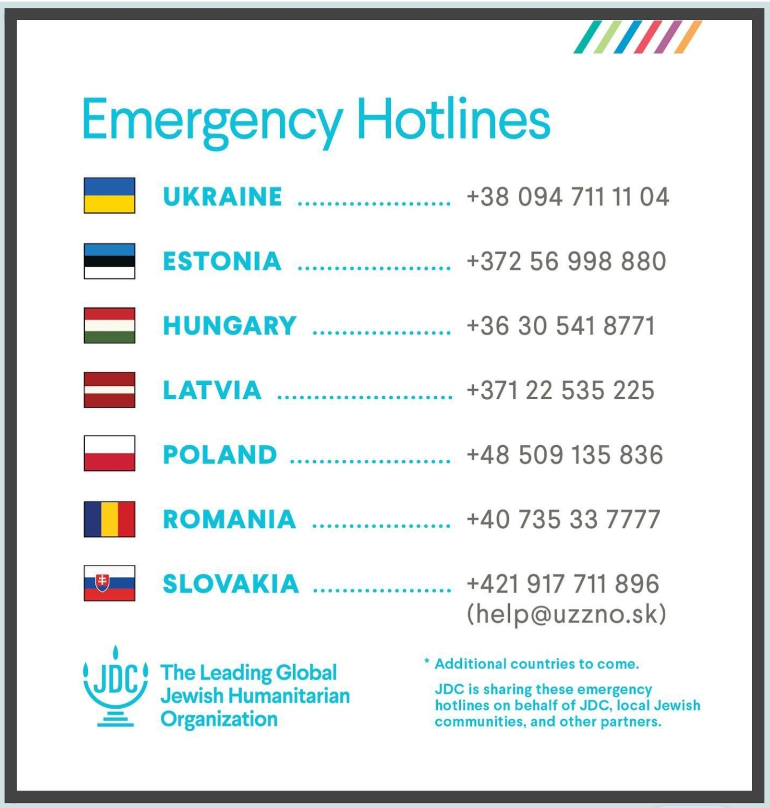
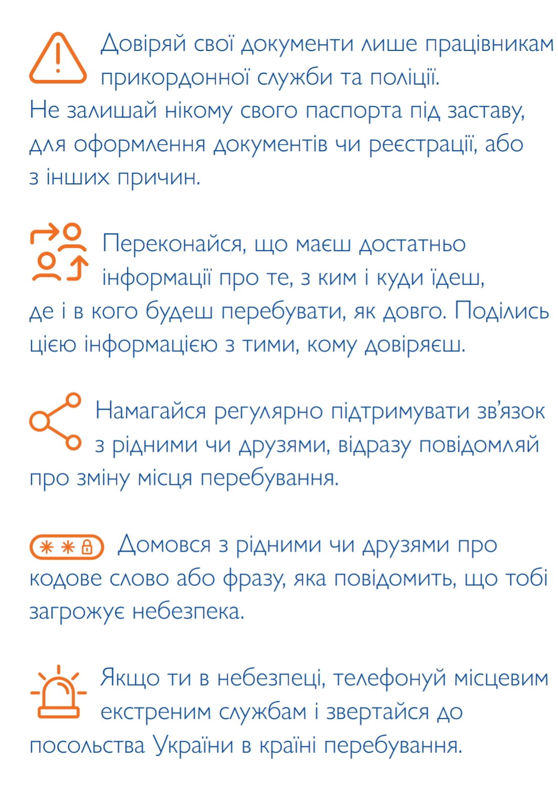
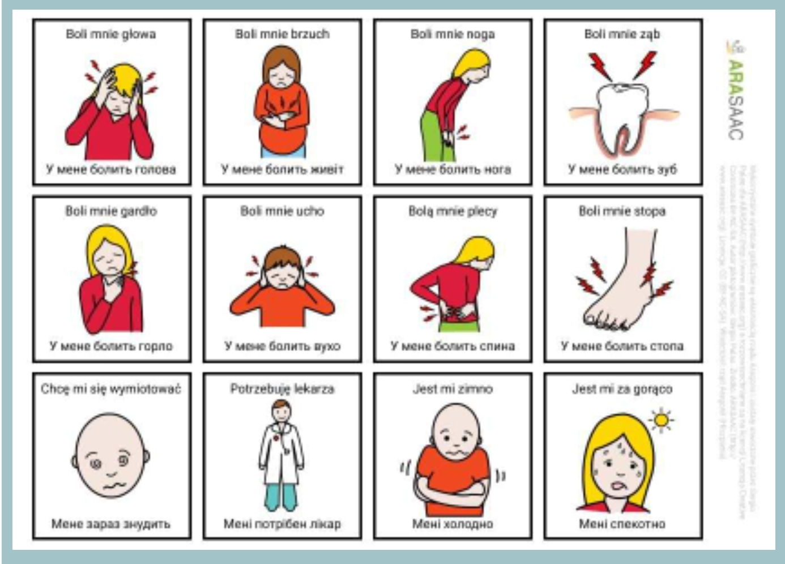
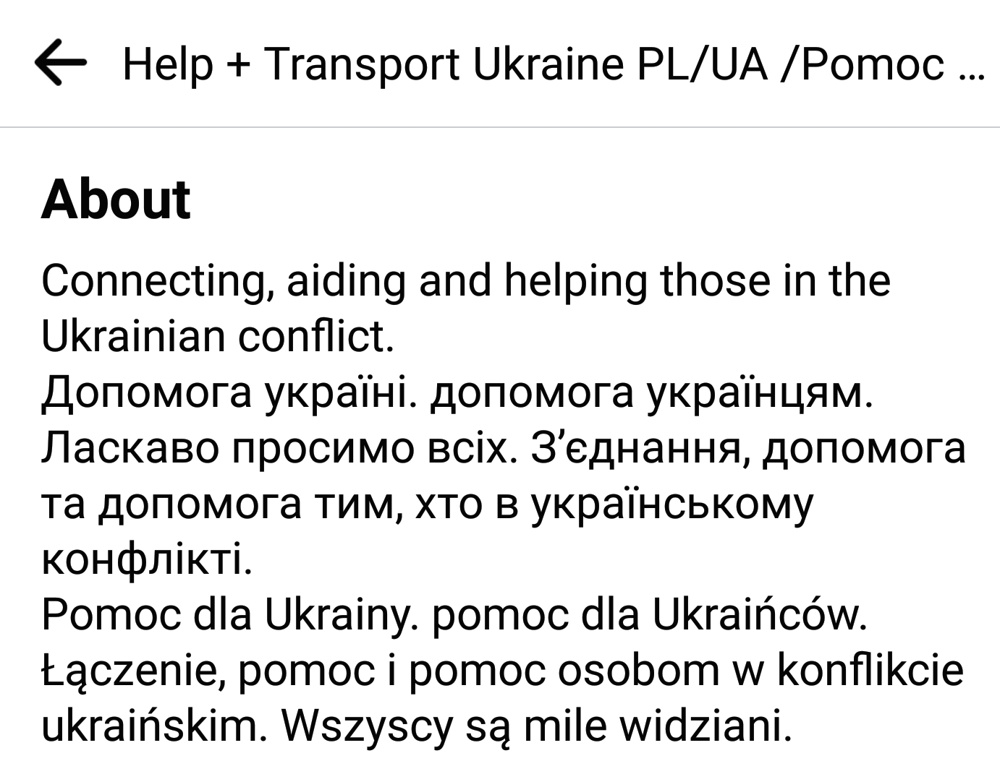
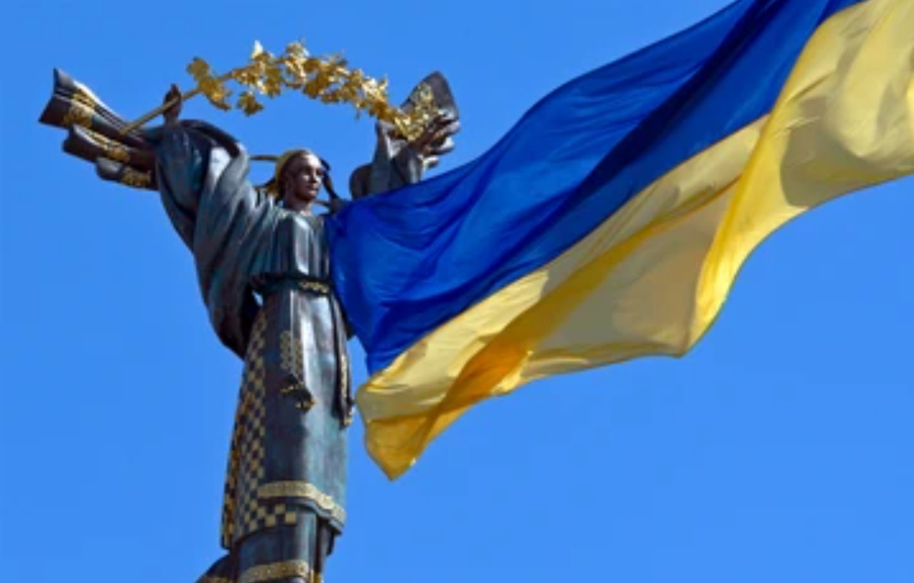
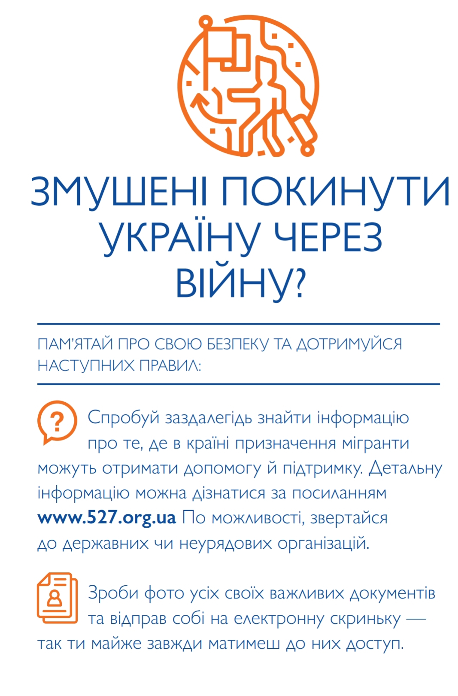
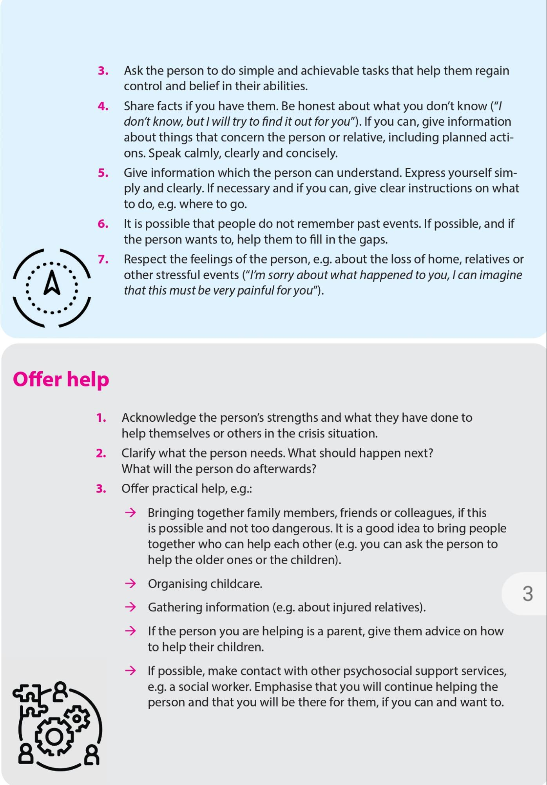
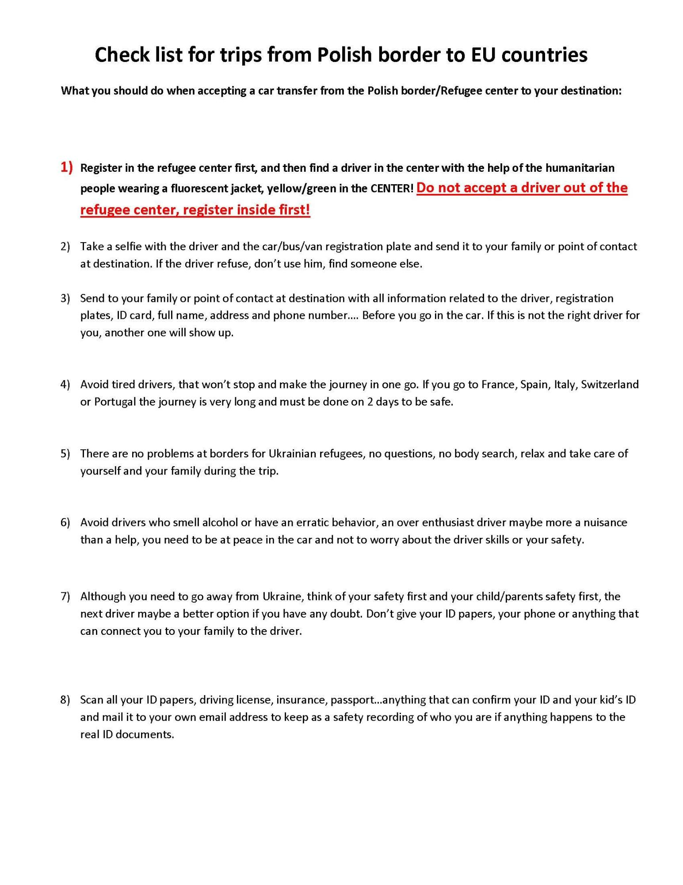
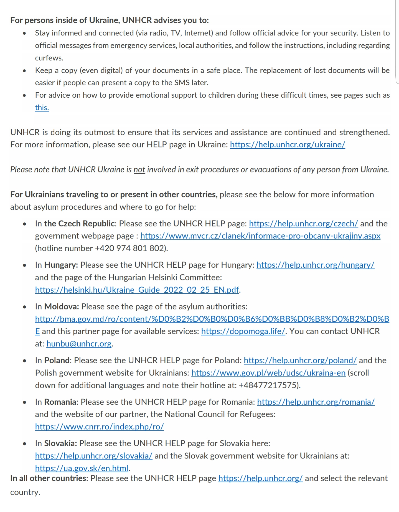
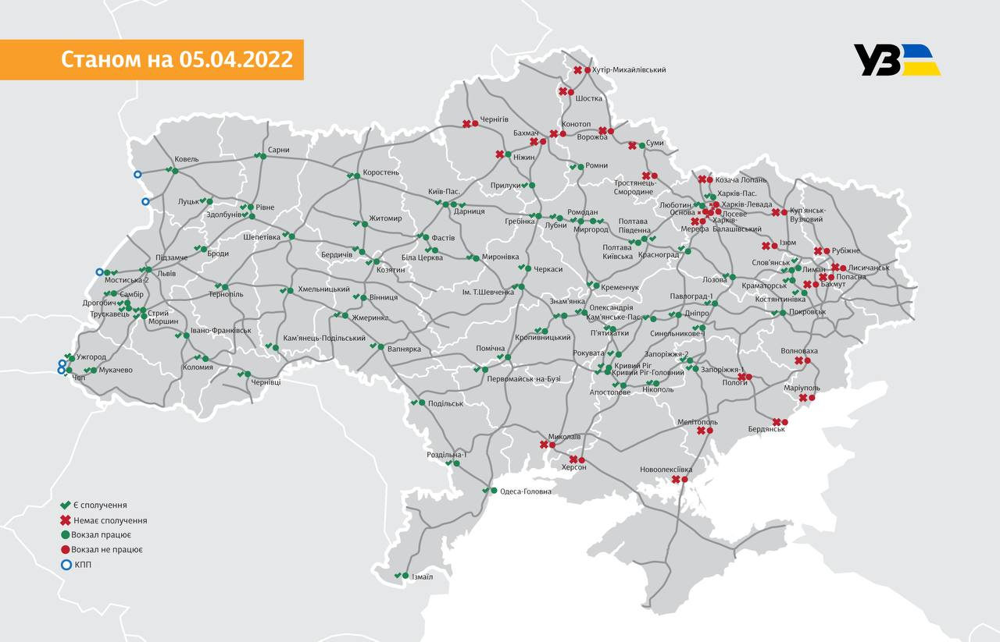

# **1. Announcements / New**

**Wednesday, 13 April -  Saturday, 16 April:**

* [UNMAS | Landmines, Explosive Remnants of War & IED Safety Handbook](https://www.unmas.org/sites/default/files/handbook_english.pdf) — "Landmines are almost always hidden and camouflaged to match their surroundings, making them seldom seen and difficult to locate. They are usually buried or hidden in grass or buildings, fixed on stakes or to trees."
* [What to do when a loved one is taken by the Russians](https://www.ukrinform.ua/rubric-society/3458231-ak-diati-koli-rodici-ci-znajomi-potrapili-v-polon-do-rosian.html) — "If your relatives or acquaintances are captured, report it to the nearest police station or other authorities. You should also contact the [Joint Center for Search and Release of Prisoners](https://ssu.gov.ua/en/zakhyshchaiemo-ukrainu-razom) by phone +38 067 650 83 32; +38 098 087 36 01 or to [united.centre.ssu@gmail.com](mailto:united.centre.ssu@gmail.com), the Central Office advises."
    * "It is also advisable to collect facts and evidence needed to search for a person - screenshots of messages, audio recordings of conversations, video from surveillance cameras and more." [Source](https://www.facebook.com/JusticeKyiv/posts/353270316844203)
* "Bus operator [FlixBus](https://global.flixbus.com/) resumes routes to _Kyiv_ and a number of other Ukrainian cities: _Zhytomyr, Rivne, Vinnytsia, Uman, Khmelnytsky, Ternopil._" [Source](https://www-kmu-gov-ua.translate.goog/news/14-kvitnya-situaciya-v-transportnij-infrastrukturi-na-2000?_x_tr_sl=auto&_x_tr_tl=en&_x_tr_hl=en)
* 14/4 _Poltava_, _Ternopil_ & _Rivne_ _oblasts_: "...doctors' visits to the places of residence of displaced persons have begun." _Chernivtsi_ & _Kirovohrad_ _regions_ will be next. 
    * Vaccinations are provided for: Covid19, tetanus, diphtheria, polio, etc. and vaccine info is given to parents for children. 
    * Information about actions to take in case of threats of biological, chemical & radiological weapons use is offered.
    * COVID19 rapid tests are done.

        [Source](https://www-ukrinform-ua.translate.goog/rubric-ato/3458007-u-troh-oblastah-pocalisa-viziti-likariv-do-pereselenciv-moz.html?_x_tr_sl=auto&_x_tr_tl=en&_x_tr_hl=en)

* [Office Of The Prosecutor General](https://gp.gov.ua/ua/posts/podati-zvernennya)
    * "Please note that appeals about the activities of sabotage and reconnaissance groups (DRG), manifestations of terrorist & subversive activities, other crimes against humanity [RAPE BY RUS TROOPS, ETC] related to the armed conflict and aggression of the Russian Federation against Ukraine, can be submitted around the clock to:

        [conflict2022.ua@gmail.com](mailto:conflict2022.ua@gmail.com)

    * In addition, round-the-clock applications are accepted on the hotline at: +38 (096) 755-02-40
    * When sending appeals, it is necessary to indicate the addressee (Office of the Prosecutor General), last name, first name, patronymic, address & contact telephone number of the applicant."
* [Some Ukrainian families will be able to receive UAH 33,000 in assistance](https://tsn.ua/ukrayina/deyaki-vnutrishno-peremischeni-osobi-zmozhut-otrimati-33-tis-grn-dopomogi-2035897.html): "Such financial assistance is intended for IDPs, both parents and adoptive parents, who:
    * Raise three or more minor children, provided that _at least one child must be under 2 years old._ 
    * Families with two or more children under the age of 18, provided that _at least one child has a disability_.
    * UAH 2,220 per month is allocated for each family member, the benefit is accrued for all for three months. That is, if the family consists of 2 adults & 3 children, the assistance will amount to UAH 33,300 in one payment.
    * To receive a payment, you need to fill out an application on the  [UNICEF](https://register.unicef.org/) website."
* There are a lot of updates to the 

>>>>>  gd2md-html alert: undefined internal link (link text: "Useful Information On Warfare"). Did you generate a TOC?  (<a href="#">Back to top</a>)(<a href="#gdcalert3">Next alert</a>) >>>>> 

[Useful Information On Warfare](#heading=h.2p41bkh8yp5t) section, concerning landmines, chemical weapons & white phosphorus bombs.
* [Survivor's guilt syndrome: what to do if you [feel] ashamed to be safe](https://tsn.ua/ukrayina/yak-otrimati-pensiyu-ta-groshovi-viplati-v-ukrposhti-yakscho-vi-evakuyuvalisya-1998718.html) — this is a _very_ common feeling experienced by Survivors. This article has some really good information & advice on dealing with those feelings. In Ukr.
* [Self-blame | Rape Crisis](https://rapecrisis.org.uk/get-help/tools-for-victims-and-survivors/self-blame-and-guilt/) — "Many victims and survivors feel like they _blame themselves for what happened_, _feel guilty, or feel ashamed_.

    These feelings of shame, guilt and self-blame can be very hard to deal with. But, if you are feeling like this, you are not alone - it's a really common response."

    * You can chat with a rape crisis counselor if you'd like to — services are _anonymous_ and text-based. Go here: [Live Chat Helpline](https://rapecrisis.org.uk/get-help/live-chat-helpline/).
    * Go at your own pace — when _you_ are ready to reach out. There is no timeline & no rules for sharing your story. Support will be there, when _you_ are ready.

---

# **2. Ukrainian Official Agencies**

    [President Zelensky](https://www.president.gov.ua/en)

    * [Facebook](https://zh-cn.facebook.com/president.gov.ua/photos/president-of-ukraine-and-deputy-prime-minister-of-turkmenistan-discussed-prospec/629357273875810/)
    * [Twitter](https://mobile.twitter.com/zelenskyyua?lang=en)
    * [Telegram](https://t.me/V_Zelenskiy_official/784)

    [Ministry of Foreign Affairs](https://mfa.gov.ua/en)

    * [Facebook](https://www.facebook.com/UkraineMFA)
    * [Twitter](https://twitter.com/MFA_Ukraine?t=0DPvRDls9MFauxb7noG8Rg&s=09)
    * [Telegram](https://t.me/Ukraine_MFA/730)
    * [Dmytro Kuleba](https://twitter.com/DmytroKuleba?t=ja3M-DldwAzfN8ClanMrJg&s=09)
    * [Oleg Nikolenko](https://twitter.com/OlegNikolenko_?t=6KR8NAdoeU4CAxn9BPgUMQ&s=09)

    [Kyiv Mayor | Vitali Klitschko](https://kyiv.klichko.org/en/)

    * [Facebook](https://www.facebook.com/KlitschkoOfficial)
    * [Twitter](https://twitter.com/klitschko)
    * [Telegram](https://t.me/vitaliy_klitschko)

    [Office Of The Prosecutor General](https://www.gp.gov.ua/)

    * [Facebook](https://www.facebook.com/pgo.gov.ua/)
    * [Twitter](https://mobile.twitter.com/gp_ukraine)
    * [Telegram](https://t.me/pgo_gov_ua)

    [Cabinet of Ministers of Ukraine](https://www.kmu.gov.ua/en)

    * [Facebook](https://www.facebook.com/KabminUA)
    * [Twitter](https://twitter.com/Kabmin_UA)

    [Ministry of Health Ukraine ](https://en.moz.gov.ua/)

    * [Facebook](https://m.facebook.com/profile.php?id=247810101979500)
    * [Twitter](https://twitter.com/MoH_Ukraine?t=1RwGXys1Qn2mHHh52maUAg&s=09)

    [Ministry of Defence of Ukraine ](https://www.mil.gov.ua/en/)

    * [Facebook](https://www.facebook.com/modofukraine)
    * [Twitter](https://twitter.com/DefenceU?t=7MxacXM6G67MDeF9FcSNzQ&s=09)
    * [Telegram](https://t.co/vXHinHjRIj%E2%80%A6)
    * [Instagram](https://t.co/jLQVwTKWwy)
    * [ArmyInform | Twitter](https://twitter.com/armyinformcomua?t=KFlo5IqlaaI4tBpHcS-maA&s=09)

    [Defence Intelligence of Ukraine ](https://gur.gov.ua/en.html)

    * [Twitter](https://twitter.com/DefenceU?t=7MxacXM6G67MDeF9FcSNzQ&s=09)
    * [Telegram](https://t.me/DIUkraine)

    [Ministry of Culture & Information Policy](https://mkip.gov.ua/en/)

    * [Facebook](https://m.facebook.com/profile.php?id=104868651165124)
    * [Twitter](https://twitter.com/mkipukraine?lang=en)
    * [Telegram](https://t.me/mkipu)

    [Verkhovna Rada of Ukraine | Twitter](https://twitter.com/ua_parliament?t=pMeQ-hBnZ90vjxSN4V_cGg&s=09)

    * [Telegram](https://t.me/verkhovnaradaofukraine)

    [Commissioner for Human Rights, Lyudmyla Denisova](http://www.ombudsman.gov.ua/)

    * [Facebook](https://www.facebook.com/denisovaombudsman/)
    * [Telegram](https://t.me/denisovaombudsman)

    [Ukraine United Nations](http://ukraineun.org/)

    * [Facebook](https://m.facebook.com/UKRinUN)
    * [Twitter](https://twitter.com/UKRinUN?t=O_uz2pRkTAqDDQDqKu84BQ&s=09)
    * [Sergiy Kyslytsya | Twitter](https://twitter.com/SergiyKyslytsya?t=fjkrS5oERTLn_Yrf8BKHXQ&s=09)

    [Ukraine UA](https://war.ukraine.ua/)

    * [Facebook](https://m.facebook.com/UkraineUA.MFA/)
    * [Instagram](https://instagram.com/ukraine.ua?utm_medium=copy_link)

    [Ukraine Embassies & Consulates](https://www.embassy-worldwide.com/country/ukraine/) (Search tool)

    [Government Hotline](https://www.kmu.gov.ua/en/uryadova-garyacha-liniya-1545) — Call 1545. (Access to medical support, humanitarian aid, care for individuals with disabilities, access to charities, care for children & parenting support, eldercare and financial & legal aid.)

    * For Ukraine’s citizens abroad: +38 044 284 19 15

    [State Migration Service](https://visitukraine.today/blog/193/state-migration-service-resumes-administrative-services): "For checking the status of documents: +38-096-033-24-42 (Kyivstar) - voice calls: This number also allows you to communicate with the operator in Viber & Whatsapp messengers via text messages (without voice calls).

    * Hours of the hotline: 9.00 to 18.00."

    

>>>>>  gd2md-html alert: inline image link here (to images/image2.jpg). Store image on your image server and adjust path/filename/extension if necessary.  (<a href="#">Back to top</a>)(<a href="#gdcalert4">Next alert</a>) >>>>> 

    [Ukrposhta](https://www.ukrposhta.ua/en) Free Delivery Information: "14 postal operators have announced that they are ready to send parcels to Ukraine free of charge. This information [was reported](https://www.ukrposhta.ua/ua/news/57615-ukrposhta-spilno-z-partnerami-proponu-bezkoshtovnu-dostavku-dodomu) in the press service of Ukrposhta."

# **

>>>>>  gd2md-html alert: undefined internal link (link text: "~War Crimes: Reporting, Documentation & Archives"). Did you generate a TOC?  (<a href="#">Back to top</a>)(<a href="#gdcalert5">Next alert</a>) >>>>> 

[~War Crimes: Reporting, Documentation & Archives](#heading=h.n5xmg67yz5yq)**

[The Office of the Prosecutor General](https://gp.gov.ua),

together with Ukrainian & international partners, created **[this resource](https://warcrimes.gov.ua/)** where you can report war crimes & crimes against humanity committed by the Russian army.

In addition, round-the-clock applications are accepted on the hotline at: +38 (096) 755-02-40.

~ OR ~

[Ministry of Justice of Ukraine](https://humanrights.gov.ua/) —

**[Report a War Crime](https://humanrights.gov.ua/report)**: "If you have witnessed or been a victim of [human rights violations](https://www.un.org/en/genocideprevention/war-crimes.shtml), record and send evidence."

* _UK_: Anyone with information can report war crime evidence to [Scotland Yard](https://www.met.police.uk/advice/advice-and-information/war-crimes/af/report-a-war-crime).
* _US_: Refugees & asylum seekers with knowledge of human rights violations committed abroad, may submit [a tip](http://tips.fbi.gov/) to the FBI; or contact your [local or international](https://www.fbi.gov/contact-us) FBI Office.
* As per [Dmytro Kulebra](https://twitter.com/dmytrokuleba): "We have created an [online archive](https://t.co/jTqLXYGO5U) to document Russia’s war crimes. The evidence gathered of atrocities committed will ensure that these war criminals cannot escape justice." [Source](https://t.co/76e6TEssK5)
* [State Ecological Inspectorate of Ukraine](https://www.zoda.gov.ua/news/60381/operativniy-shtab-ta-derzhavna-ekologichna-inspektsiya-ukrajini-prodovzhujut-formuljuvati-perelik-porushen-u-sferi-ohoroni-navkolishnogo-seredovisha.html): "A special [website](https://shtab.gov.ua) was created, through which citizens have the opportunity to report environmental damage. The purpose is to form a list of all violations in the field of environmental protection (explosions/bombardments of oil storage facilities, destruction of dams, etc — they have a list on the site) to bring the aggressor to justice."
    * Hotline: +380 (96) 756-83-66 (Telegram, WhatsApp, Viber)
    * Telegram [Chatbox](http://t.me/ecoshkodabot)
    * Email: [eco@shtab.gov.ua](mailto:eco@shtab.gov.ua)
* "The [MIA](https://mvs.gov.ua/en/) of Ukraine, together with Google, have launched a [project](https://t.co/AvkbS1BdkZ) to digitize the consequences of the Russian invasion. It should help the state to track losses, reconstruction services to plan their work, and citizens [to] know the situation with property." [Source](https://twitter.com/EuromaidanPress/status/1512284851738664962?t=xG_f5blXO8SUFVNgPsX5UA&s=19)
    * Read more [here](https://bit.ly/3LEGXXk).
    * Watch the video [here](https://youtu.be/Kt8rBE85oZY).
* Chatbot that collects your photos & videos about the war:  [Telegram | @hromadske_report_bot](https://t.me/hromadske_report_bot)

---

# **3. Safety & Security**

**[Danger Zones](https://www.google.com/maps/d/u/0/viewer?ll=50.37243250000009%2C30.460808699999994&mid=14PnyHN3WPgBZgpJ3q0BOMswKge1hv1au&shorturl=1&z=11): Interactive, live update map of target areas, by [Liveuamap](https://liveuamap.com/).**

* Emergency contact telephone numbers in Ukraine:
    * 112 – Call number for all emergency services. Call this number, and the dispatcher will connect the required service.
    * 101 – Fire Service
    * 102 – Police
    * 103 – Ambulance
    * 104 – Emergency Services: Gas Network
    * 0 800 501 482 – Security Service of Ukraine Hotline
    * 1545 — [Government hotline](https://www.kmu.gov.ua/en/uryadova-garyacha-liniya-1545)
    * 7333 — [Ukraine Lifeline](https://lifelineukraine.com/en) Suicide Prevention Hotline
* [Ukraine Ministry of Digital Transformation](https://www.kmu.gov.ua/en/yevropejska-integraciya/coordination/cifrova-transformaciya) has launched an 

    _air raid alert_ [notification](https://t.co/D3ykpynCe1) app.

    * [Google Play](https://play.google.com/store/apps/details?id=com.ukrainealarm)
    * [AppStore](https://apps.apple.com/ua/app/%D0%BF%D0%BE%D0%B2%D1%96%D1%82%D1%80%D1%8F%D0%BD%D0%B0-%D1%82%D1%80%D0%B8%D0%B2%D0%BE%D0%B3%D0%B0/id1611955391)
* [Practical Guide | In Case of Emergency or War](https://dovidka.info/en/): "It is important to know what each of us can do in an emergency, [which is] especially true when the police, ambulance, rescue and other services are [unable to respond].

    In this handbook, you will find practical advice on preparing for an emergency and how to act in such a case." _(*This guide is really well done!)_

    * In [Ukrainian](https://livewell.optum.com/pdfs/df57eb6c25018a77.pdf)
* [Telegram | Chat bot: “Ready For Everything”](https://t.me/Hotovyi_do_vsioho_bot): Information on what to do in an emergency.
* [WhatsApp | GPS Tracking/Live Location](https://faq.whatsapp.com/android/chats/how-to-use-live-location/?lang=en) allows you to share your movements with contacts you choose. You can use this when you travel or accept a ride from someone you don't know well. _Always let someone know where you are going and who you are with._
* [Five Ways To Purify Water Without A Filter](https://www.primalsurvivor.net/ways-to-purify-water-survival/) — [Source](https://twitter.com/StephenKolanko1/status/1501771824128008193?t=epxspR8ec09ELBHfmy3J_A&s=19)
* [How to make water drinkable](https://www.fema.gov/press-release/20210318/fact-sheet-how-make-your-water-safe-drink).

>>>>>  gd2md-html alert: inline image link here (to images/image3.jpg). Store image on your image server and adjust path/filename/extension if necessary.  (<a href="#">Back to top</a>)(<a href="#gdcalert6">Next alert</a>) >>>>> 

[527 Org Ukraine](https://www.527.org.ua/) | [Safety Brochure](https://drive.google.com/file/d/1chQLWFx7s-KfwCJHfhMEnbUS1WO3ApL2/view?usp=drivesdk)

>>>>>  gd2md-html alert: inline image link here (to images/image4.jpg). Store image on your image server and adjust path/filename/extension if necessary.  (<a href="#">Back to top</a>)(<a href="#gdcalert7">Next alert</a>) >>>>> 

**~Persons Inside Ukraine**

**The ICRC & UNHCR Advise:**

* "Your personal documents: In a secure and protective bag keep a copy of your national identity card, passport, family certificates, birth certificate, insurance documents, property documents, etc.
* Make sure children know their personal information such as their full names, parents' names, and parents' contacts." [ICRC](https://www.icrc.org/en/where-we-work/europe-central-asia/ukraine/help-useful-information-affected-people)
* Stay informed and connected (via radio, TV, Internet) and follow official advice for your security. Listen to official messages from emergency services, local authorities, and follow the instructions, including regarding curfews.
* Keep a copy (even digital) of your documents in a safe place. The replacement of lost documents will be easier if people can present a copy to the SMS later. (*You can also take photos of them and email them to yourself - along with photos of your family and of yourself _with_ your pets.)
* For advice on how to provide emotional support to children during these difficult times, see pages such as [this](https://www.unhcr.org/mental-health-psychosocial-support.html)." [UNHCR](https://www.unhcr.org/ua/en/42841-information-for-persons-under-unhcr-mandate.html)
* ICRC Contact Information:
    * Tel: Outside of Ukraine, call the hotline: +41 22 730 36 00
    * Email: [inquiries@icrc.org](mailto:inquiries@icrc.org)
    * Twitter: [@ICRC_ua](https://twitter.com/ICRC_ua?t=59AS_fmar8Zvv1AAG6SRjg&s=09)
    * Facebook: [@ICRC](https://www.facebook.com/ICRC/)
* Ukrainian Red Cross:
    * You can contact the Ukrainian Red Cross Society from anywhere in Ukraine: 0 800 331 800.
        * Kyiv – 0 800 300 155
        * Slavyansk — 0 800 300 115
        * Severodonetsk – 0 800 300 125
        * Mariupol – 0 800 300 165
        * Donetsk – 0 800 300 185
        * Luhansk –  0 800 300 195
    * Email: [national@redcross.org.ua](mailto:national@redcross.org.ua)
    * Twitter: [@RedCrossUkraine](https://twitter.com/RedCrossUkraine?t=SsOxU40HhtRouCP3hQceUQ&s=09)
    * Facebook: [@RedCrossUkraine](https://m.facebook.com/RedCrossUkraine/)
    * Telegram: [Ukrainian Red Cross](https://t.me/UkrainianRedCross)
* UNHCR Contact Information:
    * Теl: +38(044) 288 9710
    * Email: [ukrki@unhcr.org](mailto:ukrki@unhcr.org)
    * Website: [www.unhcr.org.ua](http://www.unhcr.org.ua)
    * Facebook: [@UNHCRKyiv](https://www.facebook.com/UNHCRKyiv/)
    * Twitter: [@unhcrukraine](https://twitter.com/unhcrukraine)

## **~Useful Information On Warfare**

* "**What can I do if there is fighting?**

    (*This advice is in regard to shelling/ missile strikes, etc. There is separate advice in relation to chemical & nuclear weapons attacks.)

1. If there's a basement, immediately, go there. Stay in a safe zone on lower ground with protective walls.
2. Stay as far as possible from windows.
3. Wait until the shooting is over before you move to a safer shelter.
4. Don't pick up anything you haven't dropped yourself. During conflict, things that may look harmless could potentially be explosive objects. Stay away from unattended objects that do not belong to you." [Source](https://www.icrc.org/en/where-we-work/europe-central-asia/ukraine/help-useful-information-affected-people)
5. "If you are trapped in debris, use a flashlight, whistle or tap on pipes to signal your location to rescuers.
6. Shout only as a last resort to avoid inhaling dangerous dust.
7. Cover your nose and mouth with anything you have on hand." [Source](https://www.ready.gov/explosions)
* Be careful of [mines](https://www.facebook.com/100505105900087/posts/121511370466127/) — warn children that they may look like colorful toys!

    **Remember: "If _you_ didn't drop it; _don't_ pick it up!"** [Video](https://m.facebook.com/story.php?story_fbid=pfbid034JomvpmFqoKikUEACksUgd5Tj3zvbAYT3D1KKEhV7XDRDfDzhwqikfcXtgrVbbyMl&id=353667671424634&m_entstream_source=timeline&__tn__=%2As%2As-R).

* "This page contains [educational materials](https://www.osce.org/project-coordinator-in-ukraine/514423) produced in response to significantly increased risks to civilians in Ukraine from mines, abandoned ordnance and other explosive remnants of war."
* [UNMAS | Landmines, Explosive Remnants of War & IED Safety Handbook](https://www.unmas.org/sites/default/files/handbook_english.pdf) — "Landmines are almost always hidden and camouflaged to match their surroundings, making them seldom seen and difficult to locate. They are usually buried or hidden in grass or buildings, fixed on stakes or to trees." (*IED: Improvised Explosive Device)
* _Interactive Map_: [Demining by SES units](https://dsns.gov.ua/map-demining#) in Ukraine — "An interactive map with places of explosive objects has been launched. It is possible to monitor the detailed dynamics of demining work on a daily basis: # of departures, demined areas and # of demined explosive devices." [Source](https://t.co/8j5RtmIJYC)
* "[Video for children](https://t.co/KonVSltAEy) about explosives, various landmines, bombs & missiles and rules on how to deal with them.

    Video is very important & only 3 minutes long." (In Ukr) [Source](https://twitter.com/ferlain/status/1514124123248726021?t=ke_FKzDFEFJ3WwzDj2Hg3Q&s=19)

* What to do in the case of an **[ammonia leak](https://twitter.com/ukrpravda_news/status/1505735077371777028?t=GTyB95jStlHxH0UFdtF-zA&s=19)**. Follow all directions for evacuation from officials. (In Ukr)
* [What to Know About White Phosphorus Bombs](https://www.webmd.com/a-to-z-guides/white-phosphorus-bombs-overview) — "It’s a chemical made from phosphate rocks. In solid form, it has a waxy texture and a garlic-like odor. It may be white or yellow in color, or clear (colorless)." _It ignites upon contact with oxygen._

    "White phosphorus is highly soluble in fat and therefore deeply burns human flesh. If fragments of white phosphorus enter the bloodstream, they can lead to multiple organ failure. Already-dressed wounds can reignite when dressings are removed, and they are re-exposed to oxygen." [Source](https://www.hrw.org/news/2022/03/17/qa-incendiary-weapons-ukraine#Five)

    [First Aid & Decontamination](https://www.cdc.gov/niosh/ershdb/emergencyresponsecard_29750025.html)**: **"Initial treatment is primarily supportive. In cases of skin or eye exposure, immediately remove burning particles of white phosphorus from the patient/victim’s eyes or skin. If skin or eyes are contaminated with white phosphorus, cover them with cool wet cloths to avoid re-ignition.

    * There is _no antidote_ for white phosphorus toxicity.
    * Click the first aid link for detailed information — scroll way down on the page.
* "The [Thomson Foundation](https://www.thomsonfoundation.org/) has created a course on reacting to a **_chemical weapons attack_** that is delivered via a Telegram bot, with the help of chemical and biological weapons expert Hamish de Bretton-Gordon." [Source](https://twitter.com/NovelSci/status/1509687859388715022?t=9uA1zaWFRgkdd0OMhV_1Yw&s=19)
    * [English](http://t.co/9pjRO7oBK8)
    * [Ukrainian](http://t.co/RxMyjGEb7b)
* **[Chemical Attack Safety Information](https://www.dhs.gov/xlibrary/assets/prep_chemical_fact_sheet.pdf)**: "If they are near an outdoor chemical release, people should:
1. Avoid any obvious plume or vapor cloud.
2. Walk away from the site and into a building in order to shelter-in-place. Do not run.
3. Bring family and pets inside. 
4. Lock doors, close windows, air vents, and fireplace dampers. 
5. Turn off fans, air conditioning, and forced air heating systems. 
6. Go into a room with as few windows as possible. Seal the room to create a temporary barrier between people and the contaminated air outside. [_NOT THE BASEMENT_]
7. Seal all windows, doors, and air vents with plastic sheeting and duct tape. 
8. Improvise with what is on hand to seal gaps to create a barrier from any contamination. 
9. Watch TV, listen to the radio, or check the Internet often for official news and instructions as they become available."

    "In case of evacuation during a chemical attack:

1. take a first aid kit;
2. dress so that there is as little exposed skin as possible;
3. use gas masks or cotton gauze bandages soaked in water or preferably 2-5% solution of baking soda (for chlorine), acetic or citric acid (for ammonia);
4. leave the room by stairs;
5. do not touch any objects on the street." [Source](https://www.pravda.com.ua/news/2022/03/24/7334047/)
* [TSN.ua | Chemical Attack by Sarin: how to act in case of poisoning](https://tsn.ua/ukrayina/himichna-ataka-zarinom-yak-rozpiznati-ta-yak-diyati-2020435.html) — "Sarin belongs to the organophosphorus weapons of neuro-paralytic action. In appearance it is a liquid, when evaporated, a colorless and odorless gas, extremely toxic." 

    "Most [sarin](https://www.cdc.gov/niosh/ershdb/emergencyresponsecard_29750001.html) affects the nervous system, over-activating it, which is accompanied by a variety of symptoms." 

    **How does sarin get into the human body?**

    * The gas enters the human body through the skin, mucous membranes of the eyes and respiratory system.
    * Clothing contaminated with sarin is also a threat because it evaporates and poisons people around. 
    * Sarin is heavier than air, so the risk of sarin poisoning is higher in the lowlands, even higher - in the basement."

    **What to do — According to the [National Library of Medicine](https://webwiser.nlm.nih.gov/substance?substanceId=151&identifier=Sarin&identifierType=name&menuItemId=61&catId=85):**

    * "If you wear glasses, wear them.
    * If the projectile with sarin exploded near the house, you need to immediately close the windows, doors, and close all vents [and fireplace dampers]. _Never turn on the air conditioner._
    * Do not go outside immediately after a chemical weapon attack, most poisons last for hours. It is necessary to wait for the notification that the chemical threat has passed, information about the ways of safe evacuation.
    * If an explosion occurs on the street, you must immediately leave the place, moving against the wind. You need to move quickly, but do not run, so as not to speed up breathing. It is desirable to hide in the nearest room, or at least in a car with raised windows.
    * If you have a chemical attack, you need to get rid of your clothes as soon as possible. Sarin on clothes evaporates and is dangerous. Clothes should not be removed over the head, it is better to cut and thus remove it.
    * After removing the clothes, you need to wash all areas of skin in contact with the poison with water, preferably also with soap. The more, the better.
    * Eyes should also be rinsed thoroughly with water for at least 10 minutes.
    * Do not touch surfaces that may be contaminated with sarin.
    * Artificial ventilation of the lungs, especially artificial respiration in this situation is unacceptable."
    * "If it is not possible to turn to specialists, then, according to cardiologist Daria Stepchina, if the enemy uses sarin, which is a neuro-paralytic, the best antidote is:
        * Diazepam;
        * Anthropine."
    * "You should also use aqueous solutions of ammonia, alkalis, hydrogen peroxide, hydroxylamine solution in a slightly alkaline environment to disinfect surfaces, rooms, objects and even clothing."
    * "One antidote, [atropine](https://go.drugbank.com/drugs/DB00572), blocks acetylcholine receptors, sparing the body's muscles from overstimulation. The other, [pralidoxime](https://go.drugbank.com/drugs/DB00733), or 2-PAM, removes sarin from the enzyme that stops acetylcholine from accumulating, Nelson said. However, both antidotes must be given within about 10 minutes of exposure in order to be effective, he said." [Source](https://www.livescience.com/58593-facts-about-sarin.html)
* **[Nuclear Explosion](https://www.ready.gov/nuclear-explosion)** — "Nuclear devices range from a small portable device carried by an individual to a weapon carried by a missile.

    Fallout is most dangerous in the first few hours after the detonation when it is giving off the highest levels of radiation. It takes time for fallout to arrive back to ground level, often more than 15 minutes for areas outside of the immediate blast damage zones." Conceivably, this provides some time to react and protect yourself to at least some degree — learn what best to do in case of a potential emergency. 

* [CDC | Radiation Emergencies](https://www.cdc.gov/nceh/radiation/emergencies/nuclearfaq.htm)

    **"How can I protect my family and myself during a nuclear blast?**

    **If you are near the blast when it occurs:**

    * Turn away and close and cover your eyes to prevent damage to your sight.
    * Drop to the ground face down and place your hands under your body.
    * Remain flat until the heat and two shock waves have passed.

    **If you are outside when the blast occurs:**

    * Find something to cover your mouth and nose, such as a scarf, handkerchief, or other cloth.
    * Remove any dust from your clothes by brushing, shaking, and wiping in a ventilated area, however, cover your mouth and nose while you do this.
    * Move to a shelter, basement, or other underground area, preferably located away from the direction that the wind is blowing.
    * Remove clothing since it may be contaminated; if possible, take a shower, wash your hair, and change clothes before you enter the shelter.
* **If you are already in a shelter or basement:**
    * Cover your mouth and nose with a face mask or other material (such as a scarf or handkerchief) until the fallout cloud has passed.
    * Shut off ventilation systems and seal doors or windows until the fallout cloud has passed. However, after the fallout cloud has passed, unseal the doors and windows to allow some air circulation.
    * Stay inside until authorities say it is safe to come out.
    * Listen to the local radio or television for information and advice. Authorities may direct you to stay in your shelter or evacuate to a safer place away from the area.
    * If you must go out, cover your mouth and nose with a damp towel.
    * Use stored food and drinking water. Do not eat local fresh food or drink water from open water supplies.
    * Clean and cover any open wounds on your body."
    * [Nuclear Emergency Types](https://www.cdc.gov/nceh/radiation/emergencies/moretypes.htm)
    * [Questions About Radiation (FAQ)](https://www.cdc.gov/nceh/radiation/emergencies/emergencyfaq.htm)
    * [Preventing and Treating Radiation Injuries and Illness](https://www.cdc.gov/nceh/radiation/emergencies/symptoms.htm)
    * [Radiation | Food & Water Safety](https://www.cdc.gov/nceh/radiation/emergencies/food_water_safety.html)
* "How to [recognize a saboteur](https://www.facebook.com/100505105900087/posts/120518213898776/): an explanation from the [Center for Popular Resistance](https://sprotyv.mod.gov.ua/)." (In Ukr) 
    * Their [Facebook](https://www.facebook.com/sprotyv.official/) page has valuable safety & awareness information.
* ["Who Are You" App](https://gur.gov.ua/content/tykhto.html) — An application for checking suspects has been launched in Ukraine. "...the main purpose of this app is to simplify the procedure for checking suspects at checkpoints, on the streets during curfew, at the entrance to the shelter or in other situations." 
    * Click the link above to see what data points the app will reveal about a person you wish to check.
* [The Mini-Manual For The Urban Defender | A Guide To The Strategies And Tactics Of Defending A City](https://www.johnspenceronline.com/urban-warfare) by Col John Spencer (In Eng, Ukr, Latvian & Japanese)

---

# **4. Housing & Transportation**

* 🇺🇦 "[Lviv | Arena Lviv Stadium](https://zaxid.net/kudi_zvertatis_bizhentsyam_u_lvovi_ta_yak_yim_dopomogti_n1536966): resettlement center for displaced persons and several points in the city where help is collected for them. According to LODA Chairman Maksym Kozytskyi, there are a total of 37,000 ready places for refugees in the region."
    * 0684147963 - for those who need asylum, housing, or humanitarian assistance;
    * 0971821860 - for those who need asylum, housing, or humanitarian assistance;
    * 0636633371 - to address transport issues."
* 🇺🇦 "[Zaporizhia Regional Military Administration](https://www.zoda.gov.ua/news/59659): the Center for Reception of Displaced Persons is open at: Zaporizhia, vul. Record, 41 (premises of the State Enterprise "Zaporizhzhya State Circus"). You need to register here. The Center will also be able to feed, heat & coordinate further actions.
    * Zaporozhye region — hotline for people moving from the combat zone: +38 066 926 50 97; +38 068 297 01 18; +38 061 787 94 75
    * Ukrainians can get information on where to apply for temporary accommodation in Zaporizhia."
    * [Shelter points](https://www.zoda.gov.ua/article/2603) in Zaporizhia Region. 
* 🇺🇦 [How to get help and a temporary home in Ukraine: instructions from "Action"](https://www.unian.ua/society/yak-otrimati-dopomogu-ta-timchasoviy-dim-v-ukrajini-instrukciya-vid-diji-novini-ukrajini-11742667.html?utm_source=twitter&utm_medium=twitter&utm_campaign=twitter_site): "Currently, [CNAPs](https://koda.gov.ua/en/interactive-map-of-cnaps/) operate as Care Centers in 120 settlements of Ukraine.
    * Internally displaced persons can receive assistance and temporary shelter at administrative service centers (ADCs) in 14 oblasts of Ukraine.
    * CNAPs operate as Care Centers where you can get basic necessities and temporary shelter. You can find out exactly [where the Care Center works with a chatbot](https://www.unian.ua/techno/communications/mincifri-zapustilo-chatbot-dlya-dopomogi-pereselencyam-11721988.html) on Telegram [@turbotnyk_bot](https://t.me/turbotnyk_bot)." (For [Viber](https://tinyurl.com/turbotnyk))
    * "Assistance is available in Rivne, Poltava, Zhytomyr, Chernivtsi, Ternopil, Zakarpattia, Zaporizhia, Luhansk, Khmelnytsky, Volyn, Lviv, Cherkasy, Vinnytsia and Ivano-Frankivsk regions." [CNAPs Interactive Map](https://koda.gov.ua/en/interactive-map-of-cnaps/) ([https://koda.gov.ua/en/interactive-map-of-cnaps](https://koda.gov.ua/en/interactive-map-of-cnaps))
    * The coordinators are available 24/7 at these numbers: +380501010454; +380993121127.
* 🇺🇦 [Settlement opportunities for IDPs](https://r2p.org.ua/vnutrishno-peremishheni-osoby/#):

    "Availability of housing facilities in _Dnipropetrovsk, Zaporizhia and Kharkiv oblasts_ that can be used as temporary/social housing for internally displaced persons under the condition of reconstruction or cosmetic repairs. They were placed on an interactive online map. If you need advice or more detailed information about these facilities, fill out the **[form](https://ee.humanitarianresponse.info/x/FdG9QOsD)** and you will be contacted by representatives of the [Right to Protection Charitable Foundation](https://ua.linkedin.com/company/right-to-protection-cf) within three working days. Data is not passed on to third parties." (Form: [https://ee.humanitarianresponse.info/x/FdG9QOsD](https://ee.humanitarianresponse.info/x/FdG9QOsD))

* [Dopomagai Org | Shelter](https://shelter.dopomagai.org/) — "Free temporary housing in safe cities of Ukraine or abroad, provided by caring people. Search among thousands of ads, or call the hotline 0 (800) 332 238." More information, from [Kyiv City Gov](https://www.facebook.com/100064898971743/posts/340752394764724/).
* 🇺🇦 List of [Caritas Ukraine organizations](http://news.ugcc.ua/news/ugkts_nadaie_pritulok_b%D1%96zhentsyam_na_zahod%D1%96_ukraini_spisok_kontakt%D1%96v_95802.html) that are ready to provide shelter in Ukraine. 
* 🇺🇦 "[Bolt taxi service](https://kyivguide.com.ua/bolt-taxify-in-kyiv/) provides its fleet for the evacuation of Ukrainians from places where heavy military operations are taking place to safer cities in Western Ukraine.

    Passengers only need to refuel the car themselves. The driver must have a driving licence of category "B" and be a citizen of Ukraine. For passengers, citizenship of Ukraine is also mandatory." [Source](https://visitukraine.today/blog/155/bolt-taxi-service-provides-cars-for-evacuation-for-free)

    * You can take a car for evacuation in the cities listed [here](https://visitukraine.today/blog/155/bolt-taxi-service-provides-cars-for-evacuation-for-free).
    * Contact numbers:

        +380630577390

        +380639584701

        +380982040707

    * You can also fill in the [form for evacuation](https://docs.google.com/forms/d/e/1FAIpQLSf1GdPcMOWb1ZYEQtjCV_c5zRciPo533yTVt5ZjBgzueZK4FA/viewform).
* [UNHCR | UN Refugee Agency](https://www.unhcr.org/): They are providing immigration information and will make referrals for accommodation (Ex., to Airbnb, who they are partnering with.). See below for contact information for different countries. ([Facebook](https://www.facebook.com/UNHCR/))([Twitter](https://twitter.com/refugees))

>>>>>  gd2md-html alert: inline image link here (to images/image5.jpg). Store image on your image server and adjust path/filename/extension if necessary.  (<a href="#">Back to top</a>)(<a href="#gdcalert8">Next alert</a>) >>>>> 

* [UNHCR | Refugee Help Pages](https://help.unhcr.org/)
    * 🇨🇿 [Czech Republic](http://help.unhcr.org/czech) & [CZ Government Website](https://www.vlada.cz/en/)
        * Hotline: +420 974 801 802
    * 🇭🇺 [Hungary](http://t.co/W3VUqJEwTw) & [Hungarian Helsinki Committee](https://helsinki.hu/en/)
    * 🇲🇩 [Moldova Asylum Authorities](https://www.unhcr.org/republic-of-moldova.html) & [Available Services](http://dopomoga.org.htmlexaminer.com/)
        * You can contact UNHCR at [hunbu@unhcr.org](mailto:hunbu@unhcr.org).
        * Hotline of the Moldovan Bureau for Migration and Asylum: +373 (0) 8000 15 27.
    * 🇵🇱 [Poland](http://t.co/wRy8CEtIzE) & [Polish Govt Site For Ukrainians](https://www.gov.pl/web/udsc/ukraina-en).
        * Hotline: +48477217575
    * 🇷🇴 [Romania](http://t.co/H11VisLGFM) & [Romanian National Council For Refugees](https://diaspora-engagement.eu/org/the-romanian-national-council-for-refugees/)
    * 🇸🇰 [Slovakia](http://t.co/B08aWP7ILK) & [Slovakia's Website for Ukrainian](https://ua.gov.sk/en.html)
    * 🇹🇷 [Turkey](https://help.unhcr.org/turkey/#_ga=2.6290357.721434156.1647648538-1458154826.1646456093&_gac=1.259124856.1646989152.CjwKCAiAg6yRBhBNEiwAeVyL0JYI1gtATqf_fkAOGmRsfLKkVXkAdPjHEeUIIsIkYhe_yiNJHAZ1yRoCIpQQAvD_BwE) & [Turkey Immigration For Ukrainians](https://www.turkeyimmigration.org/check-requirements/ukraine)
    * 🇺🇦 [Ukraine](http://help.unhcr.org/ukraine/about-unhcr-in-ukraine)
    * 🌏 [All Other Countries](http://t.co/UuwtEkUrzb)
* [Free housing for refugees in Europe: where Ukrainians can seek refuge](https://tsn.ua/ato/bezkoshtovne-zhitlo-dlya-bizhenciv-v-yevropi-de-ukrayincyam-shukati-prihistok-2035954.html)
* 🇸🇰 [Slovakia | Kto pomôže Ukrajine](https://ktopomozeukrajine.sk/) is a Government-recommended site to help refugees arriving in Slovakia. This site is incredibly well-done and includes security processes for those wishing to offer help. The site itself has a lot of very useful information!

    Refugees can request help with:

    accommodation, transport, material, psychological support, legal aid and other forms of care (education, child care, legal aid)

* 🇲🇩 [Moldova | Dopomoha](https://dopomoha.md/) is the site the Government of Moldova links to for free assistance for refugees from Ukraine. The site provides categories of help with contact information/ links to assistance. For accommodation or things not listed, you're required to submit a request form. It's a pretty good site & is organized well - it even includes free dental help.
* 🇷🇴 „[UnAcoperiș](https://unacoperis.ro/en/request-help)” '"A Roof' is a solution for identifying accommodation spaces to help refugees who arrive in **Romania** and need help immediately. The platform can register legal and natural persons who can provide rooms or buildings for people living in shelters provided by the Romanian authorities. A Roof is a platform developed by Code for Romania and managed by the CNCCI, National Center for Command and Coordination of Interventions and partner organizations."LLP
* [Hostelworld | Rooms For Refugees](https://hwhelp.hostelworldgroup.com/hc/en-us/articles/4505830563474-Rooms-4-Refugees-Supporting-those-fleeing-Ukraine) reached out to our hostel partners across Europe to create a directory of hostels that are able to provide accommodation for refugees fleeing Ukraine All hostels have confirmed that rooms allocated to refugees will not be shared with other travelers, so you will have your own space and privacy to look after yourselves and your families." ([Facebook](https://www.facebook.com/Hostelworld/))([Twitter](https://twitter.com/hostelworld?lang=en))
* [#HospitalityHelps](https://hospitality-helps.org/english/main): "This initiative has one single goal: providing temporary hotel accommodation to Ukrainian residents, who are forced to leave their homes as a result of the war." Rooms are provided free of charge to refugees fleeing the war. You can request accommodation on their site, at the above link.
    * [Free accommodation for up to 5 nights in Hilton hotels for Ukrainians](https://193land.com/hilton-free-roms-for-ukraine): The offer is valid throughout Europe!
* [Host4Ukraine](https://www.host4ukraine.com/) is being promoted by the United Nations High Commissioner for Refugees (UNHCR) and is  featured by national and international news agencies like MTV Uutiset & Bloomberg." (Run by [Churchpool](https://churchpool.com/en/)) ([Facebook](https://m.facebook.com/host4ukraine))([Twitter](https://mobile.twitter.com/Host4Ukraine))
* [I Can Help](https://icanhelp.host/): "The main goal of our platform is to assist and facilitate people in need to find a host and also for the host to find those who need solidarity housing." This site is recommended by former US President, Barack Obama. The site has a security process for vetting.
* [Homes for Ukraine](https://homesforukraine.eu/en/home-eng/) is an initiative of non-profit public organizations [Barbareum](http://st-barbara-austria.org/uk/), [Unlimited Democracy](https://www.unlimiteddemocracy.com/) and [TUMA](https://makumira.ac.tz/) with the aim of providing free, temporary accommodation within Europe for Ukrainians."
* [BlaBlaCar](https://bit.ly/blablatransfer) is a free service that helps to evacuate people to safety and bring humanitarian aid on return.
    * [How does it work?](https://support.blablacar.com/hc/uk/articles/360015367779-%D0%AF%D0%BA-%D0%BF%D1%80%D0%B0%D1%86%D1%8E%D1%94-BlaBlaCar-)

<table>
  <tr>
   <td>
<ul>

<li><a href="https://t.co/0orvOyEITr">Uber</a> is offering free rides from the <em>Poland-Ukraine</em> border.
    Update 3/16: "We plan to expand our support for refugees in other neighboring countries. With hundreds of thousands of people also fleeing Ukraine towards <em>Romania and Czechia</em>, we will extend our support of free rides to both countries."

    .

>>>>>  gd2md-html alert: inline image link here (to images/image6.jpg). Store image on your image server and adjust path/filename/extension if necessary.  (<a href="#">Back to top</a>)(<a href="#gdcalert9">Next alert</a>) >>>>> 

</li>
</ul>
   </td>
   <td>
   </td>
  </tr>
</table>

* 🇪🇺 Transportation/Accommodation Request From The Border With The EU: "[This form](http://docs.google.com/forms/d/e/1FAIpQLSeHuzZ3ppgF5iKOXpFKeikguWn0ykZzLruJKZpiQHx23hnYbw/viewform) is for refugees from Ukraine who require transport from the _EU border with Ukraine_ (or elsewhere within the EU) and/or accommodation. We will coordinate people who are ready to help and give them your contact information. Please keep in mind that we are not always able to find suitable transportation. We advise you to look for alternatives in parallel."

## **~Facebook Groups: Crowdsourcing Transports & Accommodation **

**Alert: While these groups are having good success, _vet all offers_ as well as you can and follow personal safety protocols (such as, keeping your phone batteries charged, documenting the license plates of cars you get into, making sure people know where you are going & with whom - you can also turn on [GPS tracking/live location on WhatsApp](https://faq.whatsapp.com/android/chats/how-to-use-live-location/?lang=en) to share your movements with contacts you choose. Decide with family/friends on a code word or phrase that will tell them you are in danger. Ideally, accept offers of help in a group, not alone. _If you feel that something isn't "right" - leave!_).                                                                ("Vet" = check out or verify.)**

* [We Help Ukraine](https://www.wehelpukraine.lt/): Help offers for accommodation, transportation and food/water/supplies; you can also submit help requests. They also have a Facebook group, [Lietuva padeda Ukrainai/Литва допомагає Україні](https://www.facebook.com/groups/3112002959126318/).
* [Facebook Group | Accommodation and Transport For Ukrainians](https://www.facebook.com/groups/967002083935140/?ref=share): This is an active group with many offers, as well as group problem-solving and recommendations. 
* [Facebook Group | Ukraine Refugee & Animal Transport/ Housing/ Fostering](https://www.facebook.com/groups/530024265058805/)
* [Facebook Group | Transport - Ukraina](https://www.facebook.com/groups/346476650687589/?ref=share)
* 🇵🇱 [UA Pomoc: Strona główna](http://uapomoc.pl): "This is a grassroots social action site for those who want to help and for those who are looking for help! We connect people of good heart with those who need help! If you came from Ukraine and are looking for a place where you could stay with your family, search our database!" (Transportation offers are also listed.)
* [Google Doc | Drivers Offering Help](https://bit.ly/35vyCFq)
* [Telegram Channel](https://t.me/vodiivolonterylviv): drivers helping Ukrainians flee the country.

<table>
  <tr>
   <td>
<ul>

<li><a href="https://www.refugebooking.com/">RefugeeBooking.com</a>: "Free Refugee Accommodation: Refugees from the Ukrainian war can connect with Hosts from neighbouring countries and throughout the world." 
</li>
</ul>
   </td>
   <td>

>>>>>  gd2md-html alert: inline image link here (to images/image7.jpg). Store image on your image server and adjust path/filename/extension if necessary.  (<a href="#">Back to top</a>)(<a href="#gdcalert10">Next alert</a>) >>>>> 

   </td>
  </tr>
  <tr>
   <td>
<ul>

<li><a href="https://www.facebook.com/groups/help.pomoc.ukraine/?ref=share">Help & Transport Ukraine PL/UA/Pomoc</a>
</li>
</ul>
   </td>
   <td>

>>>>>  gd2md-html alert: inline image link here (to images/image8.jpg). Store image on your image server and adjust path/filename/extension if necessary.  (<a href="#">Back to top</a>)(<a href="#gdcalert11">Next alert</a>) >>>>> 

   </td>
  </tr>
  <tr>
   <td>
<ul>

<li><a href="https://www.facebook.com/groups/2182253995256054/">Transport A Sister / Help Ukraine 2022</a> 
</li>
</ul>
   </td>
   <td>

>>>>>  gd2md-html alert: inline image link here (to images/image9.jpg). Store image on your image server and adjust path/filename/extension if necessary.  (<a href="#">Back to top</a>)(<a href="#gdcalert12">Next alert</a>) >>>>> 

   </td>
  </tr>
</table>

## **~Plane, Train, Bus, Trolley & Tram Information**

* **🇺🇦 **Regular transport infrastructure updates can be found on either of these pages: [Facebook](https://www.facebook.com/KabminUA) or [Twitter](https://twitter.com/Kabmin_UA?t=IRF8E29n1cfrNh0QWzBFnA&s=09).
* **🇺🇦 **[Ukrainian Railways](https://www.uz.gov.ua/en/): You can find updated maps and press release updates on the status functionality of railway stations and rail transport in Ukraine on this site. (*The site is currently only accessible in the EU.)
    * 14/4 Also see this [update](https://www.kmu.gov.ua/news/14-kvitnya-situaciya-v-transportnij-infrastrukturi-na-2000).
    * Their [Telegram channel](http://t.me/UkrzalInfo/1332) shows updated schedules & maps daily (see their pinned post for more information). Schedules are posted at approximately 21:00 daily.
    * [Ukrzaliznytsia](https://uz-vezemo.com) is the web portal created to inform passengers during the war. You can plan your trip and buy a ticket via a form on the site.
        * On the portal you just need to select the station of departure, arrival and date. Then, with tips, you can easily buy a ticket.
        * You can find the current list of long-distance trains, directions of commbbbbb;bbby bnb n.vmluter trains, international routes, a map of operating stations, and current rules of transportation.
        * Contact Center: 0 800 503 111, 044 465 33 44
    * At the volunteer camps in _Zakarpattia_ _and Lviv regions_ volunteer centers, it is possible to receive medical care and food - including vegetarian meals.
    * The below map was posted as an example on 5 April.

>>>>>  gd2md-html alert: inline image link here (to images/image10.jpg). Store image on your image server and adjust path/filename/extension if necessary.  (<a href="#">Back to top</a>)(<a href="#gdcalert13">Next alert</a>) >>>>> 

* 🇺🇦 The _Kyiv_ City State Administration explained how land [public transport](https://t.co/Um7ilvTLy0) will work.
    * [Telegram | Kyiv City State Administration](https://t.me/KyivCityOfficial/3308)
    * In Kyiv — as per Mayor Klitschko: "For the period of martial law, parking on the streets of the capital is free."
    * On 15/4 more routes are being added.
    * 🚎 As of 12/4 "Trams run:

        ▫️№ 14 from Otradny Avenue to Kontraktova Square;

        ▫️№ 15 from Vidradny Avenue to Starovokzalna Street;

        ▫️№ 18 from Kontraktova Square to Starovokzalna Street.

    * 🚃 As of 12/4 Trolleybuses run:

        ▫️№ 19D from Kadetsky Hai Street to Yuriy Ilyenko Street;

        ▫️№ 42K from Cosmonauts Square to Saperno-Slobidska Street;

        ▫️№ 27K from Pochayna metro station to Degtyarivska Street." [Source](https://t.me/KyivCityOfficial/3308)

    * Facebook [page](https://www.facebook.com/koda.gov.ua).
* 🇪🇺 [Information on free travel options offered by European transport companies](https://ec.europa.eu/info/strategy/priorities-2019-2024/stronger-europe-world/eu-solidarity-ukraine/eu-assistance-ukraine/information-people-fleeing-war-ukraine_en#information-on-free-travel-options-offered-by-european-transport-companies): Information for the following countries: Austria, Belgium, Bulgaria, Czechia, Denmark, Finland, France, Germany, Hungary, Italy, Latvia, Lithuania, Luxembourg, Netherlands, Poland, Romania, Slovakia, Slovenia, Spain & Sweden. (Also see: [EU Transport](https://transport.ec.europa.eu/index_en)  [Twitter](https://twitter.com/transport_eu?lang=en))
* 🇪🇺 Ukrainian refugees with a Ukrainian passport and a valid visa can request a free ticket from _[Eurostar](https://www.eurostar.com/uk-en)_ staff at Amsterdam Central, Brussels-Midi, Lille Europe or Paris Nord stations going to London. [Source](https://inews.co.uk/inews-lifestyle/travel/ukraine-refugees-eurostar-free-tickets-london-paris-amsterdam-russia-1493770?ito=social_ifb_theipaper&utm_medium=Social&utm_source=Facebook#Echobox=1646239955)
* 🇨🇿 [Czech Railways](https://www.cd.cz/en/) is offering free passage on its trains to Ukrainian citizens fleeing the war.
* 🇵🇱 [FlixBus](https://global.flixbus.com/) is providing free rides from _Bucharest_, in addition to _Przemyśl_ and _Rzeszów_. For more info and ticket requests, go [here](https://global.flixbus.com/ukraine-support). (In Ukrainian, go [here](http://www.flixbus.ua/pidtrymka-ukrainy)). [Source](https://m.facebook.com/groups/ukraineresourcesinformationandrelief/permalink/324574872973949/)
* 🇦🇹 Ukrainians fleeing from war can use [unsere oebb](https://www.unsereoebb.at/en/) trains in _Austria_ without a ticket. [Source](https://twitter.com/lgewessler/status/1497920274053971973?s=20&t=kJQcOXKkKhmNhs5s35Q4DQ)
* 🇩🇪 _Germany_: "[Deutsche Bahn](https://www.bahn.de/), is collaborating with railways in Poland to add more carriages to trains for refugees. Refugees with Ukrainian passports or identity cards can use all long-distance trains from Poland to Germany free of charge." [Source](https://www.deutschebahn.com/de/presse/pressestart_zentrales_uebersicht/Bahn-erleichtert-Gefluechteten-aus-der-Ukraine-Weiterreise-nach-Deutschland-Sonderzuege-in-Planung-7311236)
* 🇪🇸 _Spain_: "[Renfe](https://www.renfe.com/es/en) offers free travel on all its trains to refugees from Ukraine. For the management of all the movements of Ukrainian immigrants, Renfe will organize all its operations in Barcelona, ​​which is configured as a 'hub' or connection center to receive refugees arriving in Spain or for the departure of citizens to France and, subsequently, to other parts of Europe. 

    Once in Barcelona, ​​the refugees can take any Renfe train and continue their journey. In order to benefit from free Renfe trains, Ukrainian citizens who wish to do so must carry a passport or identity document and present it at Renfe sales points, service centers or station ticket offices."  [Source](https://www.facebook.com/103448042283925/posts/111089664853096/)

* 🇫🇷 _France_: [Trains for Ukrainians ](https://www.sncf.com/fr/groupe/gratuite-trains-refugies-ukrainiens#ukrainska-mova-41240)information (in Ukr). People fleeing from Ukraine can also use [Thalys](https://www.thalys.com/) trains free of charge (choose language).
* 🇮🇪 _Ireland_: To assist those on their journey, [Bus Éireann](http://www.buseireann.ie/?utm_source=galwaygaa) said people arriving into the country having fled the war can travel to their “final destination for free on [Expressway](https://www.expressway.ie/) and Bus Éireann services”.

    To avail of the offer, the refugees must show the driver their Ukrainian ID, evidence of arrival in Ireland within the previous seven days, such as an airline booking email, or confirmation from a co-ordinating group or charity.

    * [Irish Rail](https://www.irishrail.ie/) is helping refugees fleeing the crisis with their rail travel upon arrival into Ireland, for transfer from arrival point to relatives, host families or other facilities within the country.
    * [Stena Line](https://www.stenaline.co.uk/) has been providing free travel to Ukrainians across all routes since the beginning of the conflict. They now get free meals onboard too." [Source](https://www.irishtimes.com/news/ireland/irish-news/some-public-transport-services-available-for-free-for-ukrainian-refugees-1.4825440)

---

# **5. Medical/Health**

* [COVID-19 Vaccinations](https://kyivcity.gov.ua/news/u_stolitsi_pratsyuyut_73_punkti_vaktsinatsi_vid_COVID-19_adresi_telefoni/) are available at 73 locations in Kyiv. You can find 

    addresses & telephone numbers at the above link.

<table>
  <tr>
   <td>
<ul>

<li><a href="https://en.moz.gov.ua/">MoH of Ukraine</a>: list of pharmacies where diabetics can get insulin - continually updated. Call the pharmacy and check the availability of medications before going.
    Reminder: In a state of war, patients can receive "Affordable Medicines" both electronically and on paper. 
<ul>
 
<li>How to get a consultation from a family doctor or a prescription for insulin: <a href="https://tsn.ua/zdorovya/korysni-statti/vazhlivi-zmini-u-medicini-pid-chas-viyni-yak-otrimati-konsultaciyu-simeynogo-likarya-chi-recept-na-insulin-2020681.html">Go here</a>.
 
<li><a href="http://t.me/mozofficial/2247">List of pharmacies</a>.
 
<li><a href="http://bit.ly/apteky_insul">Where to find insulin</a>.
 
<li>You can contact the MoH hotline at: 0800 60 20 19. The operator will submit your application for processing and insulin will be found either in a pharmacy or delivered by volunteers.
 
<li>Ukraine Pharmacy Locator <a href="https://www.google.com/maps/d/embed?mid=11ftUM5axVYLzh23VvRRUNBcDZ4stmh1l&ehbc=2E312F&ll=50.54066462166791%2C30.515160743160727&z=6&fbclid=IwAR3AYuntsTaQ9VATEjfpNxlxW5bfWWimu4jLevXwCdpf08uKK6SyiqHu6eg">Map</a>.
 
<li>Kyiv Pharmacy Locator <a href="https://www.google.com/maps/d/viewer?mid=1dDKrnjMJs3vcFfoE77CVYV-X2tF9jzeZ&ll=50.22666457982802%2C28.946304030713467&z=9">Map</a>.
<ul>

<li>The Ministry of Health published recommendations on home care during martial law. Go <a href="https://moz.gov.ua/article/news/pidgotovlenij-%e2%80%93-znachit-zahischenij">here</a>.
<ul>

<li>Brigham and Women's Hospital made videos showing Ukrainians how to recognize and react to life-threatening bleeding. <a href="https://m.youtube.com/watch?v=epCU2EiDXsc&feature=youtu.be">Stop The Bleed</a> is in Ukrainian. 
</li>
</ul>
</li>
</ul>
</li>
</ul>
</li>
</ul>
   </td>
   <td>

>>>>>  gd2md-html alert: inline image link here (to images/image11.jpg). Store image on your image server and adjust path/filename/extension if necessary.  (<a href="#">Back to top</a>)(<a href="#gdcalert14">Next alert</a>) >>>>> 

   </td>
  </tr>
</table>

* This is an excellent resource to use in case of emergency, when medical personnel are unavailable or cannot immediately respond: [Ukraine Humanitarian Aid: Medical Quick Guide](https://docs.google.com/document/d/1-li6T8KwFSB3zSEG_hP4ffa5yR1zS15t7MwJmYPKSPs/edit?usp=drivesdk). 
* While it is not meant to take the place

    of medical care, it offers clear guidance for quick actions to take in response to injury or illness. It provides information and care guidance for the following: 

    * [Gunshot Wounds](https://docs.google.com/document/d/1w59p4ar7wwrZCV8c9PeUIJPGFA53jUcFaJhJCCM5Fik/edit#heading=h.6o2cl91qqf59): Arterial

[TOC]

* The doctors of the DSNS advise how to perform first aid in [this video](https://fb.watch/bTzooJ-EHl/).
* Information from the [Ukrainian Red Cross](https://redcross.org.ua/en/): First Aid for [hypothermia & frostbite](https://www.facebook.com/101653595808533/posts/110675678239658/) and for [stroke](https://www.facebook.com/101653595808533/posts/111863054787587/).
* [Tactical Combat Casualty Care](https://www.gsmsg.org/ukrainiantccc), which the American military uses, translated into Ukrainian.
* [Casualty Evacuation Manual](https://t.co/cPlYIO7sgv). Also see [here](https://t.co/ehHT7TVj6B), for a short thread with instructions/graphics on making homemade "litters" - devices to carry the wounded.
* "The [National Health Service of Ukraine](https://en.moz.gov.ua/search?tag=NHS+of+Ukraine) has clarified [where to observe pregnant women and receive medical care](https://www.ukrinform.ua/rubric-society/3434677-nacsluzba-zdorova-dala-rozasnenna-sodo-dopomogi-vagitnim-pid-cas-vijni.html) during martial law." It concerns free services and locating care centers. 
    * National Health Insurance Fund Contact Center: 16-77
    * During martial law, doctors will meet/receive patients without a referral.
    * [Video](https://fb.watch/bSsfvWI8X1/) with more information.
* [Cancer.net | Where people with cancer can find help during the war in Ukraine](https://www.cancer.net/blog/2022-03/coping-with-war-and-cancer-how-take-care-your-mental-health-during-ukrainian-crisis) — "First, within Ukraine, the [Ukrainian Psycho-oncology Association (UPOA)](https://www.ipos-society.org/page-1075449) posted via [Facebook](https://www.facebook.com/Ukrpsyonco) that psychologists remain virtually available to provide you with psychological support. Also, your host country has psycho-oncology societies or associations with members willing to help, including in [Poland](http://ptpo.org.pl/www2/), [Czech Republic](http://www.aplikovanapsychologie.cz/en/), [Slovakia](https://www.noisk.sk/pacient/pomoc), and [Romania](https://www.psychooncology.ro/apscoen/)."

    "In the United States, [Cancer.Net](https://www.cancer.net/) has compiled several resources available in Ukrainian, Polish, Romanian, and Russian to help people with cancer navigate their care during the crisis in Ukraine. [You can find these resources on a different page.](https://www.cancer.net/node/41958) In addition, our team here at the American Society of Clinical Oncology (ASCO) has dedicated efforts to provide information and resources to people with cancer and physicians in Ukraine and neighboring countries. You can find this information on a [separate ASCO website](https://www.asco.org/news-initiatives/current-initiatives/info-patient-dr-ukraine)."

    "ASCO has also partnered with the American Cancer Society (ACS) to assemble a group of volunteer clinicians available to provide guidance to you in Ukrainian and additional languages. You can email ACS at [Ukraine.Support@cancer.org](mailto:Ukraine.Support@cancer.org) or call the following numbers based on the country you are in, and ACS will connect you with a clinician who can answer your cancer questions:

    * Ukraine – 380.80.050.3629
    * Poland – 48.800.32.11.389
    * Romania – 40.800.410.159
    * Hungary – 36.80.216.009
    * Slovakia – 421.8006.017.49
    * Moldova – 373.80.066.001
    * United States – 800.227.2345

    Finally, ACS has cancer resources in [Ukrainian, Polish, Russian, and English](https://www.cancer.org/about-us/what-we-do/ukraine-support.html) to provide support for people with cancer and their caregivers who are impacted by this conflict."

## **~Doctors, Midwives & Clinics **

* [Samaritan's Purse](https://www.samaritanspurse.org/our-ministry/ukraine-response/) medical clinic is open at the train station in _Lviv_ to help Ukrainians in need of care.
* _Ukraine_: The [Helsi Medical System](https://www.facebook.com/helsi.me/posts/505955581197132) team has updated the system of online consultations with doctors and made them free for all Ukrainians." [Source ](https://visitukraine.today/blog/213/where-to-get-a-doctors-consultation-for-free-during-the-war)
* [Doctors For Ukrainians In Poland](https://www.znanylekarz.pl/dla-ukrainy?fbclid=IwAR0DcRDw6w7_76k-nyO_n2tdrovBcG7bXRfBKTL96226hiREYOGAhjWsp90) Doctors for Ukraine: listings of doctors who provide advice in Ukrainian or Russian. (Telemedicine)
* "‘[Lekarze dla Ukrainy](https://lekarzedlaukrainy.pl/en?)’ (Doctors for Ukraine) and available in Ukrainian, Polish and English, allows Ukrainian refugees to search for medical specialists across _Poland_ and for Polish doctors to list their free services." [Source](https://www.thefirstnews.com/article/krakow-student-creates-website-to-connect-ukrainian-refugees-with-doctors-giving-free-consultations-and-advice-28816)
* ‘How to get medical care online or by phone. [List of doctors](https://life.pravda.com.ua/health/2022/02/28/247586) who are ready to help' (This is in Ukrainian and is continually updated.)
* _Lviv_, [Mini-Clinic](https://m.facebook.com/minipoliklinika) offering consultations via the telephone: +380 67 327 9020
* "Support for pregnant women throughout _Ukraine_. You can find midwives [here](https://t.me/bezpekavagitnihua)." [Source](https://euneighbourseast.eu/uk/news-and-stories/latest-news/pidtrymka-zhinok-i-divchat-shho-postrazhdaly-vid-vijny-yaka-dopomoga-dostupna-v-ukrayini/)
* Pediatricians offering online [consultations](https://pediatrplus.com.ua/) in _Ukraine_.
* Free medical consultations from [Dobrobut doctors](https://www.dobrobut.com/med/c-bezoplatni-konsultacii-likariv-dobrobut-telefonom-ta-onlajn?fbclid=IwAR1EkAknIOtRlpQs4FHrnQFE-mCz1BRa5zZjXpnIIFzIDRiNr7L_eCfCdUw) by phone and online.
* "The Georgian medical online platform [EKIMO](https://ekimo.ge/) [[English](https://ekimo-ge.translate.goog/?_x_tr_sl=auto&_x_tr_tl=en&_x_tr_hl=en)] for citizens of Ukraine has organized the opportunity to receive services free of charge.

    With the help of EKIMO it is possible to get a free video or telephone consultation with a doctor.

    Through the EKIMO application you can choose a doctor, determine the date and time. Currently, more than 50 doctors are available on the platform for citizens of Ukraine.

    To get a consultation, you only need to [download the application](https://ekimo.page.link/6yEU): IOS or Android; or call the hotline at +380443440512. The chosen doctor will contact the patient at the appointed time."

## **

>>>>>  gd2md-html alert: undefined internal link (link text: "~Abortion Services"). Did you generate a TOC?  (<a href="#">Back to top</a>)(<a href="#gdcalert15">Next alert</a>) >>>>> 

[~Abortion Services](#heading=h.krhz8q3edd2i)**

* [Women on Waves | Abortion information per Country](https://www.womenonwaves.org/en/map/country) — "Click on a country to find out under what brand name misoprostol is sold, the abortion laws, possible abortion providers, local women's organisation's, etc."Ko
* "The World Health Organization’s (WHO) 2022 Abortion Care Guideline recommends using telemedicine approaches as an alternative to in-person interactions for provision of medical abortion." 
    * "[Women on Web](https://www.womenonweb.org/) (a nonprofit organization) was one of the first _telemedicine abortion services_ to operate worldwide."
    * "Do you have an unwanted pregnancy? Our trusted [online abortion service](https://www.womenonweb.org/en/i-need-an-abortion) can help you do a safe abortion with pills." (Via telemedicine)
    * The cost for services is 70-90 Euros. (I'm trying to find out if they're able to offer free services for Ukrainian women. ~ Jenn)
    * Website in [Ukrainian](https://www-womenonweb-org.translate.goog/en/i-need-an-abortion?_x_tr_sl=auto&_x_tr_tl=uk&_x_tr_hl=en) & in [Russian](https://www-womenonweb-org.translate.goog/en/i-need-an-abortion?_x_tr_sl=auto&_x_tr_tl=ru&_x_tr_hl=en).
* _Poland_: "Аборт у Польщі на жаль є недоступний за офіційною (державною) медичною допомогою, але особа, яка перериває власну вагітність, не карається законом.

    Фармакологічний аборт і допомога від організації «Аборт без кордонів» [+48 22 29 22 597]." [Source](https://twitter.com/SLatoch/status/1514164159994290176?t=MTbs1hgwUhc6gVpuuEZekQ&s=19)

    * [Abortion Without Borders](https://abortion.eu/) — "We provide information, support and funding to people in Poland who need abortions, in Poland with abortion pills or abroad."
    * [Website in Ukrainian](https://abortion-eu.translate.goog/?_x_tr_sl=auto&_x_tr_tl=uk&_x_tr_hl=en) & [Website in Russian ](https://abortion-eu.translate.goog/?_x_tr_sl=auto&_x_tr_tl=ru&_x_tr_hl=en)
    * Email: [administracja@maszwybor.net](mailto:administracja@maszwybor.net)
    * [Facebook Page](https://m.facebook.com/kobiety.wsieci/)
* _Poland_: [Abortion Dream Team](https://aborcyjnydreamteam.pl/)
    * Pharmacological abortion — instructions in [Russian](https://aborcyjnydreamteam.pl/2022/03/%d1%84%d0%b0%d1%80%d0%bc%d0%b0%d0%ba%d0%be%d0%bb%d0%be%d0%b3%d0%b8%d1%87%d0%b5%d1%81%d0%ba%d0%b8%d0%b9-%d0%b0%d0%b1%d0%be%d1%80%d1%82-%d0%b8%d0%bd%d1%81%d1%82%d1%80%d1%83%d0%ba%d1%86%d0%b8%d1%8f/).
    * Pharmacological abortion — instructions in [Ukrainian](https://aborcyjnydreamteam.pl/2022/03/aborcja-farmakologiczna-instrukcja-w-jezyku-ukrainskim/).
* _Czech Republic_: "[Aunt Czesia](https://ciociaczesia.pl/) helps with legal abortion in the Czech Republic. If you are in an unwanted pregnancy and need help or information about the organization of the procedure, write to us: [ciocia_czesia@protonmail.com](mailto:ciocia_czesia@protonmail.com)."
    * [Website in Ukrainian](https://ciociaczesia-pl.translate.goog/?_x_tr_sl=auto&_x_tr_tl=uk&_x_tr_hl=en)
    * [Website in Russian](https://ciociaczesia-pl.translate.goog/?_x_tr_sl=auto&_x_tr_tl=ru&_x_tr_hl=en)
* _Moldova_: "Where can you receive a medical abortion? Find a nearby facility that provides safe abortion using the [interactive map](https://www.avort.md/en/unde-te-adresezi-en/) of public medical institutions that offer quality abortion services."
    * Website in [Ukrainian](https://www-avort-md.translate.goog/en/medical-abortion/?_x_tr_sl=auto&_x_tr_tl=uk&_x_tr_hl=en) & in [Russian](https://www-avort-md.translate.goog/en/medical-abortion/?_x_tr_sl=auto&_x_tr_tl=ru&_x_tr_hl=en)

## **~Medical Help Bots **

* You can use [MedhelpUkrainebot](https://t.me/MedhelpUkrainebot) if you are in need of medical attention.
* The [MedHelp_UA_bot](https://lp.chatforma.com/landing/2394) is a chatbot for Telegram or Viber, created by doctors and pharmacists, in order to provide medical care and help finding medication or transportation for medical care.
* The [Doc2rbot](https://t.me/Doc2rbot) helps you locate a doctor.

---

# **6. Emergency Hotlines & Helplines_ _**

* [Government hotline](https://www.kmu.gov.ua/en/uryadova-garyacha-liniya-1545): Call 1545 —

    Access to medical support, humanitarian aid, care for individuals with disabilities, access to charities, care for children & parenting support, eldercare and financial & legal aid.

    * Ukraine’s citizens abroad: +38 044 284 19 15
* [List of Emergency Telephone Numbers](https://en.wikipedia.org/wiki/List_of_emergency_telephone_numbers) — Emergency services contact numbers, by country.

<table>
  <tr>
   <td>
<ul>

<li>"<a href="https://www.iom.int/">International Organization For Migration </a>(IOM) has set up information and support hotlines for persons fleeing Ukraine in different countries." Contact: +41 22 717 9111
    🇺🇦 Ukraine: 527 (free from mobile phones), 0800505501 (free from landline phones).

     

    🇵🇱 Poland: +48 22 490 20 44

     

    🇹🇩 Romania: the online support platform <a href="https://dopomoha.ro/">dopomoha.ro</a> (developed by <a href="https://code4.ro/">Code4Romania</a> with support from IOM Romania) is now live <a href="http://romania.iom.int/news/online-platform-dopomoharo-developed-code4romania-support-iom-romania-now-live">here</a>.

    🇱🇹 Lithuania: +370 525 14352 is run by IOM's Migration Information Centre, also available through live chat <a href="http://www.renkuosilietuva.lt/ru">here</a>.

    🇸🇰 Slovakia: from abroad 00421 5263 0023, locally 0850 211 478, Telegram/Signal: 00421 908 767 853 (voice only), go <a href="http://www.mic.iom.sk/en">here</a>. <a href="https://www.iom.int/iom-hotlines-persons-affected-crisis-ukraine">Source</a> (<a href="https://m.facebook.com/IOM">Facebook</a>)(<a href="https://twitter.com/UNmigration?t=u-ZYxJDhorAUGhoX-iSClg&s=09">Twitter</a>)

>>>>>  gd2md-html alert: inline image link here (to images/image12.jpg). Store image on your image server and adjust path/filename/extension if necessary.  (<a href="#">Back to top</a>)(<a href="#gdcalert16">Next alert</a>) >>>>> 

<ul>

<li>"<a href="https://www.jdcentwine.org/">JDC Entwine</a> has set up emergency hotlines for anyone who needs assistance. The hotlines are being staffed from 8:00 to 20:00 (in the local time zones) daily. We continue to work in Ukraine to ensure all have access to their basic needs." (<a href="https://www.facebook.com/jdcentwine/">Facebook</a>)(<a href="https://twitter.com/jdcentwine">Twitter</a>) Emergency Hotline Numbers: 
<ul>
 
<li>🇺🇦 Ukraine — +38 094 711 11 04
 
<li>🇪🇪 Estonia — +372 56 998 880
 
<li>🇭🇺 Hungary — +36 30 541 8771
 
<li>🇦🇹 Latvia — +371 22 535 225
 
<li>🇵🇱 Poland — +48 509 135 836
 
<li>🇹🇩 Romania — +40 735 33 7777
 
<li>🇸🇰 Slovakia — +421 917 711 896 (<a href="mailto:help@uzzno.sk">help@uzzno.sk</a>)
</li> 
</ul>
</li> 
</ul>
</li> 
</ul>
   </td>
   <td>
   </td>
  </tr>
</table>

* 🇺🇦 [Zaporizhia Regional Contact Center](https://www.zoda.gov.ua/news/59987/) — a humanitarian hotline is set up: "Information on illegal detention of Ukrainian citizens, foreign citizens & persons in temporarily uncontrolled territories, Ukrainian authorities, or missing civilians may be reported to the below telephone numbers.

    At the local level, representatives of religious, charitable & public orgs, and volunteers will be involved to help citizens who are in the respective territories.

    * Call the hotline at: 0800-503-508
    * You may also call: 067-220-41-12; 095-220-41-11."
* 🇲🇩 [Chabad of Moldova](https://kishinev.org/help-chabad-of-moldova-welcomes-jewish-refugees-from-ukraine/): Hotline number for Russian, English and Hebrew is: +373 22 541023. (They help Jewish Ukranians by helping to secure transport and providing shelter/ warm meals.)
* [International Suicide Hotlines](https://www.opencounseling.com/suicide-hotlines)

    "If you or someone you know if suicidal, call one of the numbers below. If someone is in IMMEDIATE danger, please call your local emergency number e.g. 911 in the US or 112 in the EU."

* [International Directory | Find A Helpline](https://findahelpline.com/i/iasp): "Struggling? Get free, confidential support from a real human over phone, text or web chat — free emotional support, wherever you are."
* [Refugees | Help Chats in Europe](https://www.facebook.com/groups/ukraineresourcesinformationandrelief/permalink/338951231536313/):, 

    Telegram chats, facebook groups & government sites for: Austria, Belgium, Brazil, Czech Republic, Cypres, Denmark, France, Germany, Hungary, Italy, Latvia, Moldova, Paris, Poland, Portugal, Romania, Slovakia, Slovenia, Spain, Sweden, Switzerland and Ukraine. (3 Apr — They will keep adding to this list.)

* [European Commission Telegram channel](https://t.me/europeancommission/52): "The EU has launched a dedicated language service for questions related to EU solidarity with Ukraine.
    * Citizens within the EU or abroad can use the helpline to _receive written replies in Ukr & Rus_. (+24 other languages)
    * The EU says it will reply in 3 working days (or longer, for more complex questions)." [Source](https://euneighbourseast.eu/news-and-stories/latest-news/ask-the-eu-a-question-in-ukrainian-or-russian-new-service-launched/)
* [State Ecological Inspectorate of Ukraine](https://www.zoda.gov.ua/news/60381/operativniy-shtab-ta-derzhavna-ekologichna-inspektsiya-ukrajini-prodovzhujut-formuljuvati-perelik-porushen-u-sferi-ohoroni-navkolishnogo-seredovisha.html): "A special [website](https://shtab.gov.ua) was created, through which citizens have the opportunity to report environmental damage. The purpose is to form a list of all violations in the field of environmental protection (explosions/bombardments of oil storage facilities, destruction of dams, etc — they have a list on the site) to bring the aggressor to justice."
    * Hotline: +380 (96) 756-83-66 (Telegram, WhatsApp, Viber)
    * Telegram [Chatbox](http://t.me/ecoshkodabot)
    * Email: [eco@shtab.gov.ua](mailto:eco@shtab.gov.ua)

---

# **7. Searching For Missing Loved Ones**

* [What to do when a loved one is taken by the Russians](https://www.ukrinform.ua/rubric-society/3458231-ak-diati-koli-rodici-ci-znajomi-potrapili-v-polon-do-rosian.html) — "If your relatives or acquaintances are captured, report it to the nearest police station or other authorities. You should also contact the [Joint Center for Search and Release of Prisoners](https://ssu.gov.ua/en/zakhyshchaiemo-ukrainu-razom) by phone +38 067 650 83 32; +38 098 087 36 01 or to [united.centre.ssu@gmail.com](mailto:united.centre.ssu@gmail.com), the Central Office advises."
    * "It is also advisable to collect facts and evidence needed to search for a person - screenshots of messages, audio recordings of conversations, video from surveillance cameras and more." [Source](https://www.facebook.com/JusticeKyiv/posts/353270316844203)
* If you lose contact with your loved ones, you can contact the [Red Cross Search Service of Ukraine](https://redcross.org.ua/en/tracing-service/) at the following numbers:

    ▫️Kiev – 096 304 4375, 066 250 9957

    ▫️Lviv – 095 250 1274

    ▫️Kharkiv – 099 206 5493

    ▫️Dnipro – 095 250 1181

    ▫️Kramatorsk – 095 250 1229

    *Please go to their [Facebook Page](https://www.facebook.com/RedCrossUkraine/), [Telegram Channel](https://t.me/UkrainianRedCross) or [Instagram Account](https://instagram.com/redcrossukraine) for updates, as their website is still down. 1/4/22

* [ICRC | Restoring Family Links](https://t.co/G2BszmA062) can assist in reconnecting families. This service is free & confidential.
* [International Commission on Missing Persons (ICMP)](https://oic.icmp.int/index.php?w=general_inquiries&l=en) — "If you want to report a missing person, please [click here](https://oic.icmp.int/index.php?w=mp_reg&l=en). You will be asked to provide basic information about the missing person, the circumstance of disappearance, and whether you agree to share this information with other relevant international and national agencies." ([Twitter](https://twitter.com/theicmp?lang=en))
* "Family members of persons who have disappeared in special circumstances can apply to the [Commissioner](https://ombudsman.gov.ua/news_details/zabezpechennya-prava-chleniv-simej-osib-zniklih-bezvisti-za-osoblivih-obstavin-na-zyasuvannya-doli-ta-miscya-perebuvannya-yihnih-ridnih-ye-obovyazkom-derzhavi) for assistance in searching for and/or locating their relatives."

    "We urge you not to report any information about the missing person:

    * To the hotline of the Commissioner by phone: 0800501720 or email [hotline@ombudsman.gov.ua](mailto:hotline@ombudsman.gov.ua)
    * and/or to the NGO, [Association of Relatives of the Missing | Nadiya](https://apdpkashmir.com/) by phone: 098-428-7266 or email [hope12092015@gmail.com](mailto:hope12092015@gmail.com)." [Source](https://ombudsman.gov.ua/news_details/zabezpechennya-prava-chleniv-simej-osib-zniklih-bezvisti-za-osoblivih-obstavin-na-zyasuvannya-doli-ta-miscya-perebuvannya-yihnih-ridnih-ye-obovyazkom-derzhavi)
* A [chatbot](https://t.co/BisaO8i8Cs) has been launched in the _Kyiv region_ to search for missing people.

>>>>>  gd2md-html alert: inline image link here (to images/image13.jpg). Store image on your image server and adjust path/filename/extension if necessary.  (<a href="#">Back to top</a>)(<a href="#gdcalert17">Next alert</a>) >>>>> 

* "There are close to two million people displaced in Ukraine, countless families have been separated from their loved ones by the conflict. At the request of the IT Army of Ukraine we built [DeTy.org](https://dety.org/), a website to make it easy for families to find their missing loved ones**."**

    How it works:

    * Create a profile for yourself — in case someone is trying to locate you.
    * Search for profiles by exact name match. 
    * If there is no match, you can create a message for the person you're searching for in case they check the site.
    * Request help from your local authorities in Ukraine."
    * In Eng, French, Pol, Ukr & Rus.
* [Red Crescent Society | Help Finding a Missing Relative](https://familylinks.icrc.org/how-it-works): Their services are free and confidential. 
    * Contact number: +380 44 392 7600
    * Email: [kyi_kyiv@icrc.org](mailto:kyi_kyiv@icrc.org)
* [Nadiia_Kharkiv_bot](https://t.me/Nadiia_Kharkiv_bot): You can use this bot to request help in _Kharkiv_, if you're looking for a loved one.
* [Ukraine Ministry of Internal Affairs | Find Your Own/Ishchi Svoikh](https://200rf.com/) Site: "If your [_Russian_] relatives or friends are in Ukraine and participate in the war against our people - here you can get information about their fate." (Russia has blocked the website; please use the Telegram channel.)
    * [Telegram channel](https://t.me/rf200_nooow)
    * [Form to Submit For Search](https://docs.google.com/forms/d/e/1FAIpQLSfNcHV6cob4f8QHc90QnpAihMsioOOroSQWNAVHCmwDelHL8w/viewform)
* Search for missing persons:** "**This [form](https://docs.google.com/forms/d/e/1FAIpQLSc1npbE_UAgOJnIpxq9ZbK1bbBMpJOGjOgS0QAYRBKJ10CKRw/viewform) is for collecting data about people with whom you have no [contact]. The information will be available to law enforcement agencies, volunteers and the Donetsk Regional Military Administration."
* "[Ukraine Zone](https://ukrainezone.org/) is a British team looking to reunite displaced Ukrainians back with loved ones during the present conflict with Russia. 

    This service is free and available on smartphones or any browser, should local services be unreliable, screened or politically restricted."

---

# **8. Food, Water, Supplies & Financial Support **

* The [Ukraine Cabinet of Ministers](https://www.kmu.gov.ua/en) has approved:
    * Reimbursement of about UAH 450/month for each person housed by Ukrainians who sheltered IDPs free of charge, to reimburse utility;
    * Local governments will create a register of available housing for accommodation. Owners of places that can receive displaced persons should apply to local authorities;
    * A social package to support internally displaced persons has been developed. [VIDEO](https://youtu.be/QIbpFF0c5GI).  [Source](https://www.ukrinform.ua/rubric-society/3435179-vlasnikam-zitla-aki-bezoplatno-prihistili-pereselenciv-kompensuut-komunalni-vitrati.html)
* "_Kyiv_ is reopening after the siege: 900 grocery stores, 460 cafes working, 535 car repair shops, 35 food markets, 55 bakeries, 75 clothes and shoe stores are open, according to the city administration." [Map of open businesses](https://t.co/jzyTVltPIV). [Source](https://twitter.com/KyivIndependent/status/1513127564633640961?t=nz29MKB4Vk7qjwF9sDfwjQ&s=19)
* "The government has extended the period for [receiving assistance](https://t.co/cGXUfHESZu) to IDPs. The application deadline for assistance to IDPs has been extended to April 30."
    * "Adults are able to receive UAH 2,000 and UAH 3,000 per child.
    * Now it is possible to obtain immigrant status after employment." [Source](https://twitter.com/Now_in_Ukraine/status/1513086527009611776?t=j4FB-um5yqMKq8pp-tYl7Q&s=19)
* [Yourz Space Bistro](https://www.facebook.com/pages/category/Restaurant/Yourz-Space-Bistro-108637750490595/) in Odessa, is working with [World Central Kitchen](https://wck.org/relief/activation-chefs-for-ukraine) (WCK) to cook thousands of plates of food daily for anyone in need. Location: Preobrazhens'ka St, 45, Odessa, Odessa Oblast, Ukraine, 65000
* "["Girls"](https://www.facebook.com/lectures4girls/), provides support to families from_ Irpen, Bucha, Vorzel, Gostomel and Kotsyubynsky_ - areas that have suffered greatly from the Russian invasion. Families with children can receive financial support - UAH 1,000 for food, medicine and hygiene products." Submit this [form](https://docs.google.com/forms/d/e/1FAIpQLSeIfVkO7b5WaYMeXmvVQlyjxk2c3dvzSr8BjfkeMSO2F6gWsQ/viewform)." [Source](https://euneighbourseast.eu/uk/news-and-stories/latest-news/pidtrymka-zhinok-i-divchat-shho-postrazhdaly-vid-vijny-yaka-dopomoga-dostupna-v-ukrayini/)
* [UKR_RAZOM_bot](https://t.me/UKR_RAZOM_bot) "This chatbot was created for the prompt response of volunteers to the needs of those who found themselves in a hopeless situation during the war in Ukraine." You can request food/supplies, evacuation/transport assistance or emergency medical care.
    * In Ukrainian
    * Available 24/7
* [saveua_bot](https://t.me/saveua_bot): "This bot will allow you to find or provide assistance in different regions of Ukraine: transport, food, medicine, etc." This bot also requires that you verify your identity for security reasons. 
* [turbotnyk_bot](https://t.me/turbotnyk_bot) is a chatbot Caregiver which helps Ukrainian migrants 24/7 to get a temporary home and necessary things (mattresses, bedding, baby or hygiene items) in the [CNAPs](https://koda.gov.ua/en/interactive-map-of-cnaps/), which work as points of care." 
    * The coordinators can be reached 24/7 at these numbers: +380501010454

        +380993121127

* [Foraging/Regrowing Food](https://t.co/cIZd0iu9ML) - [Source](https://twitter.com/StephenKolanko1/status/1497749264776278016?t=oeHKvcijRpLdgaL7ytdN6w&s=19)
* [TSN.ua | How to grow a large crop of potatoes: the best tips](https://tsn.ua/ukrayina/yak-virostiti-velikiy-urozhay-kartopli-2034520.html) — "Potatoes feed Ukrainians all year round. It is very important to grow a good potato crop today, in a state of war. The article TSN.ua contains the best tips - how to plant potatoes, care, pest control." _Pretty thorough article. _In Ukr. ([English](https://tsn-ua.translate.goog/ukrayina/yak-virostiti-velikiy-urozhay-kartopli-2034520.html?_x_tr_sl=auto&_x_tr_tl=en&_x_tr_hl=en))
* [8 Vegetables You Can Grow in Pots on a Balcony](https://www.gardeningchannel.com/8-vegetables-pots-balcony/) ([In Ukrainian](https://www-gardeningchannel-com.translate.goog/8-vegetables-pots-balcony/?_x_tr_sl=auto&_x_tr_tl=uk&_x_tr_hl=en))
* [Five Ways To Purify Water Without A Filter](https://www.primalsurvivor.net/ways-to-purify-water-survival/) — [Source](https://twitter.com/StephenKolanko1/status/1501771824128008193?t=epxspR8ec09ELBHfmy3J_A&s=19)

---

# **9. Disabilities & Vulnerable Persons (Pensioners)**

<table>
  <tr>
   <td>
<ul>

<li>"<a href="https://www.ukrposhta.ua/en">Ukrposhta</a> explains how to <a href="https://t.co/K5Z8z4oIQT">receive pensions and cash benefits</a> during the war."
    "If you are in your permanent residence,  please expect your payment at home or go to the nearest office where it's safe, if you changed place of residence during the war. Call the Contact Center of the UKRPost at phone number 0800 300 545 (button 2) OR to the Pension Fund of Ukraine in your region or provide information through the electronic cabinet." 
</li>
</ul>
   </td>
   <td>

>>>>>  gd2md-html alert: inline image link here (to images/image14.jpg). Store image on your image server and adjust path/filename/extension if necessary.  (<a href="#">Back to top</a>)(<a href="#gdcalert18">Next alert</a>) >>>>> 

   </td>
  </tr>
</table>

* In Ukraine and NEED HELP? [SafeBow](https://safebow.org/) works directly with families and individuals to evacuate from Ukraine, prioritizing at-risk populations, including children, LGBT, BiPOC, elderly, and disabled individuals. Reach out [here](https://docs.google.com/forms/d/e/1FAIpQLSdxx_OJEDpbms9XKcnjyT4f_PmDd4_VMQXxbLSpJQCe5hsBeA/viewform?fbzx=4602178245592464764).
* The Ukrainian Government has [simplified border crossings](https://t.co/vLztsgMRC0) for certain categories of people with disabilities and accompanying persons.
* [NoWar.help | Support for Sick, Disabled and Deaf People](https://www.nowar.help/en/disability): Information about organizations offering help in Ukraine, Germany and Slovakia. Many of those listed support deaf individuals.
* [Fight for Right](https://ffr.org.ua/) is supporting people with disabilities to evacuate from Ukraine. You can call their emergency hotline if you're needing immediate assistance: +380978831508; [office.ffr@org.ua](mailto:office.ffr@org.ua). You can find more information here: [The Partnership For Inclusive Disaster Strategies](https://disasterstrategies.org/ukraine-crisis/) or here: [CrowdSource Rescue](https://twitter.com/cs_rescue/status/1507599855635640323?t=NjOY_CK1aLWzfe_kiYfUOQ&s=19).
    * [Practical information for people with disabilities who wish to evacuate from Ukraine](https://disasterstrategies.org/%d1%96%d0%bd%d1%84%d0%be%d1%80%d0%bc%d0%b0%d1%86%d1%96%d1%8f-%d0%b4%d0%bb%d1%8f-%d0%bb%d1%8e%d0%b4%d0%b5%d0%b9-%d0%b7-%d1%96%d0%bd%d0%b2%d0%b0%d0%bb%d1%96%d0%b4%d0%bd%d1%96%d1%81%d1%82%d1%8e/)
* [Off-The-Grid Missions](https://www.offthegridmissions.org/ukraine/): "We are coordinating with our network of NGOs to provide access to important information for deaf people in need in Ukraine." They have a lot of great information on their site!
    * Kyiv map of [shelter locations](https://www.google.com/maps/d/u/0/viewer?ll=50.37243250000009%2C30.460808699999994&mid=14PnyHN3WPgBZgpJ3q0BOMswKge1hv1au&shorturl=1&z=11).
    * The site includes contact information for organizations working to welcome Deaf refugees from Ukraine & help chat links for Hungary, Poland, Moldova, Romania and Slovakia.
* [Migrant Offshore Aid Station (MOAS)](https://www.moas.eu/)

    Contact: [info@moas.eu](mailto:info@moas.eu): Avery, helping coordinate evacuations for people with disabilities. WhatsApp contact: +1 (951) 751-3978

* [Quick Help for People in Need of Care](https://www.health-h.de/en/post/quick-help-for-ukrainian-people-in-need-of-care?fbclid=IwAR0b8jKSnss3JLartJokEdt6eApHHDMe2TGzpo5v1i0Ao8Qm9KPyQPqzAl4): "Under the hashtag **#_health4ukraine_**, a private group from Germany is now organizing special transports of mobility-impaired people, people in need of care and their relatives to safe areas, as well as the referral of affected persons from the war zone to care facilities throughout all over Germany." 
* [AE member organisations supporting autistic people in Ukraine](https://www.autismeurope.org/ae-member-organisations-supporting-autistic-people-in-ukraine/): "In this page you will find the actions and support that AE member organisations are providing to _autistic_ refugees from Ukraine."
* "This [Facebook group](https://www.facebook.com/groups/667774194546768/) is being used to help centralize information regarding existing channels of support for Ukrainian refugees and any kind of available support for _autistic_ people in Ukraine." [Source](https://www.autismeurope.org/what-we-do/areas-of-action/support-for-autistic-people-in-ukraine/)
    * Also see: [International Autism Organizations](https://www.autismspeaks.org/international-autism-organizations) for more resources listed by country. 

---

# **10. Women & Children_ _**

* For information on abortion services, please click here: 

>>>>>  gd2md-html alert: undefined internal link (link text: "Abortion"). Did you generate a TOC?  (<a href="#">Back to top</a>)(<a href="#gdcalert19">Next alert</a>) >>>>> 

[Abortion](#heading=h.krhz8q3edd2i).
* [Women Against Violence Europe](https://wave-network.org/) — table of [women’s helplines](https://wave-network.org/wp-content/uploads/WAVE-list-of-heplines.pdf) available in the 46 European Countries.
    * To contact WAVE directly, call: +43 1 5482720
* [Rape Crisis Network Europe](https://www.rcne.com/) — database of rape crisis centres across Europe. Unfortunately, there is no listing for Ukraine. Please contact: [La Strada-Ukraine](https://www.lastradainternational.org/la-strada-ukraine/). 
    * "If you have experienced sexual violence or are supporting someone else who has been violated, you can contact a rape crisis centre for help &  information.
    * _It does not matter whether the sexual violence happened recently or a long time ago."_
* "[Women’s Information Consultative Center (WICC)](https://civilmplus.org/en/actors/women-s-information-and-consultative-centre/) is supporting women and women with children who find themselves in a difficult or hopeless situation. In addition, they constantly publish current, useful information on their [website](http://wicc.net.ua/en/category/viyna), such as: daily schedules of evacuation trains; instructions on how to act in a crisis situation (explosion, occupation, mental health, and much more); lists of official information channels and other useful information during the war." [Source](https://wave-network.org/42-days-of-war/) ([Facebook](https://www.facebook.com/WICC.NET.UA/))
* "[United Nations Population Fund (UNFPA) in Ukraine](https://ukraine.unfpa.org/en) provides free psychological support to Ukrainian women. The National Hotline for the Prevention of Domestic Violence, Trafficking in Human Beings and Gender Discrimination (includes sexual assault & rape) is _available online._ You can get psychological support 24/7 on these pages:
    * [Facebook](https://www.facebook.com/lastradaukraine)
    * [Telegram](https://t.me/NHL116123)
    * Email: [hotline@la-strada.org.ua](mailto:hotline@la-strada.org.ua)
    * Skype: lastrada-ukraine." [Source](https://euneighbourseast.eu/uk/news-and-stories/latest-news/pidtrymka-zhinok-i-divchat-shho-postrazhdaly-vid-vijny-yaka-dopomoga-dostupna-v-ukrayini/)
* The [Masha Efrosinina Foundation](https://instagram.com/mashaefrosinina?utm_medium=copy_link) provides psychological assistance to children. You can request assistance [here](https://docs.google.com/forms/d/e/1FAIpQLScAhuuZhLEK1S1SQW9t4HlldngRE32BeK0bBkn1_buG_WIcEw/viewform). (Ukrainian)
* [La Strada-Ukraine | Child Hotline](https://www.lastradainternational.org/la-strada-ukraine/) offers free counseling for parents who need support. You can connect via:
    * [Facebook](https://www.facebook.com/childhotline.ukraine/)
    * [Telegram](https://t.me/CHL116111)
    * [Instagram](https://www.instagram.com/childhotline_ua)
* [The Child Mind Institute | Helping Children Cope With Traumatic Events](https://childmind.org/resources/helping-children-cope-with-traumatic-events/): "Free, multilingual resources to help parents, educators and communities support children during and after potentially traumatic events." 
* [MilitaryChild.org | Support and Resources for Ukrainian Military Families](https://www.militarychild.org/resourcesukrainianfamilies)
* "Svitlana Roiz and the [Ministry of Education and Science](https://mon.gov.ua/eng) have launched a video project ["Psychological Care"](https://www.youtube.com/playlist?app=desktop&list=PLFVSJgZgf7h8rXg9TTyevxZkdfxAQXodS&fbclid=IwAR0qUXzXfGQbi3yYTI8D3pt1D_GxBc20O5sN7-f3C9K7N_nBpo) for children. Experts talk about how to take care of a child in a bomb shelter, how to talk during an evacuation, how to pick up words if one of the parents went to war." [Source](https://euneighbourseast.eu/uk/news-and-stories/latest-news/pidtrymka-zhinok-i-divchat-shho-postrazhdaly-vid-vijny-yaka-dopomoga-dostupna-v-ukrayini/)
* "What should parents expect from their children while in the shelter? How should they support them?

    There should be books, games and computers there for children to use. But in a state of hyper-alertness, a lot of children find it difficult to concentrate or do anything apart from cry. If this happens, hold and comfort the child. Don’t tell them to stop being afraid. This isn’t helpful — it dismisses what they are feeling. Rather, acknowledge that it is a scary situation and reassure them that you are with them and things will be okay.

    Then after the alert has passed, go to [YouTube](https://youtu.be/PmBYdfv5RSk) for breathing exercises, music, and movement exercises to “shake out the fear” and reduce levels of tension. This is a very worthwhile thing to do." [Source](https://www.timesofisrael.com/parenting-under-fire-as-rockets-rain-a-bomb-shelter-guide-for-israeli-parents/) (This was a great article; recommend reading the whole thing.) (Here is another "breathing exercise" for children: [YouTube](https://youtu.be/PHQ7YZYRAms) - I could not find one in Ukrainian. ~Jenn)

* [UNICEF | 7 tips to support your child on the road](https://www.unicef.org/ukraine/stories/how-to-support-a-child-on-the-road) — "How can parents help their child to endure forced relocation?"
* [Marshzhinok_bot](https://t.me//Marshzhinok_bot) is supported by the Women's March Organization. 
    * "We coordinate the provision of care for women and their children: products, medicines, doctors, etc. All cities.
    * The psychological help hotline is working 24/7, with text."
* "The [Ukrainian Network for the Rights of the Child](https://en.childrights.org.ua/) and [UNICEF](https://www.unicef.org/ukraine/en) have launched a support line. Specialists on the line will provide informational assistance to foster families, family-type orphanages, families raising a disabled child, and any family with children in need. 

    Social workers, employees of children's services and other structures that accompany families and take care of children can also apply for support." [Source](https://euneighbourseast.eu/uk/news-and-stories/latest-news/pidtrymka-zhinok-i-divchat-shho-postrazhdaly-vid-vijny-yaka-dopomoga-dostupna-v-ukrayini/)

    You can get help by calling:

    * Kyivstar: +380675679845
    * Lifecell: +380636614252; +380633994592
    * Vodafone: +380953271521
* Free children's [audiobooks](https://abuk.com.ua/catalog/compilation/29?fbclid=IwAR1lzWu3ezPkvP5p4uMuwst-TA0XBe6TSgu0H0NEnEW9zJ6ys3CrCBIk4Uo).
* "[Video for children](https://t.co/KonVSltAEy) about explosives, various landmines, bombs & missiles and rules on how to deal with them.

    Video is very important and only 3 minutes long." (In Ukr) [Source](https://twitter.com/ferlain/status/1514124123248726021?t=ke_FKzDFEFJ3WwzDj2Hg3Q&s=19)

* [Some Ukrainian families will be able to receive UAH 33,000 in assistance](https://tsn.ua/ukrayina/deyaki-vnutrishno-peremischeni-osobi-zmozhut-otrimati-33-tis-grn-dopomogi-2035897.html): "Such financial assistance is intended for IDPs, both parents and adoptive parents, who:
    * Raise three or more minor children, provided that _at least one child must be under 2 years old._ 
    * Families with two or more children under the age of 18, provided that _at least one child has a disability_.
    * UAH 2,220 per month is allocated for each family member, the benefit is accrued for all for three months. That is, if the family consists of 2 adults & 3 children, the assistance will amount to UAH 33,300 in one payment.
    * To receive a payment, you need to fill out an application on the  [UNICEF](https://register.unicef.org/) website."

[Parents & Caregivers Are Heroes: Protecting Our Children In A Crisis](https://www.unodc.org/documents/drug-prevention-and-treatment/ENG_Ukraine_parenting.pdf) 

>>>>>  gd2md-html alert: inline image link here (to images/image15.jpg). Store image on your image server and adjust path/filename/extension if necessary.  (<a href="#">Back to top</a>)(<a href="#gdcalert20">Next alert</a>) >>>>> 

## **

>>>>>  gd2md-html alert: undefined internal link (link text: "~Education Resources"). Did you generate a TOC?  (<a href="#">Back to top</a>)(<a href="#gdcalert21">Next alert</a>) >>>>> 

[~Education Resources](#heading=h.8cw9xqz0gqn0)**

* [How to register a child in a new school and get a document on education in wartime](https://tsn.ua/ukrayina/yak-oforomiti-ditinu-v-novu-shkolu-ta-otrimati-dokument-pro-osvitu-v-umovah-viyni-2030983.html) — guidance from the Ministry of Education & Science.
* [MES | Ukrainian Online Academy for Displaced Students](https://mon.gov.ua/ua/news/zapusheno-stvorennya-ukrayinskoyi-onlajn-akademiyi-dlya-peremishenih-shkolyariv) has been launched for temporarily displaced students, which will allow them to continue their education free of charge."
    * provides continuing education for students who are temporarily relocated to regions of Ukraine or abroad;
    * for students who do not have the opportunity to continue studies in a foreign language;
    * courses with Ukrainian translation;
    * for students in grades 9-11;
    * students will be able to transition back to studies in Ukraine sooner, after victory;
    * registration [link](https://citizenshighschool.com/academies/ukrainian-online-academy/).
* "Currently, there are 36 schools in Ukraine that issue Ukrainian-style certificates. A list of them can be found on [the website](https://uis.org.ua/edu-course/advanced-english-ii/) of the  International Ukrainian School. The International Ukrainian School is authorized by the Ministry of Education of Ukraine to evaluate children in the territory where they are. If desired, children can be registered directly with this school, which operates exclusively in the external form of education, organizing an individual curriculum for each student." [Source](https://tsn.ua/ukrayina/yak-oforomiti-ditinu-v-novu-shkolu-ta-otrimati-dokument-pro-osvitu-v-umovah-viyni-2030983.html)
* "The [Ministry of Education and Science](https://mon.gov.ua/eng) has created an [online schedule](https://t.co/Qvw5F2yy7g) for students during the war."
* Ukraine MES offers [a list of mobile applications](https://mon.gov.ua/ua/news/mobilni-zastosunki-dlya-vivchennya-inozemnih-mov) for learning foreign languages, which are free for Ukrainians impacted by the war.
* [Lets Learn without Borders](https://uied.org.ua/en/lets-learn-without-borders/) — "This resource provides students, teachers and parents free access to learning resources and resources aimed at psychological support."
    * [Learning resources](https://uied.org.ua/en/lets-learn-without-borders/learning-resources/)
    * [Resources for psychological support](https://uied.org.ua/en/lets-learn-without-borders/psychological-support/)
* "The Volunteer Initiative for the Protection of Children of Ukraine launched an _online platform with free lessons for children and psychological help_. Children from all over Ukraine who have access to the Internet can learn with teachers in real time. Volunteers from abroad [have] joined the platform. 

    For descriptions of trainings, schedule of classes and the registration form, go [here](https://dostupnaosvita.com.ua/news/naukovij-licej-churyumova-spilno-z-volonterami-zapustili-platformu-z-bezkoshtovnimi-onlajn-urokami-v?fbclid=IwAR04q7oJ2jbNjEhFpJXNId0xciJ4vcWU0FWi7g-HQyncnjhe1JZypeTea9k)." [Source](https://euneighbourseast.eu/uk/news-and-stories/latest-news/pidtrymka-zhinok-i-divchat-shho-postrazhdaly-vid-vijny-yaka-dopomoga-dostupna-v-ukrayini/)

---

# **11. LGBTQ+ Community **

* "[Insight.org](https://t.co/wjKTmc00nm) is organizing temporary stays of people from the LGBTQ+ community and their families in other cities/countries, helping with accommodation and basic necessities, coordinating with organizations and other people on the ground, while providing free psychological assistance." (They also provide legal help.) [Source](https://t.co/NhXBIL22yB)
    * Request psychologist help [here](https://docs.google.com/forms/d/e/1FAIpQLSctFBXMK3J34F2oDW4ofszZiALb3Cwwkn58PLGTQiCPKfS9XQ/closedform).
    * Request legal assistance [here](https://docs.google.com/forms/d/e/1FAIpQLSd8wzBqifqM_7HtkXh_owDE4Isov1J62tvKQn1TrtYt8Tkq8Q/viewform).
    * ([Facebook](https://www.facebook.com/insight.ngo/))([Twitter](https://mobile.twitter.com/insightua)) 
* Immigration: [Support for BIPOC & LGBTQ+ Communities](https://www.nowar.help/en/bipoc) from NoWar.help.
* In Ukraine and NEED HELP? [SafeBow](https://safebow.org/) works directly with families and individuals to evacuate from Ukraine, prioritizing at risk populations, including children, LGBT, BiPOC, elderly, and disabled individuals. Reach out [here](https://docs.google.com/forms/d/e/1FAIpQLSdxx_OJEDpbms9XKcnjyT4f_PmDd4_VMQXxbLSpJQCe5hsBeA/viewform?fbzx=4602178245592464764).
* [VAWnet.org  | Transgender Sexual Violence Survivors: A Self Help Guide to Healing and Understanding](https://vawnet.org/material/transgender-sexual-violence-survivors-self-help-guide-healing-and-understanding) — "This guide is written for trans survivors of sexual violence. Sections include: trauma and its aftermaths, transgender survivors of sexual assault, options for healing, and self-help techniques."

---

# **12. BiPOC Community**

* Emergency hotline for African, Asian and other students wishing to leave Ukraine may call this hotline for assistance: +38 093 418 5684.
* Immigration: [Support for BIPOC & LGBTQ+ Communities](https://www.nowar.help/en/bipoc) from NoWar.help.
* [Resources for Minorities and People of Color](https://boisdejasmin.com/2022/03/aiding-communities-in-and-outside-ukraine.html) (African Nations embassy contact information and more.)
* [Help For Nigerians Leaving Ukraine ](https://lnkj.in/p/nido/)(Website)** **
* [African Diaspora Haven](https://africandiasporahaven.org/): You can request help [here](https://africandiasporahaven.org/help/).
    * "Transportation & Accommodation: Please contact us if you are still stuck in Ukraine and require transportation or if you have been evacuated and require a place to stay.
    * Feeding & Medical Support:

        If you are in need of supplies, medical support, or assistance with your mental 

        health, please contact us.

    * Education & Immigration:

        Please contact us if you require immigration assistance or would want to learn more about the different options for continuing your education."

---

# **13. Students & Professionals: Artists, Writers, Scientists, Scholars & Filmmakers**

* "[UChicago](https://www.uchicago.edu/) will provide full-tuition undergraduate scholarships and other resources to students and scholars affected by the invasion. Click [here](https://t.co/ZqvtK6KT3Z) for details." [Source](https://t.co/M7K2nSgE7l)
* "The team of [Docudays and Docudays UA](https://docudays.ua/2022/news/kino/docuhelp-raising-money-to-support-the-filmmaking-community-in-ukraine/) has initiated a support fund for Ukrainian cinematographers who are boldly and desperately documenting the events of the war in Ukraine right now: recording war crimes, creating materials for foreign media and future films that will later provide more insightful view of the situation in our country." [Request help](https://docs.google.com/forms/d/e/1FAIpQLSee1HblSIyaDIQ5Cypu7srm6Q60_yL_4SU6BNOJxqGXGYZuHg/viewform).
* Displaced students can study online at other universities. 

    The National Agency for Quality Assurance in Higher Education: [this list](https://t.co/DcT4A5NUkH) is not exhaustive and will be updated on the official [Facebook page](https://m.facebook.com/nazyavo).

* [FENS community support for Ukraine](https://www.fens.org/ukraine): "A list of resources shared by our community for Ukrainian scientists and students."
* [Science For Ukraine](https://scienceforukraine.eu/table.html) has a database of current help offers, with many paid job listings, in the sciences.
    * [Interactive Map](https://scienceforukraine.eu/) of Universities assisting Ukrainian refugees.
* [ARTMargins Online | Resources for Artists and Scholars Forced to Flee Ukraine](https://artmargins.com/resources-for-ukrane/?fbclid=IwAR0aaCACIGsUVpYWKrvN9f1lFEs1mZWWasQ7n7w_QwjtRWa437No8Ouv9Fg): "...growing list of resources (primarily art- and research-related), including residencies, fellowships,  internships, and emergency funds." 

    You can submit resources you're aware of to them. They will continue to update. (Also includes: Cultural Heritage and Evacuation of Art resources.) (_This is a valuable site!_)

* "The agency of artists in exile in _France_ (Paris, Marseille) opened a hotline for Ukrainian _artists_: [soutienartistesukrainiens@aa-e.org](mailto:soutienartistesukrainiens@aa-e.org)."
    * [About | Artists in Exile](https://aa-e.org/en/category/atelier-2/)

    [Source](https://aa-e.org/en/soutien-aux-artistes-ukrainiens-2/)

* Ukrainian Refugee Writers, Poets, Artists, Filmmakers - Resources available by country, compiled by community resources. It's an incredible list and is currently being translated. It must be viewed from Facebook - the comments also have valuable information. Go [here](https://www.facebook.com/100027885304019/posts/1003314770608024/).
* [IUBMB](https://iubmb.org/): "The Relocation Support for Displaced Trainees will support _graduate students and postdoctoral fellows_ displaced from their labs because of natural disasters, war, or other events beyond their control that interrupt their training. Relocation Support for Displaced Trainees – [Application Form](https://iubmb.org/iubmb-relocation-support-for-displaced-trainees-application-form/).
    * [List of life scientists](https://www.embo.org/solidarity-with-ukraine) across Europe and beyond, offering to host Ukrainian researchers in their labs.
* "[Scholars at Risk](https://www.scholarsatrisk.org/) protects scholars suffering grave threats to their lives, liberty and well-being by arranging temporary research and teaching positions at institutions in our network as well as by providing advisory and referral services."
* "The [Ukrainian Scholars at Risk Fellowships](https://www.scholarsatrisk.org/2022/03/solidarity-with-the-people-of-ukraine-and-ukrainian-higher-education/) are established to provide Ukrainian academics currently under threat due to the Russian Invasion an academic home during the war and allow them and their families to be in safety and space to continue their work. The fellowships are currently open for researchers in the fields of humanities, law and the fields covered by the overall focus of the Field of Excellence." See [here](http://europaeisierung.uni-graz.at/de/neuigkeiten/detail/article/call-fellowships-ukrainian-scholars-at-risk).
* "[Institute of International Education’s Scholar Rescue Fund (IIE-SRF)](https://www.scholarrescuefund.org/iie-srf-statement-on-ukraine/) is working closely with our global network of partners to help threatened/displaced scholars continue their academic work in safety until they are able to return home or make longer-term plans in a second country. We recently launched a [call for applications](https://mailchi.mp/iie/call-for-applications-threatened-scholars-march-2022?e=%5bUNIQID%5d) (you can apply there) and welcome applications from, or referrals of, Ukrainian and Russian professors and researchers facing threats. 

    We also welcome offers to host these scholars in temporary positions at higher education institutions in Europe, North America, and globally."

    * [IIE-SRF Website](https://mailchi.mp/iie/call-for-applications-threatened-scholars-march-2022?e=%5bUNIQID%5d) (to host)
    * _Artists_ directly impacted can apply for assistance: [IIE’s Artist Protection Fund](https://www.iie.org/Programs/Artist-Protection-Fund/Eligibility-and-Application/APF-Application)
    * [IIE’s Emergency Student Fund](https://www.iie.org/Programs/Emergency-Student-Fund) will rush aid to Ukrainian _students_ in need who are studying at US colleges & universities.
* "Resources for Helping Displaced Scholars from Ukraine: [ASEEES](https://www.aseees.org/) is working with the newly created [International Task Force for Displaced Scholars (ITFDS)](https://www.aseees.org/resources/help-displaced-scholars-ukraine) established by a group of scholars and graduate students. For more information, email [displaced.scholars@gmail.com](mailto:displaced.scholars@gmail.com)." See [here](http://www.aseees.org/resources/help-displaced-scholars-ukraine).
    * [ASEEES | Resources to Help Displaced Scholars From Ukraine](https://www.aseees.org/resources/help-displaced-scholars-ukraine)
    * [International Task Force for Displaced Scholars (ITFDS) | Detailed Guide](https://docs.google.com/document/d/1S0qKI9NoIMKVSoJ17R-_d4vkcolvCK4Is1dgGkFjgto/edit?usp=drivesdk) for bringing displaced students and scholars to your institutions amid the invasion of Ukraine.
* [H-net.org | Emergency Resources for Ukrainian Scholars](http://networks.h-net.org/node/4555727/projecttype/Emergency-Resources-for-Ukrainian-Scholars) 
* [Ukraine Archives Rescue Team](https://www.ualberta.ca/kule-folklore-centre/news/2022/march/u-art.html?fbclid=IwAR04qE5H_3joMcL77TpzVPCUuE9FJdqb-Stqv2cSNDfKKaexXfIDldXm-o0)

    "The Canadian Institute of Ukrainian Studies recently helped launch an initiative offering free, secure cloud storage to archivists, librarians, scientists and other institutions in Ukraine." "The digital storage is available to scholars and institutions of all disciplines." [Source](https://www.cbc.ca/news/canada/edmonton/university-of-alberta-initiative-aims-to-protect-ukrainian-archives-research-1.6384871)

* "[ERA4Ukraine](https://euraxess.ec.europa.eu/ukraine) is a one-stop-shop for information and support services to _Ukraine-based researchers and researchers fleeing Ukraine_. The portal brings together initiatives at the EU level, per country and from non-governmental groups as well.

    Through this portal, affected researchers can find housing and job opportunities, facilitate the recognition of their diplomas and receive other supporting services." [Source](https://marie-sklodowska-curie-actions.ec.europa.eu/news/eu-stands-with-ukrainian-researchers)

* From [House of Europe](https://houseofeurope.org.ua/en): "European institutions and programs offer a number of [opportunities to support](https://www.facebook.com/108793443805527/posts/708651113819754/) Ukrainian students and educators."
* Another great list from 'House of Europe' detailing [opportunities in the culture and creative industries sector](https://www.facebook.com/108793443805527/posts/707885870562945/).

---

# **14. Animals**

* Tips for [evacuating with animals](https://www.facebook.com/917592118296008/posts/4755422114512970/).
* Take a picture of you _with_ your pets, in case you are separated. Also take pictures of any uniquely identifying marks/bodily features they may have (one of my cats has one tan toe on each front paw, for example ~ Jenn). Email your photos to yourself, in case your phone becomes lost.
* [AVMA | Pet First Aid – Basic Procedures](https://www.avma.org/resources/pet-owners/emergencycare/pet-first-aid-basic-procedures) — "Emergency treatment and first aid for pets should never be used as a substitute for veterinary care. But it may save your pet's life before you can get your pet to a veterinarian." Basic advice for acting quickly to address:
    * Poisoning and exposure to toxins
    * Seizures
    * Fractures
    * Bleeding (external/internal)
    * Burns
    * Shock
    * Pet is not breathing or has no heartbeat
* [Red Cross | Pet First Aid App](http://3cu.be/sharepfa) is a reference guide that animal owners can keep on their cell phones.
    * [Apple App](https://apps.apple.com/us/app/pet-first-aid/id780415389)
* [#VetsForUkrainianPets](https://lnkd.in/gN-_rRee): "Humane Society International together with FVE - Federation of Veterinarians of Europe and FECAVA is rolling out a program to provide _free veterinary care for pets and horses_ of Ukrainian refugees across 38 European countries." 
    * "Every registered practicing veterinarian in Europe can apply to become part of the programme and can make up to five claims for refunding the cost of treatment for pet animals of Ukrainian refugees by using the website [Vets For Ukraine](http://apply.vetsforukraine.com).
* The [European Association of Zoos and Aquaria](https://www.eaza.net/) has set up a donation system that will send funds to the [Nikolaev Zoo](http://zoo.nikolaev.ua/en) and the zoos in [Kharkiv](https://zoo.kharkov.ua/) and [Kyiv](https://zoo.kiev.ua/en/homepage/). You can find donation information **[here](https://www.eaza.net/emergency-appeal-for-ukrainian-zoos/)**. 🦒🐼

### **

>>>>>  gd2md-html alert: undefined internal link (link text: "~Companion Animals"). Did you generate a TOC?  (<a href="#">Back to top</a>)(<a href="#gdcalert22">Next alert</a>) >>>>> 

[~Companion Animals](#heading=h.jb9biiwc211e)**

* 🇺🇦 "In _Kyiv_, the Zoopatrol (an organization that takes care of homeless or lost pets) volunteers are helping to save pets that were left alone in apartments. People can fill out a form indicating the area of the city where the pet is, how long they’ve been alone, whether they need a new shelter, and so on. If an owner agrees, volunteers can make a hole in the wall of an apartment, so that the animal can get out to eat and drink." Go [here](https://t.co/4E0w9SEeyA).
    * Tel: +380635735663
    * Free service
    * [Request Form](https://docs.google.com/forms/d/e/1FAIpQLScAJ5RtbskmznlobCKABI7mTBuNmWCPOXcUXYFDH3tcAmGQLw/viewform): "Врятуйте мою тварину!

        Запит волонтерам врятувати свою домашню тварину, яка сидить в зачиненій квартирі. Автоматично, пройшовши це опитування, ви ПІДПИСУЄТЕ УГОДУ ПРО ЗАВДАННЯ ШКОДИ ВАШІЙ СТІНІ (ми будемо робити отвір в стіні, щоб ваша тварина могла вилізти та поїсти)." [Source](https://t.co/11U82ilVfS)

    (They've had a lot of success, thus far.) [Video](https://www.instagram.com/p/CawkzHYN_mt/?utm_medium=copy_link) [Video](https://www.instagram.com/tv/Ca1pFxzDd3P/?utm_medium=copy_link) [Video](https://www.instagram.com/tv/Ca1pFxzDd3P/?utm_medium=copy_link) 

* 🇺🇦 [UAnimals](https://www.facebook.com/UAnimals.official/) is helping to rescue animals, provides both funding and pet food to shelters and holds pet food giveaways around _Kyiv_. They post helpful tips, advice and other animal-related updates to their Facebook page.
* 🇺🇦 [Breaking The Chains](https://www.breakingthechains.co.uk/) is on the ground, both rescuing and getting food to rescues in Ukraine. They're doing an incredible job! ([Facebook](https://m.facebook.com/FacesOfHopeDocumentaries) - they post regularly about their mission in Ukraine) If you would like to donate you can do so via [PayPal](https://www.paypal.com/) at [dogrescue@toms-n.co.uk](mailto:dogrescue@toms-n.co.uk). (*While they're not a 501(c)3, they're listed as a "Rescue Service" - they're doing _really_ good work!) [Twitter](https://twitter.com/Breakingtcmedia?t=y6wL2e4OWbNr0Q3iKE5Eog&s=09)

    _Rescues in need of emergency help can email requests to: _[support@breakingthechains.co.uk](mailto:support@breakingthechains.co.uk)

* 🇺🇦 [List of Ukrainian Rescues](https://docs.google.com/spreadsheets/d/1nM0ZGlf9sg7xPejsEihgRhaADFFXXfoDEDZWOYGpcZM/htmlview) which includes their social media and donation details. The details on the list are verified.

    When finished, the list will contain over 150 rescues across the country. (*The creators of this list are credible and their information is trusted.) [Source](https://www.facebook.com/groups/317825230407855/permalink/320888816768163/)

* 🇵🇱 If you are evacuating with animals, this Facebook Group: [Kynolodzy - Kynologom na Ukrainie](https://t.co/RNovpWlwBr), has gathered a list of over a thousand safe homes in _Poland_ where you can shelter yourself & your animals. Polish vets are also offering free medical assistance.
* 🇵🇱 [Evacuation Documents](https://t.co/HB5616gxIO) for animals crossing the border into _Poland_. Files can be downloaded in English.
* 🇵🇱 _Poland_: [Paws Up | Sprzęt Ortopedyczny dla Zwierząt](https://www.facebook.com/pawsuporthovet/posts/1920486261469077) (Orthopedic Equipment for Animals) "Both private animal owners and Ukrainian aminal rescues can apply. Write [hello@pawsup.pl](mailto:hello@pawsup.pl) or call: +48697665554 to tell us how we can help you." 
* 🇵🇱 _Warsaw, Poland_: Information for bird owners. [Our help | Nasza pomoc | Наша допомога](https://www.facebook.com/projektptasiaedukacja/posts/501310628333028) (Facebook): "[Projekt Ptasia Edukacja](https://www.facebook.com/projektptasiaedukacja/), Polish educational platform focused on everything _avian_. (Qualified exotic vet nurse and avian zoo psychologist.) If anyone in Ukraine needs help transferring surviving parrots to safety and patching them up if needed, please contact: Phone/WhatsApp (+48) 607550520. I volunteer to either come to the border or cross the border to take them either to Polish zoos that offer shelter or to temporary homes (I have a base of volunteers). I will provide a contract/agreement to sign so nobody has to worry about the credibility. Слава!" ~ [Ola Borowiec](https://www.facebook.com/szejdi.szejdi.szejdi), Avian Vet. Nurse [Source](https://www.facebook.com/119338609863567/posts/501310628333028/)
* 🇵🇱 _Warsaw_, _Poland_: Free vet service for _birds_ | [Darmowa pomoc weterynaryjna | Безкоштовна допомога ветеринара](https://www.facebook.com/birdhism/posts/2073860776120609): Aleksandra Kornelia Maj, DVM, Avian vet,.offers FREE veterinary help for refugee birds in Warsaw, as well as _remote help and advice_ - will also try to help find temporary homes for birds if needed. Contact preferably via [Instagram](https://www.instagram.com/p/CVvmi1HqKtY/) or Email: [aleksandrakorneliamaj@gmail.com](mailto:aleksandrakorneliamaj@gmail.com)." [Source ](https://www.facebook.com/191609134345792/posts/2073860776120609/)
* Facebook Group: [Ukrainian Animal Rescue Information](https://www.facebook.com/groups/317825230407855/) (This is a really well run group - lots of info and sources of help. Great admin team!)
* 🇲🇩 [Areal Moldavian Dog Rescue](http://www.moldaviandogrescue.com/) in _Moldova_ offers advice, consultation, quarantine and/or accommodation. Call or message for evacuation help: +373 799 899 69
* [IFAW](https://www.ifaw.org/): Helpful information for people fleeing Ukraine with their pets - includes valuable information for Belgium, Czech Republic, Denmark, Estonia, Finland, Hungary, Germany, India, Ireland, Italy, Latvia, Lithuania, Netherlands, Poland, Romania and Slovakia. Go [here](https://www.ifaw.org/news/resources-flee-ukraine-pets?ms=UONDF220320130&cid=7013k000001a9KF).
* [Paw Squad](https://www.pawsquad.com/): "We've made our services FREE for anyone in need in Ukraine, w/ access to our _24 hour vets via video, audio or live text chat_. We are here for urgent medical advice & first aid support." Go [here](https://t.co/aOy7ITWJFs).

>>>>>  gd2md-html alert: inline image link here (to images/image16.jpg). Store image on your image server and adjust path/filename/extension if necessary.  (<a href="#">Back to top</a>)(<a href="#gdcalert23">Next alert</a>) >>>>> 

* Facebook Group: [Help To Ukrainian Dog Owners/Breeders - Temp Home & Care For Pets](https://www.facebook.com/groups/274662958080088/?ref=share): Lots of temporary rehoming offers and accommodation availability, as well as information on animal-related help.
* 🇺🇦 [Ukraine Small Animal Veterinary Association](https://wsava.org/associations/usava/)
* 🇵🇱 [Poland Small Animal Veterinary Association](https://wsava.org/associations/psava/)
* 🇪🇪 [Estonia Small Animal Veterinary Association](https://www.fecava.org/associations/estonia-esava/)
* 🇬🇧 _UK_ [Exporting dog/cat food from England, Scotland and Wales](https://www.gov.uk/export-health-certificates/export-pet-food-animal-feed-and-feed-additives-for-non-productive-animals-to-ukraine-certificate-7160): If you’re in England, Scotland or Wales, you must apply for this export health certificate (EHC) using the online service. If you’re in Northern Ireland, you must apply to [DAERA](https://www.gov.uk/export-health-certificates/export-pet-food-animal-feed-and-feed-additives-for-non-productive-animals-to-ukraine-certificate-7160#other-ways)."
* 🇮🇪 _Ireland_ "Special Measures in Place for People Travelling with Pets From Ukraine, and for EU Citizens Travelling From Russia. 

    Special arrangements have been put in place to facilitate the movement of non-commercial pets with their owners from Ukraine and for EU citizens currently in Russia wishing to return to the EU with their pets in emergency circumstances. 

    These pets will be allowed to travel with their owners even if the pet is non-compliant for entry into the EU or missing documentation. Please bring as much documentation about your pets as you can, e.g. vaccination or vet records. Staff will then issue you with instructions on arrival. 

    Travelers are being asked to contact the point of arrival via email in advance at the emails below."

    * Dublin Airport [petmove@agriculture.gov.ie](mailto:petmove@agriculture.gov.ie)

        (+353 (0) 87 417 8986) 

    * Dublin Port [dubport.petmove@agriculture.gov.ie](mailto:dubport.petmove@agriculture.gov.ie)
    * Shannon Airport Pets [Shannon@agriculture.gov.ie](mailto:Shannon@agriculture.gov.ie)
    * Cork Airport [corkpetmove@agriculture.gov.ie](mailto:corkpetmove@agriculture.gov.ie)
    * Ringaskiddy Port, Cork [corkpetmove@agriculture.gov.ie](mailto:corkpetmove@agriculture.gov.ie)
    * Rosslare Europort [europort@agriculture.gov.ie](mailto:europort@agriculture.gov.ie)

### **_

>>>>>  gd2md-html alert: undefined internal link (link text: "~Horses"). Did you generate a TOC?  (<a href="#">Back to top</a>)(<a href="#gdcalert24">Next alert</a>) >>>>> 

[~Horses](#heading=h.7cehrv3t55dj)_**

* [Fleet of Angels | Fund For Ukraine Horses](https://www.fundforukrainehorses.com/) Horse owners can now apply: "Grant recipients may use the funds to provide feed for horses that are in Ukraine and cannot yet be evacuated.  Some horse owners who have successfully evacuated to a NATO country may also qualify for funding assistance with feed or quarantine expenses, depending on the circumstances."​ To apply, complete the form at the above link. 
* 🇷🇴 "[Equiwent](https://www.equiwent.org/) supports and protect horses and humans; refugees. We have our own Horse-Clinic in _East-Romania_/at the Border to Ukraine where we have non-profit (free) vets and farriers for poor horses in east Europe. The name of the Border crossing to Ukraine is: _SIRET_. 

    We can pick up horses and their owners only on the border to the EU. We can't drive into Ukraine. To proceed into the EU, horses need a quarantine time of at least 21 Days. We can provide a place to quarantine for the Horse and the Owner. In the meanwhile, we will fix all the necessary documents and tests for the horses. If you are trying to flee from Ukraine with horses, please contact us. We will help you, once you are at the border, to ensure safe travels across Europe. Please send an email to: [equiwent@yahoo.de](mailto:equiwent@yahoo.de) Subjekt: Direct Contact - We need the Ukrainian phone number from the horse owner." [Source](https://twitter.com/Jr3597/status/1501161374524887041?t=7V5yoUzI19f7kJmP7oIjCg&s=19)

* [Ukrainian Equestrian Federation Charity Foundation](https://helpukrainehorses.eu/) (Newly formed, by the Ukrainian Equestrian Federation, with the goal of getting feed and supplies to the equines in Ukraine.) "The charity aims to help horse owners, riding schools, athletes, equestrian clubs, stables and professionals. It will also provide counselling and needs-based assistance on the ground, including the relocation of horses, and gathering and distributing goods for equestrians and their horses both in Ukraine and in their temporary locations in Europe.

    Parkhomchuk is taking a horse truck with “humanitarian cargo” to Ukraine and will evacuate several horses to Poland on his return trip. He is also negotiating the organisation of a logistical hub for humanitarian aid and as a pick up place for evacuated horses." 

    * To donate: you can purchase feed/hay from shops listed [here](https://helpukrainehorses.eu/en/donate-feed-en/?amp=1), and follow their instructions. [Source](https://www.horsetalk.co.nz/2022/03/03/charity-foundation-ukraine-equestrians/)
    * Request help via [this form](https://helpukrainehorses.eu/en/ask-for-help/?amp=1) — let them know of your situation and how they can assist! You can request help with: shelter and stabling, goods, or advice.
    * ([Facebook](https://www.facebook.com/helpuahorses))([Twitter](https://mobile.twitter.com/helpuahorses))

---

# **15. Mental Health**

* Ministry 0f Health Ukraine: ['How to deal with stress during the war'](https://moz.gov.ua/article/health/jak-vporatisja-zi-stresom-pid-chas-vijni-): "Russia's aggression & hostilities on the territory of Ukraine have been going on for a month. Under such conditions, we can feel stress & deep feelings, fear, anxiety, both for ourselves and for loved ones. To safely adapt to modern realities, minimize the effects of stress, we offer you simple steps [see link]."                                 

    _"Remember that it is normal to feel anxiety, worry and fear at a time when there is fighting around you and the country is at war with the aggressor._ _This is an acceptable reaction of your psyche and body to the situation."_

* "Svitlana Roiz and the [Ministry of Education and Science](https://mon.gov.ua/eng) have launched a video project ["Psychological Care"](https://www.youtube.com/playlist?app=desktop&list=PLFVSJgZgf7h8rXg9TTyevxZkdfxAQXodS&fbclid=IwAR0qUXzXfGQbi3yYTI8D3pt1D_GxBc20O5sN7-f3C9K7N_nBpo) for children. Experts talk about how to take care of a child in a bomb shelter, how to talk during an evacuation, how to pick words if one of the parents went to war." [Source](https://euneighbourseast.eu/uk/news-and-stories/latest-news/pidtrymka-zhinok-i-divchat-shho-postrazhdaly-vid-vijny-yaka-dopomoga-dostupna-v-ukrayini/)

**[Grounding Exercises](https://niaendingviolence.org.uk/wp-content/uploads/2020/02/WGN-Gateway-Self-Help-Guide.pdf)** **— _I am feeling overwhelmed, what can I do?_** 

* "Sensory grounding exercise 5,4,3,2,1
    * Describe 5 things you can see in the room.
    * Name 4 things you can feel (“my feet  on the floor” or “the air in my nose”).
    * Name 3 things you hear right now  (“traffic outside”).
    * Name 2 things you can smell right  now (or 2 smells you like).
    * Name 1 good thing about yourself. 
    * You should feel calmer and more at ease  by the end of the exercise. 
    * Repeat the 5  steps more than once if needed. 
    * Try out  the technique in different situations. (I use this technique often. 💙💛 Jenn)
* Physical grounding technique:
    * Place both feet flat on the floor.
    * Lean back into your chair, and make note  of the feeling of the chair under you and against your back.
    * Cross your arms over your chest.
    * Gently tap your shoulders, alternating  one side at a time.
    *  Alternatively, you can place your hands on your thighs if you are in public, tapping one leg at a time. Although not as effective as shoulder tapping, this technique can still calm you down.
* Use an object:
    * Touch something that you enjoy the sensation of, a stone that is smooth, a crystal, a piece of wood – anything that feels solid and that you can use to remember where you are and that you are safe – you can carry this around with you all day and every time you feel nervous just throw your hands into your pocket to remember you are here and safe right now."

    Go [here](https://niaendingviolence.org.uk/wp-content/uploads/2020/02/WGN-Gateway-Self-Help-Guide.pdf) for more suggestions.

## **~Providers/Agencies  **

* Psychological Assistance:

    "[National Psychological Association (NPC)](https://www.facebook.com/645017952595504/posts/1391715561259069/) members have set up a psychological counseling center for those experiencing panic, anxiety and constant stress."

    * To request services, submit this [form](https://forms.gle/3Z4vpJiPgLpTTzzr5)."
* "At the [PSYCHOLOGIST 3433](https://upsihologa.com.ua/) psychologists from all over Ukraine are currently in our directory. Over the years, our portal has become a meeting place for professional psychologists in Ukraine and potential clients, as well as everyone who is interested in psychology. All users have the opportunity to ask questions to our specialists in the "question-answer" format for free."
* [La Strada-Ukraine | Child Hotline](https://www.lastradainternational.org/la-strada-ukraine/) offers free _counseling for parents_ who need support. You can connect via:
    * [Facebook](https://www.facebook.com/childhotline.ukraine/)
    * [Telegram](https://t.me/CHL116111)
    * [Instagram](https://www.instagram.com/childhotline_ua)
* [Therapists for Ukraine](https://www.complicated.life/ukraine): "The counselors listed on this page come from many backgrounds, work with different therapeutic modalities, and speak a wide variety of languages. What unites them is that they have agreed to offer _free, online_ counseling for any person directly affected by the war in Ukraine." 
    * They offer a minimum of 4, 45-60 minute sessions. 
* The [Masha Efrosinina Foundation](https://www.instagram.com/p/CZch4TFrLYY/) provides psychological assistance to children. You can request assistance [here](https://docs.google.com/forms/d/e/1FAIpQLScAhuuZhLEK1S1SQW9t4HlldngRE32BeK0bBkn1_buG_WIcEw/viewform). (Ukrainian)
* "[Psychological support of Ukrainians during the war](https://t.me/PsihologDopomogaWarInUa2022) from psychotherapists-practitioners." [Source](https://euneighbourseast.eu/uk/news-and-stories/latest-news/pidtrymka-zhinok-i-divchat-shho-postrazhdaly-vid-vijny-yaka-dopomoga-dostupna-v-ukrayini/)
* "The online platform ["Tell Me"](https://tellme.com.ua/) is providing free psychological assistance to Ukrainians around the clock. If you feel anxious, have panic attacks, are close to depression or even on the verge - leave a request and wait. The specialist will contact you as soon as possible."

## **~Hotlines & Support Groups**

* [Lifeline Ukraine National Line on Suicide Prevention and Mental Health Prevention](https://lifelineukraine.com/en) - Call 7333 for support 24/7
    * [Online Chat](https://lifelineukraine.com/en#max-widget)
    * [Telegram](https://web.telegram.org/), [Facebook](https://www.facebook.com/)
* The [Ukrainian Red Cross](https://redcross.org.ua/en/) are doing their best to provide psychosocial support. Their hotline is 0 800 331 800.

>>>>>  gd2md-html alert: inline image link here (to images/image17.jpg). Store image on your image server and adjust path/filename/extension if necessary.  (<a href="#">Back to top</a>)(<a href="#gdcalert25">Next alert</a>) >>>>> 

* "Intervention Phone Offering Psychological Support: +48 669 981 038

    Call if: 

    * You had to suddenly leave Ukraine for _Poland;_
    * You are worried about how you will arrange your next days;
    * You feel fear or experience paralyzing sadness;
    * You are worried about the well-being of your children;
    * Your relatives stayed in Ukraine, you feel helpless & lonely.

    The hotline supports regular phone calls, Whatsapp, Viber. 

    Mon, 16.00-20.00 | Wed, 10.00-14.00 | Fri, 14.00-18.00." [Source](https://t.co/3JhvujJDbA)

* [La Strada Ukraine | National Hotline for Children and Youth](https://www.lastradainternational.org/la-strada-ukraine/): 

    "Every day from 9:00 to 21:00 on the

    numbers 0 800 500 225 (from landlines) or 116 111 (from mobile).

    Calls are free, anonymous, [and] confidential."

* 🇵🇱 _Poland_: [Support Telephone Line](https://mindgram.com/en/help-in-crisis-ukraine/) for those who have been affected by the crisis related to the war in Ukraine. If you or a loved one needs support, we encourage you to get help by contacting one of our psychologists.
    * From Monday till Sunday 9:00-21:00 +48 459 595 252 (languages: Ukrainian, Russian, Polish, English)

    All information will be updated on a regular basis."

* "Every day the Mindgram platform and [YouTube](https://www.youtube.com/channel/UCD9L24sP5S4M3l-4nNRJZ6w/featured) channel host workshops in the form of discussion groups for everyone interested in coping with difficult emotions. The meetings will be held in Polish and English. We will host selected workshops in Ukrainian as well."
* "[People in Need](https://www.peopleinneed.net/) offers psychological support to all those affected by the war. The hotline is open 24 hours a day, 7 days a week, it is confidential, anonymous and free: 0800210160." [Source](https://euneighbourseast.eu/uk/news-and-stories/latest-news/pidtrymka-zhinok-i-divchat-shho-postrazhdaly-vid-vijny-yaka-dopomoga-dostupna-v-ukrayini/)
* [Facebook Group | Praktyki troski i wsparcia dla uchodźczyń/uchodźców oraz osób pomagających](https://www.facebook.com/groups/1043493309714098/?ref=share): "Practices of care and support for helpers and women refugees / refugees." Their focus is: Psychology, Body Practices, Support Groups and Cross-Cultural Communication.

    *There are many good resources and lots of useful information shared in this small group. 

>>>>>  gd2md-html alert: inline image link here (to images/image18.jpg). Store image on your image server and adjust path/filename/extension if necessary.  (<a href="#">Back to top</a>)(<a href="#gdcalert26">Next alert</a>) >>>>> 

* "[IOMU kraine](https://iom.org.ua/) set up a psychological support hotline with 30+ psychologists, counselors & psychiatrists ready to provide free support to people affected who are in Ukraine. Call 0 800 211 444." [Source](https://t.co/IWDfFnXWPt)
* 🇺🇸 _US_: "If news of a crisis in another country has you feeling overwhelmed, anxious or upset, you're not alone: the national [@Distressline](https://twitter.com/distressline?lang=en) offers 24/7 support. Call or text 1-800-985-5990 and Talk With Us." [Source](https://t.co/6ijd8HX0m7)

## **~Field Guides/Info/Apps & Bots**

* [Survivor's guilt syndrome: what to do if you are ashamed to be safe](https://tsn.ua/ukrayina/yak-otrimati-pensiyu-ta-groshovi-viplati-v-ukrposhti-yakscho-vi-evakuyuvalisya-1998718.html) — this is a _very_ common feeling experienced by Survivors. This article has some really good information & advice on dealing with those feelings. In Ukr.
* "Stress relief [in the bomb shelter](https://hey.mindist.io/meditation?meditationId=irdOPptMRuE4FvX3atFY) , 12 min audio — Gleb Khodorkovsky."
* How to [deal with homesickness](https://t.co/Ie4Pccy3Wj): practical tips. 
* [Psychological First Aid for Displaced Children and Families (NCTSN)](https://www.nctsn.org/resources/pfa-for-displaced-children-and-families).
* [Traumatic Separation and Refugee & Immigrant Children](http://www.nctsn.org/resources/traumatic-separation-and-refugee-and-immigrant-children-tips-current-caregivers): Tips for parents and current caregivers. 
    * [National Child Traumatic Stress Network](https://www.nctsn.org/)
    * [Facebook](https://www.facebook.com/NCTSN/)
    * [Twitter](https://mobile.twitter.com/nctsn/status/1498372603643375618)
* [Dr. V of DAT | Mental Health Tips & Info for Survivors of Disaster & War](https://t.co/qMvUaA4Tgt)

    "Feeling sad, terrified, restless, uneasy, can't sleep, panicked, overwhelmed, can't stop news scrolling? Effective psychological techniques you can use to feel better, _now_." 

    * Trauma, grief, loss, crisis, self-care and so much more are addressed in this helpful doc.
    * Please remember that _loss_ comes in many forms — it doesn't only mean the death of a person. It's _normal_ to grieve the loss of your home, community, pets, belongings, safety, job, way of life… stability. 
    * Dr. V has decades of experience and is a practicing psychotherapist in the US.
* [My Mental Health Guide](https://www.mymentalhealth.guide/) — from the Czech Republic. Available in ENG, CZ, UA & RUS.
* [HelpGuide | Coping with Grief and Loss](https://www.helpguide.org/articles/grief/coping-with-grief-and-loss.htm) — "Whatever type of loss you’ve suffered, there’s no right or wrong way to grieve. But by _understanding the stages and types of grief_, you can find healthier ways to cope."

    "Whatever your loss, it’s personal to you, so _don’t feel ashamed about how you feel_, or believe that it’s somehow only appropriate to grieve for certain things. If the person, animal, relationship, or situation was significant to you, it’s normal to grieve the loss you’re experiencing. Whatever the cause of your grief, though, there are healthy ways to cope with the pain that, in time, can ease your sadness and help you come to terms with your loss, find new meaning, and eventually move on with your life."

* [How the sudden death of loved ones affects people](https://www.unian.ua/health/yak-spravitisya-z-gorem-pislya-raptovoji-smerti-blizkoji-lyudini-poradi-psihodogiv-11783433.html?utm_source=twitter&utm_medium=twitter&utm_campaign=twitter_site#id-1307944835) — "You do not have time to prepare for a life catastrophe, there is no opportunity to say goodbye to a loved one. The loss is perceived as a blow, as a shock."
* "Exposure to war causes a wide range of harmful mental health effects. Those living in Ukraine, refugees who are displaced, family and friends of Ukrainian citizens and communities watching around the world may experience responses such as anger, fear, trouble with sleep, increased use of substances, and others." [CSTS Online | War in Ukraine Mental Health Resources](https://www.cstsonline.org/resources/resource-master-list/war-in-ukraine-mental-health-resources)
* [NHS | Post-Traumatic Stress Disorder (PTSD)](https://www.nhsinform.scot/illnesses-and-conditions/mental-health/post-traumatic-stress-disorder-ptsd) — "Post-traumatic stress disorder (PTSD) is an [anxiety disorder](https://www.mayoclinic.org/diseases-conditions/anxiety/symptoms-causes/syc-20350961) caused by very stressful, frightening or distressing events.

    Someone with PTSD often relives the traumatic event through nightmares and flashbacks, and may experience feelings of isolation, irritability and guilt."

    "The type of events that can cause PTSD include:

    * serious road accidents
    * violent personal assaults, such as sexual assault, mugging or robbery
    * prolonged sexual abuse, violence or severe neglect
    * witnessing violent deaths
    * military combat
    * being held hostage
    * terrorist attacks" (and more)

    This guide covers symptoms, causes, treatment and complex PTSD (CPTSD). They also offer a self-help guide, which is very good — except that resource centers are in Scotland. However, you can give it a look, maybe do some of the exercises and connect with a therapist in Ukraine, if/when you're ready.

    * [PTSD & CPTSD Self-Help Guide](https://www.nhsinform.scot/illnesses-and-conditions/mental-health/mental-health-self-help-guides/ptsd-and-cptsd-self-help-guide) — "Work through a self-help guide for PTSD and CPTSD based on Trauma- Focused Cognitive Therapy (TF-CT)."
* The Institute of Cognitive Modeling: ['It Seems To Me](https://itseems.com.ua/)' is an anonymous online diary. *Journaling can be an effective coping tool during times of stress & anxiety. 
* [Telegram Channel | Psychological Support](https://t.me/psy_support)
    * Offers tips & advice for psychological health, coping and living during the war.
* The Center for Strategic Communications & Information Security has created a new bot, ["Friend. First Aid"](https://t.me/friend_first_aid_bot?fbclid=IwAR3E7kjNACpNdjxnLKDxRNVgAralWKYW0BZKcj3GY9Jyfk_SUWcQCz8S_Q8) — which can provide psychological assistance in stressful situations, or immediately after a traumatic event, in the case that you cannot access a therapist. 
    * "This bot was created on the basis of modern research, so it can really help you in the first hours after a traumatic event ," - says the agency. [Source](https://www.facebook.com/100068219718932/posts/303102991973689/)
* Psychological first aid: Guide for field workers (Ukrainian). See [here](http://apps.who.int/iris/bitstream/handle/10665/44615/9786176150787-ukr.pdf?sequence=72).
    * Psychological first aid: facilitator’s manual for orienting field workers (Ukrainian). See [here](http://app.mhpss.net/?get=245/psychological-first-aid_facilitators-manual-for-orienting-field-workers_ukrainian_e-version.pdf).
* 'Recommendations for dealing with people in crisis situations and following difficult life events'. (This is useful information for anyone in contact with Survivors of war.) Brochure [link](https://acrobat.adobe.com/link/track?uri=urn:aaid:scds:US:a88e1735-230e-3d3f-8a84-7bcb1920b538). In [Ukrainian](https://rm.coe.int/for-helpers-ukr-print/1680a5c95a).

>>>>>  gd2md-html alert: inline image link here (to images/image19.jpg). Store image on your image server and adjust path/filename/extension if necessary.  (<a href="#">Back to top</a>)(<a href="#gdcalert27">Next alert</a>) >>>>> 

>>>>>  gd2md-html alert: inline image link here (to images/image20.jpg). Store image on your image server and adjust path/filename/extension if necessary.  (<a href="#">Back to top</a>)(<a href="#gdcalert28">Next alert</a>) >>>>> 

>>>>>  gd2md-html alert: inline image link here (to images/image21.jpg). Store image on your image server and adjust path/filename/extension if necessary.  (<a href="#">Back to top</a>)(<a href="#gdcalert29">Next alert</a>) >>>>> 

---

# **16. Gender-Based Violence/ Rape & Human Trafficking**

* **Ukrainian National Hotline for Prevention of Domestic Violence, Trafficking in Human Beings and Gender Discrimination:**
    * **Landline 0 800 500 335 or Mobile 116 123. Dial 112 for Emergencies in EU Countries.**
* For information on abortion services, please click here: 

>>>>>  gd2md-html alert: undefined internal link (link text: "Abortion"). Did you generate a TOC?  (<a href="#">Back to top</a>)(<a href="#gdcalert30">Next alert</a>) >>>>> 

[Abortion](#heading=h.krhz8q3edd2i).
* [CHLSS | Regarding Refugee Children Fleeing the War in Ukraine](https://chlss.org/blog/regarding-refugee-children-fleeing-the-war-in-ukraine/)
* [UNICEF | Guidance for protecting displaced and refugee children in and outside of Ukraine](https://www.unicef.org/emergencies/guidance-protecting-displaced-children-ukraine?fbclid=IwAR1QE--onRxBsJHc9Z4QNW-ozs2ScT775lIPKPAYx33DgSSbX1UvqHvOs0U): "How authorities and aid workers can help keep children displaced by the war in Ukraine safe from trafficking and other forms of exploitation and abuse."
* [Istanbul Convention](https://www.coe.int/en/web/istanbul-convention/text-of-the-convention): Action against violence, against women and domestic violence.
    * [Helplines in Europe](https://www.coe.int/en/web/istanbul-convention/help-lines)
* "Contact the [RINJ HelpLine](https://rinj.org/helpline/) using this number: +16477399279 available on WhatsApp, Signal and Telegram. Anything we can arrange for you we will do." 
    * Case Report of Rape in A War Zone Please Complete [This Form](https://rinj.org/war-crime/report/).
    * "With volunteer investigators in the field and with online data collection our goal is to gather evidence and build a war-crime case to arrest and imprison war criminals who have committed the [war crime of rape](http://www.ohchr.org/en/newsevents/pages/rapeweaponwar.aspx) in a war zone. 
    * If you have pictures of the location of the crime or the perpetrator(s) or any pictures or documents that would help the case please [upload them here](https://rinj.org/uploads/). 
    * You can come back [to this form](https://rinj.org/war-crime/report/) and complete it. In the message area of the [form](https://rinj.org/war-crime/report/), please provide as much information as possible including languages you speak. A representative of the RINJ Foundation will contact you to get more details. 
    * If you have questions the [following links](https://rinj.org/rape/) may provide you with answers."
* [Women Against Violence Europe (WAVE)](https://wave-network.org/) — table of [women’s helplines](https://wave-network.org/wp-content/uploads/WAVE-list-of-heplines.pdf) available in the 46 European Countries.
    * To contact WAVE directly, call: +43 1 5482720
    * ([Twitter](https://twitter.com/WAVE_europe?t=voY2yheGwocaUi2MxTM5ug&s=09))
* [National Fight Against Trafficking And Counseling For Migrants](http://ukraine.iom.int/en/migrant-protection-and-assistance) 
    * Hotline: From a landline: 0 800 505 501; from a mobile phone: 527
    * Operates from 8:00 to 20:00; and is free and anonymous.
* [Women Against Violence Europe](https://wave-network.org/) — table of [women’s helplines](https://wave-network.org/wp-content/uploads/WAVE-list-of-heplines.pdf) available in the 46 European Countries.
    * To contact WAVE directly, call: +43 1 5482720
* [Rape Crisis Network Europe](https://www.rcne.com/) — database of rape crisis centres across Europe. Unfortunately, there is no listing for Ukraine. Please contact: [La Strada-Ukraine](https://www.lastradainternational.org/la-strada-ukraine/). 
    * "If you have experienced sexual violence or are supporting someone else who has been violated, you can contact a rape crisis centre for help &  information.
    * _It does not matter whether the sexual violence happened recently or a long time ago."_
* [Lila.help](https://lila.help/): "On this website you will find trustworthy _gender-based violence helplines and NGOs_ for almost every country in the world. Every helpline or organization on this website is safe, will provide a listening ear, understands what victims need, is part of a broader crisis-help network, and can answer your questions or call for help."

    "The [Global Network of Women’s Shelters (GNWS)](https://gnws.org/) strives to meet the needs of all survivors."

* [NoMore Directory](https://nomoredirectory.org/ukraine/) - Sexual Assault & Domestic Violence Helplines:
    * [24/7 National Hotline](https://rozirvykolo.org/): + 0 800 500 335
    * [Hotline of National police of Ukraine](http://womenua.today/en/de-v-ukrayini-otrymaty-dopomogu-postrazhdalym-vid-domashnogo-nasylstva/): + 0 800 500 202.
    * Gov Hotline for victims of domestic and gender based violence: 1547
    * [Telegram | Police Helpbot](https://t.me/police_helpbot)
* The Republic of Moldova: [Center for Combating Trafficking in Human Beings of the Ministry of Internal Affairs of Moldova](https://www.iom.int/preventing-trafficking-and-protecting-victims-moldova)
    * Hotline: +373 22 25 49 98 (round the clock)
    * 800 777 77 (free of charge from the Republic of Moldova)
    * +373 22 23 33 09 (for calls from abroad) Hotline on safe migration and combating trafficking in human beings.
* Human Trafficking and Counseling Migrants - Poland: +48 22 490 20 44 MOM Poland (9.00-17.00 weekdays)
    * +48 22 628 01 20 National Counseling Center and Assistance to Victims of Trafficking
    * +48 605 68 77 50 Anti-Trafficking Hotline, [La Strada-Poland](https://www.lastradainternational.org/la-strada-poland/)
* [National Anti-Trafficking Agency](https://ec.europa.eu/anti-trafficking/romania_en) - Romania: 0 800 800 678 / +40 21 313 31 00
* Hotline for Victims of Human Trafficking - Slovakia: +421 800 800 818 National 
* National Crisis and Information Line -  Hungary: +36 80 20 55 20 (free of charge from Hungary, 24 hours a day)
* [La Strada - Ukraine](https://la-strada.org.ua/kontakty): Electronic channels of counseling:
    * Email: [hotline@la-strada.org.ua](mailto:hotline@la-strada.org.ua)
    * [Telegram](https://t.me/NHL116123)
    * [Messenger](http://m.me/lastradaukraine)
    * Skype: lastrada-ukraine

       For Children:

    * [Telegram](https://t.me/CHL116111)
    * [Instagram](https://www.instagram.com/childhotline_ua/)
    * [Facebook](https://www.facebook.com/childhotline.ukraine/)
* [Support for women and girls affected by the war: what help is available in Ukraine?](https://euneighbourseast.eu/uk/news-and-stories/latest-news/pidtrymka-zhinok-i-divchat-shho-postrazhdaly-vid-vijny-yaka-dopomoga-dostupna-v-ukrayini/) This has a fantastic list of resources for women and children - impacted by the war, domestic violence, or in need of psychological care.
* "[United Nations Population Fund (UNFPA) in Ukraine](https://ukraine.unfpa.org/en) provides free psychological support to Ukrainian women. The National Hotline for the Prevention of Domestic Violence, Trafficking in Human Beings and Gender Discrimination is _available online._ You can get psychological support 24/7 on these pages:
    * [Facebook](https://www.facebook.com/lastradaukraine)
    * [Telegram](https://t.me/NHL116123)
    * Email: [hotline@la-strada.org.ua](mailto:hotline@la-strada.org.ua)
    * Skype: lastrada-ukraine." [Source](https://euneighbourseast.eu/uk/news-and-stories/latest-news/pidtrymka-zhinok-i-divchat-shho-postrazhdaly-vid-vijny-yaka-dopomoga-dostupna-v-ukrayini/)
* [Self-blame | Rape Crisis](https://rapecrisis.org.uk/get-help/tools-for-victims-and-survivors/self-blame-and-guilt/) — "Many victims and survivors feel like they _blame themselves for what happened_, _feel guilty, or feel ashamed_.

    These feelings of shame, guilt and self-blame can be very hard to deal with. But, if you are feeling like this, you are not alone - it's a really common response."

    * You can chat with a rape crisis counselor if you'd like to — services are _anonymous_ and text-based. Go here: [Live Chat Helpline](https://rapecrisis.org.uk/get-help/live-chat-helpline/).
    * Go at your own pace — when _you_ are ready to reach out. There is no timeline & no rules for sharing your story. Support will be there, when _you_ are ready. Be gentle with yourself.
* [Survivors Network](https://survivorsnetwork.org.uk/resource/survivors-self-help-guide/) — "[The Survivors Self Help Guide](https://survivorsnetwork.org.uk/wp-content/uploads/2019/02/SN-Self-Help-Guide.pdf) is for survivors of rape or sexual abuse who want to understand and process their own personal reactions to their experience. When you have suffered rape or sexual abuse it can affect how you think, how you feel, how you behave and how you see the world."
    * Website in Ukrainian: [Посібник із самодопомоги для тих, хто вижив](https://survivorsnetwork-org-uk.translate.goog/resource/survivors-self-help-guide/?_x_tr_sl=auto&_x_tr_tl=uk&_x_tr_hl=en)
    * Website in Russian: [Руководство по самопомощи для выживших](https://survivorsnetwork-org-uk.translate.goog/resource/survivors-self-help-guide/?_x_tr_sl=auto&_x_tr_tl=ru&_x_tr_hl=en)
* [VAWnet.org  | Transgender Sexual Violence Survivors: A Self Help Guide to Healing and Understanding](https://vawnet.org/material/transgender-sexual-violence-survivors-self-help-guide-healing-and-understanding) — "This guide is written for trans survivors of sexual violence. Sections include: trauma and its aftermaths, transgender survivors of sexual assault, options for healing, and self-help techniques."

[Sexual Violence: Self-Help Resource Guide](https://niaendingviolence.org.uk/wp-content/uploads/2020/02/WGN-Gateway-Self-Help-Guide.pdf)

>>>>>  gd2md-html alert: inline image link here (to images/image22.jpg). Store image on your image server and adjust path/filename/extension if necessary.  (<a href="#">Back to top</a>)(<a href="#gdcalert31">Next alert</a>) >>>>> 

---

# **17. Legal Assistance & Banking**

* [Ukrainian Legal Aid](https://ukrainelegalaid.org/#/): "This website is for Ukrainians who have fled as refugees to other countries seeking asylum and other legal assistance. We've collected a database of volunteer attorneys willing to help." (Site is in Ukr, Eng, Rus, Pol & Hun)
* [UA Support | Pro Bono Legal Help for Ukrainian Refugees in Different Countries](https://www.ua.support/) — "We connect lawyers who offer help to refugees coming from Ukraine and we collect legal information on the related issues that can help the refugees find their way when they arrive in a new country."
    * Argentina, Austria, Belgium, Czech Republic, Finland, France, Germany, Hungary, Israel, Luxembourg, Netherlands, Poland, Romania, Slovakia, Spain, Ukraine & the UK.
* "Lawyers in the [Canadian Bar Association | CBA](https://www.cba.org/For-The-Public/Crisis-in-Ukraine) Immigration Law Section are spearheading an initiative to provide services, without charge, to individuals affected by the crisis in Ukraine. These services include legal consultations and advice for those seeking to take advantage of Immigration, Refugees and Citizenship Canada’s facilitative initiatives and programs to bring eligible Ukrainian nationals to _Canada_.
* US: [Lawyers for Good Government](https://www.lawyersforgoodgovernment.org/client-waitlist-form-english) – "We will be providing free legal assistance to Ukrainian Nationals seeking Temporary Protected Status (TPS). Please fill out this form to join our list of people to be notified when Ukrainians are allowed to prepare and submit TPS applications."
* [AILA](https://www.aila.org/) (American Immigration Legal Association) immigration lawyer search database. "AILA is the only legal association in the _United States_ for immigration attorneys." 
* _Hungary_: "[The Hungarian Helsinki Committee](https://helsinki.hu/en/) will help people fleeing from Ukraine. Asylum seekers can count on us to provide them with professional and free legal assistance, from counselling to representation." ([Facebook](http://facebook.com/helsinkibizottsag))([Twitter](https://twitter.com/hhc_helsinki/status/1486608672788824066))
    * Contact us here: [ukrainecrisis@helsinki.hu](mailto:ukrainecrisis@helsinki.hu)
* Fleeing to _Romania_: [Romanian National Council for Refugees (CNRR)](https://www.cnrr.ro/index.php/en/)

    Services: information, legal counselling. Email: [office@cnrr.ro](mailto:office@cnrr.ro)

    Phone: (004) 0213126210

    Hotline: (004) 0730073170

* [Ukraine Advice Project UK](https://advice-ukraine.co.uk/) "Free _UK_ immigration advice for Ukrainians: "We are a group of volunteer legal professionals with immigration and asylum expertise. We are providing a free service to connect Ukrainian citizens in need of free legal advice on UK immigration, visas and asylum with qualified and regulated lawyers."

    "To request, contact: [ukraine@freemovement.org.uk](mailto:ukraine@freemovement.org.uk) with some details of your circumstances and the advice you need." *Available in English only. 

* _UK_: [Good Law Project](https://t.co/j8AFIKGRvB) "We are funding a legal caseworker at [Asylum Aid](https://www.asylumaid.org.uk/), working full time for a year, on asylum claims." (Click link for more.) Contact: [Email](https://goodlawproject.org/contact/).
* _Poland_: [Association for Legal Intervention](https://interwencjaprawna.pl/en/) has created a [portal](https://ukraina.interwencjaprawna.pl/?fbclid=IwAR0ebYzcsFkzusH-Ciaxh1aVutKfoXexYhsDz4-avL79ZW6NU1F8FYA55E8) for legal information, where you can find FAQs and guidance on the following topics:
    * Border crossing;
    * International protection;
    * Legalization of stay;
    * Social matters;
    * Education;
    * You can request free help [here](https://interwencjaprawna.pl/en/need-help/). 
* List of links to Ukraine [immigration law resources](https://t.co/kFYsBn9UUm).
* [Guide on International Humanitarian Law](https://bit.ly/VyvchayemoMGP) prepared by the [Ukrainian Helsinki Human Rights and Goods Association](https://helsinki.org.ua/en/) & [The Red Cross of Ukraine](https://www.icrc.org/en/where-we-work/europe-central-asia/ukraine). (In ukr) "Being purely abstract in peaceful times, this knowledge helps survive and provide livelihood in a period of armed conflict. The dissemination of knowledge in international humanitarian law is a life-saving necessity." [Source](https://www.facebook.com/101653595808533/posts/110671348240091/)
* [RevolutApp](https://www.revolut.com/en-US) is offering its payment services for free to refugees from Ukraine now in the _EU_, providing them access to additional currencies and savings mechanisms. Details can be found [here](https://t.co/8xvS62mGtP).
* [Expanding PayPal’s Money Services To Help Ukraine Humanitarian Efforts](https://newsroom.paypal-corp.com/2022-03-Expanding-PayPals-Money-Services-To-Help-Ukraine-Humanitarian-Efforts)
    * "Expansion of send & receive peer-to-peer (P2P) payments between friends and family for Ukrainian customers that will supplement the company’s existing [PayPal](https://www.paypal.com/) and [Xoom services](https://www.xoom.com/) available in Ukraine.
    * PayPal is temporarily waiving its own fees for customers sending funds to Ukrainian PayPal accounts or receiving funds into Ukrainian accounts.
    * Ukrainian customers can transfer funds from their PayPal Wallet to eligible Mastercard and Visa debit and credit cards.
    * _Ukrainian customers who have traveled to other countries to seek refuge will be able to access these services by establishing a Ukrainian [PayPal Wallet](https://www.paypal.com/us/digital-wallet)_."

---

# **18. Immigration & Border Crossing Info**

* [Ukraine Border Crossings Monitoring](https://www.mapotic.com/ukraine-border-crossings): "Providing general info and overview about the current situation at Ukraine borders." Also see: [Monitoring of Border Crossings Queues](https://docs.google.com/spreadsheets/u/1/d/e/2PACX-1vTmKNAxZn2cPpBqPHnRx9Hc_GPzfi7U92h05hkNuES6pA8l7IcbfdRELMkTBWGcBFoRkUdwlnfX889X/pubhtml?gid=0&single=true&fbclid=IwAR0cqOMl7qEgeYTE4_VbCp2XiRsOx-R2wyd9B7iHE6uijqJ8mjxAqmgCzfU).
    * [Telegram | Ukraine Border](https://t.me/kordon_help): Border queues & details about crossing.
* The Ukrainian Government has [simplified border crossings](https://t.co/vLztsgMRC0) for certain categories of people with disabilities and accompanying persons.
* "[Telegram chat bot](https://t.me/safeabroad_bot) to help women when crossing the border." [Source](https://visitukraine.today/blog/204/safety-rules-for-girls-and-women-crossing-the-border-1)
* [Information for going abroad](https://prykhystok.gov.ua/faq):
    * "What to do if your passport expires;
    * Departure of a minor child abroad;
    * What do you need to have when crossing the Ukrainian border?"
* 🇪🇺 [Information for Ukrainians arriving in the European Union](https://www.edf-feph.org/information-for-ukrainians-arriving-in-the-european-union/): This provides valuable information for those arriving in/choosing to stay in any of the EU countries. There are also links to each country's website for Ukrainian residents.
    * "There are two options when you cross the border into the European Union: 
        * You can move freely for up to 90 days on a standard tourist visa;
        * You can claim temporary protection for 1 year, which may be renewed for up to 3 years in total depending on the circumstances.
    * The Temporary Protection Directive gives you a series of rights, including access to housing, education, employment and self-employment, necessary assistance in terms of social welfare and means of subsistence, and medical care.
    * Please note that once you have claimed temporary protection in one Member State, you cannot normally claim it in another Member State. 
    * You should therefore only register for temporary protection when you have reached the country in which you want to stay for a longer period.  
    * We can advise you and put you in contact with organisations in different countries that can support you. 
    * In addition, please note that you can lose the benefit of temporary protection if you apply for asylum. The situation may depend on the rules in the Member States in which you are, so we advise you to seek legal advice if you wish to apply for asylum."
    * [For more information visit the European Commission webpage on temporary protection](https://ec.europa.eu/home-affairs/policies/migration-and-asylum/common-european-asylum-system/temporary-protection_en)
* [527 Org | Rules of entry to Ukraine's neighboring countries during the war](https://www.527.org.ua/): Moldova, Romania, Hungary, Slovakia and Poland have very complete profiles with contact information. They have included information separately for: Lithuania,  Germany, Austria, Belgium, Czech Republic, Croatia, Denmark, Estonia, Finland, France, Greece, Ireland, Italy, Latvia, Malta, Netherlands, Norway, Portugal, Slovenia, Sweden, and the United Kingdom.

    For each entry, they try to include:

    * Entry into the country
    * Asylum
    * International protection
    *  Temporary shelter
    * Transport
    * Useful contacts
    * Psychological help
    * Medicine
    * Hotline
* FAQ: [Migration From Ukraine](https://www.ukrainenow.org/faq#googtrans(uk%7Cen)) from [UkraineNow.org](https://www.ukrainenow.org/). (Eng & Ukr)
* 🇺🇦 "The Ukrainian Ministry of Internal Affairs has resumed administrative services - issuance of foreign passports and rights." Go [here](https://t.co/rn1vME4bxH). (Ukr)
* "[This repository](https://github.com/billfitzgerald/embassy_data) contains a breakdown of embassies and consulates in and around Ukraine and neighboring countries, organized by Country." Created by [Bill Fitzgerald](https://twitter.com/funnymonkey)
* [Federal Ministry for European and International Affairs](https://www.entwicklung.at/en/actors/federal-ministry-for-european-and-international-affairs): "Citizens of Ukraine holding a biometric passport do not need a short-stay visa in order to travel to [Schengen Zone countries](https://www.axa-schengen.com/en/countries-schengen-area), including to France. 

    (The Schengen Area includes the 26 following States:

    Member States of the European Union: Austria, Belgium, Czech Republic, Denmark, Estonia, Finland, France, Germany, Greece, Hungary, Italy, Latvia, Lithuania, Luxembourg, Malta, Netherlands, Poland, Portugal, Slovakia, Slovenia, Spain and Sweden;

    Non-Member States of the European Union: Iceland, Liechtenstein, Norway and Switzerland.)

    "Citizens of Ukraine have a legal stay of 90 days within the Schengen Zone. They can also obtain protection in the country where they are staying." [Source](https://www.schengenvisainfo.com/news/france-welcomes-refugees-from-ukraine-facilitates-travel-rules-for-them/) (Also see: [SchengenVisaInfo.com](https://www.schengenvisainfo.com))

* [LPHR Org | Information for the escape to Germany/Switzerland/ Poland](https://www.lphr.org/en/info-flucht/): Helpful links in German & Ukrainian.
* The [International Refugee Assistance Project (IRAP)](https://support.iraplegalinfo.org/hc/en-us/articles/4629538686612) is an excellent page with legal/asylum, psychosocial & disability resource listings, humanitarian aid orgs & government sites/information for Ukrainian refugees. It has information for: _Moldova, Poland, Romania, Hungary & Slovakia_.
* 🇪🇺 [Information for people fleeing the war in Ukraine](https://ec.europa.eu/info/strategy/priorities-2019-2024/stronger-europe-world/eu-solidarity-ukraine/eu-assistance-ukraine/information-people-fleeing-war-ukraine_en): "If you are fleeing the war in Ukraine and coming to the European Union, you will find key information about your rights with regard to crossing the border into an EU country, eligibility for temporary protection and applying for international protection, as well as the rights of travel inside the European Union." Information in Eng, Ukr & Rus. 
* 🇪🇺 🚗 (19 Mar) Citizens of Ukraine can cross the borders of _Poland, Slovakia, Hungary, Romania, the Czech Republic and Moldova_ in their own cars without ["Green Card" policies](https://visitukraine.today/blog/201/do-ukrainian-drivers-need-a-green-card-when-entering-the-eu).

    "In case of traveling to other countries, [Green Card policies can now be issued by Ukrainian insurers](https://visitukraine.today/blog/201/do-ukrainian-drivers-need-a-green-card-when-entering-the-eu), including via the Internet, both for a short period (up to 60 days) with a 50% discount, and for any period."

    * Ukrainian citizens can get vehicle insurance ("Green Card")  — needed to cross into many Schengen countries by car, at the [Oschad bank](https://www.oschadbank.ua/aktualnij-rezim-roboti-viddilen-ta-bankomativ).
* 🇪🇺 [Information on free travel options offered by European transport companies](https://ec.europa.eu/info/strategy/priorities-2019-2024/stronger-europe-world/eu-solidarity-ukraine/eu-assistance-ukraine/information-people-fleeing-war-ukraine_en#information-on-free-travel-options-offered-by-european-transport-companies): Information for the following countries: Austria, Belgium, Bulgaria, Czechia, Denmark, Finland, France, Germany, Hungary, Italy, Latvia, Lithuania, Luxembourg, Netherlands, Poland, Romania, Slovakia, Slovenia, Spain & Sweden.
    * [Additional information from national authority](https://ec.europa.eu/info/strategy/priorities-2019-2024/stronger-europe-world/eu-solidarity-ukraine/eu-assistance-ukraine/information-people-fleeing-war-ukraine_en#onward-travel-in-the-eu)
* [Asylum Access Org | Ukraine Emergency: Resources for Refugees](https://asylumaccess.org/ukraine/) — Provides information about safety for refugees and organizations offering assistance in neighboring countries.
* 🇪🇺 ["Europe without Barriers"](https://english.europewb.org.ua/) provides information concerning documentation, fleeing with children, and legal routes/choices you have for remaining in the EU legally: [The way home: how to return to Ukraine for those who fled the war](https://www.eurointegration.com.ua/articles/2022/04/7/7137414/)
* [UNICEF Europe C. Asia](https://twitter.com/UNICEF_ECA/status/1509520100419936268?t=B1Qwz0SzRXMLnB2ydeuhHQ&s=19): "If you or someone you know has fled Ukraine and is taking refuge in the _Czech Republic, Hungary, Moldova, Poland, Romania or Slovakia_, [here's how to access essential services](https://t.co/8traaj8pp2), including:
    * Shelter 
    * Food
    * Protection
    * Other forms of support."
* [ECRE | Information Sheet](https://ecre.org/wp-content/uploads/2022/03/Information-Sheet-%E2%80%93-Access-to-territory-asylum-procedures-and-reception-conditions-for-Ukrainian-nationals-in-European-countries.pdf) – Measures in response to the arrival of displaced 

    people fleeing the war in Ukraine.

* 🇪🇺 [Practical support for Ukrainian refugees: From procedures to transport, accommodation and jobs](https://euneighbourseast.eu/standwithukraine/refugees/)
    * "...hundreds of initiatives have sprung up to provide practical support in neighbouring countries and beyond, ranging from small volunteer NGOs to major international organisations and state services. [Above] is a list of just some of these initiatives and how you can access the support."
* [Information & Support For (Young) People Fleeing Ukraine](https://eurodesk.eu/2022/03/04/information-for-ukraine/) — official sources of information & citizen-led initiatives.
* **Protecting Yourself:**
    * Try to find information in advance about where migrants can get help and support in the destination country. If possible, contact government or non-governmental organizations.
    * Take photos of all your important documents and send them to your email - so you will almost always have access to them.
    * Trust your documents only to border guards and police. Do not leave your passport as collateral, for paperwork or registration, or for other reasons.
    * Make sure you have enough information about who you are going with and where, where and with whom you will stay, for how long. Share this information with those you trust.
    * Agree with family or friends on a code word or phrase that will tell you that you are in danger.
    * If you are in danger, call the local emergency services and contact the Ukrainian embassy in the host country.
    * If you have any questions or doubts, do not hesitate to contact the hotlines to help migrants." [Source](https://www.527.org.ua/)

[USG | Reception Center Locations](https://www.usaid.gov/sites/default/files/documents/2022-03-11_USG_Ukraine_Complex_Emergency_Program_Map.pdf)

>>>>>  gd2md-html alert: inline image link here (to images/image23.jpg). Store image on your image server and adjust path/filename/extension if necessary.  (<a href="#">Back to top</a>)(<a href="#gdcalert32">Next alert</a>) >>>>> 

---

# **19. By Country: Refugee Info, Immigration & Facebook Groups**

    **[UNHCR | Refugee Help Pages](https://help.unhcr.org/)**

    * [Czech Republic](http://help.unhcr.org/czech) & [CZ Government Website](https://www.vlada.cz/en/)
        * Hotline: +420 974 801 802
    * [Hungary](http://t.co/W3VUqJEwTw) & [Hungarian Helsinki Committee](https://helsinki.hu/en/)
    * [Moldova Asylum Authorities](https://www.unhcr.org/republic-of-moldova.html) & [Available Services](http://dopomoga.org.htmlexaminer.com/)
        * You can contact UNHCR at [hunbu@unhcr.org](mailto:hunbu@unhcr.org).
        * Hotline of the Moldovan Bureau for Migration and Asylum: +373 (0) 8000 15 27.
    * [Poland](http://t.co/wRy8CEtIzE) & [Polish Govt Site For Ukrainians](https://www.gov.pl/web/udsc/ukraina-en). 
        * Hotline: +48477217575
    * [Romania](http://t.co/H11VisLGFM) & [Romanian National Council For Refugees](https://diaspora-engagement.eu/org/the-romanian-national-council-for-refugees/)
    * [Slovakia](http://t.co/B08aWP7ILK) & [Slovakia's Website for Ukrainians](https://ua.gov.sk/en.html)
    * [Turkey](https://help.unhcr.org/turkey/#_ga=2.6290357.721434156.1647648538-1458154826.1646456093&_gac=1.259124856.1646989152.CjwKCAiAg6yRBhBNEiwAeVyL0JYI1gtATqf_fkAOGmRsfLKkVXkAdPjHEeUIIsIkYhe_yiNJHAZ1yRoCIpQQAvD_BwE) & [Turkey Immigration For Ukrainians](https://www.turkeyimmigration.org/check-requirements/ukraine)
    * [Ukraine](http://help.unhcr.org/ukraine/about-unhcr-in-ukraine)
    * [All Other Countries](http://t.co/UuwtEkUrzb)

---

#### **🇦🇺 Australia **

    [Immigration & Citizenship](https://immi.homeaffairs.gov.au/)

    [Immigration and Visas](https://info.australia.gov.au/information-and-services/immigration-and-visas) & [Ukraine visa support](https://www.homeaffairs.gov.au/help-and-support/ukraine-visa-support#:~:text=On%2023%20February%202022%2C%20the,family%20members%2C%20came%20into%20effect.)

    [Embassy of Ukraine | Australia](https://australia.mfa.gov.ua/en)

    * Address: Suite 1, Level 12, 60 Marcus Clarke Street, Canberra ACT 2601
    * Tel: +61 2 6230 5789; +61 2 6247 2182
    * Email: [emb_au@mfa.gov.ua](mailto:emb_au@mfa.gov.ua)

        [embukraine.au@gmail.com](mailto:embukraine.au@gmail.com)

    * ([Facebook](https://www.facebook.com/%D0%9F%D0%BE%D1%81%D0%BE%D0%BB%D1%8C%D1%81%D1%82%D0%B2%D0%BE-%D0%A3%D0%BA%D1%80%D0%B0%D1%97%D0%BD%D0%B8-%D0%B2-%D0%90%D0%B2%D1%81%D1%82%D1%80%D0%B0%D0%BB%D1%96%D1%97-Embassy-of-Ukraine-in-Australia-546169938873828/))([Twitter](https://twitter.com/UKRinAUS?t=Csuqph1_-GpA9MuuErMDrA&s=09))

    [UNHCR | Australia](https://help.unhcr.org/australia/#_ga=2.68962257.1926838147.1649777461-1458154826.1646456093&_gac=1.83946987.1646989152.CjwKCAiAg6yRBhBNEiwAeVyL0JYI1gtATqf_fkAOGmRsfLKkVXkAdPjHEeUIIsIkYhe_yiNJHAZ1yRoCIpQQAvD_BwE)

    "Access to State Services With [Humanitarian and Refugee Visa](https://immi.homeaffairs.gov.au/what-we-do/refugee-and-humanitarian-program)

    [Persons](https://visaguide.world/australia-visa/humanitarian/#:~:text=Global%20Special%20Humanitarian%20Visa%2D%20subclass,member%20or%20a%20close%20relative.) who hold a [humanitarian and refugee visa](https://immi.homeaffairs.gov.au/what-we-do/refugee-and-humanitarian-program/the-special-humanitarian-program), have access to Australia’s government services. This includes:

* Medicare
* Centrelink
* Jobactive
* Trauma Counselling (if you want)." [Source](https://visaguide.world/australia-visa/humanitarian/#:~:text=Global%20Special%20Humanitarian%20Visa%2D%20subclass,member%20or%20a%20close%20relative.)

    [Refugee Council of Australia | Service directories for refugees and people seeking asylum](https://www.refugeecouncil.org.au/services/): "Do you need a service? Many of our members and other organisations provide services to refugees and people seeking asylum, such as help with money, employment, housing, and legal advice."

    * Tel: +61 (02) 9211 9333

    [Australian Red Cross](https://www.redcross.org.au/migration/)

    * "Information about coping with distress, and helping children cope with distress is available in [українська (Ukrainian)](https://www.redcross.org.au/emergencies/looking-after-yourself/ukrainian/) and [русский (Russian)](https://www.redcross.org.au/emergencies/looking-after-yourself/russian/)."

    [Refugee Education](http://refugee-education.org/scholarships) — "Listed on this page are [scholarships for people seeking asylum and refugees](http://refugee-education.org/scholarships) who hold temporary visas (TPV, SHEV, BV). These scholarships are limited and highly competitive but we urge people from refugee backgrounds and asylum seekers to apply."

---

#### 🇦🇹 **Austria**

    [Federal Office for Immigration and Asylum (BFA)](https://www.bfa.gv.at/news.aspx?id=7138695A2B6150634156493D)

    [Austrian Foreign Ministry ](https://www.bmeia.gv.at/en/)

    [Information For Ukrainian Citizens in Austria](https://www.bbu.gv.at/ukraine)

* "If you are in urgent need of assistance, please contact the hotline: +43 1 2676 870 9460
* If you do not have the financial means to organize accommodation on your own, we provide shelters.
* Temporary housing, food and non-food-items are provided in the shelters. Call the hotline for further information.
* Medical Services for refugees from Ukraine (passport or document of residence has to be shown) are free
* If you show your Ukrainian ID, tickets for the Austrian Railway are free." [Source](https://www.bbu.gv.at/)

    [UNHCR | Austria](https://help.unhcr.org/austria/#_ga=2.65300462.1926838147.1649777461-1458154826.1646456093&_gac=1.121423610.1646989152.CjwKCAiAg6yRBhBNEiwAeVyL0JYI1gtATqf_fkAOGmRsfLKkVXkAdPjHEeUIIsIkYhe_yiNJHAZ1yRoCIpQQAvD_BwE) - "Help for refugees and asylum-seekers

    Help lines for non-English and non-German speaking Ukrainian refugees: If you need help and speak Ukrainian, please call the following institutions: [BBU](https://www.bbu.gv.at/en) - Federal Agency for Support and Assistance (state aid): +43 1 2676 870 9460, [Caritas](https://www.caritas-austria.at/) (non-governmental organization - non-state aid): +43 5 1776 380."

    [Legal and practical guide for people leaving Ukraine to Austria](https://www.taylorwessing.com/en/insights-and-events/insights/2022/03/legal-and-practical-guide-for-people-leaving-ukraine-to-austria)

    [Borgen Project | Organizations Helping Refugees in Austria](https://borgenproject.org/refugees-in-austria/) 

    The City of Vienna, several NGOs and "Helfer Wiens" have set up [this platform](https://www.wien.gv.at/english/health-socialservices/refugees/) for everyone who wants to help.

---

#### 🇧🇪 **Belgium**

    [UNHCR | Belgium](https://help.unhcr.org/belgium/en/ukraine-situation/): "As of Monday 14 March 2022, registration for temporary protection will take place at Brussels Expo, Palais (8) Heysel. The registration centre is open 7 days per week, from 8.30AM to 5.30PM.

    Please consult the following governmental website for further detailed information: [Opening new registration centre – Ukraine](https://info-ukraine.be/en/newsroom/opening-new-registration-centre) ([info-ukraine.be](https://info-ukraine.be/))."

    [Helpline](https://www.solentra.be/en/nieuwsblog/we-mind-helpline-for-psychological-support-for-ukrainian-refugees/) to provide psychological support for Ukrainians arriving in Belgium.

    * From 9 am to 12.30 pm
    * English & Dutch: 02 225 44 11
    * Ukrainian: 02 225 44 21

    [Belgium – Entry and Stay Measures for Ukrainian Refugees](https://home.kpmg/xx/en/home/insights/2022/03/flash-alert-2022-050.html)

    [Legal and Practical Guide for people leaving Ukraine to Belgium](https://www.taylorwessing.com/en/insights-and-events/insights/2022/03/legal-and-practical-guide-for-people-leaving-ukraine-to-belgium)

    [Assistance In Belgium](https://info-ukraine.be/en/assistance-belgium)

    [Information For Refugees ](https://m.facebook.com/uarefugeesinbe)(Facebook Page)

    Job Opportunities:

    * [www.jobat.be/en](https://www.jobat.be/en)
    * [be.indeed.com](https://be.indeed.com)
    * [www.vdab.be/english/belgie.shtml#jobs](https://www.vdab.be/english/belgie.shtml#jobs)

---

#### 🇧🇬 **Bulgaria**

[Bulgaria For Ukraine](https://www.bg4ua.com/)

    [Bulgarian Red Cross opens toll-free hotline to help Ukrainian refugees](https://bnr.bg/en/post/101611839/bulgarian-red-cross-opens-toll-free-hotline-to-help-ukrainian-refugees): "...consultants & volunteers from the Bulgarian Red Cross (BRC) will provide the needy with information: 

* Tel: 0800 20101
* Between 8.00 am & 20.00 pm
* Ukrainian volunteers will provide information in Ukrainian and Russian.
* Email: [help@redcross.bg](mailto:help@redcross.bg)

    [Salaries in Bulgaria in 2022 & average living costs: everything a refugee from Ukraine needs to know](https://tsn.ua/ato/zarplati-v-bolgariyi-2022-roku-i-seredni-vitrati-na-zhittya-vse-scho-potribno-znati-bizhencyu-z-ukrayini-2016679.html)

    "Ukrainians are offered to leave for Bulgaria with their children. In the [children’s camp “Sea Dunes”](https://incamp.me/camps/detskiy-lager-fresh-next-4021/) they are ready to shelter for free by May 31 with three meals a day. You have to pay only 75 euros for the bus, children under 2 years old free of charge. The head of the group will help to arrange documents for accommodation, departure on April 16.

    * Many Bulgarian hotels are ready to accept Ukrainian citizens until the end of May." [Source](https://globalhappenings.com/economy/150549.html)

---

#### 🇨🇦 **Canada**

[Immigrating from Ukraine to Canada](https://www.visaplace.com/canadian-immigration/country/ukraine/)

Call: 1.855.936.1718

    [How Ukraine Refugees Can Come to Canada](https://www.visaplace.com/blog-immigration-law/ukraine-canada-refugee/)

    **"**Ukrainians and their immediate family members of any nationality may stay in Canada for up to three years. Overseas applicants need to apply online for a [visitor visa](https://www.canadavisa.com/canadian-temporary-resident-visa-visitor.html) and provide their [biometrics](https://www.canadavisa.com/visiting-canada-biometrics.html).

    The Canadian government encourages [CUAET applicants](https://www.canada.ca/en/immigration-refugees-citizenship/news/2022/03/canada-ukraine-authorization-for-emergency-travel.html) to apply for a three-year [open work permit](https://www.canadavisa.com/canadian-immigration-open-work-permits.html) at the same time as their visa application. This will allow them to work in Canada for any employer."

    "Applicants who do not have a valid passport may still apply. [Immigration, Refugees and Citizenship Canada](https://www.canadavisa.com/ircc.html) (IRCC) will issue a single journey travel document on a case-by-case basis, where appropriate." [Source ](https://www.cicnews.com/2022/03/canada-launches-special-temporary-residence-pathway-for-ukrainians-0323260.html/amp)

    [Immigration Measures For People Affected by the Situation in Ukraine](https://www.canada.ca/en/immigration-refugees-citizenship/services/immigrate-canada/ukraine-measures.html): "We’ve created a phone line and a [web form](http://www.canada.ca/en/immigration-refugees-citizenship/services/immigrate-canada/ukraine-measures.html#contact-form) to prioritize questions from:

* people affected by the situation in Ukraine
* people contacting us on behalf of someone who is affected."

    *You can now add the keyword “Ukraine2022” to the IRCC Web form with your enquiry and your email will be prioritized.

    "Contact us by phone at +1-613-321-4243; Mon to Fri, 6:30am to 7pm (ET). Available both inside and outside Canada. We’ll accept charges for collect calls or calls with reverse charges." ~ [Canada to welcome those fleeing the war in Ukraine](https://www.canada.ca/en/immigration-refugees-citizenship/news/2022/03/canada-to-welcome-those-fleeing-the-war-in-ukraine.html).

    [Canada-Ukraine authorization for emergency travel](https://www.canada.ca/en/immigration-refugees-citizenship/services/immigrate-canada/ukraine-measures/cuaet.html): "Temporary residence programs are intended to help those affected by the Russian invasion of Ukraine to seek temporary safe harbour in Canada, until it is safe to return to Ukraine. Temporary residents may be able to apply for permanent residency through various programs, should they decide to stay in Canada at the end of their temporary stay."

    * Information on [how to apply](https://t.co/jZERaRmXQe) this new immigration pathway.

    [Canada | Find useful information and resources](https://www.canada.ca/en/immigration-refugees-citizenship/services/immigrate-canada/ukraine-measures.html#information)

    Ukrainian Canadian Congress: If you'd like to offer your assistance/ services, please go here, [Assistance to Ukranians Affected by War in Ukraine](https://www.surveymonkey.com/r/HYPCHTP), and complete their form.

    "The [University of Alberta](https://www.cbc.ca/amp/1.6382745) is offering financial support to Ukrainian students who may be suffering financial hardship because of the Russian invasion."

    [Govt of Canada | JobBank](https://www.jobbank.gc.ca/home)

    [Montreal area Ukraine relief information/ Informations sur l'aide à l'Ukraine](https://www.facebook.com/groups/mtlukrainereliefaide)

    [Use ArriveCAN to enter Canada](https://www.canada.ca/en/public-health/services/diseases/coronavirus-disease-covid-19/arrivecan.html)

    11/4 [Prime Minister co-convenes the Stand Up for Ukraine pledging event](https://pm.gc.ca/en/news/news-releases/2022/04/09/prime-minister-co-convenes-stand-ukraine-pledging-event)

    * "New income supports for Ukrainians for up to six weeks for those who need it, to get them started here in Canada on the right foot and ensure access to basic necessities."
    * "Temporary hotel accommodations for up to two weeks, for those who need an initial place to stay."
    * "This is in addition to key services for Ukrainians to help them settle into their new communities, including language training, information about life in Canada, information on how to enroll in schools, employment aid and services for women, seniors, youth, and LGBTQ2+ individuals." [Source](https://twitter.com/SeanFraserMP/status/1512832378233892867?t=S5zqnGKtBGndQokap2rV7Q&s=19)

    📱[Rogers Helps](https://about.rogers.com/news-ideas/helping-ukrainian-arrivals-to-canada-stay-connected-to-loved-ones-and-resources/): "We're proud to help Ukrainian arrivals to Canada stay connected to loved ones and resources through prepaid [@chatrmobile](https://www.chatrwireless.com/) SIM cards. 

    We're continuing to waive long-distance and SMS charges to Ukraine, and roaming charges for any Canadian customers currently in the country." [Source](https://twitter.com/Rogers/status/1513947913042501652?t=n3XAENX9XNIihIgNvkX_yQ&s=19)

---

#### **🇭🇷 

>>>>>  gd2md-html alert: undefined internal link (link text: "Croatia"). Did you generate a TOC?  (<a href="#">Back to top</a>)(<a href="#gdcalert33">Next alert</a>) >>>>> 

[Croatia](#heading=h.xvn11rnaf837)**

    [How Ukrainian citizens can come and live in Croatia: Guide for 2022](https://www.expatincroatia.com/ukraine-citizens/)

---

#### 

>>>>>  gd2md-html alert: undefined internal link (link text: "🇨🇾 Cypress"). Did you generate a TOC?  (<a href="#">Back to top</a>)(<a href="#gdcalert34">Next alert</a>) >>>>> 

[🇨🇾 Cypress](#heading=h.wkp2vy7o6g37)

    [Cypress Asylum Service](http://www.moi.gov.cy/moi/asylum/asylumservice.nsf/index_en/index_en?OpenDocument)

    * [Application for Temporary Protection](https://docs.google.com/forms/d/e/1FAIpQLSeaiqPy5jqRjUR-X8318VSDQETGoxa8hmoAjGZ7waYCw2B0Fg/viewform?vc=0&c=0&w=1&flr=0)

    "In Cyprus, the government announced the opening of a bank account where money is deposited for people in Ukraine. Additionally, the government is collecting supplies for the UKraineans.  All information can be found [here](https://cyprus-mail.com/2022/02/24/cyprus-govt-sets-up-bank-account-food-collection-points-for-people-of-ukraine/)." [Source](https://eurodesk.eu/2022/03/04/information-for-ukraine/)

[Important Phone Numbers](https://hrvatskazaukrajinu.gov.hr/UserDocsImages//dokumenti/UA//MUP-Letak-Ukrajina-vazni-brojevi-UA.pdf)

>>>>>  gd2md-html alert: inline image link here (to images/image24.jpg). Store image on your image server and adjust path/filename/extension if necessary.  (<a href="#">Back to top</a>)(<a href="#gdcalert35">Next alert</a>) >>>>> 

---

#### 🇨🇿 **Czech Republic**

    Government [Website](https://www.mvcr.cz/clanek/informace-pro-obcany-ukrajiny.aspx). 

Hotline number +420 974 801 802

[Organization To Aid Refugees](https://www.opu.cz/en/) (CZ)

    [UNHCR | Czech Republic](http://help.unhcr.org/czech) 

    [Organization for Aid to Refugees (OPU)](https://www.opu.cz/en/) — Provides free legal and social counselling to applicants.

    [www.nasiukrajinci.cz](http://www.nasiukrajinci.cz)

    [www.stojimezaukrajinou.cz](http://www.stojimezaukrajinou.cz)

    [Pomoc Ukrajinĕ - sbírky, odkazy, tipy](https://www.facebook.com/groups/pomocukrajine/) (Facebook Group)

    "[Opora.uk](https://www.opora.uk/?fbclid=IwAR1-fBV3TYVsz2PrWFW0IapMfyib41ARNKxGvElcVFkycLQ2oAtUR8bM1gU) can provide direct emergency assistance to families arriving into CZ, from funding basic necessities, finding shelter, informational support to partnering with local organisations to facilitate both emergency and long-term resettlement needs of Ukrainian families."

    [Association for Integration and Migration](https://www.migrace.com/en/) – NGO providing legal, social & psychosocial counseling.

    [Integration Centre Prague](https://icpraha.com/en/ukrajina/) — A nonprofit org that helps refugees settle in Prague. They offer help through legal & social counseling, interpretation and by providing all services within their information center are free.

    * Tel: +420 775 751 748
    * Email: [ukr@icpraha.com](mailto:ukr@icpraha.com)
    * Hours: Monday-Friday: 9 AM – 6 PM
    * Information Centre: 
        * Tel: +420 252 543 846
        * Email: [info@icpraha.com](mailto:info@icpraha.com)
        * Hours: M-F 8am - 6pm

    [Guide for Refugee Parents](https://www.aauni.edu/wp-content/uploads/2022/03/guide-en-01-b-1-korr.pdf)

    [Directory of psychological help in the Czech Republic](https://www.mvcr.cz/docDetail.aspx?docid=22368889&doctype=ART&#UA)

    A [psychotherapeutic line](https://www.expats.cz/czech-news/article/psychological-support-line-opens-to-help-heal-mental-wounds-of-ukrainian-refugees) was established by the Czech Association for Psychotherapy.

    * "While the call is a paid service, the therapy itself is free. The line is available on 212 812 540 every day from 9:00 to 18:00."

    [YOUkraine](https://youkraine.live/en/youkraine-en/) — provides free services to Ukrainian refugees. 

    * Professional help provided by psychologists and psychotherapists.
    * Immigration and legal support prior to leaving Ukraine and assistance with arranging all matters to ensure the lawfulness of residence in the Czech Republic.
    * Translation of documents required for immigration and other residence-related proceedingsInterpreting of communication with authorities.
    * Relocation and social services.

    "**How much is paid to Ukrainian refugees in the Czech Republic:**

    One-time assistance in the amount of 5,000 kroons (184 euros) is provided to all refugees in the Czech Republic. The first payment will be given automatically to everyone upon presentation of a passport. If the refugee proves that he / she is in a difficult financial situation, he / she may re-apply for assistance in the same amount for a period not exceeding the next 5 months. That is, in general, a refugee from Ukraine is entitled to six humanitarian benefits of 5,000 kroons (in six months, refugees will be able to receive state aid, but within the framework of standard social assistance). If you can get one-time assistance in cash, then to receive assistance for up to 5 months, you will need to open an account in a Czech bank. You can apply for this assistance electronically through the application www.mpsv. cz or at any office of the Employment Center of the Czech Republic at the place of residence. The state will pay 5,000 kroons each to people over the age of 65 who are not entitled to a pension." [Source](https://tsn.ua/svit/skilki-platyat-ukrayinskim-bizhencyam-v-yevropi-2035333.html)

    [Wages in the Czech Republic in 2022 & the average cost of living: everything a refugee from Ukraine needs to know](https://tsn.ua/ato/zarplati-v-chehiyi-2022-roku-i-seredni-vitrati-na-zhittya-vse-scho-potribno-znati-bizhencyu-z-ukrayini-2014618.html)

    "In the Czech Republic, volunteers have set up a special [telegram channel](https://t.me/housingforrefugeesfromUkrine) where you can find up-to-date information on free housing for Ukrainian refugees. Volunteers help not only find shelter, but also inform Ukrainians about the rules of life in the country." [Source](https://tsn.ua/ato/bezkoshtovne-zhitlo-dlya-bizhenciv-v-yevropi-de-ukrayincyam-shukati-prihistok-2035954.html)

    Free [ČSOB Bank](https://www.csob.cz/portal/ua) offer for Ukrainians:

    * People can also use a special hotline in the Ukrainian language at 800 200 290 or visit this website for more information.

 

---

#### 🇪🇪 **Estonia**

[Estonian Refugee Council](https://www.pagulasabi.ee/uk)

    [Coming to Estonia](https://kriis.ee/en/security-situation-europe/ukrainian-war-refugees/coming-estonia): "Initial information to Ukrainian citizens and their family members about the opportunities they have to come to Estonia, the necessary documents and contacts."

 

---

#### 🇫🇮 **Finland**

[Finland | Basic Information](https://sites.google.com/view/finland-)

[Ukranians in Finland Org](https://ukrainians-in-finland.org)

    [Accommodation & Help For Ukranians In Finland](https://www.facebook.com/groups/698870174438352/) (Facebook Group)

---

#### 🇫🇷 **France**

    [Reception in France of people displaced from Ukraine](https://www.welcometofrance.com/accueil-en-france-des-personnes-deplacees-dukraine) (Gov Website)

    [UNHCR Help Page | France](https://www.unhcr.org/fr-fr/)

    [Legal and practical guide for people leaving Ukraine to France](https://www.taylorwessing.com/en/insights-and-events/insights/2022/03/legal-and-practical-guide-for-people-leaving-ukraine-to-france)

    [France: rules for entry and stay. Information for Ukrainian refugees](https://visitukraine.today/blog/206/france-how-to-move-out-for-ukrainians)

    [War in Ukraine: how to help Ukrainians from France?](https://www.service-public.fr/particuliers/actualites/A15542?lang=en)

    _Paris_: "Call 3975, the City of Paris number, to receive information on how refugees are being taken in and, to get practical information.

    If you are anxious about relatives in Ukraine – contact the French Ministry for Foreign Affairs' crisis unit: +33 1 43 17 53 53." [Source](https://www.paris.fr/pages/how-paris-is-supporting-ukraine-20549)

    _Paris: _"A reception center called "Accueil Ukraine" has opened its doors, only for Ukrainian refugees, at 15 avenue Ernest Renan in the 15th arrondissement (Métro station Porte de Versailles).

    "Home Ukraine" is open 7 days a week from 9 am to 6 pm.

    It provides Ukrainian refugees with a first point of contact in order to assess their needs and guide them towards the most appropriate solutions." [Source](https://www.paris.fr/pages/how-paris-is-supporting-ukraine-20549)

    _Artists: _"The agency of artists in exile in France (Paris, Marseille) opened a hotline for Ukrainian artists: [soutienartistesukrainiens@aa-e.org](mailto:soutienartistesukrainiens@aa-e.org)."

    _Paris:_ "The Paris city board of education has also opened a [Ukraine “crisis unit”](https://www.ac-paris.fr/portail/jcms/p1_2548828/crise-ukrainienne-contact-de-la-cellule-academique) to help refugee parents with the school enrolment process." [Source](https://www.france24.com/en/europe/20220315-paris-schools-prepare-to-take-in-refugee-children-from-ukraine)

---

#### **🇩🇪 Germany**

    People fleeing from Ukraine can find important information [here](https://www.integrationsbeauftragte.de/ib-de/staatsministerin/war-in-ukraine-2008510).

    [FAQs](https://www.bmi.bund.de/SharedDocs/faqs/EN/topics/ministry/ukraine-war-eng/faq-list-ukrain-war-en.html) about entry from Ukraine and about residence in Germany.

    You can reach the crisis hotline of the [German Federal Foreign Office](https://www.auswaertiges-amt.de/en) on +49 (0) 30 / 5000 3000

[Germany Handbook](https://handbookgermany.de/de/ukraine-info/ru.html) (In Ukr)

    [Legal and Practical Guide for people leaving Ukraine to Germany](https://www.lexology.com/library/detail.aspx?g=c42bc88c-718b-4376-9b35-225219f4ae50)

    [Potreba | Evacuation to Germany](https://potreba.org/ad/3771) — "The city of Randersaker (Germany, Bavaria) receives refugees from Ukraine.

    * The city fully assumes the provision of everything necessary. Places in the homes of local families.
    * Language courses, kindergarten, school. Everything is free.
    * Offer for people who are currently in Ukraine and who need help.
    * Pick-up from the Slovak border.
    * Potreba is a search and assistance service. You may offer or request help. This is a crowdsourced site - use caution. 

    [#Unterkunft Ukraine](https://unterkunft-ukraine.de) (A platform for finding or offering accommodation.)

    [MitOst | Mental Health Resources in Germany](https://www.mitost.org/ukraine/mental-support/): "...counselling by licensed therapists, psychologists, and volunteers in various countries."

    Munich: [Münchner Freiwillige ](https://www.muenchner-freiwillige.de/)(Non-profit)

    [Münchner Freiwillige - Wer helfen e.V.](https://www.facebook.com/muenchnerfreiwillige) (Facebook Page)

    Berlin: [Information for refugees from Ukraine](https://www.berlin.de/ukraine/en/)

    Comprehensive information for [Ukrainian refugees arriving in Berlin](https://t.co/QXzG3tqdwL): "As a war refugee, you have a right of residence for an initial period of one year and simplified access to the labour market." [Source](https://twitter.com/AltTaxPro/status/1502688507965308931?t=D670HxpPyx8mk6kRw2LSlw&s=19)

    Facebook Group: [Bridge: a group to help Ukrainian refugees](https://www.facebook.com/groups/718925522598800/?ref=share) (Germany)

    "**How much financial aid is paid to Ukrainian refugees in Germany: **If a refugee from Ukraine does not live in a dormitory provided by social services and does not receive material assistance, social services will pay for the first 18 months:

* an adult if he lives separately 367 euros per month,
* if living with a husband or wife - 330 euros.
* Adults under the age of 25 living with their parents will receive 294 euros each.
* for a teenager aged 14-17 326 euros,
* for a child aged 6 to 14 years - 326 euros,
* for a child under six years - 249 euros per month.

    An application for social assistance to refugees is submitted to the Sozialamt, the community's social affairs office. If the temporary protection is extended, the refugee will receive higher benefits, such as those received by the socially disadvantaged and the long-term unemployed in Germany." [Source](https://tsn.ua/svit/skilki-platyat-ukrayinskim-bizhencyam-v-yevropi-2035333.html)

    [Wages in Germany in 2022 & the average cost of living: everything a refugee from Ukraine needs to know](https://tsn.ua/ato/zarplati-v-nimechchini-2022-roku-i-seredni-vitrati-na-zhittya-vse-scho-potribno-znati-bizhencyu-z-ukrayini-2015278.html)

---

#### **🇬🇷 Greece **

    [Information on Displaced Persons from Ukraine](https://migration.gov.gr/ukraine/)

    * Tel: (0030) 213 162 9600
    * Hours: weekdays: 08.00 - 21.00, Weekends & holidays: 10.00-17.00
    * Info by phone in Eng, Ukr & Greek
    * Email: [ukraine@migration.gov.gr](mailto:ukraine@migration.gov.gr)
    * Address: 196-198 Leoforos Thivon, Agios Ioannis Rentis, Attica, 182 33

    "Ukrainian citizens who do not carry travel documents, can only enter from the Promachonas Border Control station, (tel. +30-23230 41079) where they will be provided with relevant documentation by the staff  of the [Ukrainian Embassy in Greece](https://www.visahq.com/ukraine/embassy/greece/)." [Source](https://www.atlasconsulting.gr/en/special-procedures-for-ukrainian-refugees-to-enter-greece/)

    "The Government of the Hellenic Republic has endorsed a decision to send buses or planes to Poland to voluntarily accept and resettle some Ukrainian refugees." 3/11 [Source](https://www.ukrinform.net/rubric-ato/3426215-greece-to-take-some-ukrainian-refugees-from-poland.html)

    "The Embassy of Greece in Ljubljana is announcing that Greece has put in place [special procedures](https://www.mfa.gr/missionsabroad/en/slovenia-en/news/announcement-about-special-procedures-for-ukrainian-refugees.html) for Ukrainian refugees to enter Greece."

    Ukrainians can request help from the migration & asylum ministry site [here](https://migration.gov.gr/ukraine/). (Greek, English & Ukrainian)

    "All Ukrainian citizens who plan to enter Greece are no longer required to fill in the Passenger Locator Form (PLF) upon their arrival in this country - from Sun, March 6." [SchengenVisaInfo.com ](https://www.schengenvisainfo.com)

    "Starting April 4, a special fast track procedure to identify and provide a special biometric ID to all Ukrainians wishing to stay temporarily in Greece will be in place." [Source](https://www.ekathimerini.com/news/1179053/greece-prepares-to-host-ukrainian-refugees/) (_&lt;- Very good update article._)

---

#### **🇭🇺 Hungary**

    [Embassy of Ukraine | Hungary](https://kijev.mfa.gov.hu/eng)

    * 1125, Budapest, st. Ishtengedi, 84/B
    * Tel.: +36 1 422 41 18; +36 1 422 41 22; +36 1 422 41 23; +36 1 422 41 24

    [Hungarian Helsinki Committee](https://helsinki.hu/en/information-for-people-fleeing-from-ukraine/) (They offer free legal guidance & assistance for asylum claims)

    [Hungarian Helsinki Committee | Guide for New Arrivals From Ukraine](https://helsinki.hu/wp-content/uploads/2022/02/Hungarian_Helsinki_Comittee_Ukraine_Guide_2022_02_25_EN.pdf)

UNHCR: [Hungary Refugee Help Page](http://t.co/W3VUqJEwTw)

    [Legal and practical guide for people leaving Ukraine to Hungary](https://www.taylorwessing.com/en/insights-and-events/insights/2022/03/legal-and-practical-guide-for-people-leaving-ukraine-to-hungary)

    [Information for people fleeing from Ukraine](https://helsinki.hu/wp-content/uploads/2022/02/Hungarian_Helsinki_Comittee_Ukraine_Guide_2022_02_25_EN.pdf) (English)

    [Інформація для біженців із України](https://helsinki.hu/wp-content/uploads/2022/02/Hungarian_Helsinki_Comittee_Ukraine_Guide_2022_02_25_UA.pdf) (Ukrainian)

    [Информация для ищущих убежища из Украины](https://helsinki.hu/wp-content/uploads/2022/02/Hungarian_Helsinki_Comittee_Ukraine_Guide_2022_02_25_RU.pdf) (Russian)

    [Hungarian Association for Migrants information](https://menedek.hu/en/news/what-will-happen-people-fleeing-ukraine)

    "[Cordelia Foundation](https://cordelia.hu/en/) offers psychological support to survivors of trauma and their families." (Services are free)

    [List of Organizations that provide Legal Aid to Refugees in Hungary](https://www.refugeelegalaidinformation.org/hungary-pro-bono-directory)

    [Hungarian Red Cross](https://voroskereszt.hu/en/): " The government has launched a 24/7 customer service to provide information to refugees in Hun, Ukr, & Eng, on topics such as the asylum procedure, border crossing, entry, documentation, as well as information on individual circumstances. 

    The customer service can be called free of charge from Hungary on 06 / 80-310-310, free of charge from Ukraine on 0-800 / 504-546, from other countries on + 36 / 1-550-1828, or you can email [menekultinfo@me.gov.hu](mailto:menekultinfo@me.gov.hu)."

    [Menedék Hungarian Association for Migrants](https://menedek.hu/en/news/what-will-happen-people-fleeing-ukraine-last-update-09032022): "This article is a summary of what people fleeing Ukraine for Hungary can expect based on current regulations."

    [Wages in Hungary in 2022 & average living costs: everything a refugee from Ukraine needs to know](https://tsn.ua/ukrayina/zarplati-vitrati-na-zhittya-v-ugorschini-2022-roku-vse-scho-potribno-znati-bizhencyu-z-ukrayini-2016268.html)

    [https://www.facebook.com/groups/994143548136400/](https://www.facebook.com/groups/994143548136400/)

 

---

#### **🇮🇪 Ireland**

    [Irish Immigration Service](http://www.irishimmigration.ie/)

    This [FAQ document](https://www.irishimmigration.ie/faqs-for-ukraine-nationals-and-residents-of-ukraine) provides information for Ukrainian Citizens and their Family members wishing to travel to Ireland.

    [Asylum Seekers & Refugees ](https://www.citizensinformation.ie/en/moving_country/asylum_seekers_and_refugees/the_asylum_process_in_ireland/coming_to_ireland_from_ukraine.html)

    (In Ukrainian)

    [Legal and practical guide for people leaving Ukraine to Ireland](https://www.taylorwessing.com/en/insights-and-events/insights/2022/04/legal-and-practical-guide-for-people-leaving-ukraine-to-ireland)

    [Practical sites to support Ukrainians arriving in Ireland](https://linktr.ee/SupportForUkrainiansInIreland)

    [UNHCR Ireland - Help for refugees and asylum-seekers](https://help.unhcr.org/ireland/)

    [Temporary protection for people fleeing the conflict in Ukraine](https://www.irishimmigration.ie/temporary-protection-for-people-fleeing-the-conflict-in-ukraine/)

---

#### **🇮🇱 Israel**

    [Embassy of Ukraine | Israel](http://www.israel.mfa.gov.ua) 

    * Str. Yirmiyahu, 50, Tel Aviv
    * Tel: +972 3-627-3300

    [Israel Ministry of Foreign Affairs](https://mfa.gov.il/mfa/consularservices/pages/visas.aspx)

    [Aid Organization for Refugees and Asylum Seekers in Israel (ASSAF)](https://assaf.org.il/en/)

    * Vul. Golomb, 52, Tel Aviv
    * Tel: +972 (0) 72 251 3838
    * Email: [info@assaf.org.il](mailto:info@assaf.org.il)

    [Jewish Agency For Israel Org](https://www.jewishagency.org/home-at-last/)

    [Amnesty International Israel](http://www.amnesty.org.il)

    * Str. Montefiore, 27, Tel Aviv, POB 14179 TLV 65793 
    * Tel: +972 (0) 3 52 50 005 
    * Email: [info@amnesty.org.il](mailto:info@amnesty.org.il)

    "[Israel will receive relatives of Ukrainians who are already in the country](https://www.i24news.tv/en/news/ukraine-conflict/1647197036-israel-to-let-in-more-ukrainians-with-relatives-in-the-country)**" **Israel's Interior Minister: 

    Non-Jewish family members seeking asylum in Israel will not count toward the 5000-person cap.

    "Under Israel’s Law of Return, citizenship can be automatically granted to any person who has at least one Jewish grandparent.

    The new system, known as “Green Path,” would allow nearly all refugees reasonably claiming to be eligible for Israeli citizenship into the country, without receiving immigration visas. Once in Israel, they will complete the immigration process and only then receive citizenship." [Source](https://www.timesofisrael.com/israel-to-significantly-shorten-entry-process-for-would-be-immigrants-from-ukraine/)

---

#### **🇮🇹 Italy**

    [Ukrainian Migration to Italy](https://www.tandfonline.com/doi/pdf/10.1080/15362940802371507)

    [UNHCR Help Page | Italy](https://help.unhcr.org/italy/asylum-italy/arrival/)

    Helpline for refugees and asylum seekers realized by ARCI and UNHCR:

    * +39 800 905 570;
    * or +39 3511376335 (for Lycamobile users/Whatsapp)

    Rome: Housing Hotline 800938873 or send a request via email: [emergenza.ucraina@comune.roma.it](mailto:emergenza.ucraina@comune.roma.it)

[Asylum Visa In Italy](https://www.immigration-italy.com/obtain-asylum-visa-in-italy)

    [Essential guidelines to people fleeing Ukraine: your first steps in Italy - YouTube](https://youtu.be/gvFHktsB3UE)

    [Rome issues guide for Ukrainian refugees arriving in Italian capital](https://www.wantedinrome.com/news/rome-guide-ukrainian-refugees-italy.html)

    [Help, Accommodation & Shelter For Ukrainians In Italy ](https://www.facebook.com/groups/465946801653038/)(Facebook Group)

---

#### **🇱🇻 

>>>>>  gd2md-html alert: undefined internal link (link text: "Latvia"). Did you generate a TOC?  (<a href="#">Back to top</a>)(<a href="#gdcalert36">Next alert</a>) >>>>> 

[Latvia](#heading=h.ek7uwb28fvc0)**

    [From Ukraine to Latvia](https://www-ukraine--latvia-com.translate.goog/uk?_x_tr_sl=auto&_x_tr_tl=en&_x_tr_hl=en) — "Providing assistance to Ukrainian refugees in Latvia." (Database)

    * "We will provide housing, food and other assistance."
    * "The only round-the-clock information phone on services and support of citizens of Ukraine in Latvia: +371 27 380 380 (works 24/7)"
* [Gribu palīdzēt bēgļiem](https://gribupalidzetbegliem.lv/kontakti/) – NGO helping asylum seekers.

---

#### **🇱🇹 Lithuania**

    [Lithuania | A Guide For Ukrainian Refugees](https://docs.google.com/document/d/1f5o_oWoJLVCF18mIMBrOzAwtmCj3bs2RsrlOoEa8A-w/edit?usp=drivesdk)

    "In Lithuania, [Pelėdos](https://stipruskartu.lt/ua/) volunteers have launched a special initiative to help refugees from Ukraine find free housing in the country. You need to register on the site, after which the Ukrainian should be contacted by volunteers and provide the necessary advice, help to find temporary shelter. On this resource you can also find homeowners who are ready to provide it to Ukrainians for free." [Source](https://tsn.ua/ato/bezkoshtovne-zhitlo-dlya-bizhenciv-v-yevropi-de-ukrayincyam-shukati-prihistok-2035954.html)

---

#### **🇦🇩 Moldova**

    Please see the page of the [Asylum Authorities](http://bma.gov.md/ro/content/%D0%B2%D0%B0%D0%B6%D0%BB%D0%B8%D0%B2%D0%BE) and this page for [Available Services](https://dopomoga.life).

    Hotline of the [Moldovan Bureau for Migration and Asylum](http://bma.gov.md/en/content/important): +373 (0) 8000 15 27

    Border Police - Moldova: +373 22 259 717

    [How To Apply For Asylum In Moldova](https://www.uni-bielefeld.de/themen/refugees/index.xml)

    You may Email UNHCR at: [hunbu@unhcr.org](mailto:hunbu@unhcr.org).

    [Moldovan gov site on assistance for people entering Moldova from Ukraine](http://bma.gov.md/en/content/important)

    [The Charity Centre for Refugees](https://ccr.md/)

    If you need help or information, this is an excellent [page](https://ccr.md/ukraine/).

    Hotline for assistance 080001527.

    (From Ukraine +37322820007)

    [The Law Center of Advocates](https://cda.md/2022/02/24/how-to-apply-for-asylum-in-moldova) — How To Apply For Asylum In Moldova:

* "For additional questions about asylum in Moldova, call the hotline at the Legal Center of Lawyers
    * +373 60574848
    * +373 60966760
    * +373 60238927
    * +373 79586779
    * +373 61068968
    * +373 69071119
    * +373 69915725
    * +373 68287590
    * +373 62030251
    * +373 60974490
    * +373 69621551
    * +373 60970653."

    [Ajutor Ucraineni în Moldova / Допоможіть українцям у Молдові](https://www.facebook.com/groups/347615063908402) (Facebook Group)

    [Salaries in Moldova in 2022 & average living costs: everything a refugee from Ukraine needs to know](https://tsn.ua/ukrayina/zarplati-v-moldovi-i-seredni-vitrati-na-zhittya-na-2022-vse-scho-potribno-znati-bizhencyu-z-ukrayini-2016880.html)

 

---

#### **🇳🇱 Netherlands**

    [Coming to the Netherlands as a Ukrainian](https://ind.nl/en/ukraine/Pages/Coming-to-the-Netherlands-as-a-Ukrainian.aspx): "​Ukrainians who come to the Netherlands can usually travel freely. And do not have to apply for asylum. Reception is possible in various places in the Netherlands."

    [Legal and practical guide for people leaving Ukraine to the Netherlands](https://www.taylorwessing.com/en/insights-and-events/insights/2022/03/legal-and-practical-guide-for-people-leaving-ukraine-to-the-netherlands)

    [Working in the Netherlands](https://jobon.nl/events/werken-in-nederland-voor-oekrainers/)

    'Red Cross [opens hotline](https://nltimes.nl/2022/03/20/red-cross-opens-hotline-ukrainian-refugees-netherlands) for Ukrainian refugees in the Netherlands': "Assistance is available in both Ukr & Eng. A Dutch-language helpline will run alongside this for people who want to request help in Dutch, or for locals who want to offer help to refugees."

    "People who speak Ukrainian or English can contact the Red Cross on 06-48158053 using WhatsApp. The Dutch-language line is available from 9 a.m. to 9 p.m., Monday through Friday. That number is 070-4455888."

    [Aid for Ukraine Animals](https://www.hulpvoordierenuitoekraine.nl/en/): "The hotline "Help to animals from Ukraine" can be contacted to save animals that have escaped from the war. For assistance, call 088-811 3333 or email [info@hulpvoordierenuitoekraine.nl](mailto:info@hulpvoordierenuitoekraine.nl).

    Dierenbescherming and NFDO coordinate rescue and asylum opportunities in the Netherlands, and collaborate with other animal-assisted organisations, including DierenLot, Stichting Bevordering Huisdierenwelzijn, Mendoo, BVDD and KNMvD."

    "On [refugeehelp.nl](https://www.refugeehelp.nl/) we collect all information for refugee Ukrainians who are in the Netherlands or who are planning to come here. The information is available in Dutch, English, Ukrainian and Russian." [Source](https://www.vluchtelingenwerk.nl/nl/steun-oekraiense-vluchtelingen)

    [Oekraïne Vluchtelingen NL](https://www.facebook.com/groups/683253849468899) (Facebook Group)

    [Initiatives from all over the country](https://www.vluchtelingenwerk.nl/nl/steun-oekraiense-vluchtelingen/overzicht-van-initiatieven-voor-vluchtelingen-uit-oekraine): housing, donations, welcome centers, support for the deaf… etc.

    [VluchtelingenWerk Netherlands ](https://www.vluchtelingenwerk.nl/nl/steun-oekraiense-vluchtelingen)

    Refugee support - "Find out what you can do, which organization you can contact and what the current situation is."

    [The Royal Dutch Society for Veterinary Medicine](https://www.knmvd.nl/?fbclid=IwAR3R6Ditx2CRpybjsGaVtssPpeaJbEoH7-C4RZqb-rRy-dW_6FcuyKi8TAc)

---

🇳🇿 **New Zealand**

    [New Zealand Immigration](https://www.immigration.govt.nz/about-us/media-centre/news-notifications/important-information-for-ukrainian-nationals)

    "The 2022 Special Ukraine Policy will be open for one year and enable New Zealand citizens and residents in New Zealand who were born in Ukraine or are Ukrainian citizens to sponsor their parents, grand-parents, adult siblings and adult children and their immediate family.

    Successful applicants will be granted a two-year visa with work rights, or study rights if they are 18 or younger.

    New Zealand sponsors can now complete a sponsorship form and submit it to Immigration New Zealand (INZ)."

---

#### **🇵🇱 Poland**

    [Poland | A Guide For Ukrainian Refugees](https://docs.google.com/document/d/1vFjhJosI4tHCTbZyVq360Lj_nuOC1Rd_5A6VB7s9Snk/edit?usp=drivesdk)

    [List of Humanitarian Organizations in Poland](https://demagog.org.pl/analizy_i_raporty/pomoc-dla-ukrainy-lista-wiarygodnych-zbiorek-i-akcji/?cn-reloaded=1&cn-reloaded=1)

    [List of Organizations that provide Legal Aid to Refugees in Poland](https://www.refugeelegalaidinformation.org/poland-pro-bono-directory)

    **Financial assistance to Ukrainians in Poland: **"Ukrainians who came to Poland due to hostilities can receive material assistance from the UN for 3 months in the amount of 700 zlotys, about 146.5 euros for the first person in the family and 610 zlotys or 128 euros for the next four people.

    It is not necessary to cross the Polish-Ukrainian border to receive these funds, and not to enter Poland through third countries. You do not have to have a PESEL or a bank account. To receive money, you need to fill out the appropriate form and meet with a representative of the program. Carry an identity document and provide fingerprints. The money should arrive in 7 days, you can withdraw it at an ATM." [Source](https://tsn.ua/svit/skilki-platyat-ukrayinskim-bizhencyam-v-yevropi-2035333.html)

    [Polish Center for International Aid](https://pcpm.org.pl/)

    [Foundation for Polish-Ukrainian Cooperation "U-WORK"](http://www.u-work.pl) — "Call center (+48 12 312 06 46) employs multilingual experts who provide information on formalities and possibilities of comprehensive support for Ukrainian refugees." [Source](https://u-work.pl/strona-glowna/war-in-ukraine/)

    [Wages in Poland in 2022 & average living costs: everything a refugee from Ukraine needs to know](https://tsn.ua/ato/zarplati-v-polschi-2022-roku-i-seredni-vitrati-na-zhittya-vse-scho-potribno-znati-bizhencyu-z-ukrayini-2014402.html)

    "Citizens of this European country [Poland] actively support Ukrainians. There are even those who are willing to provide their own housing for free. You can find all the offers on a special site [UkraineSupport](https://ukrainesupport.net/uk/ad_category/mieszkanie/). Many Poles also offer refugees jobs, especially care for the frail and elderly, and in return provide accommodation even for women with children." [Source](https://tsn.ua/ato/bezkoshtovne-zhitlo-dlya-bizhenciv-v-yevropi-de-ukrayincyam-shukati-prihistok-2035954.html)

    _Women's Health: _"Аборт у Польщі на жаль є недоступний за офіційною (державною) медичною допомогою, але особа, яка перериває власну вагітність, не карається законом.

    Фармакологічний аборт і допомога від організації «Аборт без кордонів» [+48 22 29 22 597]." [Abortion Without Borders](https://abortion.eu/) [Source](https://twitter.com/SLatoch/status/1514164159994290176?t=MTbs1hgwUhc6gVpuuEZekQ&s=19)

    [Information from Polish media in Ukrainian language](https://press.pl/ukraina)

    A [newspaper](https://pl.naszwybir.pl) for Ukrainians in Poland.

>>>>>  gd2md-html alert: inline image link here (to images/image25.jpg). Store image on your image server and adjust path/filename/extension if necessary.  (<a href="#">Back to top</a>)(<a href="#gdcalert37">Next alert</a>) >>>>> 

[Graphic Source](https://twitter.com/Jr3597/status/1504291258256211971?t=thNrS-JOq5HGa5UvI_fuAA&s=19)

---

#### **🇵🇹 Portugal**

    [Embassy of Ukraine | Portugal](https://portugal.mfa.gov.ua/en)

    * Avenida das Descobertas, nº18 - Restelo, 1400-092 Lisbon
    * Tel: +351-21-301-0043, +351-21-301-0047
    * Email: [emb_pt@mfa.gov.ua](mailto:emb_pt@mfa.gov.ua)

    [Ucrânia SOS Portugal](https://www.facebook.com/ucrania.sos.portugal/) (Gov Facebook Page)

    [Portuguese Council for Refugees](https://cpr.pt/)

    "[JRS Portugal](https://www.jrsportugal.pt/) provides free support at various stages of integration:

* assistance with legalization of documents;
* help of psychologists;
* employment assistance,
* Portuguese language courses;

        and other assistance.

    Contacts:

    [centro.atendimento@jrs.net](mailto:centro.atendimento@jrs.net)

    [jrsportugal@jrs.net](mailto:jrsportugal@jrs.net)

    +351 217 552 790 (option 1)

    +351 937 541 620." Go [here](https://www.jrsportugal.pt/informacao-para-ucranianos/?fbclid=IwAR2B-socZfWb62dr3UTIyy7yR3SaLwC9rHTotYNLrlEBOsQWTuxaJtzBFlE).

---

#### **🇷🇴 Romania**

[National Council for Refugees](https://www.cnrr.ro/index.php/ro)

Email: [office@cnrr.ro](mailto:office@cnrr.ro)

Phone: (004) 0213126210

Hotline: (004) 0730073170

    Asylum Hotline of the National Romanian Council for Refugees: +40 721 206 926

    [Romanian Government Website |  Assistance for Ukrainian Refugees Entering Romania](https://www.gov.ro/ro/pagina/ukraine-together-we-help-more)

[People Solidarity For Ukraine](https://refugees.ro)

UNHCR, the UN Refugee Agency:

    Office Phone: +40 21 201 7873 (Mon-Fri: 9:00-17:30)

    Hotline: +40 723 653 651 (available 24/7)

Email: [rombu@unhcr.org](mailto:rombu@unhcr.org)

[UNHCR | Romania Help Page](http://t.co/H11VisLGFM)

[Oameni De Bine | Alege inițiativa](https://oamenidebine.ro)

[pentru Ucraina!](https://oamenidebine.ro)

    ️Additional info - Through Chernivtsi: Suceava Border Customs Office: +40 230 529 595; [Map](http://t.co/4jGfB3zcBa)

    Romanian Border Police: +40 219 590

    Contacts when you arrive at the border: 

Mr Okafor: +40747568035,

Dr Okonkwo: +40757696087

    [Code for Romania guide for people entering Romania from Ukraine](https://dopomoha.ro/en)

    "[Kit from the International Organisation for Migrants in Romania](https://romania.iom.int/news/useful-information-people-entering-romania-ukraine) - Useful information for people entering Romania from Ukraine." (Eng & Ukr) [Source](https://eurodesk.eu/2022/03/04/information-for-ukraine/)

    Facebook Group:  \
[Uniți Pentru Ucraina (UNIȚI PENTRU UCRAINA - Об'εднанi за Украiну - United for Ukraine)](https://www.facebook.com/groups/unitipentruucraina)

    (Group has more than 225,000 members, including donors, volunteers, tutors, and Ukrainians seeking help as they escape the violence. It's a project organized by European Parliament member Vlad Gheorghe, along with other Romanians eager to unite local individuals, NGOs, and businesses willing to help." [Source](http://www.rferl.org/a/romania-ukraine-war-refugees/31730512.html))

    [Romanian Red Cross](https://oldmedia.ifrc.org/ifrc/where-we-work/europe-and-central-asia/romanian-red-cross/)

    There is an extremely comprehensive & useful Twitter thread concerning Ukrainians fleeing to Romania, [here](https://twitter.com/andreea_mihaela/status/1497892369315811329?s=20&t=UDiofo5v9cj7yL8XQha_9w).

    National Council for Refugees, for border issues: + 40 730 073 170

    "Call Center (on WhatsApp) for information about asylum & information for Ukrainians (Eng, Rus & Ukr): +40 765 861 888. Call Center for social and psychological counselling for Ukrainians who have already taken refuge in Romania: +40 745 139 747." [Source](https://eurodesk.eu/2022/03/04/information-for-ukraine/)

    [List of Humanitarian Organizations in Romania](https://www.romania-insider.com/solidarity-ukraine-romania-refugees-2022)

    [Frequently Asked Questions about asylum in Romania](https://www.facebook.com/cnrr.ro/posts/5089886994366381?__cft__[0]=AZX34VCJxZsvd8iOOOVtI76UrGKmzYcDb-BVtyJRNMT5QrqVWUFX6X7C5AVS6vyb-Ew2V8GqETci4zSMhbay69nFCoiEr1iEjGGOO4mFn5uVFjgwRME8s1Z0WWOhbuX2QFuGcxLUOMwqbjao5EkZLxKEM2nIDiybLd2A-PAqR5cw2PQYRgG06_B3FvjAhmyb0HVRlpxsXkW1R97Xt_1OFxyc&__tn__=-UC%2CP-R) (English)

    [Salaries in Romania in 2022 & average living costs: everything a refugee from Ukraine needs to know](https://tsn.ua/ato/zarplati-v-rumuniyi-2022-roku-i-seredni-vitrati-na-zhittya-vse-scho-potribno-znati-bizhencyu-z-ukrayini-2016214.html)

    Check the waiting time at [Border Crossings](https://www.politiadefrontiera.ro/ro/traficonline/).

    [List of Organizations that provide Legal Aid to Refugees in Romania](https://www.refugeelegalaidinformation.org/romania-pro-bono-directory)

>>>>>  gd2md-html alert: inline image link here (to images/image26.jpg). Store image on your image server and adjust path/filename/extension if necessary.  (<a href="#">Back to top</a>)(<a href="#gdcalert38">Next alert</a>) >>>>> 

---

#### **🇸🇰 Slovakia**

Government [website](https://ua.gov.sk/en.html) for Ukrainians.

    [Slovak Humanitarian Council](https://www.shr.sk)

UNHCR: [Slovakia Help Page](http://t.co/B08aWP7ILK)

    [Information for Ukrainians entering Slovak republic](https://ua.gov.sk/sk.html?csrt=2726931430198670460)

    [Legal and practical guide for people leaving Ukraine to Slovakia](https://www.taylorwessing.com/en/insights-and-events/insights/2022/03/legal-and-practical-guide-for-people-leaving-ukraine-to-slovakia)

    [Rules for entry into the Slovak Republic from Ukraine](https://www.pwc.com/sk/en/tax-services/rules-of-entry-into-the-slovak-republic-from-ukraine.html)

    [Slovakia Center for Legal Aid](https://www.centrumpravnejpomoci.sk/en)

    [Slovak Red Cross](https://redcross.sk/)

    [Pomoc pre Ukrajinu](https://pomocpreukrajinu.sk) (Допомога Україні)

    [Human Rights League](https://www.hrl.sk/en/migration-info/legal-aid) — on this website you will be able to find information about:

    * Border crossings and entry conditions
    * What to pack before coming to Slovakia
    * Asylum and subsidiary protection
    * Temporary refuge
    * Visas
    * Transportation
    * Accomodation
    * Healthcare

    [List of Organizations that provide Legal Aid to Refugees in Slovakia](https://www.refugeelegalaidinformation.org/slovakia-pro-bono-directory)

    "**Material assistance to Ukrainian refugees in Slovakia**: Ukrainians in Slovakia can count on monthly payments of about 68.8 euros per person. Refugees with 1 to 4 children will receive 130.9 euros, and if there are more than 4 children in the family - 241 euros." [Source](https://tsn.ua/svit/skilki-platyat-ukrayinskim-bizhencyam-v-yevropi-2035333.html)

    [Wages in Slovakia in 2022 & average living costs: everything a refugee from Ukraine needs to know](https://tsn.ua/ato/zarplati-v-slovachchini-2022-roku-i-seredni-vitrati-na-zhittya-vse-scho-potribno-znati-bizhencyu-z-ukrayini-2015698.html)

---

#### 

>>>>>  gd2md-html alert: undefined internal link (link text: "🇪🇸 Spain"). Did you generate a TOC?  (<a href="#">Back to top</a>)(<a href="#gdcalert39">Next alert</a>) >>>>> 

[🇪🇸 Spain](#heading=h.p7qs6h4156gd)

    [Embassy of Ukraine in Spain](https://www.spain.info/en/info/embassy-of-ukraine/)

    tel. +34 917 48 93 60

    Address: Rda. Abubilla, 52, 28043 Madrid, Spain

    [UNHCR | Spain](https://help.unhcr.org/spain/#_ga=2.266096335.1926838147.1649777461-1458154826.1646456093&_gac=1.87785834.1646989152.CjwKCAiAg6yRBhBNEiwAeVyL0JYI1gtATqf_fkAOGmRsfLKkVXkAdPjHEeUIIsIkYhe_yiNJHAZ1yRoCIpQQAvD_BwE) – Help for refugees and asylum seekers

    [How to apply for international protection for Ukrainian refugees in Spain?](https://www.agmabogados.com/en/how-apply-international-protection-refugees-ukraine-spain/)

    "Las Caracolas Refugee Center in Madrid (temporary accommodation with meals)

    * Address: Avenue del Mayorazgo, 28051, Madrid, the nearest underground stations "Congosto" and "La Gavia" line 1" [Source](https://visitukraine.today/blog/177/ukrainians-in-spain-everything-you-need-to-know-about-crossing-the-border-living-conditions-and-support-for-refugees)

    "Social Assistance Point Training Center for Social Security Bodies

    * Address: José de Carabanchel a Aravaca, 91, 28233, Posuelo de Alarcon, Madrid
    * Hotline: +34 91 047 44 44" [Source](https://visitukraine.today/blog/177/ukrainians-in-spain-everything-you-need-to-know-about-crossing-the-border-living-conditions-and-support-for-refugees)

    [ACCEM](https://www.accem.es/): Andalucía (Córdoba), Castilla La Mancha, Castilla y León, Murcia, Asturias, Extremadura, Aragón and Galicia.

    * [Información para personas ucranianas desplazadas en España](https://www.accem.es/informacion-para-personas-ucranianas-desplazadas-en-espana/)

    [CEAR](https://www.cear.es/guia-sobre-la-proteccion-en-espana-para-personas-afectadas-por-la-guerra-en-ucrania/): Andalucía (Málaga, Sevilla, Cádiz), Basque Country and Canary Islands (Gran Canaria and Tenerife).

    * [Guide on protection in Spain for people affected by the war in Ukraine](https://www.cear.es/guia-sobre-la-proteccion-en-espana-para-personas-afectadas-por-la-guerra-en-ucrania/)

    [Cruz Roja](https://www2.cruzroja.es/): Andalucía (Almería, Granada and Huelva), Balearic Islands, Cantabria, Catalunya, La Rioja, Madrid, Navarra and Valencia region.

    * "They are turning to the reception and assistance to people arriving from Ukraine, providing first aid, temporary accommodation, delivery of food, water, basic necessities, urgent health care, psychosocial support, as well as telephone SIM cards so that people can keep in touch with their families."

    [Ukrainians in Spain](https://visitukraine.today/blog/177/ukrainians-in-spain-everything-you-need-to-know-about-crossing-the-border-living-conditions-and-support-for-refugees): "everything you need to know about crossing the border, living conditions and support for refugees."

    [Spain: New host family programme for those fleeing Ukraine](https://ec.europa.eu/migrant-integration/news/spain-new-host-family-programme-those-fleeing-ukraine_en)

    "A list of all local associations formed by Ukrainians across Spain can be found [HERE](https://www.ucranianos.com/es/ucranianos-en-espana/asociaciones) with contact links." [Source](https://www.theolivepress.es/spain-news/2022/04/04/explained-how-can-i-offer-my-home-in-spain-to-refugees-fleeing-war-in-ukraine/)

    "In Spain those displaced can apply for work and residence permits, as well as accommodation, legal or employment support, access to healthcare and schooling, and financial aid." [Source](https://ec.europa.eu/migrant-integration/news/spain-new-host-family-programme-those-fleeing-ukraine_en)

    [Refugee Assistance Center Saier](https://www.google.com/maps/place/SAIER/@41.3779613,2.1428604,17z/data=!4m5!3m4!1s0x12a4a27bebb8e2b7:0x459086d0447e601e!8m2!3d41.3779613!4d2.1450491?hl=es-ES)

    * Tel: +32 931 53 28 00

---

#### **🇸🇪 Sweden**

    [Infor­ma­tion for persons arriving to Sweden from Ukraine](https://www.migrationsverket.se/English/About-the-Migration-Agency/The-situation-in-Ukraine.html)

    [Video](https://youtu.be/wA-iQoU1zBc) from the [Swedish Migration Services](https://www.government.se/government-agencies/the-swedish-migration-agency/) on what placement of refugees looks like.

    [Transport Från Ukraina 🇺🇦 till Sverige och hjälp för flyktningar](https://www.facebook.com/groups/703206627465375) (Facebook Group)

    [Save the Children Sweden](https://www.raddabarnen.se/)

---

#### **🇨🇭 

>>>>>  gd2md-html alert: undefined internal link (link text: "Switzerland"). Did you generate a TOC?  (<a href="#">Back to top</a>)(<a href="#gdcalert40">Next alert</a>) >>>>> 

[Switzerland](#heading=h.yz7xbtd5rohx) **

#### 
    [Swiss Refugee Council](https://www.refugeecouncil.ch/)

#### 
    [UNHCR Help Page | Switzerland & Liechtenstein](https://help.unhcr.org/switzerland/ukraine/)

    * [Entry and asylum in Switzerland](https://help.unhcr.org/switzerland/ukraine/entry-and-asylum-in-switzerland/)

    [AsyLex | Information on Ukraine](https://asylex.bryter.io/s/Ddmn1KQmSvyIKnwmeHkuYA/ukraine) — Chatbot: "AsyLex is a Swiss online legal advisory service for refugees - therefore we cannot advise on any law apart from Swiss law."

#### 
    [Telegram Channel | Ukrainians in Switzerland](https://translate.google.com/website?sl=auto&tl=en&hl=en&u=https://t.me/SwissUA)

    [Telegram Channel | Help for Ukrainians](https://translate.google.com/website?sl=auto&tl=en&hl=en&u=https://t.me/refugeesinSwitzerland)

---

#### **🇹🇷 Turkey**

    [Turkey: rules for refugees from Ukraine](https://visitukraine.today/blog/197/turkey-rules-for-refugees-from-ukraine)

    [Turkey visa for Ukrainian citizens - Turkey Immigration](https://www.turkeyimmigration.org/check-requirements/ukraine)

    [UNHCR | Help for refugees and asylum-seekers in Turkey](https://help.unhcr.org/turkey/#_ga=2.6290357.721434156.1647648538-1458154826.1646456093&_gac=1.259124856.1646989152.CjwKCAiAg6yRBhBNEiwAeVyL0JYI1gtATqf_fkAOGmRsfLKkVXkAdPjHEeUIIsIkYhe_yiNJHAZ1yRoCIpQQAvD_BwE)

* "The UNHCR Counselling Line can be reached on 4444868 . It is available from 9.00 to 17.00 on Mondays to Thursdays, and from 9.00 to 16.00 on Fridays."
* [Services Advisor Interactive Map](https://turkey.servicesadvisor.org/en): Find medical and social services help. 

---

#### **🇬🇧 United Kingdom**

    Apply for a Ukraine Family Scheme visa:

    Guidance for family members of British nationals, UK settled persons and certain others to come to or stay in the UK under the Ukraine Family Scheme, go [here](https://www.gov.uk/guidance/apply-for-a-ukraine-family-scheme-visa). 

    Questions — Tel: +44 808 164 8810 Option 1; Monday to Friday, 24 hours/free of charge.

    Guidance from UK Gov: [Move to the UK if you’re from Ukraine](https://www.gov.uk/guidance/move-to-the-uk-if-youre-from-ukraine)

    * Also see: [Ukraine and the UK](https://www.gov.uk/world/ukraine/news)

    [Legal and practical guide for people leaving Ukraine to the UK](https://www.taylorwessing.com/zh-hant/insights-and-events/insights/2022/03/legal-and-practical-guide-for-people-leaving-ukraine-to-the-uk)

    [Citizens Advice | Bringing family members from Ukraine to the UK](https://www.citizensadvice.org.uk/immigration/bringing-family-members-from-ukraine-to-the-uk/)

    [Ukraine Zone | Guidance on support available to Ukrainian nationals and their family members](https://ukrainezone.org/)

    Companion Animals Update: "Refugees and animals can arrive at the border and the UK Government will assist with simplified paperwork and cover the costs of vaccination and quarantine."

    [Source](https://t.co/cB0fvyOp2C)

    [How to take in a Ukrainian refugee: Who can sponsor refugees under UK scheme and how to be a host](https://inews.co.uk/news/ukrainian-refugee-how-take-in-sponsor-refugees-uk-scheme-host-explained-1511763?ico=in-line_link): "Brits will be able to nominate a named Ukrainian individual or family to stay with them in their home, or offer a separate property for them to use rent-free.

    People sponsoring refugees will be required to commit to the scheme for a min of six months, but are encouraged to keep up the offer for as long as they can." A £350/month payment if being offered.

    The [Homes for Ukraine](https://homesforukraine.campaign.gov.uk/) website went live on Monday, March 14th. The new scheme will allow people to offer accommodation for fleeing Ukrainian refugees for up to a year.

    _Ukrainian refugees who are part of the scheme can stay for three years in the UK. During this time they are entitled to work and can access public services_." [Source](https://www.goodto.com/family/family-news/house-a-ukrainian-refugee-uk-655551)

    "[Opora.uk](https://www.opora.uk/?fbclid=IwAR1-fBV3TYVsz2PrWFW0IapMfyib41ARNKxGvElcVFkycLQ2oAtUR8bM1gU) aims to provide both emergency and long-term support to Ukrainians and their families who are looking to rebuild their lives in safety, having fled the war. As well as funding accommodation, travel and helping refugees navigate the immigration system through our online support channels, we are also focussed on identifying structural ways to create self-sustainable employment and self-employment opportunities for Ukrainian families to rebuild their livelihoods."

    [Ukrainian Refugee Support](https://refugee-support.ukrainianinstitute.org.uk/): "This page includes useful links, information and guidance for UK hosts looking to support Ukrainians and for Ukrainians arriving in the UK. This page is managed by the [Ukrainian Institute London](https://ukrainianinstitute.org.uk/russias-war-against-ukraine-what-can-you-do-to-support-ukraine-ukrainians/)."

    [Ukrainian Institute London | Ukrainian Refugee Support](https://refugee-support.ukrainianinstitute.org.uk/): "This page includes useful links, information and guidance for UK hosts looking to support Ukrainians and for Ukrainians arriving in the UK."

    "[Micro Rainbow](https://microrainbow.org/) can help connect UK sponsors with LGBTQI Ukrainian Nationals. After arrival in the UK, Micro Rainbow will provide LGBTQI Ukrainians with [employability support & social inclusion activities](https://t.co/cVRKfnOt8J)."

    "The [Diia.Business](https://t.co/JxFETPsxXO) team at the Ministry of Digital Transformation has developed a special section with information for those forced to leave Ukraine and are in the United KIngdom. The webpage explains how to get a visa, social benefits, find a job, or start a business." [Source](https://twitter.com/Now_in_Ukraine/status/1513891254119108609?t=30DZe_Q9-QJB2nCwnoGXdg&s=19)

    [Barnardo’s Ukrainian Support Helpline](https://www.barnardos.org.uk/what-we-do/helping-families/ukrainian-helpline) — Free Helpline: 0800 148 8586

    * The Helpline is available to anyone fleeing the conflict in Ukraine.

---

#### 
    

>>>>>  gd2md-html alert: undefined internal link (link text: "🏴󠁧󠁢󠁥󠁮󠁧󠁿 England"). Did you generate a TOC?  (<a href="#">Back to top</a>)(<a href="#gdcalert41">Next alert</a>) >>>>> 

[🏴󠁧󠁢󠁥󠁮󠁧󠁿 England](#heading=h.d62x5udhes0w)

---

#### 
    **

>>>>>  gd2md-html alert: undefined internal link (link text: "🏴󠁧󠁢󠁳󠁣󠁴󠁿 Scotland"). Did you generate a TOC?  (<a href="#">Back to top</a>)(<a href="#gdcalert42">Next alert</a>) >>>>> 

[🏴󠁧󠁢󠁳󠁣󠁴󠁿 Scotland](#heading=h.1sk31agbu0uw) **

#### 
        [Ukrainian Resources for Schools and Families](https://scilt.org.uk/UkrainianResourcesforSchoolsandFamilies/tabid/8525/Default.aspx)

---

#### 
    

>>>>>  gd2md-html alert: undefined internal link (link text: "🏴󠁧󠁢󠁷󠁬󠁳󠁿 Wales"). Did you generate a TOC?  (<a href="#">Back to top</a>)(<a href="#gdcalert43">Next alert</a>) >>>>> 

[🏴󠁧󠁢󠁷󠁬󠁳󠁿 Wales](#heading=h.r522pgpo42od)

        [Wales | How to Help Ukrainian Refugees](https://gov.wales/how-you-can-help-people-ukraine#section-95523)

    _Wales_: "For anyone affected by the situation in Ukraine you can contact the CALL (Community Advice & Listening Line) Mental Health helpline. 

    * It is available 24 hours a day to listen and provide support. Call 0800 132737 or text ‘Help’ to 81066."

---

#### **🇺🇸 United States**

    "Ukrainian nonimmigrant visa applicants may apply anywhere they are physically located & can schedule an appointment. Follow instructions on the respective embassy website to apply. Find a list of embassy websites [here](https://www.usembassy.gov).

    Most Ukrainian immigrant visas, other than adoption cases, will be processed by U.S. Consulate General Frankfurt. U.S. Embassy Warsaw will process Ukrainian adoption cases, diplomatic & official visas. More information [here](https://travel.state.gov/content/travel/en/News/visas-news/announcement-of-processing-posts-for-visa-applicants-from-Ukraine.html)." [Source](https://www.facebook.com/photo.php?fbid=328915809271476&set=a.227341039428954&type=3)

    "The**_ _**[US Dept of State](https://corporateimmigrationpartners.com/us-department-of-state-releases-guidance-for-ukrainian-applicants/) has issued further details for Ukrainian applicants affected by the ongoing crisis in Ukraine:

* The guidance applies to immigrant and nonimmigrant visas
* Applicants must prove intent to leave the US, when it is safe, to receive a nonimmigrant visa
* Individuals who have filed a Form I-130 petition with USCIS can request expedited processing
* A COVID-19 exemption applies to some nonimmigrant travelers from Ukraine."

[US Embassy | Visas](https://ua.usembassy.gov/visas/)

    If you are seeking information about immediate humanitarian assistance in Poland (also see: [here](https://www.facebook.com/100002762915374/posts/4365127950255926/)): [US Embassy | Humanitarian Assistance & Visa Information For Ukrainians ](https://pl.usembassy.gov/visas/humanitarian-assistance-and-visa-information-for-ukrainians/)

    In Ukrainian: [Посольство США | Гуманітарна допомога та візова інформація для українців](https://pl.usembassy.gov/visas/humanitarian_assistance_visas_ukr/)

    [Immigration Help Available to Those Affected by Special Situations, Including the Invasion of Ukraine](https://www.uscis.gov/newsroom/alerts/immigration-help-available-to-those-affected-by-special-situations-including-the-invasion-of-ukraine)

    "[This document](https://novaukraine.org/faq-en/) has information regarding what kind of help is available for those who are in the USA or need to get to the USA." (FAQ by [Nova Ukraine](https://novaukraine.org/))

    [Nova Ukraine | Request Help for Ukrainian Refugee in the US](https://docs.google.com/forms/d/e/1FAIpQLSd9aai0ZBcf25C8aEAIFvOuN6XcGVBAsGcwYB0vuSCYa6518Q/viewform) 

    They are collecting available resources and will connect you with people willing to help.

    [Welcome.US | Ukraine Hub](https://t.co/gwSHUOHyWF): learn how citizens can help Ukrainian families newly arriving to the US.

    [Lawyers for Good Government](https://www.lawyersforgoodgovernment.org/client-waitlist-form-english): "We will be providing free legal assistance to Ukrainian Nationals seeking Temporary Protected Status (TPS). Please fill out this form to join our list of people to be notified when Ukrainians are allowed to prepare and submit TPS applications."

    ([Facebook](https://www.facebook.com/lawyersforgoodgovernment))([Twitter](https://twitter.com/lawyers4goodgov))

    Humanitarian Casework Assistance from [CA Senator Padilla's Office](https://www.padilla.senate.gov/assistance-for-ukraine/): "If you or your immediate family have been affected by Russia’s invasion of Ukraine and need humanitarian assistance, complete [this form](https://www.padilla.senate.gov/services/agency-assistance/agency-assistance-form/)." (See above link for instructions.) Questions: [casework_padilla@padilla.senate.gov](mailto:casework_padilla@padilla.senate.gov)

    [US AID | Resources For Refugees And Asylum-Seekers](https://www.usaid.gov/usaid-response-ukraine/resources-refugees-asylum-seekers) 

---

# **20. Translators & Communication**

* Ukraine MES offers [a list of mobile applications](https://mon.gov.ua/ua/news/mobilni-zastosunki-dlya-vivchennya-inozemnih-mov) for learning foreign languages, which are free for Ukrainians impacted by the war.
* [Translators Without Borders ](https://translatorswithoutborders.org/) 'Ukraine Conflict Appeal' button at the top of their home page: "Translators without Borders is a global community of over 80,000 members helping people get vital information and be heard, whatever language they speak." ([Facebook](https://www.facebook.com/translatorswithoutborders/)) ([Twitter](https://twitter.com/translatorswb?lang=en))
* [Tarjimly](https://www.tarjim.ly/): "Tarjimly means “translate for me.” Our mission is to improve the lives of refugees and the efficiency of humanitarian services by eliminating language barriers." [Refugee Translation - Google App](https://play.google.com/store/apps/details?id=com.tarjimlymobile&hl=en_US&gl=US) &  [Refugee Translation App - Apple](https://apps.apple.com/us/app/tarjimly/id1438066201) ([Facebook](https://www.facebook.com/tarjimlyTranslate/))([Twitter](https://twitter.com/tarjimly?lang=en))
* [Google Translate App](https://translate.google.com/intl/en/about/): "Continuously translate speech in near real-time, allowing you to talk with someone who speaks a different language." "Speak, snap [pictures of signs or scan images of documents], write or type." 
* To translate a website or google doc into another language, you can copy/paste the link [here](http://itools.com/tool/google-translate-web-page-translator), and choose which language you'd prefer. [Google Chrome](https://www.google.com/chrome/downloads/) is another option. (Articles referred to in this doc that are in Ukrainian can easily be transcribed to English, if you'd like to read them.)

<table>
  <tr>
   <td>

>>>>>  gd2md-html alert: inline image link here (to images/image27.jpg). Store image on your image server and adjust path/filename/extension if necessary.  (<a href="#">Back to top</a>)(<a href="#gdcalert44">Next alert</a>) >>>>> 

   </td>
   <td>

>>>>>  gd2md-html alert: inline image link here (to images/image28.jpg). Store image on your image server and adjust path/filename/extension if necessary.  (<a href="#">Back to top</a>)(<a href="#gdcalert45">Next alert</a>) >>>>> 

   </td>
  </tr>
</table>

* [Symbol set and resources for Augmentative and Alternative Communicación (AAC)](https://arasaac.org/?fbclid=IwAR3uEDFuw1-sc5Nwv6XB8ipa46Xbn4TQ7eMQikKw5yqOBRjnVjxoCy8z2X8): "Bilingual communication boards with pictograms and text in Ukrainian: medical emergencies and treatments, clothing, daily needs."

    Picture boards can be used for communicating with refugees from Ukraine who only speak Ukrainian or Russian; translated into many languages. 

    * 🇬🇧 [Angielski/English](https://drive.google.com/drive/u/0/folders/1Gx-zRkCKRnf6v1ikDDkwoHoGTzQ_yF3Z)
    * 🇨🇿 [Czeski/Czech](https://drive.google.com/drive/u/0/folders/16X-4woG4nSu1M_G8c09bq72d60_cwMGT)
    * 🇩🇰 [Duński/Danish](https://drive.google.com/drive/u/0/folders/1XreIrxnMdbTbL_1OeCCmgCS9Rezqz6BS)
    * 🇫🇷 [Francuski/French](https://drive.google.com/drive/u/0/folders/1Za_3h57gq6V71RCLzZHNitNRoC9pXwvr)
    * 🇳🇱 [Holenderski/Dutch](https://drive.google.com/drive/u/0/folders/1XRIXNHSuAf7u77kDTNWwl7cTkD8Gv1hQ)
    * 🇩🇪 [Niemiecki/German](https://drive.google.com/drive/u/0/folders/1fUXOeKyGIcFi0zYLdpXV2L-CLu3eUgGd)
    * 🇳🇴 [Norweski/Norwegian](https://drive.google.com/drive/u/0/folders/1g3lRtNnVEKH8rKUcoX0B_JjMXTElUOrq)
    * 🇵🇱 [Polski/Polish](https://drive.google.com/drive/u/0/folders/1DAD4I1xuYYuG84c6LmXdZm8ko42RNJdE)
    * 🇵🇹 [Portugalski/Portuguese](https://drive.google.com/drive/u/0/folders/1k7DCs8MN5SR-d8Marb1a2oUx74wJXr6p)
    * 🇷🇺 [Rosyjski/Russian](https://drive.google.com/drive/u/0/folders/1ilaz3ZEuqpK5GFCaINPofM1KARZkBtW2)
    * 🇷🇴 [Rumuński/Romanian](https://drive.google.com/drive/u/0/folders/1nERU5r0OWCpgUWmfy7mZAPspOS96INok)
    * 🇷🇸 [Serbski/Serbian](https://drive.google.com/drive/u/0/folders/1JrmltrQJBXJlbEuPiYHoT9rVuj4chrxd)
    * 🇸🇰 [Słowacki/Slovak](https://drive.google.com/drive/u/0/folders/18xK8GoQOineLOF2JnXGvmAy3ALrkF97v)
    * 🇭🇺 [Węgierski/Hungarian](https://drive.google.com/drive/u/0/folders/1CNWV2Jab5hlabYMcCT38ZtY5UAekrvAj)
    * 🇮🇹 [Włoski/Italiano](https://drive.google.com/drive/u/0/folders/1BDn4_QITFtQowMU54-fhLiVdGHPaS840)

    "The pictographic symbols used are the property of the Government of Aragón (Spain) and have been created by Sergio Palao for ARASAAC ([http://www.arasaac.org](http://www.arasaac.org))." [Source](https://www.facebook.com/100001014351027/posts/5066202616756833/)

---

# **21. Ways To Help & Volunteers Needed**

**State Hotline to Offer Assistance**

**       ■    Calls from Ukraine: 0 800 202 600**

**       ■    Calls from other countries (can also.  **

**              be used for calls from Ukraine):   **

**              +380442370002**

**       ■    Telegram: [@VolunteersHotlineBot ](https://t.me/VolunteersHotlineBot)**

* Monitor the [UN/WHO Website](https://t.co/m6SuHPSlFx) to see who is currently active where and how you can get involved.
* "There are a few things that _[would-be disaster volunteers should stop and consider](https://www.cidi.org/how-to-help/volunteering/)_ before getting on a plane." [USAID CIDI](https://www.cidi.org/)
* "President Zelensky’s Office has launched a humanitarian aid website. The official website, [Humanitarian Aid Portal](https://help.gov.ua/en), helps to find out how to send and whom to address humanitarian aid. The portal also provides contacts of foreign and Ukrainian humanitarian hubs."
* [BBC | Five tips on being a refugee host family](https://www.bbc.com/news/live/world-europe-60746557?ns_mchannel=social&ns_source=twitter&ns_campaign=bbc_live&ns_linkname=6230c842ec502b53cd482495%26Five%20tips%20on%20being%20a%20refugee%20host%20family%262022-03-15T21%3A12%3A06.915Z&ns_fee=0&pinned_post_locator=urn:asset:e755a5fe-84f6-4809-84f8-cb5b19cd712e&pinned_post_asset_id=6230c842ec502b53cd482495&pinned_post_type=share): "If you're thinking about signing up, here are some tips from people across the UK who have hosted refugees or asylum seekers in their own homes in the past."
    * Be prepared for the mental impact.
    * Find people who match your stage of life.
    * Think about ground rules.
    * Get the GP sorted early.
    * Don't feel bad about saying no.
* [Monito](https://www.monito.com/send-money/united-states/ukraine/usd/uah) is a comparison search engine that shows the best ways to send money to Ukraine from the USA. The site only recommends regulated & secure companies. You can choose transfers to a bank, cash pickup or to a card. 

    Additionally, many US financial institutions are waiving or refunding wire fees for money sent to Ukraine. Inquire at your bank.

* "Take political action to condemn the ongoing Russian war of annihilation in Ukraine. Call on your political representative in your own home districts and states to put an end to the war as soon as possible to prevent further destruction of Ukrainian infrastructure and the violent injury of soldiers and civilians.
    * In the US: [Support Ukraine: Write to your Reps in Congress](https://docs.google.com/document/d/1s2RFC2nHgTGbI5-Aq8mhesEi__h3xsMWpyeSwXjbJVU/edit)
    *  In UK, France, Spain, Italy: [Template letter to MPs](https://docs.google.com/document/d/10TbVCVm5eWghVRWnDKJzBCXdNovePPXk8p8B6I4B2Dc/edit?fbclid=IwAR3lUR0b6nZP9ptrLLDCVq4HrA5U9fmSnDePR3PVKyMsIM7E8ZOcqRUdyn8)
    * In Canada: ​​[Write to your MP! Ukraine needs Canada’s help NOW!](https://www.ucc.ca/2022/02/25/write-to-your-mp-ukraine-needs-canadas-help-now/)" [Source](https://docs.google.com/document/d/16nOJoUOcSRc8tg1Bm4aXlFJVru4mZLAf5N_sjim5g1g/edit?usp=drivesdk)
* [Google Business Profiles new emergency help attributes for Ukraine support](https://searchengineland.com/google-business-profiles-new-emergency-help-attributes-for-ukraine-support-382839) (Google also added hotel attributes to define if your hotel offers support to those displaced from Ukraine.)
    * "Google Business Profiles is rolling out a new business attribute under a new category called “emergency help” where you can say if your _business or organization_ accepts donations, employs refugees, needs volunteers or offers free products or services."
* Donate unused air miles to [Miles4Migrants](https://miles4migrants.org/): "Your _unused frequent flyer miles and credit card points_ can help refugees and asylum-seekers, many of whom have been separated from their families for years, reunite with their loved ones and reach safe homes."
* "Volunteers are always welcome at [World Central Kitchen](https://wck.org/) in _Przemysl, Poland_ — 8 miles from the major border crossing from Ukraine.  

    If you want to come find lodging first, getting here is no problem. Sleeping nearby is a challenge. People are commuting 60-90 minutes by car or train. Try to find a spot in Przemysl.

    You can fly into Warsaw (far), Krakow (not so far and easy by train in a few hours) or Rzeszow (closest).

    The address here where we work is:

    Bohaterów Getta 63

    37-700 Przemysl, Poland

    People show up around 8 am." [Source](https://www.facebook.com/1051856658/posts/10223783253623264/)

* [UA Aid Centers](https://ua-aid-centers.com/#cover-2): Verified aid collection centers and warehouses globally. You simply: "choose your country and see the addresses of verified centers that collect donations and transfer them to Ukraine." This site also has lists of needed items.
* _Volunteer from anywhere_: "[SafeBow](https://safebow.org/) is looking for passionate people to join their team as _researchers, case managers_, admin support, mental health supports, and translators. If you can offer special skills – legal counsel, humanitarian or tactical experience, for example – [reach out](https://docs.google.com/forms/d/e/1FAIpQLScgK4AK0DDkeujHGp3QvEX_qUUITz1ZSGjfYhJSNDcxJC30hQ/viewform)!"
* [Help Ukraine Center](https://helpukraine.center/en): Humanitarian and medical aid for Ukraine. "Our Charity Fund is a joint initiative in _Poland and Germany_. We received a list of requirements from Territorial Defence Forces and from the Ministry of Health."
    * _Urgent needs: medicines, food rations, blankets, and other humanitarian assistance._
    * Warehouse in Poland.
    * Call-centre: PL +48 45 102 6042.
    * Email: [help@helpukraine.center](http://help@helpukraine.center)
* "Musetech and _cultural heritage_ professionals: you can volunteer for [SUCHO](https://www.sucho.org/) (Save Ukraine Cultural Heritage _Online)_ with your area/s of expertise. Knowledge of Russian or Ukrainian is not required. Sign up as a volunteer at [this link](http://t.co/0IWCrFDMQq)." ([Article](https://www.iiconservation.org/content/how-ukraine-moving-protect-its-cultural-heritage) about this effort.)
* 🇪🇺 _Europe:_ "The NGO [‘Refugees Welcome International’](http://www.refugees-welcome.net/) is part of a Europe-wide initiative providing long-term housing for Ukrainian refugees. If you are able to offer housing in any way shape or form, please take the time to register with us." [Source](https://euneighbourseast.eu/standwithukraine/refugees/)
* 🇺🇦 "People from outside Kharkiv order pizza for people in _Kharkiv_ in bomb shelters, hospitals, firefighters.

    If you want to help: 

    * [Website](https://t.co/dA6JXyXWZT) or [Instagram](https://t.co/uzVgdawhuT)
    * Credit card: 4441114456515749
    * PayPal: [veter_88@ukr.net](mailto:veter_88@ukr.net)" [Source](https://t.co/2lBcKiorKh)
* 🇬🇧 In the _UK_: "If you're in the UK and want to help Ukrainians both inside and leaving the country, visit the website of the [Ukrainian Institute in London](https://ukrainianinstitute.org.uk/russias-war-against-ukraine-what-can-you-do-to-support-ukraine-ukrainians/). They have excellent resources on what to do and where to safely donate."
* 🇺🇸 "[Family-to-Family](https://t.co/GooKTXHysK) is a charity that allows you to _help a hungry refugee_ family. Right now the refugees are likely from other conflicts and crises, but as the _US_ accepts Ukrainians, a good idea to help them when they arrive." [Source ](https://twitter.com/PeterCorless/status/1505239826886393857?t=yDQ6mTuNWUCJysuQzn8Pog&s=19)
* 🇬🇧 [How to take in a Ukrainian refugee: Who can sponsor refugees under UK scheme and how to be a host](https://inews.co.uk/news/ukrainian-refugee-how-take-in-sponsor-refugees-uk-scheme-host-explained-1511763?ico=in-line_link): "Brits will be able to nominate a named Ukrainian individual or family to stay with them in their home, or offer a separate property for them to use rent-free.

    People sponsoring refugees will be required to commit to the scheme for a min of six months, but are encouraged to keep up the offer for as long as they can." A £350/month payment if being offered.

    The [Homes for Ukraine](https://homesforukraine.campaign.gov.uk/) website went live on Monday, March 14th. The new scheme will allow people to offer accommodation for fleeing Ukrainian refugees for up to a year.

* 🇵🇱 _Poland_: Check the government site for what help is needed, [here](https://pomagamukrainie.gov.pl).
* 🇵🇱 _Poland_: [Slava Ukraini](https://ukraina.space/en/?fbclid=IwAR1WnBNr9bu-jEeVYrEXoBDa_i6_FZrMqg60_J6c1vGGBDPGXhWYyU3dHuo)

    "If you can help in any way: post your offer on our platform. It will be translated into Ukrainian and directly reach people looking for help. Remember: any form of help is needed. Accommodation, food, clothing, medical and legal assistance."

* 🇧🇪 [Help Ukraine From Belgium](https://linktr.ee/help.ua.from.be)
* 🇩🇪 How to help in _[Berlin](https://linktr.ee/ukrainehelpberlin)_.
* 🇨🇿 Ways to help from the _[Czech Republic](https://www.stojimezaukrajinou.cz/en)_.
* 🇸🇰 _Slovakia_ [Kto pomôže Ukrajine](https://ktopomozeukrajine.sk/): "If you want to help by offering accommodation, transport, material, psychological support, other forms of care (education, child care, legal aid), register in the questionnaire."
* 🇦🇹 How to help Ukraine from _[Austria](https://storinka.at/help/)_.
* [Ukraine Now](https://www.ukrainenow.org/): "We are a _global_ decentralized effort to help Ukrainians and other nations deal with the humanitarian crisis and consequences of Russia's invasion.
    * I'm a Volunteer: I want to help, whether you know how to or have ideas or not, everyone is welcome.
    * I Can Host: You are abroad, and you can help Ukranians who crossed the border?"
* 🇪🇸 _Spain: _ [How Can I Offer My Home In Spain To Refugees Fleeing War In Ukraine?](https://www.theolivepress.es/spain-news/2022/04/04/explained-how-can-i-offer-my-home-in-spain-to-refugees-fleeing-war-in-ukraine/) "The scheme is through the Ministry and La Caixa Foundation so if you live within the provinces of Madrid, Barcelona, Murica or Malaga and want to offer accommodation through this scheme you can look at the website [HERE](https://prensa.inclusion.gob.es/WebPrensaInclusion/noticias/ministro/detalle/4229), call  900 67 09 09 or fill out the application form [HERE](https://cloud.news.fundacionlacaixa.org/form01?idf=acoUKR2022&lang=es&_ga=2.24310653.635160904.1648545581-1658039373.1648545575)." [Source](https://www.theolivepress.es/spain-news/2022/04/04/explained-how-can-i-offer-my-home-in-spain-to-refugees-fleeing-war-in-ukraine/)
* 🇬🇷 _Greece_: "Public and private agencies, individuals and NGOs may sign up as to the kind of help they can offer to Ukrainian refugees [here](https://migration.gov.gr/help-ukraine-online-form)."
* 🇫🇷 _France_: [War in Ukraine: how to help Ukrainians from France?](https://www.service-public.fr/particuliers/actualites/A15542?lang=en)
* 🇨🇦 _Canada_: [How do I find a refugee to sponsor?](https://www.cic.gc.ca/english/helpcentre/answer.asp?qnum=1110&top=11)
* 🏴󠁧󠁢󠁷󠁬󠁳󠁿 _Wales_: [How you can help the people of Ukraine](https://gov.wales/how-you-can-help-people-ukraine)
* 🇺🇸 [Ukrposhta](https://www.ukrposhta.ua/en) has resumed flights to the US and will deliver humanitarian aid back to Ukraine. (As of 3/7)

    "In the _United States_, [DNIPRO LLC](https://dniprollc.com/) acts as a consolidator and a freight agent to accept the cargo in its warehouse and to prepare it for transportation. Humanitarian goods are accepted at the following address in the USA: 645 West 1st Avenue, _Roselle, NJ_ 07203.

    For dimensional restrictions and additional information, please call +1 (908) 241-2190, +1 (888) 336-4776 or contact [SaveUkraine@dniprollc.com](mailto:SaveUkraine@dniprollc.com). _Medical supplies and food are accepted for transportation_. All boxes must have an indication 'UkrPoshta Dnipro LLC / Humanitarian Aid.”' [Source](https://www.eseller365.com/mail-from-ukraine-will-continue-shipping-to-us/) 

* 🇺🇸 Hubs collecting humanitarian aid for Ukraine in the _US_: (_contact them for details on what is accepted & needed_.)(See above for Dnipro US.)
    * [Nova Poshta](https://novaposhta.ua/)

        27 Merry Lane

        East Hanover, NJ 07936

        (973) 463-00-88

    * [Meest USA](https://my.meest.us/)

        600 Markley Street, Port Reading, NJ 07064

        (732) 634-15-17

* 🇺🇸 [Welcome.US | Ukraine Hub](https://t.co/gwSHUOHyWF): learn how citizens can help Ukrainian families newly arriving in the _US_.
* 🇺🇸_ US | NYS_ has launched a [website](https://t.co/6mlG2lUSSn) of resources for Ukrainians and New Yorkers who want to help relief efforts.
* 🇺🇸 _US | Sacramento Co, CA_: [Spring of Life Ukrainian Church](https://www.solsacramento.com/help-ukraine) in Orangevale is matching Ukrainian refugees with host families. See the link for how to participate.
* This [Facebook Group](https://www.facebook.com/groups/626113545145015/?ref=share) is of _Ukrainian Etsy shop owners_ who are still able to get money that way. Etsy has waived their fees and it is the only way they are supporting their families. This is a quick and easy way to get money to civilians.
    * Related: "_Kids from Ukraine_ are posting their drawings on [Etsy](https://www.etsy.com/), allowing others around the world to buy the art and send money directly to Ukrainian people." Many drawings illustrate peace in their country, in patriotic colors. [Source](https://www.nbcphiladelphia.com/news/national-international/etsy-stores-provides-a-new-way-to-support-ukrainian-families-young-ukrainian-artists/3172202/?_osource=SocialFlowTwt_PHBrand)
* "[The Aerial Recovery Group](https://www.aerialrecoverygroup.com/) team will be planning future missions and Impact Trips for volunteers to Ukraine to assist in providing long-term aid to its people. The team currently does not have any specific dates planned, but if you are interested in volunteering, please fill out [this form](https://aerialglobal.typeform.com/to/I8TDTo?typeform-source=www.aerialrecoverygroup.com) to let us know your capabilities and willingness and we will reach out with opportunities. The team is looking for _Veterans_, _medical professionals_, and _child specialists_."
* [Texas Baptist Men](https://www.tbmtx.org/) - seeking volunteers for missions: "Would you like to serve Ukrainian refugees in Poland? We are filling teams now to serve for two weeks at a time." [Source](https://www.facebook.com/TexasBaptistMen/)
    * Also see: [Ukrainian Baptists](https://ukrbaptist.org/en/)
* [Lovecrafts | Patterns to support Ukraine](https://www.lovecrafts.com/en-us/c/article/patterns-for-ukraine?om_campaign=omme_33b42c61-ffb_29400_34862&om_send=af1b8795c87f44709113eaa036f8da5e&omhide=true&utm_campaign=180322_na_thankyouedwardmessage&utm_content=LC_WW&utm_medium=email&utm_source=Loveknitting): "Many of our independent designers have kindly donated their [crochet/knit] patterns to help raise money for Ukraine. 100% of the sales will go directly to [Choose Love](https://donate.chooselove.org/campaigns/ukraine-appeal/), helping to provide vital aid and services to those still in and fleeing Ukraine. [When you] buy a pattern your money will help Choose Love to give emergency medical care, food, shelter, clothes, legal support, support for the LGBTQIA+ community and mental health support."
* [Airbnb Refugee Housing](https://airbnb.org/help-ukraine): "Anyone with space available, from a private room to an entire home, can offer to temporarily house refugees through Airbnb.org. If you’re already a Host, you can opt into the program and make your listing available for free or at a discounted rate. If you’re new to Airbnb and want to host only for this cause, you can create a listing on [Airbnb.org](https://airbnb.org/) that will be free and available only to refugee guests."
* "[Whistleblower Portal](https://t.co/kwIyVF8ZZ4) — Submit a whistleblower report on assets of persons related to the Russian aggression against Ukraine. 

    "Everyone can submit information that will help in search, seizure, and confiscation of Russian assets." [Source](https://t.co/n0dtFBuAaY)

---

# **22. Donations**

* [NBU | Fundraising Account for Humanitarian Assistance to Ukrainians Affected by Russia’s Aggression](https://bank.gov.ua/en/news/all/natsionalniy-bank-vidkriv-rahunok-dlya-gumanitarnoyi-dopomogi-ukrayintsyam-postrajdalim-vid-rosiyskoyi-agresiyi): "The account is meant for charity contributions from Ukraine and from abroad. The Ministry of Social Policy will channel the raised funds to support Ukraine’s citizens severely affected by the war."
* "Money transferred to this account will be used by the [Ministry of Social Policy of Ukraine](https://www.msp.gov.ua/en/):
    * to provide food and shelter for refugees and citizens that have been displaced due to military conflict;
    * to provide clothing, shoes, and medicine for them;
    * to buy staple goods for the population;
    * to pay out one-off financial aid and to meet other essential needs of the population."
* [CNBC | Here’s a list of the top-rated charities to help the Ukraine relief effort](https://www.cnbc.com/2022/03/09/heres-a-list-of-top-rated-charities-to-help-the-ukraine-relief-effort.html): "To make sure your money gets into the right hands, here is a list of highly rated nonprofits engaged in relief and recovery efforts in Ukraine and the surrounding areas."  This is an excellent list, organized by donation category/charity activity, that links directly to the Nonprofit Organization's 'Charity Navigator' profile - which shows you their rating. 

## **~Charity Verification**

* On the [I.R.S. website](https://www.irs.gov/charities-non-profits/tax-exempt-organization-search), you can search to see if your organization is listed as a 501(c)3. Make sure the charity is an actual charity. (To claim your donation as a deduction, the organization must have this status.)
* [Charity Navigator](https://www.charitynavigator.org/): When choosing a charity, look for one that spends less than 30% of its total costs on administration and fundraising expenses.
    * [Charity Navigator | Crisis in Ukraine](https://www.charitynavigator.org/index.cfm?bay=content.view&cpid=9366)
* [Guidestar.org](https://www.guidestar.org/): You can learn more about the charity and their rating. A good rule of thumb is to stick with charities with a rating of 3 stars and above. 
* You can review complaints about charities at [Give.org](https://give.org/), the BBB Wise Giving Alliance.
* Search the charity register for the [UK](https://www.gov.uk/find-charity-information). *There are different registers for charities in [Scotland](https://www.oscr.org.uk/search) and charities in [Northern Ireland](https://www.charitycommissionni.org.uk/charity-search/?pageNumber=1).
* We recommend that you check out the social pages of organizations you are thinking of donating to. Many smaller orgs post _how_ _they are using donations_ and provide some element of verification. **Transparency is paramount**. 

## **~Organizations On The Ground**

* [UNHCR Ukraine](https://www.unhcr.org/ua/en) is providing protection, shelter, reception, cash assistance and more, while supporting government-led efforts to assist Ukrainians fleeing Ukraine. Additionally, they're working with partners to deliver food, aid, blankets and more to those still inside the country in some of the hardest hit areas. [Source](https://t.co/Tu7sVXsQGg) 

    Donate [here](https://giving.unhcr.org/en/ukraine/?gclid=Cj0KCQiAmpyRBhC-ARIsABs2EApGKtyYGGeGSw1aG_x2gfauW8pEKbjn4fhCbkPjdBHFTgd90-NQLcMaAhG5EALw_wcB). ([Facebook](https://www.facebook.com/UNHCRKyiv/))([Twitter](https://twitter.com/unhcrukraine)) 

* [Unicef USA](https://www.unicefusa.org/) is setting up 'Blue Dot' centers at points along transit routes - they're a one-stop shop, providing respite, guidance and psychosocial support - along with other services, to families fleeing. Unicef has also increased efforts from its field offices in: Kramatorsk, Mariupol, Luhansk and Donetsk; as well as working with its partners across the country. They're providing health, hygiene and education supplies, water as close as possible to communities impacted by the war. They're supporting mobile child protection teams providing psychosocial care to traumatized children, responding to cases of violence/abuse against children and assisting children separated from family. [Source](https://www.unicefusa.org/stories/unicef-children-crossfire-ukraine-crisis/39542?utm_campaign=20220225_Emergencies&utm_medium=Organic&utm_source=UkraineWebStoryChildrenFeb2022&utm_content=LearnMoreUkraineWebStoryChildrenFeb2022&ms=Organic_PRL_2022_Emergencies_20220225_UkraineWebStoryChildrenFeb2022_LearnMoreUkraineWebStoryChildrenFeb2022_none_none&initialms=Organic_PRL_2022_Emergencies_20220225_UkraineWebStoryChildrenFeb2022_LearnMoreUkraineWebStoryChildrenFeb2022_none_none) \
Donate [here](https://www.unicefusa.org/?form=FUNVJWTZOTR). ([Facebook](https://www.facebook.com/UNICEF-USA/)) ([Twitter](https://twitter.com/unicefusa)) 
* [International Committee of Red Cross - Ukraine](https://www.icrc.org/en/where-we-work/europe-central-asia/ukraine) (ICRC ua) '"Teams from the ICRC have been delivering medical supplies, food, water and hygiene material in Kyiv, Mariupol, Odessa, Donetsk, Luhansk, and many other places. But it's clear much more must be done to assist the skyrocketing number of people in need. That's why we are mobilizing more staff and supplies to Ukraine and neighbouring countries, to help people suffering from the effects of this conflict," said Martin Schüepp, ICRC's regional director for Europe and Central Asia." [Source](https://www.icrc.org/en/humanitarian-crisis-ukraine) \
Donate [here](https://www.icrc.org/en/donate/ukraine). ([Facebook](https://www.facebook.com/ICRCUA/))([Twitter](https://twitter.com/icrc_ua)) 
* "[World Food Program](https://www.wfp.org/emergencies/ukraine-emergency) is planning to reach 3.15 million people affected by the conflict through cash-based transfers as well as in-kind food distributions. Also, WFP is preparing to assist 300,000 displaced Ukrainians in refugee hosting countries." They are on the ground providing critical food assistance for people fleeing the war.  \
Donate [here](https://secure.wfpusa.org/donate/ukraineconflict-gsbt?ms=GS_B_EMR_SL_Ukraine&gclid=CjwKCAiAvaGRBhBlEiwAiY-yMLhPujNVFOdBqIGYVGjafo44kerbAXo-_jzsgM27p2eDTMPnJWLT6xoC8noQAvD_BwE). ([Facebook](https://www.facebook.com/WorldFoodProgramme/))([Twitter](https://twitter.com/wfp))
* "[United Nations Population Fund (UNFPA)](https://www.unfpa.org/ukraine-war) remains on the ground (in Moldova) and is preparing to increase operational capacity to deliver life-saving sexual and reproductive health services and supplies. We are also working with neighbouring countries to respond to the immediate sexual and reproductive health needs of refugees including women and girls and vulnerable groups such as older persons.

    Our priority now is to safeguard the health and rights of women and girls, including to give birth safely and to live free from violence and abuse." [Video | 'Ukraine Crisis: UNFPA on the ground in Moldova'](https://www.unfpa.org/video/ukraine-crisis-unfpa-ground-moldova) 

    Donate [here](https://www.unfpa.org/ukraine-war?form=UkraineAppeal). ([Facebook](https://www.facebook.com/UNFPA)) ([Twitter](https://twitter.com/unfpa))

* [International Rescue Committee (IRC)](https://www.rescue.org/topic/ukraine-crisis): "We're on the ground in Poland, working with our partners to provide critical information services as well as sleeping bags, medical supplies and other essentials to refugees from Ukraine who are crossing the border. In Ukraine, we are working to mobilize resources and connect with partners to provide lifesaving support to civilians forced to flee their homes amid growing violence." \
Donate [here](https://help.rescue.org/donate/ukraine-web?ms=ws_crisis_page_fy22_ukraine_mmus_feb&initialms=ws_crisis_page_fy22_ukraine_mmus_feb). ([Facebook ](https://www.facebook.com/InternationalRescueCommittee))([Twitter](https://twitter.com/rescueorg))
* "[IOM](https://iom.org.ua/en/iom-and-airbnborg-partner-support-those-fleeing-ukraine) is on the ground, mobilizing teams and boosting capacity in Ukraine and neighboring countries to respond to the needs of Ukrainians forced to flee the country, those internally displaced, and stranded third country nationals." "IOM is screening and assessing potential vulnerabilities and risks, including for human trafficking, child protection, health and mental health, and the arrival of more vulnerable people with special needs, including elderly, wounded or sick people."  \
Donate [here](https://donate.iom.int/). ([Facebook](https://www.facebook.com/IOM)) ([Twitter](https://twitter.com/unmigration)) (IOM: International Organization for Migration)
* [IFRC | Red Crescent Societies](https://www.ifrc.org/): "Volunteers and staff of the Red Cross are preparing to provide shelter, basic aid items, and medical supplies for displaced people. They are also ready to provide first aid and psychosocial support when needed." For more information, contact: +36 1 888 4500; Email: [europe.region@ifrc.org](mailto:europe.region@ifrc.org)

    Donate [here](https://donation.ifrc.org/?campaign=e8952a8a-5096-ec11-a2db-005056010027). ([Facebook](https://www.facebook.com/IFRC/))([Twitter](https://twitter.com/ifrc_europe)) 

    (Ukrainian Red Cross: [Facebook/Ukr](https://www.facebook.com/RedCrossUkraine/)  [Facebook/Eng](https://www.facebook.com/pages/category/Non-Governmental-Organization--NGO-/Ukrainian-Red-Cross-Society-106065957610088/)  [Twitter](https://twitter.com/redcrossukraine?lang=en))

* "[Save The Children](https://ukraine.savethechildren.net/) is providing children and families with immediate aid, such as food, water, hygiene kits, psychosocial support and cash assistance."

    Donate [here](https://support.savethechildren.org/site/Donation2?df_id=5751&mfc_pref=T&5751.donation=form1). ([Facebook](https://m.facebook.com/savethechildren))([Twitter](https://twitter.com/SavetheChildren?t=MGGUz2tF67u9zxCFv6jMtg&s=09))

* [Norwegian Refugee Council (NRC)](https://www.nrc.no/) is on the ground in Poland, Romania and Moldova. They provide information to those attempting to flee, via a hotline & email responses. They're now registering IDPs for cash dispersement - starting in the Ternopil region. They are establishing a supply chain from Poland and Romania to their emergency aid depots in western and central parts of Ukraine. They've been working in Ukraine, in the Donbas region since 2014 and have now switched over to emergency aid operations. 

    Donate [here](https://www.nrc.no/emergencies/ukraine-help-now/). ([Facebook](https://www.facebook.com/NRC/))([Twitter](https://twitter.com/nrc))

* "The [International Medical Corps](https://internationalmedicalcorps.org/country/ukraine/) is on the front lines and prepared to help citizens with emergency health care services, as well as mental health and psychosocial support. The agency is also keeping the pandemic top of mind throughout the crisis by prioritizing COVID-19 awareness and prevention services, to help keep displaced citizens safe from the pandemic." [Source](https://www.globalcitizen.org/en/content/ways-to-help-ukraine-conflict/)

    Donate [here](https://give.internationalmedicalcorps.org/page/99837/donate/1?ea.tracking.id=DP~UA22~DPHHU2202). ([Facebook](https://www.facebook.com/internationalmedicalcorps/))([Twitter](https://twitter.com/imc_worldwide?lang=en))

* "[SOS Children’s Villages](https://www.sos-usa.org/) is on the ground in Ukraine and surrounding countries, working tirelessly to keep children and families safe." They are working to ensure support for children and families directly by providing: emergency relief,

    critical medical supplies, meals and clean water, psychotherapy support and quality education and resources for distance learning.

    Donate [here](https://www.sos-usa.org/donate-to-ukraine). ([Facebook](https://www.facebook.com/soschildrensvillages))([Twitter](https://twitter.com/sos_children?lang=en))

* "[Mercy Corps](https://www.mercycorps.org/blog/aid-for-all-ukraine-crisis) is on the ground in Ukraine, Romania, and Poland, working to meet the most urgent humanitarian needs in the region." "The organization anticipates providing emergency cash assistance and supporting local organizations that know their community needs best."

    Donate [here](https://www.mercycorps.org/donate/crisis-ukraine-give-now). ([Facebook](https://www.facebook.com/mercycorps/))([Twitter](https://twitter.com/mercycorps_uk))

* [Samaritan's Purse](https://www.samaritanspurse.org/) is in the process of setting up a field hospital with two operating rooms on the outskirts of Lviv. "The field hospital is equipped with an operating room, an ICU, an emergency room, a pharmacy, and it has its own water and sanitation system. As many as 100 patients a day can be seen at this hospital."  \
Donate [here](https://www.samaritanspurse.org/article/pray-for-the-crisis-in-ukraine/?utm_source=Ggl&utm_medium=cpc&utm_campaign=m_YGUK-B22V&utm_content=Pray-For-Ukraine&gclid=Cj0KCQiAmpyRBhC-ARIsABs2EAq_WVAEWmznmk64mXp6V_-yLPM5Ajse75Y2RhIceDCF8uD0QDpvYN4aAn4HEALw_wcB). ([Facebook](https://m.facebook.com/SamaritansPurse/)) ([Twitter](https://twitter.com/SamaritansPurse?t=c0vZFes35FH8kAFqCZCZXQ&s=09))
* "[HIAS](https://www.hias.org/hias-responds-crisis-ukraine) has a response team in Ukraine assessing ways it can assist Ukrainians — both Jews and others — as they cross into Poland and other neighboring countries." HIAS partners with [Right to Protection (R2P)](https://ua.linkedin.com/company/right-to-protection-cf), a charitable organisation based in Lviv. Their activities and contributions are too numerous to summarize here - please see the link.

    Donate [here](https://act.hias.org/page/6048/donate/1?ea.tracking.id=Ukraine_popup&utm_source=hias.org&utm_medium=website&utm_campaign=Ukraine&utm_content=urgent-block). ([Facebook](https://www.facebook.com/HIASrefugees/))([Twitter](https://twitter.com/hiasrefugees))

* [The Salvation Army | Ukraine Appeal](https://www.salvationarmy.org.uk/ukraine-crisis-appeal)

    "In Ukraine, the group is helping people with food, clothes, blankets, and emotional and spiritual support. They are currently intensifying their efforts in Lviv, and the border with Poland, providing refugees with sandwiches, hot meals, water, and other food and non-food items. The group is also working in Ukraine’s neighboring countries Romania, Moldova, Poland, and Slovakia helping arriving refugees." [Source](https://www.inquirer.com/philly-tips/ukraine-charities-donate.html)

    Donate [here](https://give.sawso.org/give/393706/#!/donation/checkout?c_src=USNUkraineLandingPage&c_src2=hero). ([Facebook](https://www.facebook.com/SalvationArmyUSA))([Twitter](https://www.twitter.com/SalvationArmyUS))

* "[OutRight Action International](https://outrightinternational.org/ukraine) is helping to support LGBTQ+ groups and organizations on the ground, setting up shelters and providing safety for citizens. All donations made to OutRight will go directly to the cause." [Source](https://www.globalcitizen.org/en/content/ways-to-help-ukraine-conflict/)

    Donate [here](https://outrightinternational.org/ukraine?form=Ukraine). ([Facebook](https://www.facebook.com/outrightintl))([Twitter](https://twitter.com/outrightintl?lang=en))

* "[Project Hope](https://www.projecthope.org/) is on the ground responding to the Ukraine crisis and is actively shipping essential medicines and medical supplies to assist Ukrainians. They are coordinating with local organizations in Ukraine (Lviv & Kyiv, primarily), Poland, Moldova and Romania to provide support inside Ukraine as well as in the surrounding countries." Additionally, they're providing personal hygiene kits,health kits, women's dignity kits and infant care kits.  \
Donate [here](https://secure.projecthope.org/site/SPageNavigator/2022_02_Ukraine_Response_Web_UNR.html&s_subsrc=bt1). ([Facebook](https://m.facebook.com/ProjectHOPEorg/))([Twitter](https://twitter.com/projecthopeorg?t=NTvBW64hFukB1cj2P8zCow&s=09)) 
* [Team Rubicon](https://teamrubiconusa.org/) responded to The WHO's request for verified EMTs to help displaced Ukrainians - they sent an initial team of Greyshirts to Poland. Additional teams will be sent to Moldova, Romania, Hungary, and Slovakia. They continue to assess the situation and will update further. Donate [here](https://fundraise.teamrubiconusa.org/give/394187/#!/donation/checkout). ([Facebook](https://m.facebook.com/teamrubicon/posts?locale=en_GB&_rdr))([Twitter](https://twitter.com/teamrubicon?lang=en))
* [Team Humanity](https://teamhumanity.info/impact-ukraine/): "We are on the ground at the border of the Republic of Moldova and Ukraine, providing women and children with life-saving essentials that they need. In addition to assisting at the border, we are organizing the evacuation of women, children, and the elderly. We initiated a plan to purchase buses to enter Ukraine safely and evacuate families and children left behind." Recently, in partnership with [WCK](https://wck.org/), they have established and are operating a kitchen in Chișinău to deliver daily hot meals to refugees crossing the border to Moldova. 

    Donate [here](https://www.justgiving.com/campaign/supportukraine). ([Facebook](https://www.facebook.com/teamhumanitynfp/))

* [Global Empowerment Mission](https://www.globalempowermentmission.org/mission/ukraine-crisis/) is assisting Ukraine refugees in Poland, Hungary, Romania and Moldova to move on as quickly as possible to other locations they desire. They are assisting with resources in the evacuation zones as well. 

    Donate [here](https://globalempowermentmission.kindful.com/?campaign=1182522). ([Facebook](https://www.facebook.com/theglobalempowermentmission/))([Twitter](https://twitter.com/gemmissions))

* [World Central Kitchen](https://wck.org/): "Working at a 24-hour pedestrian border crossing in southern Poland, WCK began serving hot, nourishing meals within hours of the initial invasion and are now set up at eight border crossings across the country. Additionally, we are supporting local restaurants preparing meals in eight Ukrainian cities including in Odessa, Lviv, and Kyiv. WCK teams are also on the ground in Romania, Moldova, Hungary, and arriving soon to Slovakia to see how we can best support." 

    Donate [here](https://donate.wck.org/give/236738/#!/donation/checkout). ([Facebook](https://www.facebook.com/WorldCentralKitchen/))([Twitter](https://twitter.com/wckitchen))

    9 Mar Update: "We are now delivering meals to 50 locations in Lviv alone…2 warehouses up and running. Trucks filled with food headed to Odessa…Kharkiv… more. As [@natemook](https://wck.org/team) says, hoping things become more peaceful, but we [@WCKitchen](https://www.instagram.com/wckitchen/?hl=en) are ready…" [Source](https://twitter.com/chefjoseandres/status/1501340168564973569?t=YN1GfochMiiInLPhL1VjBA&s=19)

    [Chef José Andrés Facebook](https://www.facebook.com/chefjoseandres)

    [Chef José Andrés Twitter](https://twitter.com/chefjoseandres)

* [Convoy of Hope](https://convoyofhope.org/response-updates/convoy-reaching-out-to-help-in-ukrainian-crisis/) is on the ground in Poland, where they've acquired a warehouse for a full-scale response. They are feeding, sheltering, and providing for the people directly affected by the war. [Source](https://fb.watch/bKwwHFKS1m/)

    Donate [here](https://convoyofhope.org/donate/disaster-services/ukraine/). ([Facebook](https://www.facebook.com/convoyofhope/))([Twitter](https://twitter.com/convoyofhope))

* "[World Vision](https://www.worldvision.org/disaster-relief-news-stories/ukraine-crisis-facts-faqs-and-how-to-help) staff are supporting refugees in Romania with essential aid, including emergency food assistance packages and educational and psychological support [and hygiene kits as well as two child play areas and heaters for mother-and- child rest stations]. We’re also working with partners to support refugees in Moldova and displaced families in Ukraine, and through our staff in Georgia, where thousands of visiting Ukrainians were stranded when the conflict began."

    Donate [here](https://donate.worldvision.org/give/ukraine-crisis-fund). ([Facebook](https://www.worldvision.org/#facebook))([Twitter](https://www.worldvision.org/#twitter))

* "[CrowdSource Rescue](https://www.crowdsourcerescue.org/ukraine) launched a search-and-rescue mission to Ukraine, to help aid in evacuations, medical care, and relief distribution during the Russian invasion."

    Their primary objectives are to:

    * "Assist local volunteers and local NGOs with humanitarian response efforts in the Kyiv and Southwestern Ukraine regions.
    * Deliver medical equipment and aid, as requested by local Ukrainian hospitals or NGOs.
    * Evacuate affected populations, with a particular focus towards people with disabilities."

    They are in need of both financial and in-kind (i.e. physical item) 

    donations. 

    Donate financially [here](https://crowdsourcerescue.org/donate) or see in-kind donations needed lists [here](https://docs.google.com/spreadsheets/d/1KcqeoNS7_oFZyIxKkF2LMzZoLIP_vto8zeRe4l5HRts/htmlview#gid=0). ([Facebook](https://www.facebook.com/crowdsourcerescue/))([Twitter](https://twitter.com/cs_rescue/with_replies))

* "[Third Wave Volunteers](https://thirdwavevolunteers.com/) nurses have joined with [Exitus](https://joinexitus.org/) who have been extracting and aiding vulnerable and exploited orphans from Ukraine since 2014 with a great track record and system in place." They are on the ground in Romania with the mission of getting special needs orphans out who have US adoptive parents awaiting them - to get them to US hospitals. 

    "Most of the children are medically fragile experiencing withdrawal sysmptoms, trauma from physical, mental and sexual abuse- most have feeding tubes, need meds every 2 hours and need to be carried." [Source](https://www.instagram.com/p/CaurYQeOXkM/?utm_medium=copy_link) \
Donate [here](https://www.spotfund.com/story/ecd3583e-1f3d-4a9b-be66-63260a4c17d3?created=true&SFID=6Z2SK0&referral_id=50e32ed4-9052-4cad-8f20-80cbdf21124a). ([Facebook](https://m.facebook.com/thirdwavevolunteers/))([Twitter](https://twitter.com/thirdwaveorg)) ([Facebook Group](https://www.facebook.com/groups/Thethirdwavevolunteers/?ref=share))

* "[Americares](https://www.americares.org/emergency-program/conflict-in-ukraine/) has an emergency response team in Poland to support health services for families affected by the war..Americares has sent 3 tons of critical medicine and medical supplies to an organization inside Ukraine. "Staffed by physicians, nurses and other medical professionals, our medical teams provide primary care services, emergency treatment for injuries, as well as mental health and psychosocial support services to help survivors cope with stress and trauma." \
Donate [here](https://secure.americares.org/site/Donation2?df_id=27490&mfc_pref=T&27490.donation=form1&_ga=2.242262274.1447340010.1646885726-1986827819.1646885726). ([Facebook](https://www.facebook.com/americares/))([Twitter](https://twitter.com/americares?lang=en))
* "[Catholic Relief Services (CRS)](https://www.crs.org/our-work-overseas/where-we-work/ukraine) is sending staff and resources to support local [Caritas](https://www.caritas.eu/caritas-ukraine/) partners in Ukraine, Romania, Moldova and Poland to address the growing needs.  

    The Church's initial support of displaced families includes, but is not limited to: 

    * Food distributions: Support with reception centers at Caritas offices, train stations, and transit hubs.
    * Transportation services: Support with evacuation centers, which provide shelter, food and counseling services for displaced families.
    * Evacuation of vulnerable children from conflict areas to centers in safe zones." 

    Donate [here](https://support.crs.org/donate/donate-ukraine?ms=agicrs2022ukr00her01&_ga=2.203114769.1202230909.1646889368-2137130541.1646889368&_gac=1.45728342.1646889369.CjwKCAiAvaGRBhBlEiwAiY-yML4edWwgU_tav5I4GvvazkDQU7naIEwJBAlE80h2_qkRlwoZnznbkhoCO3kQAvD_BwE). ([Facebook](https://hi-in.facebook.com/CatholicReliefServices/videos/crs-responds-to-ukraine-conflict/1128542957896257/))([Twitter](https://twitter.com/catholicrelief?lang=en))

* [MSF Canada | Doctors Without Borders](https://www.doctorswithoutborders.ca/) is sending medical supplies and medical response teams to Kyiv and East Ukraine. 

    Donate [here](https://action.msf.ca/site/Donation2?2200.donation=form1&df_id=2200&mfc_pref=T&s_locale=en_CA&_ga=2.5712051.1626072455.1646741251-1376547848.1646741251). ([Facebook](https://www.facebook.com/doctorswithoutborderscanada/))([Twitter](https://mobile.twitter.com/msf_canada))

* [Doctors of the World](https://www.doctorsoftheworld.org.uk/): Midwives and psychologists are providing online consultations; an emergency team is at the EU border with Ukraine; have provided surgical equipment and supplies to 3 hospitals; and are obtaining medical supplies for health facilities in Ukraine. 

    Donate [here](https://donate.doctorsoftheworld.org.uk/page/100169/donate/1?ea.tracking.id=web). ([Facebook](https://m.facebook.com/DoctorsoftheWorldUK/))([Twitter](https://twitter.com/DOTW_UK?t=RKm4U0oP6lywEz2dx7xY1A&s=09)) [Source](https://twitter.com/DOTW_UK/status/1499798571817840644?t=N09iakXVyC3dt2PZgEWUtw&s=19)

* "[Mercy Chefs](https://mercychefs.com/) has deployed to provide immediate food relief for Ukrainians crossing the border into Romania and for those running out of supplies in Ukraine. We are mobilizing emergency relief food distribution from a warehouse space along the border and across the border into areas of great need. Our team will be assessing long-term needs and opportunities in hopes of providing continued relief by establishing a field kitchen to begin providing hot meals in the coming weeks and months." [Ukraine Mission](https://mercychefs.com/ukraine). 

    Donate [here](https://secure.mercychefs.com/site/Donation2;jsessionid=00000000.app20102a?idb=1701728431&df_id=2224&mfc_pref=T&2224.donation=form1&NONCE_TOKEN=F5E185F6DD12906BA742468AE69BE856) or via [PayPal](https://secure.mercychefs.com/site/Donation2?idb=659289442&df_id=2224&mfc_pref=T&2224.donation=form1). ([Facebook](https://www.facebook.com/MercyChefs/))([Twitter](https://twitter.com/mercychefs)) 

    You can follow Mercy Chef's updates, [here](https://express.adobe.com/page/Kc3O27pTOr1bk/). 3/11 "Chef Jon is on the ground in Romania with an [update](https://t.co/uBY7RVovZB) on Mercy Chefs food and resource supply lines into Ukraine."

* "[Voices of Children](https://voices.org.ua/en/) is providing non-stop assistance to affected children and families from all over the country - providing emergency psychological assistance, and assisting in the evacuation process." Email: [info@voices.org.ua](mailto:info@voices.org.ua) // Phone: +380 (95) 785 60 69

    Donate [here](https://voices.org.ua/en/donat/). ([Facebook](https://m.facebook.com/vocukraine/))

* [People In Need](https://www.peopleinneed.net/) (an Austrian org) has organized aid deliveries of durable food, basic hygiene kits, medical supplies, and other necessities."They're also building facilities for refugees, providing food, hygiene supplies, and psychosocial assistance, mainly on the border with Slovakia. At the crossings with Moldova and Romania, they're financially supporting and coordinating local NGOs that help refugees." People In Need is a partner organization of [CARE.org](https://www.care.org/).

    Donate [here](https://www.peopleinneed.net/donate/once?amount=40&accountId=7). ([Facebook](https://m.facebook.com/peopleinneed/))([Twitter](https://twitter.com/people_in_need?t=2iY10a-gFQ4zcqczV8xziA&s=09))

    * You can donate to Care [here](https://my.care.org/site/Donation2?df_id=31067&mfc_pref=T&31067.donation=form1&s_src=172223UCF000&_ga=2.222585692.612382476.1647841178-1495464787.1646889336&_gac=1.257057529.1646889336.CjwKCAiAvaGRBhBlEiwAiY-yMLZXnkZY4gJmIXRkdaYvjmG6yfOHU3C06efvN2Dgso44pluSNNfZlBoCJIwQAvD_BwE). ([Facebook](https://www.facebook.com/carefans))([Twitter](https://twitter.com/care))
* [COWF | Children of War Foundation ](https://www.cowf.org/)has sent surgical supplies & equipment and has a pediatric cardiac surgery team on the ground in Ukraine, performing life saving surgeries. Donations of supplies and money are needed. 

    For monetary donations, go [here](https://www.gofundme.com/f/critical-surgical-care-in-ukraine?utm_source=customer&utm_medium=copy_link&utm_campaign=p_cf+share-flow-1). 

    To donate supplies, please contact: [Intern@cowf.org](mailto:Intern@cowf.org). ([Facebook](https://m.facebook.com/childrenofwarfoundation/))([Twitter](https://twitter.com/childrenofwar?lang=en))

* [Revived Soldiers Ukraine](https://www.rsukraine.org/) "We are now working around the clock to deliver medical equipment & supplies, arrange humanitarian aid, and provide medical treatment to injured Ukrainians."

    Donate [here](https://www.rsukraine.org/ways-to-help). ([Facebook](https://m.facebook.com/RevivedSoldiersUkraine/))

* [Hospitallers.life](https://www.hospitallers.life/) defines their objectives as:
    * "Helping the wounded on the battlefield
    * Assistance in the rehabilitation of the wounded
    * Evacuation of the wounded to hospitals
    * Delivery of the dead in the country to the place of burial

    Members of the organization are volunteers who, at the risk of themselves, provide first aid on the contact line."

    Donate [here](https://www.hospitallers.life/needs-hospitallers). ([Facebook](https://www.facebook.com/hospitallers))

* "[Plan International](https://plan-international.org/emergencies/ukraine-appeal/)’s response to the crisis in Ukraine is focused on refugee children and their families in Poland, Moldova and Romania, includes work in the areas of protection, psychosocial support, emergency education and meeting basic needs for _children and families_ that fled their homes with little more than the clothes on their backs." (This org's focus is helping _girls_, specifically.)

    Donate [here](https://www.planusa.org/humanitarian-response-ukraine-plan-usa/?gclid=CjwKCAjw9LSSBhBsEiwAKtf0n5-1y3WUQdlPss0lryStBTY8UxXWu-jCnL_Q8ye8EUc_yoDLX_MxlhoCM4sQAvD_BwE&gclsrc=aw.ds). ([Facebook](https://www.facebook.com/planinternational/))([Twitter](https://twitter.com/planglobal))

* [Mriya Aid](https://www.mriyaaid.org/) organizes and delivers aid to the frontlines of the war in Ukraine. They have boots on the ground in Poland & Romania. Their goals are: 
    * "Delivery of non-lethal Military Aid to frontline defenders;
    * delivery of medical supplies to support frontline defenders and those impacted by war;
    * collaboration with partner organizations to assist with evacuation and immigration efforts."
    * Individuals & organizations may [request aid](https://www.mriyaaid.org/request-aid).

    Donate [here](https://www.mriyaaid.org/donate/). ([Twitter](https://twitter.com/Mriya_Aid?t=f8sE6fYJFFbp7wr9Ll6caw&s=09))

* [Everybody Can Ua](https://en.everybodycan.com.ua/) provides funding to help children with disabilities to receive necessary medical care; to provide targeted and socio-psychological assistance to elderly women with disabilities; and to purchase medical equipment, supplies & pay for repair of equipment for Ukrainian hospitals.

    Donate [here](https://everybodycan.com.ua/campaigns). ([Facebook](https://m.facebook.com/everybody.can.ua))([Instagram](https://www.instagram.com/everybodycan.ua/))

* [Lifesong For Orphans](https://lifesong.org/countries/ukraine/) — "Our team has 10 vehicles operating for both evacuation and relief supplies delivery. Specifically, our team is focusing on high-risk people first, such as crisis families, single mothers with children, and those with special needs [in Ukraine]." "In Poland, between two camps and integration centers, our team has directly impacted 2,000 people. And through our network of church partnerships, over 10,000 people have been impacted."

    Donate [here](https://lifesong.org/ukraine-relief/). ([Facebook](https://www.facebook.com/lifesongfororphans))([Twitter](https://twitter.com/lifesongorphans))

* "[Hillel International](https://www.hillel.org/) has launched a fund to help get supplies to its employees and other Jewish refugees gathering in countries such as _Germany_ and _Poland_. The group is also working to convert Hillel spaces across the region into temporary housing for Jewish students and others displaced by the conflict, with bathrooms, showers, blankets, pillows and mattresses."

    "The Hillel International Emergency Relief Fund will work hand-in-hand with trusted, highly skilled relief organizations on the ground, including the [American Jewish Joint Distribution Committee](https://www.jdc.org/), [Jewish Agency for Israel](https://www.jewishagency.org/), and [Jewish Federations of North America](https://www.jewishfederations.org/) to ensure the critical, lifesaving needs of the entire Jewish community are met." [Source](https://www.hillel.org/about/news-views/news-views---blog/news-and-views/2022/03/01/hillel-international-launches-emergency-relief-fund-to-support-jewish-students-professionals-impacted-by-crisis-in-ukraine)

    Donate [here](https://donate.hillel.org/EmergencyRelief). ([Facebook](https://www.facebook.com/HillelFJCL/))([Twitter](https://twitter.com/hillelintl?lang=en))

### **

>>>>>  gd2md-html alert: undefined internal link (link text: "—Animal Organizations"). Did you generate a TOC?  (<a href="#">Back to top</a>)(<a href="#gdcalert46">Next alert</a>) >>>>> 

[—Animal Organizations](#heading=h.rkgni6nh9ehq)**

* [Ukrainian Equestrian Federation Charity Foundation](https://helpukrainehorses.eu/) (Newly formed, by the Ukrainian Equestrian Federation, with the goal of getting feed and supplies to the equines in Ukraine.) "The charity aims to help horse owners, riding schools, athletes, equestrian clubs, stables and professionals. It will also provide counselling and needs-based assistance on the ground, including the relocation of _horses_, and gathering and distributing goods for equestrians and their horses both in Ukraine and in their temporary locations in Europe.

    Parkhomchuk is taking a horse truck with “humanitarian cargo” to Ukraine and will evacuate several horses to Poland on his return trip. He is also negotiating the organisation of a logistical hub for humanitarian aid and as a pick up place for evacuated horses." [Source](https://www.horsetalk.co.nz/2022/03/03/charity-foundation-ukraine-equestrians/)

    To donate: you can purchase feed/hay from shops listed [here](https://helpukrainehorses.eu/en/donate-feed-en/?amp=1), and follow their instructions.  ([Facebook](https://www.facebook.com/helpuahorses))([Twitter](https://mobile.twitter.com/helpuahorses))

* [Sirius](https://dogcat.com.ua/en): This shelter focuses on caring for homeless _animals_ in Kyiv and nearby suburbs. They care for more than 3000 animals per day. 

    Donate [here](https://t.co/tSSRp1X2er). ([Facebook](https://t.co/kw9uwGdpy0)) 

    * Learn more about the Kyiv shelter in a short YouTube video, [here](https://t.co/gGm2MRkmRX).
* [Casa lui Patrocle](https://casaluipatrocle.ro/): "Volunteers for the Romanian nonprofit are at the border to make sure that families entering the country don’t have to leave their pets behind, the [Dodo.com](https://www.thedodo.com/) reported. Volunteers are helping to find housing, shelter and veterinary assistance for _animals_ in need of help — regardless of species." [Source](https://animalfoodbank.org/supporting-ukraine/)

    Donate [here](https://casaluipatrocle.ro/donatie-casa-lui-patrocle).  ([Facebook](https://www.facebook.com/casaluipatrocle/))([Instagram](https://www.instagram.com/casaluipatrocle/?hl=en))

* [IFAW | International Fund for Aminal Welfare](https://www.ifaw.org/news/emergency-aid-ukraine): Main border crossing near _Medyka_, _Poland_: "Our teams have assumed management of the only animal service station there—a large blue tent—helping the hundreds of animals arriving." "...trained IFAW responders, veterinarians and local volunteers rotate in 12-hour shifts to provide 24/7 access to pet food, triage veterinary care and supplies for refugees with their pets."

    _Przemyśl train station_:  "...two IFAW-supported veterinarians from Ukraine working alongside Polish veterinarians operating the animal border control. In 24-hour shifts, the veterinarians assess the animals’ health, provide vaccinations and microchipping, and help with the paperwork required to ensure pets can travel into Poland and other EU countries. The owners are also provided with items such as carriers, leashes, harnesses and muzzles, and pet food to bring with them on their journey."

    Donate [here](https://secure.ifaw.org/united-states/ukraine-emergency-grant?ms=UONDF220320033&cid=7013k000001a9Y3&cid=7013k000001C33Z&gclid=CjwKCAjwi6WSBhA-EiwA6Niok1aA3zVKiD1vr8sZeCMMrLQQq8o6ax_y5tQp3Y0Jc2XH0Xw81Z0DYBoC7JoQAvD_BwE&ms=UONDF220001100&utm_campaign=CV_DM_AdWords.Donor+Intent+Keyword.Brand&utm_medium=cpc&utm_source=google&_ga=2.88587739.1916903818.1649014160-1197994427.1649014160&_gac=1.257648377.1649014160.CjwKCAjwi6WSBhA-EiwA6Niok1aA3zVKiD1vr8sZeCMMrLQQq8o6ax_y5tQp3Y0Jc2XH0Xw81Z0DYBoC7JoQAvD_BwE). ([Facebook](https://www.facebook.com/ifaw/))([Twitter](https://twitter.com/ifawglobal?lang=en))

* [Four Paws](https://www.four-paws.org.uk/about-us/faqs-collection/faq-ukraine) — "Our team in Sofia (Bulgaria), together with our partners Animal Society in Bucharest (Romania) and Doctor Vet in Chișinău (Moldova) offer immediate support for free. Vaccinations, microchipping, medical treatments, and food are the most important things that are being taken care of for the next few days and weeks to come."

    Donate [here](https://action.four-paws.org.uk/page/100711/donate/1?utm_source=web&utm_campaign=ukraine&utm_medium=web&_ga=2.164599039.1990098002.1649153109-165288159.1649153109). ([Facebook](https://www.facebook.com/fourpaws.org/))([Twitter](https://twitter.com/fourpawsint?lang=en))

* [British Equestrians for Ukraine Fund](https://www.worldhorsewelfare.org/support-us/appeals/british-equestrians-for-ukraine-fund) (via [World Horse Welfare](https://www.worldhorsewelfare.org/)) — "We are raising funds on behalf of British Equestrian & the UK’s equine sector to provide emergency support for the equines, and their owners and carers, affected by the devastation of the [war] in Ukraine. We will be working initially with local partners, including the Ukraine and Polish Equestrian Federations, and with other partners as the situation progresses. Any unused funds will be donated to the Foundation of the Ukraine Equestrian Federation."

    "The food, forage and bedding in our nine-truck convoy sent to Poland at the end of March has now been distributed throughout Ukraine via an established supply chain, to key locations where it’s most needed." Read an update post on their activities [here](https://www.worldhorsewelfare.org/news/british-equestrians-for-ukraine-week-four-update?utm_source=twitter&utm_medium=post&utm_campaign=ukraine2022&utm_content=four_week_update).

    Donate [here](https://www.worldhorsewelfare.org/support-us/appeals/british-equestrians-for-ukraine-fund). ([Facebook](https://www.facebook.com/BritishEquestrianOfficial))

## **~Vetted Organizations To Donate To**

* **🇺🇦 **[Official crypto wallets of Ukraine](https://business.diia.gov.ua/cases/novini/verified-ukraine-donations-list)
* 🇺🇦 "[National Bank](https://bank.gov.ua/en/) has opened a current account with the [Ministry of Social Policy of Ukraine](https://www.msp.gov.ua/en/) for humanitarian purposes. The funds received on this account will be directed [toward]:
    * meeting the food needs and accommodation of refugees and citizens who have left their place of residence in connection with the hostilities;
    * providing them with clothes and shoes, providing medicines and medicines;
    * providing the population with basic necessities,providing one-time financial assistance, meeting other priority needs of human life."

    For donation information, go [here](https://www.msp.gov.ua/content/nacionalniy-bank-vidkriv-rahunok-dlya-gumanitarnoi-dopomogi-ukraincyam-postrazhdalim-vid-rosiyskoi-agresii.html).

* 🇺🇸 "[Human Rights Watch](https://www.hrw.org/europe/central-asia/ukraine) has verified and assessed hundreds of videos and photographs so far and is ensuring that all of it is being carefully logged and archived." HRW will assist in ensuring the adequate preservation of evidence documenting war crimes perpetrated against Ukraine and her citizens by the Russian aggressors.

    Donate [here](https://donate.hrw.org/page/65440/donate/1?ea.tracking.id=EP2022EVpgdonate&promo_id=1000). ([Facebook](https://www.facebook.com/HumanRightsWatch))([Twitter](https://twitter.com/hrw))

* 🇺🇸 [Nova Ukraine](https://novaukraine.org/delivering-emergency-aid-to-the-ukrainian-refugees/) is helping in a number of ways. They include:
    * "Directing evacuation requests from citizens in cities being affected most such as Kharkiv, Mykolayiv and Kyiv;
    * Building a network of volunteers in Ukraine, Europe, and the US to provide and share vital resources to refugees such as available housing, online health services and humanitarian support at the border;
    * Providing assistance via email and a dedicated hotline to affected civilians seeking helpHelping to secure legal assistance for refugees when they arrive in the US;
    * Funding local Ukrainian partners and organizations who are able to deliver immediate assistance to those in need by providing food, hygiene items, medical supplies, evacuation transport, etc.);
    * Preparing to welcome refugees in the US by building a network of lawyers who will be able to provide legal assistance, sourcing information on how to find shelter, and assembling essential items such as clothes and food."

    Donate [here](https://novaukraine.org/donate/). ([Facebook](https://m.facebook.com/novaukraine.org))([Twitter](https://twitter.com/RealNovaUkraine?t=sizPsZ3M4WI2FNPkvmUFwg&s=09))

* **🇺🇦 **[Come Back Alive - Save Lives In Ukraine](https://www.comebackalive.in.ua/): "Our organization does not use funds for purchasing arms. Our mission is limited to supplying technology, trainings, and accouterments to help save lives of Ukrainians and help our warriors defend Ukraine." 

    Donate [here](https://www.comebackalive.in.ua/donate). ([Facebook](https://www.facebook.com/backandalive/))([Twitter](https://twitter.com/BackAndAlive?t=eiQl98ujLmJRk_SazhLIRA&s=09))

* 🇺🇦 [Fight for Right](https://ffr.org.ua/) is supporting people with _disabilities_ and assisting in evacuations from Ukraine. You can support them via their [Go Fund Me](https://gofundme.com/f/help-disabled-ukrainians). ([Facebook](https://www.facebook.com/wefightforrights/))([Twitter](https://twitter.com/fightforright)) (🇺🇸 [The Partnership for Inclusive Disaster Strategies](https://disasterstrategies.org/) endorses and is in full support of this organization's humanitarian efforts.)
* 🇺🇸 "[Matthew 25 Ministries](https://m25m.org/) is shipping relief supplies to Ukraine for distribution to people affected by the invasion. We are working with partners to provide items such as personal care supplies, paper products & clothing." [Source](https://t.co/ZjgycZyrq6)

    They have requested specific donations [here](https://m25m.org/disaster/ukraine22/). ([Facebook](https://www.facebook.com/m25m.org/))([Twitter](https://twitter.com/M25M_org/with_replies))

* 🇺🇸 "[Direct Relief](https://www.directrelief.org/place/ukraine/) is working directly with Ukraine’s Ministry of Health and other on-the-ground partners to provide urgently needed medical aid, including emergency response packs intended for first responders, oxygen concentrators, critical care medicines, and much more." 

    Donate [here](https://secure.directrelief.org/site/Donation2?df_id=2924&mfc_pref=T&2924.donation=form1) (choose "Ukraine Crisis")

    ([Facebook](https://www.facebook.com/DirectRelief/))([Twitter](https://twitter.com/directrelief))

* 🇺🇸 "[Afya](https://afyafoundation.org/campaign/disaster-response-hub-ukraine/) Disaster Response Hub has been preparing wound care, surgical equipment, and biomedical equipment to be shipped. We are partnering with several groups to gather supplies and coordinate shipments." 

    Donate [here](https://afyafoundation.org/campaign/ukraine/). ([Facebook](https://www.facebook.com/afyaeducacional/))([Twitter](https://twitter.com/afyafoundation))

* 🇺🇸 [Sunflower of Peace](https://www.sunflowerofpeace.com/) is assembling first aid medical tactical backpacks for paramedics and doctors on the front lines. 

    Donate [here](https://www.sunflowerofpeace.com/). ([Facebook](https://www.facebook.com/sunflowerofpeace/))([Twitter](https://twitter.com/SunflowerFund))

* 🇺🇸 [Razom For Ukraine](https://razomforukraine.org/): "The current emergency response is focused on purchasing medical supplies for critical situations like blood loss and other tactical medicine items." They've also sent humanitarian aid that partners on the ground are warehousing and delivering to those in need. 

    Donate [here](https://razomforukraine.org/donate/). ([Facebook](https://m.facebook.com/RazomForUkraine))([Twitter](https://twitter.com/razomforukraine?t=lfPhm26F8A-l6kfoYLuyQg&s=09))

* 🇺🇸 [United Help Ukraine](https://unitedhelpukraine.org/) is based in the DC area and has a warehouse in Delaware. They are sending medical supplies and personal protective gear to Ukraine. To date, they've shipped 33 tons of humanitarian aid. They also maintain support of wounded veterans in Ukraine.

    Donate [here](https://unitedhelpukraine.org/donate). ([Facebook](https://www.facebook.com/UnitedHelpUkraine.org/))[(Twitter)](https://mobile.twitter.com/UnitedHelpUA)

* 🇺🇸 [Women For Women International](https://www.womenforwomen.org/): "Crisis and displacement put women at increased risk of sexual and physical violence, trafficking and abuse. 

    We are hearing reports of this in Ukraine and we are compelled to act.

    Help us meet the needs of women impacted by the crisis in Ukraine." — via their Crisis Response Fund and through supporting partners on the ground. [Source](https://t.co/Dn1eK47dzr) 

    Donate [here](https://support.womenforwomen.org/donate/ukraine-crisis-women-need). ([Facebook](https://www.facebook.com/womenforwomen/))([Twitter](https://twitter.com/WomenforWomen?t=AfLeUbtP0s5eYcRKg-bMNg&s=09))

* 🇬🇧 "[Amna](https://amna.org/) (formerly: Refugee Trauma Initiative) specialises in supporting the psychosocial wellbeing of refugees and other displaced communities. We help communities manage the insecurity, stress, and trauma that comes from conflict and forced displacement."

    Donate [here](https://donate.amna.org/donate/~my-donation?_cv=1). ([Facebook](https://www.facebook.com/AmnaOfficial))([Twitter](https://twitter.com/AmnaHealing))

* 🇬🇧 [The Bearr Trust](https://bearr.org/2022/02/27/bearr-trust-ukraine-appeal/): "The money will go to local charities in Ukraine and Moldova who are already partners in our work to improve the health and social welfare of vulnerable people. They will be able to use it quickly to provide food, shelter, clothing, medicine and specialised transport for elderly or disabled people who are in Ukraine or who are now refugees in Moldova and who find it difficult to look after themselves." 

    "A partner organisation in southern Ukraine is providing essential supplies for displaced persons and for women and children taking refuge in bomb shelters.  This support is vital for families who have lost their regular income because of the war." Another purchased mattresses & bedding for shelters in Moldova. 

    Donate [here](https://cafdonate.cafonline.org/19892#!/DonationDetails). ([Facebook](https://www.facebook.com/BearrTrust/))([Twitter](https://twitter.com/bearrtweets))

* 🇺🇸 "[Direct Help for Ukraine](https://www.directhelpforukraine.info/) is run by American volunteers who hail from former Soviet republics." 

    "We have direct connections with Ukrainian authorities, and get real-time updates on the supplies that are most needed on-the-ground. We continually monitor and update our [Amazon Wishlist](https://www.amazon.com/hz/wishlist/ls/2FWSLNH0C93UU?ref_=wl_share) to reflect these needs. When you purchase an item, it’s delivered to our team of volunteers who immediately sort, organize, and package it for delivery to Ukraine. Within days, your donation arrives in Poland via our freight partner, Nova Poshta Global, and is trucked into hotspots in Ukraine for immediate distribution." To donate, click on the link to their Amazon Wishlist, above. (*This group has been heavily vetted, as they are new.) 

* 🇺🇸 "[Greater Good Charities](https://greatergood.org/) is in contact with humanitarian and animal welfare partners on the ground responding to the immediate needs of the people and pets of Ukraine. We're providing funding to help distribute nourishing meals at border crossings for refugees and at shelters and camps for those who remain in the country.

    Greater Good Charities’ funding is also helping to support people and pet evacuations from Chernihiv and northern Kyiv regions, food, and other supplies for residents not evacuating, and additional sheltering for pets outside the region until they can be reunited with their families." Donate [here](https://greatergood.org/crisis-in-ukraine-send-aid-now?utm_campaign=Ukraine%20Emergency%20Relief%20FY22&utm_source=facebook&utm_medium=paidsocial&utm_term=03122022&utm_content=disaster-donors-wv-v2&hsa_acc=309839359&hsa_cam=6275598008501&hsa_grp=6275777595901&hsa_ad=6275777595701&hsa_src=fb&hsa_net=facebook&hsa_ver=3). ([Facebook](https://www.facebook.com/GreaterGoodCharities/))([Twitter](https://twitter.com/greatergoodsc?lang=en))

* 🇨🇦 [Help Us Help](https://helpushelp.charity/our-initiatives) has a number of humanitarian initiatives underway. You can learn more about any of the following at the above link:
    * First Responder Medical Support: Direct delivery of individual first aid kits (IFAKS) & associated medical supplies.
    * Mental Health Hub Expansion: "6-10 psychologists to provide mental health support in various relocation centres across Ukraine."
    * Relocation Support, Humanitarian Aid and Anti-Human Trafficking Awareness. 

    Donate [here](https://helpushelp.charity/donate). ([Facebook](https://m.facebook.com/helpushelp.charity))

### **

>>>>>  gd2md-html alert: undefined internal link (link text: "—Animal-Related Organizations"). Did you generate a TOC?  (<a href="#">Back to top</a>)(<a href="#gdcalert47">Next alert</a>) >>>>> 

[—Animal-Related Organizations](#heading=h.n3zfpq7y1ar)**

* **🇺🇸 **[Fleet of Angels](https://www.fleetofangels.org/) to provide funds for emergency transport and feed for the _horses_ still in Ukraine and aftercare for those who reach safe havens in NATO countries. 

    Donate [here](https://www.paypal.com/pools/c/8HQd9XrViB). ([Facebook](https://www.facebook.com/FleetOfAngelsNews/))

* 🇨🇦 [Animal Food Bank](https://animalfoodbank.org/supporting-ukraine/) set up a separate bank account for holding, and disbursing funds to orgs helping _pets_ in & around Ukraine. 

    Donate [here](https://t.co/cjV4zyCEeU) — Please note “Ukraine” in the comments of your donation. ([Facebook](https://www.facebook.com/animalfoodbankcanada/))

* 🇨🇦 "[Veterinarians Without Borders](https://www.vetswithoutborders.ca/index.php?option=com_civicrm&task=civicrm/contribute/transact&reset=1&id=214) is urgently raising funds to support shelter friends in Ukraine, including bordering countries where the need is great, as people flee with their animals. Monitoring the situation, and planning for any subsequent interventions where we can stage further assistance." Partners on the ground are delivering pet food and medications to shelters. [Source](https://www.facebook.com/138139866215606/posts/5461832533846286/)

    Donate [here](https://tinyurl.com/39s52c72). ([Faceboook](https://www.facebook.com/VetswithoutBorders/)) ([Twitter](https://twitter.com/vwb_vsf?lang=en))

---

# **23. Staying Updated**

* [Ukraine | Relief Web](https://reliefweb.int/country/ukr): 
    * [OCHA Situation Reports](https://reports.unocha.org/)
    * [OCHA Snapshots (Infographic)](https://www.humanitarianresponse.info/en/operations/central-african-republic/infographics/infographic-type/humanitarian-snapshot)
    * [OCHA Reference Maps](https://reliefweb.int/map/ukraine/ukraine-operational-reference-maps-oblasts-admin-level-1)
    * [OHCHR Ukraine Civilian Casualties / Украина: потери среди гражданских лиц/Україна: втрати серед цивільних осіб](https://www.ohchr.org/EN/NewsEvents/Pages/DisplayNews.aspx?NewsID=28241&LangID=E)
    * [OCHA/HDX Ukraine Data Explorer: Ukraine](https://data.humdata.org/visualization/ukraine-humanitarian-operations/) 

    ([Source](https://reliefweb.int/country/ukr))(*[Ukraine | OCHA](https://www.unocha.org/ukraine): United Nations Office for the Coordination of Humanitarian Affairs)

* Monitor the [UN/WHO Website](https://t.co/m6SuHPSlFx) to see who is currently active where and how you can get involved.
* [Kyiv Independent](https://kyivindependent.com/) ([Facebook](https://www.facebook.com/kyivindependent/))([Twitter](https://twitter.com/kyivindependent?lang=en))([Telegram](https://t.me/KyivIndependent_official))
* [Euromaidan Press](https://euromaidanpress.com/) ([Facebook](https://www.facebook.com/euromaidanpress.en/))([Twitter](https://twitter.com/euromaidanpress?lang=en))
* [Unian](https://www.unian.net/) 

    ([Facebook](https://www.facebook.com/UNIAN.ua/))([Twitter](https://twitter.com/unian_en?lang=en) - Eng) ([Telegram](https://t.me/uniannet))

* [Ukrayinska Pravda](https://www.pravda.com.ua/eng/) ([Facebook](https://www.facebook.com/ukrpravda/))([Twitter](https://mobile.twitter.com/ukrpravda_news/with_replies))([Telegram](https://t.me/ukr_pravda))
* [SPRAVDI](https://spravdi.gov.ua/en/) (Ukr)

    ([Facebook](https://spravdi.gov.ua/facebook-vydalyv-akaunty-yaki-poshyryuvaly-fejky-pro-vakczyny/feed/))([Telegram](https://t.me/spravdi))

* [UkraineWorld](https://ukraineworld.org/) 

    ([Facebook](https://www.facebook.com/ukraineworld.org/))([Twitter](https://twitter.com/ukraine_world?lang=en))

* [Atlantic Council | Ukraine Alert](https://www.atlanticcouncil.org/category/blogs/ukrainealert/#signup-ukrainealert)

    ([Facebook](https://www.facebook.com/sharer/sharer.php?u=https%3A%2F%2Fwww.atlanticcouncil.org%2Fblogs%2Fukrainealert%2Frussian-energy-embargo-europe-must-stop-financing-putins-ukraine-war%2F#))([Twitter](https://twitter.com/intent/tweet?url=https%3A%2F%2Fwww.atlanticcouncil.org%2Fblogs%2Fukrainealert%2Frussian-energy-embargo-europe-must-stop-financing-putins-ukraine-war%2F&text=Russian%20energy%20embargo:%20Europe%20must%20stop%20financing%20Putin%E2%80%99s%20Ukraine%20war%C2%A0))

* [Meduza](https://meduza.io/en) ([Facebook](https://www.facebook.com/themeduza/))([Twitter](https://twitter.com/meduzaproject))([Telegram](https://t.me/meduzalive))
* [Radio Free Europe/Radio Liberty ](https://www.rferl.org/)([Facebook](https://www.facebook.com/rferl/))([Twitter](https://twitter.com/rferl))([Telegram](https://t.me/rferl))
* [Der Spiegel International ](https://www.spiegel.de/international/world/) 

    (requires free registration)

    ([Facebook](https://www.facebook.com/spiegelinternational/))([Twitter](https://twitter.com/derspiegel))([Telegram](https://www.spiegel.de/thema/telegram/))

* [BBC World | War in Ukraine](https://www.bbc.com/news/world) ([Facebook](https://www.facebook.com/bbcworldservice/))([Twitter](https://twitter.com/bbcworld)) ([Telegram](https://telegram.me/bbcworldnews))
* [The Guardian | Russian Ukraine War – Live Feed](https://www.theguardian.com/world/live/2022/mar/20/russian-ukraine-war-latest-thousands-of-mariupol-residents-being-deported-to-remote-parts-of-russia-live)

    ([Facebook](https://www.facebook.com/theguardian/))([Twitter](https://twitter.com/guardian))

* [Aljazeera | The Ukraine War](https://www.aljazeera.com/tag/ukraine-russia-crisis/)

    ([Facebook](https://www.facebook.com/aljazeera))([Twitter](https://twitter.com/AJEnglish/status/1509797149306933261))([Telegram](https://t.me/aljazeera_world))

* [US Department of State | Latest Ukraine Updates](https://www.state.gov/latest-ukraine-updates/)
    * [United with Ukraine](https://www.state.gov/united-with-ukraine/)
* [Media Initiative For Human Rights](https://mipl.org.ua/)

    ([Facebook](https://www.facebook.com/MediaInitiativeForHumanRights/posts/the-media-initiative-group-for-human-rights-reports-that-at-least-102-ukrainian-/2628161517223840/))([Twitter](https://twitter.com/MediaInitiativ1?t=AqV2oam_qviQvtipFtSKHQ&s=09))([Telegram](https://t.me/miplua))

* [NPR | State of Ukraine](https://www.npr.org/podcasts/510366/state-of-ukraine) — Podcast "With reporters on the ground, conversations with politicians and officials, and breakdowns of what's going on, we'll bring you everything you need to know about the Russian invasion of Ukraine, multiple times a day. We'll discuss the conflict's past, its possible futures, and what each new development means for the rest of the world."
    * [Russia-Ukraine war recap: What happened today](https://www.npr.org/series/1084620843/russia-ukraine-recap) — Daily recap of key events.
* I've found this source to be credible and useful for english-only speakers, [Twitter | Now in Ukraine](https://twitter.com/Now_in_Ukraine?t=URzGNEQ_ASOblG1IGeNE5w&s=09). ~ Jenn
    * "We serve local news on war from verified sources not available in English. We translate them and provide real-time updates to the international press."

### **

>>>>>  gd2md-html alert: undefined internal link (link text: "~Maps & Situational Awareness"). Did you generate a TOC?  (<a href="#">Back to top</a>)(<a href="#gdcalert48">Next alert</a>) >>>>> 

[~Maps & Situational Awareness](#heading=h.z8fs29a2f0r2)**

* [British Defense Intelligence | Ukraine](https://twitter.com/DefenceHQ?t=PXFHsS93BKEKP8oayuGxTw&s=09)
    * They release daily situational awareness maps & intelligence updates.
* "[The Russia-Ukraine Monitor Map](https://maphub.net/Cen4infoRes/russian-ukraine-monitor) is a crowdsourced effort by the [Centre for Information Resilience (CIR)](https://www.info-res.org/), [Bellingcat](https://www.bellingcat.com/), [Mnemonic](https://www.mnemonic.no/) and the [Conflict Intelligence Team](https://citeam.org/about-our-team/?lang=en), and the wider open source community to map, document and verify significant incidents during the conflict in Ukraine." (Situational Awareness) [Source](https://www.disinfo.eu/ukraine-hub/)
    * Related: A collaborative map to compile [verified videos](https://observers.france24.com/en/tv-shows/the-observers/20220309-ukraine-russia-osint-amateur-images-map-geolocation) of the war.
* [Bellingcat | Interactive TimeMap | Incidents of Civilian Harm in Ukraine](https://t.co/GnFv90jnLD)
    * "This map plots out and highlights incidents that have resulted in potential civilian impact or harm since Russia began its invasion of Ukraine." (On February 24, 2022)
    * This map is not yet supported on mobile devices. (3/19)
    * Bellingcat: ([Facebook](https://www.facebook.com/bellingcat/)) ([Twitter](https://twitter.com/bellingcat))([Discord Chat](https://t.co/5nCqhxTB5F))
* [Liveuamap](https://liveuamap.com/) (Situational Awareness) ([Facebook](https://www.facebook.com/liveuamap/))([Twitter](https://twitter.com/liveuamap))([Telegram](https://t.me/s/liveuamap)) ([Instagram](https://www.instagram.com/liveuamap/?hl=en))
* [Institute for the Study of War](https://www.understandingwar.org/) (They release an update with a map, at least once daily, entitled: 'Assessed Control of Terrain in Ukraine and Main Russian Maneuver Axes.' You'll also find other detailed information on their website.) ([Facebook](https://www.facebook.com/InstitutefortheStudyofWar/)) ([Twitter](https://twitter.com/thestudyofwar?lang=en))

---

# **24. Fact-checking & Verifying **

* "[UkraineFacts.Org](https://ukrainefacts.org/), [is] a public website updated by journalists from 74 news organisations in 70 countries, representing professional fact-checking initiatives, where readers can find any claims that have already been debunked."
    * [Verified signatories of the IFCN code of principles](https://www.ifcncodeofprinciples.poynter.org/signatories): credible fact-checking organizations from around the world. (*IFCN: International Fact-checking Network)
* [AFP Fact Check | Europe](https://factcheck.afp.com/list/all/all/all/38562/17)
    * If you'd like to learn more,  they offer a free, 10-part [video training series](https://www.facebook.com/watch/1396364020508066/901730560402111).
* [GIJN | Four Quick Ways to Verify Images on a Smartphone](https://gijn.org/2021/08/24/four-quick-ways-to-verify-images-on-a-smartphone/)
* Video verification tools/sites:
    * [TinEye](https://tineye.com/)
    * [Google Reverse Image Search](https://support.google.com/websearch/answer/1325808?hl=en&co=GENIE.Platform%3DDesktop)
    * [InVid](https://www.invid-project.eu/)
    * [Amnesty Video Verification](https://www.amnesty.org/en/latest/campaigns/2014/07/real-vs-fake-how-to-authenticate-youtube-videos-for-human-rights-work/)
    * [Trulymedia](https://www.truly.media/)
    * [Redfin](https://www.redfin.com/)
    * [RevEye](https://chrome.google.com/webstore/detail/reveye-reverse-image-sear/keaaclcjhehbbapnphnmpiklalfhelgf?hl=en)
    * [Exiftool](https://exiftool.org/)
    * [Google Lens](https://lens.google/)
    * [Yandex](https://yandex.com/images/) - Bellingcat highly recommends using Yandex for Western European and former Soviet Union countries. For detailed information, see: [Guide To Using Reverse Image Search For Investigations](https://www.bellingcat.com/resources/how-tos/2019/12/26/guide-to-using-reverse-image-search-for-investigations/).
* [PBS | How to spot fake or misleading footage on social media claiming to be from the Ukraine war](https://www.pbs.org/newshour/world/how-to-spot-fake-or-misleading-footage-on-social-media-claiming-to-be-from-the-ukraine-war) - article with links to recommended sites to use.
* [15 Tips for Investigating War Crimes in Ukraine and Beyond](https://reutersinstitute.politics.ox.ac.uk/news/15-tips-investigating-war-crimes-ukraine-and-beyond) — by: Global Investigative Journalism Network

    (_This is very well done!_)

* [Social Media Search and Account Analysis](https://docs.google.com/document/d/1ZJbIUk5L8fe3VKK9CLVNMj9qOFdXG-RhQT6pyEgsS4I/edit?usp=drivesdk): A comprehensive list of tools & resources. Created by Craig Silverman from BuzzFeed News.
* [Google’s Fact Check Explorer](https://toolbox.google.com/factcheck/explorer): keyword search to find fact-checks for a person or topic.

### **

>>>>>  gd2md-html alert: undefined internal link (link text: "~Mis, Dis & Mal Information"). Did you generate a TOC?  (<a href="#">Back to top</a>)(<a href="#gdcalert49">Next alert</a>) >>>>> 

[~Mis, Dis & Mal Information](#heading=h.oxzynqz13cmz) **

* [The Center for Combating Disinformation](https://www.facebook.com/protydiyadezinformatsiyi.cpd/posts/136979732184434)
* [EU Disinfo Lab](https://www.disinfo.eu/ukraine-hub/): Ukraine Conflict Resource Hub
* [Newsguard | Russia-Ukraine Disinformation Tracking Center](https://www.newsguardtech.com/special-reports/russian-disinformation-tracking-center/) —

    170+ Websites Spreading War Disinformation And The Top Myths They Publish

* [Fight Russian Disinformation](https://demcast.com/disinfo/) — You can get involved! "This project will spread the truth and fight Putin’s active measures on social media."

### **

>>>>>  gd2md-html alert: undefined internal link (link text: "~Avoiding Scams"). Did you generate a TOC?  (<a href="#">Back to top</a>)(<a href="#gdcalert50">Next alert</a>) >>>>> 

[~Avoiding Scams](#heading=h.1xve908zmzrc)**

* [How Crypto Scammers are targeting Ukrainian Donation Campaigns](https://bolster.ai/blog/ukraine-crisis-crypto-donation-scams)

    ■  "How to avoid such scams:

    * Don't trust random social media accounts and random websites.
    * Always use the official donation address listed on official Ukrainian government websites or legitimate charity websites.
    * Don't trust screenshots and QR codes screenshots. They could be easily forged or altered.
    * Always verify that the social media account asking for a donation is the legitimate account for the said organization." [Source](https://bolster.ai/blog/ukraine-crisis-crypto-donation-scams)
* [Bolster Labs | CheckPhish: ](https://checkphish.ai/)"Free scanner to detect phishing & fraudulent sites in real-time."

---

# **25. Talking With Children About War**

* "[How Do You Talk To Children About War?](https://today.duke.edu/2022/03/how-do-you-talk-children-about-war) Duke mental health experts offer tips for tough conversations about Ukraine."

    "If you’re planning to discuss the war with a child, here are some tips Gurwitch offers:

    * Ask what they are hearing;
    * Check in on how they feel; _(validate_ their feelings - "it's okay to feel…" "Sometimes, I feel ___, too.")
    * Monitor media exposure, including social media;
    * Look for signs of stress;
    * Get involved." (Ask your child if they'd like to find a way to support Ukraine and make it a family endeavor! Aside from the values this can help develop, it can also help your child to feel empowered.)
* [National Child Traumatic Stress Network](https://www.nctsn.org/) (NCTSN) Children may have questions about the war in Ukraine - NCTSN created a resource to help have those discussions with children.

    _Resource_: "Offers information for caregivers on how to talk to children about war. This fact sheet includes the potential impact and considerations when talking to children about war, how to start the conversation, understanding media coverage, and how to foster resilience." Download [here](http://www.nctsn.org/sites/default/files/resources/fact-sheet/talking-to-children-about-war.pdf).

    ([Facebook](https://www.facebook.com/NCTSN/))([Twitter](https://twitter.com/nctsn?lang=en))

* [APA | Talking to kids about the war in Ukraine](https://www.apa.org/news/apa/2022/children-teens-war-ukraine): "Psychologists offer strategies for discussing the conflict in age-appropriate ways with children and teens." (*APA: American Psychological Association)
* [AACAP | Terrorism and War: How to Talk to Children](https://www.aacap.org/AACAP/Families_and_Youth/Facts_for_Families/FFF-Guide/Talking-To-Children-About-Terrorism-And-War-087.aspx) — "War and terrorism are not easy for anyone to comprehend or accept. Many young children feel confused, upset, and anxious. Parents, teachers, and caring adults can help by listening and responding in an honest, consistent, and supportive manner. Most children, even those exposed to trauma, are quite resilient. Like most adults, they can and do get through difficult times and go on with their lives. By creating an open environment where they feel free to ask questions, parents can help them cope and reduce the possibility of emotional difficulties." (*AACAP: American Academy of Child & Adolescent Psychiatry) (_This is an excellent resource! ~ Jenn)_
* [SOS Children’s Villages | How do I talk to my child about the situation in Ukraine?](https://www.sos-usa.org/news/topics/emergency-and-disaster-relief/how-to-talk-to-my-child-about-ukraine) "Here are our top tips on how to approach the topic [of the war in Ukraine] —or any tricky subject."
    * Don't play things down
    * _The most valuable phrase ever invented can be: **"I don't know"**_
    * Keep the lines of communication open
    * Don't add your own editorial commentary
* [HundrED.org | Resources for Talking to Children and Young People about the War in Ukraine](https://hundred.org/en/articles/resources-for-talking-to-children-and-young-people-about-the-war-in-ukraine#6b3ffe9f): Examples & resources to help parents and teachers address the war in Ukraine with children and students. (This has some great resources for _educators!)_
    * "The article '[How to talk to children about the invasion of Ukraine, and why those conversations are important'](https://theconversation.com/how-to-talk-to-children-about-the-invasion-of-ukraine-and-why-those-conversations-are-important-177983) from the [Conversation](https://theconversation.com/global) offers strategies on starting and continuing the conversation with specific recommendations for different age groups."
    * "This resource from [Barnardos](https://www.barnardos.ie/about-us/our-mission-vision-values) offers strategies for adults to think about when [talking to children about war](https://www.barnardos.ie/media/14835/talking-to-children-about-war.pdf)."
* [The Week Junior](https://theweekjunior.com/) has put together some excellent [resources and advice](http://t.co/KAUfoYngyr) on how to talk to kids about the war and what to do if the news upsets them. "Insightful conversation starters for inquisitive kids."

---

# **26. Employment & Sponsorship Opportunities**

* "The [Center for European Policy Analysis (CEPA)](https://cepa.org/) [is offering a] new fellowship fund to support Ukrainian journalists and researchers. The [Democracy Fellowship](https://cepa.org/programs/democracy-fellowship-fund/help-support-ukraines-civil-society/) provides a critical lifeline for Ukraine’s civil society with year-long fellowships for highly qualified independent journalists and researchers who are no longer able to continue their work due to Putin’s brutal war."
* [JobAid Ukraine](https://www.jobaidukraine.com/): If you have left, or are planning to leave Ukraine and need help finding a job, you can view listings on their job board. (*The jobs are only available for people fleeing the war.)
* [Happymonday.ua](https://happymonday.ua/) – "Platform with 200+ job listings for Ukrainians ranging from technical to design, illustration, SEO, PPC, marketing, copywriting, etc. – both remote & physical opportunities." [Source](https://euneighbourseast.eu/standwithukraine/refugees/)
* "[UA Talents](https://www.uatalents.com/) is an employment platform for Ukrainians who have been forced to leave their homes and move to other cities in Ukraine or abroad."
* [UNHCR | Scholarship Opportunities for Refugees](https://services.unhcr.org/opportunities/?utm_source=help.unhcr.org&utm_medium=referral&utm_campaign=HQ_HE_EN_oppviahelp#_ga=2.177991974.2013993077.1650002997-1422853708.1646763667) (By subject)
* "The European Commission has launched a Ukrainian version of the [EU Skills Profile Tool for Third Country Nationals](https://ec.europa.eu/migrantskills/). The tool will make it easier for people fleeing Russia’s invasion of Ukraine to map their skills and find jobs and other opportunities. It will also make it easier for Ukrainians to access information on where to get support for recognition or restoration of diplomas." [Source](https://euneighbourseast.eu/news-and-stories/latest-news/eu-skills-profile-tool-in-ukrainian-to-help-ukrainian-refugees-integrate-eu-labour-market/)
* "PHPdevelopers fleeing Ukraine

    [DecisioningIT](https://decisioning.it/) wants to hire you, fly you & your family to _Canada_, find you a place to stay and give you a job." Apply here: [lnkd.in/d_cNh7UY](https://lnkd.in/d_cNh7UY)

    [Source](https://t.co/wYAcAYsGMk) ([Facebook](https://www.facebook.com/decisioningit/))(DecisioningIT Founder, André-Martin Hobbs [Twitter](https://twitter.com/andremhobbs))

* [European Research Council for Ukraine: jobs for researchers fleeing the war](https://euneighbourseast.eu/news-and-stories/latest-news/european-research-council-for-ukraine-jobs-for-researchers-fleeing-the-war/): "ERC has appealed to its grantees to provide temporary employment to refugee researchers and support staff, such as technicians and lab managers, from Ukraine." They are compiling a database with opportunities. 
* Job opportunities are available for refugees in _Lublin, Poland_. Go [here](https://t.co/9VUPNv3Fqc).
* "Refugees who are seeking a new future in _Canada_, and would like a career in the auto sector please reach out to [@APMACanada](https://twitter.com/apmacanada?lang=en) directly.

    We will match qualified candidates with employers. There is a labour shortage here but we have lots of Peace & Hope.

    Email: [info@apma.ca](mailto:info@apma.ca)." [Source](https://twitter.com/FlavioVolpe1/status/1501933611456479243?t=15kNyng4PcQYOWU3TBZAwQ&s=19)

---

# **27. Cyber Security**

* [Cyber Police Ukraine](https://cyberpolice.gov.ua/)
    * [Cyber Police Ukraine | Telegram Bot](https://t.me/ukraine_avanger_bot): "The official chatbot of Ukraine to report hostile actions on the territory of our state."
* [State Service for Special Communications & Information Protection of Ukraine](https://cip.gov.ua/ua)
    * [Twitter](https://twitter.com/dsszzi?t=Ncb7nwecNdGDxwJ0acfgbw&s=09)
* [US DHS | Cybersecurity & Infrastructure Security Agency (CISA) | Shields Up](https://www.cisa.gov/shields-up) "...many organizations find it challenging to identify resources for urgent security improvements, we’ve compiled free cybersecurity services and tools from government partners, and industry to assist."
    * "Organizations should report anomalous cyber activity and/or cyber incidents 24/7 to [report@cisa.gov](mailto:report@cisa.gov) or (888) 282-0870."
* "F-Secure FREEDOME VPN is now available for free in all of Ukraine. Protect your online privacy: [Freedom VPN](https://t.co/TekcNPxW9p)." [Source](https://t.co/XCZp6p5Cbn)
* [EFF Org | If you are in Ukraine, here is what you need to know about Telegram](https://www.eff.org/deeplinks/2022/03/telegram-harm-reduction-users-russia-and-ukraine)
    * Also see: The [National Police of Ukraine (NPU)](https://nabu.gov.ua/en/tags/national-police) advise how to use Telegram safely and give [step-by-step instructions](https://t.me/UA_National_Police/2680) to set up account privacy.
* "[Signal](https://signal.org/en/) is a messaging app that uses end-to-end encryption to keep your messages private.

    When you send a message, the only people who can see it are the recipients — not even the company that runs Signal can see what you send. \

    You can use the [Signal app](https://signal.org/en/) to send texts, photos, videos, and voice messages, as well as manage group chats." [Source ](https://www.businessinsider.com/signal-app)

* [Bolster Labs | CheckPhish: ](https://checkphish.ai/)"Free scanner to detect phishing & fraudulent sites in real-time."
* [Beware of QR Code Scams](https://t.co/5wB0pW0e29):

    "QR code scams are essentially a new form of phishing attack, where scammers direct victims to a bogus website and ask for personal information."

* [The New York Times | A Paranoid Person’s Guide to Preparing for Digital Danger](https://www.nytimes.com/2022/03/05/your-money/cybersecurity-tips.html) — Defending (and Duplicating) Your Data & Dealing With Disruption.

---

# **28. Humanitarian  Responders, Volunteers & Journalists**

* [Ukraine Refugees in the US: How Mental Health Professionals Can Prepare](https://pro.psycom.net/special_reports/trauma-survivors-ptsd-treatment-approaches/ukraine-refugees-in-the-us-how-mental-health-professionals-can-prepare) — "It is likely that refugees will have had experienced direct exposure to warfare, loss or separation from family, life-threatening journeys to safety, guilt about those left behind, food and shelter scarcity for prolonged periods, and complexities with acculturation by the time they reach our offices."
* _Journalists_: "Here's a [list of resources](https://docs.google.com/document/d/14qxHZOCSrnQQ2OEbx7wpydyKVxRSIt4PgvgsTKvB3Vg/mobilebasic) and contacts for trauma relief & support. Created and updated by [Dart Centre Europe](https://dartcenter.org/), [@selbstlaut_k](https://twitter.com/selbstlaut_k) and [@nrecherche](https://twitter.com/nrecherche)."  [Source](https://t.co/gRmIj5Ehza)
* "_Journalists_ covering the Russia-Ukraine war face grave risks. Reporters on the front lines can find resources in CPJ's war reporting safety note:
    * [English](https://t.co/avKZq4BkbB), [Ukrainian](https://t.co/vFMSEiUB1Q) & [Russian](https://t.co/5EpAezBDkH)"
    * "CPJ [also] has safety information on how to understand trauma and strategies for implementing [self-care & resilience](https://t.co/OC9gL2foxE)." [Source](https://twitter.com/pressfreedom/status/1512443220298448903?t=VUwlsINPBedyViVGfVO58Q&s=19)
* [NPR | Stressed by what’s going on in Ukraine? How to cope – and help](https://healthblog.uofmhealth.org/wellness-prevention/stressed-by-whats-going-on-ukraine-how-to-cope-and-help): "Key steps can protect your mental health while allowing you to make a human connection from a distance or in your community." _Very useful info. _
* [CDC | Emergency Responders - Tips For Taking Care Of Yourself](https://emergency.cdc.gov/coping/responders.asp#:~:text=Coping%20techniques%20like%20taking%20breaks,help%20can%20address%20these%20needs.): "Coping techniques like taking breaks, eating healthy foods, exercising, and using the buddy system can help prevent and reduce burnout and _secondary traumatic stress_. Recognize the signs of both of these conditions in yourself and other responders to be sure those who need a break or need help can address these needs."
    * [Secondary traumatic stress](https://www.acf.hhs.gov/trauma-toolkit/secondary-traumatic-stress) – stress reactions and symptoms resulting from exposure to another individual’s traumatic experiences, rather than from exposure directly to a traumatic event."
* [Huff Post | How To Ease Some Of The Vicarious Trauma You May Be Feeling Right Now](https://www.huffpost.com/entry/vicarious-trauma-tips_l_6217a88de4b03d0c80350fc1): "Thanks to social media, news reports & violent images that bombard us at all hours, we can experience what experts call _[vicarious trauma](https://www.counseling.org/docs/trauma-disaster/fact-sheet-9---vicarious-trauma.pdf)_ when a horrific event occurs ― like the Russian invasion of Ukraine."
* "_Compassion fatigue_, also known as second-hand shock and secondary stress reaction, describes a type of stress that results from helping or wanting to help those who are traumatized or under significant emotional duress." [Source](https://www.goodtherapy.org/blog/psychpedia/compassion-fatigue)

    "Compassion fatigue is basically a draining of emotional energy for those of us who deal with others' pain," said Walter Roberts, an American Red Cross disaster relief mental health lead. “Typically it has a tendency to be progressive and sneak up on people and oftentimes we characterize this as burnout.” [Source](https://krcgtv.com/news/local/compassion-fatigue)

* [MindfulNext | On compassion fatigue, vicarious trauma & burnout](http://www.mindfulnext.org/on-compassion-fatigue-vicarious-trauma-burnout/):

    "What are some signs/symptoms of compassion fatigue?

* Increased isolation from others
* Apathy, sadness, no longer finding activities pleasurable
* Feels that colleagues and friends simply don’t understand
* Can’t recover quickly after association with a traumatic event
* Affected deeply by stress of clients
* Lost sense of hopefulness and optimism; cynicism and pessimism
* Difficulty concentrating on anything
* Mentally and physically tired
* Nightmares or flashbacks of traumatic event
* Substance abuse used to mask feelings
* Compulsive behaviors such as overspending, overeating, gambling, addictions." 

**_Take care of yourselves, too!_**

---

# **29. Resource Docs & Websites**

* Overview of Information for War Refugees: [NoWar.help | Border & Migration](https://www.nowar.help/en/migration). Contains information for: Worldwide, EU, Bulgaria, Czech Republic, Germany, Hungary, Moldova, Poland, Romania, Russia, Slovakia, Slovenia, Ukraine and United Kingdom. 
* [Information and Coordination Center](https://coordination.team/en/?fbclid=IwAR1slVeYjHIvI2RpCV-c5UoxxAM9nSfuv8Sj7q4kHjJG9HFFDoTSwF0_seA) for help to Ukraine: "This is a database for anyone who wants to help or needs to get help in Ukraine during the war."
* [Aiding Ukraine and Ukrainians from Abroad](https://docs.google.com/document/d/1gL0cPoZeqQlbE0Nqubqs4kNmDYjn_kw7JRvomUmqWSQ/edit?usp=drivesdk) (Heavy focus on marginalized groups.)
* [Interaction](https://viyna.net/): "This platform is designed for quick and easy information retrieval during the war. The sections are constantly updated and the resources are carefully checked by a team of specialists." (In Ukrainian) Link for [English](https://viyna-net.translate.goog/?_x_tr_sl=auto&_x_tr_tl=en&_x_tr_hl=en).
* [Support Ukraine](https://supportukraine.love/): This site provides information for Charities & Aid, Information for Refugees, Information & Disinformation, OSINT & Template Letters for Government. (*Support Ukraine has permission for use of this doc in full on their site. 4/3/22 JMR)
* [Resources for People Fleeing Ukraine](https://docs.google.com/document/d/1ebXPKnF_krrfkpjF4dHKhJ3YYzYVpg8w-JAG91yLxdc/edit?usp=drivesdk) includes updates on border crossings and transportation, as well links for housing, employment, medical & trauma support, and legal help, both globally and specifically, for the 5 countries bordering Ukraine. (_*Please use care when using crowdsourced resources._)
* The [International Refugee Assistance Project (IRAP)](https://support.iraplegalinfo.org/hc/en-us/articles/4629538686612) is an excellent page with legal/asylum, psychosocial & disability resource listings, humanitarian aid orgs & government sites/information for Ukrainian refugees. It has information for: Moldova, Poland, Romania, Hungary & Slovakia.

---

# **30. Contact Information**

If you spot a mistake/information that should be updated or have additional information, you can use the 'Suggest Changes' tool directly on the doc, or send us an **_[Email](http://disasterassistteam@gmail.com)_**, **_[Facebook Message](https://www.facebook.com/disasterassistteam/)_** or **_[Twitter DM](https://twitter.com/jr3597)_**. You may also send a text to 502-509-1743. 

If you know of a resource that you believe should be added, please enter it here:** [Submission for Ukraine Resources & Information](https://docs.google.com/forms/d/e/1FAIpQLSd6XYEj_VFxF3WZCd_W4j6Es97CVDT3UxfyUcQFSed3pBFaLA/viewform).**

Your input is valuable and appreciated!

You're welcome to join our Facebook Group, **['Ukraine Resources, Information & Relief'](https://www.facebook.com/groups/ukraineresourcesinformationandrelief/?ref=share)**.

 

_The world breaks everyone, _

_and afterward, _

_many are strong at the _

_broken places. _

        _-Hemingway_

**_[Disaster Assist Team](https://www.facebook.com/disasterassistteam/) _**

>>>>>  gd2md-html alert: inline image link here (to images/image29.jpg). Store image on your image server and adjust path/filename/extension if necessary.  (<a href="#">Back to top</a>)(<a href="#gdcalert51">Next alert</a>) >>>>> 

**_[Anhelina, age 7, Khmelnytsky ](https://www.instagram.com/p/CbP6ZZsNcSO/?utm_source=ig_web_copy_link)Region_**

Children’s artwork from Ukraine, showing the war through their eyes, is being displayed on an Instagram account entitled, ‘[Mom, I see war](http://t.co/DDpvpeoQSM)’.** **There are plans to create photo collages and sell them as [NFT](https://www.creativebloq.com/features/what-are-nfts).

**Suggested**: "The movie ["Fairytale"](https://t.co/oDuiok8utT) about the WAR tells about the first weeks of the full-scale Russian invasion of Ukraine. It contains a huge amount of facts and evidence of Russian aggression in Ukraine." [Source](https://twitter.com/armyinformcomua/status/1513102375233462279?t=6m-pQlhFVMXdMufddHg2Sw&s=19)

## **

>>>>>  gd2md-html alert: undefined internal link (link text: "Disclaimer"). Did you generate a TOC?  (<a href="#">Back to top</a>)(<a href="#gdcalert52">Next alert</a>) >>>>> 

[Disclaimer](#heading=h.2t2zq9igt97o)_ _**

This resource document is updated, verified to the extent possible, and was developed by Disaster Assist Team (DAT), for humanitarian efforts.

Many thanks to the individuals who have assisted in editing and the vetting of resources.

Use, other than sharing via the [link](http://bit.ly/UkrResources), is with attribution to the author and by written permission only. ⓒ2022

DAT Team Lead, [Jenn Ratcliff](https://twitter.com/jr3597) 

502-509-1743 Louisville, KY
